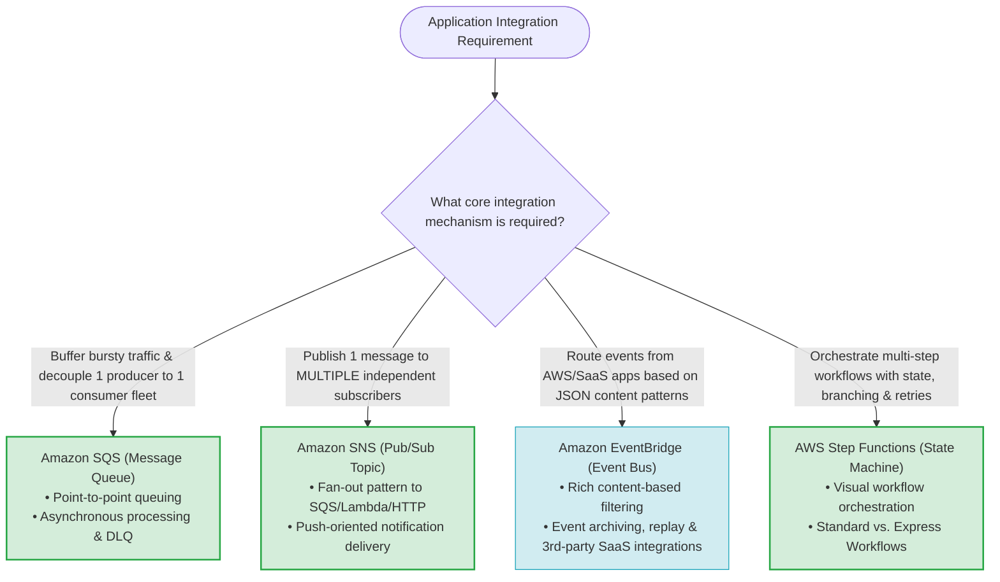
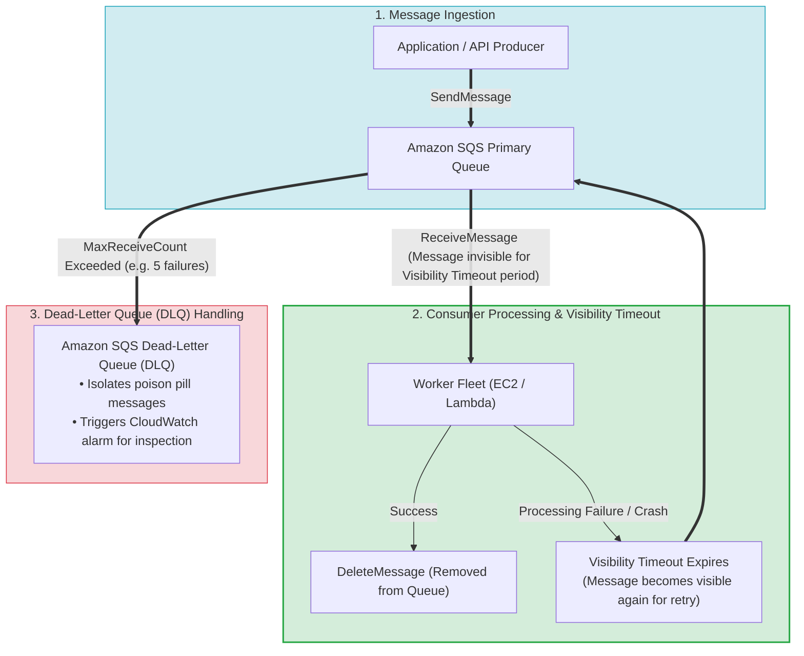
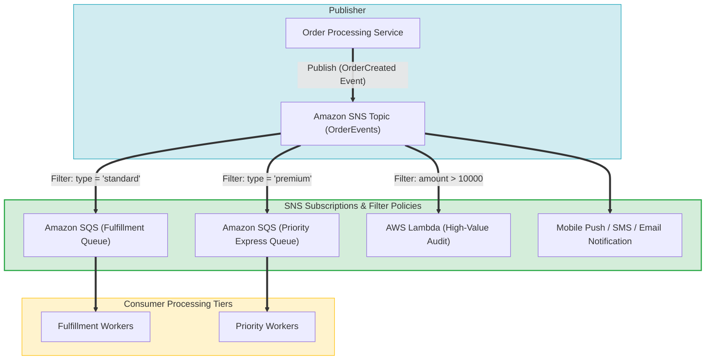
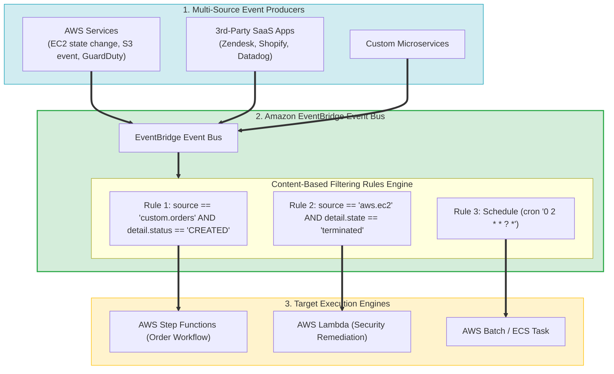
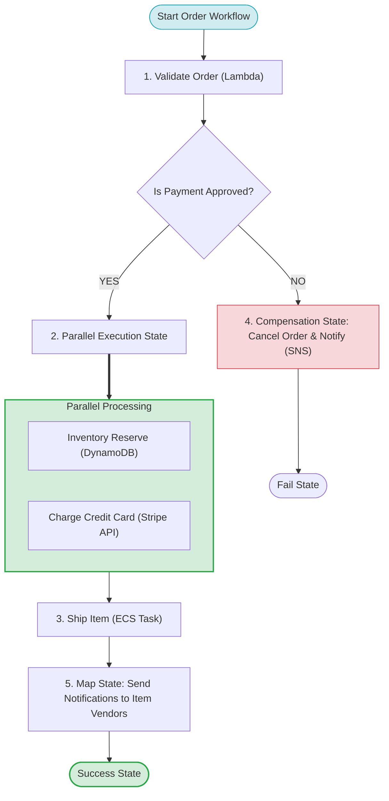
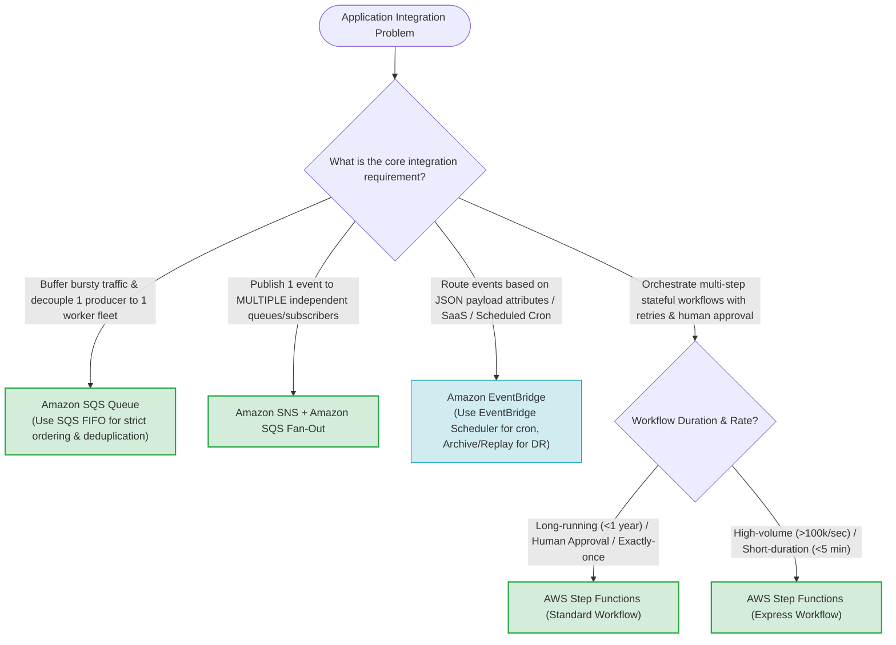

# Task 4.4: Determine Opportunities for Modernization and Enhancements — Integration Services (Amazon SQS, Amazon SNS, Amazon EventBridge, AWS Step Functions)

> [!NOTE]
> **Exam Mindset**: For the AWS Solutions Architect Professional (SAP-C02) and AI Practitioner (AIP-C01) exams, integration services modernize applications by breaking synchronous monolithic coupling into scalable, resilient, asynchronous event-driven architectures:
> - **Amazon SQS (Buffer / Queue)** = *"Decouples producers and consumers via point-to-point queuing, absorbing sudden traffic bursts and providing failure isolation."*
> - **Amazon SNS (Pub/Sub Fan-Out)** = *"Distributes a single published message simultaneously to multiple independent subscribers (SQS, Lambda, HTTP)."*
> - **Amazon EventBridge (Event Routing Bus)** = *"Routes events between AWS services, SaaS applications, and custom microservices based on declarative JSON content filtering rules."*
> - **AWS Step Functions (Workflow Orchestration)** = *"Coordinates multi-step distributed application workflows with built-in state tracking, retries, branching, and error handling."*

---

## 1. End-to-End Tightly-Coupled vs. Decoupled Event-Driven Integration Architecture

```mermaid
flowchart TD
    subgraph Synchronous_Monolith ["1. Tightly-Coupled Synchronous Monolith (Fragile & Cascading Failures)"]
        Client1["Client App"] ==> Order_API1["Order Service"]
        Order_API1 ==>|"Blocking HTTP Call"| Pay_API1["Payment Service"]
        Pay_API1 ==>|"Blocking HTTP Call"| Inv_API1["Inventory Service"]
        Inv_API1 ==>|"Blocking HTTP Call"| Mail_API1["Email Notification"]
    end

    subgraph Decoupled_Serverless ["2. Modernized Decoupled Event-Driven Integration (Resilient & Scalable)"]
        Client2["Client App"] ==> Order_API2["Order Service"]
        Order_API2 ==>|"Publish Event (Async)"| EventBridge_Bus["Amazon EventBridge (Event Bus)"]

        EventBridge_Bus ==>|"Rule 1: Route to Workflow"| Step_Machine["AWS Step Functions<br/>(Payment & Inventory Orchestration)"]
        EventBridge_Bus ==>|"Rule 2: Fan-Out Notifications"| SNS_Topic["Amazon SNS Topic"]

        SNS_Topic ==>|"Subscribe"| SQS_Email["Amazon SQS (Email Queue)"]
        SNS_Topic ==>|"Subscribe"| SQS_Analytics["Amazon SQS (Analytics Queue)"]

        SQS_Email ==> Lambda_Email["AWS Lambda (Email Sender)"]
        SQS_Analytics ==> Lambda_Analytics["AWS Lambda (Data Ingestion)"]
    end

    style Synchronous_Monolith fill:#f8d7da,stroke:#dc3545,stroke-width:1px
    style Decoupled_Serverless fill:#d4edda,stroke:#28a745,stroke-width:2px
```

---

## 2. Integration Services Decision Framework

---

## 3. Master AWS Integration Services Comparison Matrix

| Integration Feature | Amazon SQS | Amazon SNS | Amazon EventBridge | AWS Step Functions |
| :--- | :--- | :--- | :--- | :--- |
| **Primary Core Role** | Point-to-Point Message Queue | Pub/Sub Topic Notification | Event Router & Filtering Bus | Workflow Orchestrator |
| **Messaging Paradigm**| **Pull / Polling Model** (Consumer polls queue) | **Push Model** (Pushes to subscribers) | **Push Model** (Routes matching rules to targets) | **State Machine** (Executes steps sequentially/parallel) |
| **Subscriber Fan-Out** | 1 Message $\rightarrow$ 1 Consumer | 1 Message $\rightarrow$ Multiple Subscribers | 1 Event $\rightarrow$ Multiple Rules & Targets | Manages state across tasks |
| **Message Ordering** | Standard (Best-effort) or **FIFO** (Strict) | Standard (Best-effort) or **FIFO** | Standard event delivery | Sequential state ordering |
| **Filtering Ability** | Basic (SQS message attributes) | SNS Subscription Filter Policies | **Rich JSON Content Pattern Filtering** | Conditional Choice states |
| **Failure Handling** | Visibility Timeout & Dead-Letter Queue (DLQ) | Retry Policies & DLQ for HTTP/SQS | Retry Policies, Archival & Replay, DLQ | Declarative `Retry` & `Catch` blocks per state |
| **Primary Exam Trigger** | *"Buffer bursty traffic, decouple worker fleet, queue messages"* | *"Fan-out single message to multiple queues, send notifications"* | *"Route events based on content, SaaS integration, scheduled cron"* | *"Orchestrate multi-step workflow, handle retries and human approval"* |

---

## 4. Amazon SQS Deep Dive: Queue Mechanics & Failure Isolation

### 4.1 SQS Standard vs. SQS FIFO Queue Comparison Matrix

| Feature | SQS Standard Queue | SQS FIFO Queue |
| :--- | :--- | :--- |
| **Throughput Capacity** | **Nearly unlimited** Send/Receive TPS | Up to 3,000 msg/sec with batching (300 msg/sec without) |
| **Message Delivery** | **At-Least-Once Delivery** (Occasional duplicates) | **Exactly-Once Processing** |
| **Message Ordering** | Best-effort ordering (Can arrive out of order) | **Strict First-In-First-Out (FIFO) ordering** |
| **Deduplication** | Application must handle duplicate processing | Automated via `MessageDeduplicationId` (5-min window) |
| **Message Groups** | Not supported | Supported via `MessageGroupId` (Parallel ordered streams) |

---

## 5. Amazon SNS Pub/Sub Fan-Out Architecture

> [!IMPORTANT]
> **SNS + SQS Fan-Out Pattern (Crucial Exam Pattern)**:
> Combining **Amazon SNS** and **Amazon SQS** allows a publisher to send a message once to an SNS topic, which then fan-outs and delivers copies into multiple SQS queues. Each consuming service receives its own dedicated queue, granting **independent message buffering, worker auto-scaling, and failure isolation** without impacting other services.

---

## 6. Amazon EventBridge Architecture & Content-Based Routing

### 6.1 Amazon SNS vs. Amazon EventBridge Comparison Matrix

| Architectural Dimension | Amazon SNS | Amazon EventBridge |
| :--- | :--- | :--- |
| **Primary Architecture** | Simple Pub/Sub topic notification | Advanced Event Bus for event-driven systems |
| **Event Routing Rules** | Simple message attribute filtering | **Complex JSON content pattern matching** |
| **Event Replay / Archive** | Not supported | **Supported** (Archive and replay past events) |
| **Target Destinations** | SQS, Lambda, HTTP/S, SMS, Email, Mobile Push | **28+ AWS targets**, API Destinations (HTTPS webhooks), EventBridge Buses |
| **SaaS App Integration** | Requires custom code ingestion | **Direct native ingestion from 3rd-party SaaS partners** |
| **Built-in Scheduler** | Not supported | **EventBridge Scheduler** (Replaces EC2 `cron` servers) |

---

## 7. AWS Step Functions State Machine Workflow Orchestration

### 7.1 Step Functions Standard Workflows vs. Express Workflows

| Feature / Dimension | Standard Workflows | Express Workflows |
| :--- | :--- | :--- |
| **Maximum Duration** | **Up to 1 year** | **Up to 5 minutes** |
| **Execution Rate** | Up to 2,000 / second | **Over 100,000 / second** |
| **Execution Semantics** | **Exactly-once execution** | At-least-once (Asynchronous) / At-most-once (Synchronous) |
| **Pricing Model** | Charged per **State Transition** | Charged by **number of executions & duration (ms)** |
| **Primary Use Cases** | Business workflows, human approvals, order fulfillment | High-volume IoT data ingestion, microservice coordination |

---

## 8. Real-World Exam Scenarios & Strategic Solution Patterns

### Scenario 1: Absorbing Unpredictable Traffic Bursts Without Dropping Orders
- **Scenario**: An e-commerce system experiences extreme traffic bursts during sales events. The order processing backend database cannot handle the peak write volume, causing client HTTP request timeouts and dropped orders.
- **Solution**: Modernize by inserting an **Amazon SQS Standard Queue** between the web API and the backend worker fleet.
- **Reasoning**:
  - SQS acts as a durable buffer, absorbing thousands of incoming order messages instantly.
  - Backend workers pull messages from SQS and process them at a steady rate, protecting the database from IOPS exhaustion.
  - *Exam Traps*: Do not scale up database instance sizes as a primary fix for bursty write traffic; buffer with SQS.

---

### Scenario 2: Fan-Out Event Processing to Multiple Independent Microservices
- **Scenario**: When a customer places an order, three separate microservices (Inventory, Shipping, and Fraud Detection) must receive the event. Each service scales independently and requires its own isolated failure and retry queue.
- **Solution**: Publish the order event to an **Amazon SNS Topic**, and subscribe three separate **Amazon SQS Queues** (one for each microservice) to the topic.
- **Reasoning**:
  - SNS provides the 1-to-many fan-out mechanism.
  - Each SQS queue buffers messages independently for its respective microservice worker fleet.
  - *Exam Traps*: Avoid invoking 3 HTTP microservice endpoints synchronously from the order application.

---

### Scenario 3: Complex Multi-Step Order Fulfillment with Human Approval
- **Scenario**: A corporate procurement application executes a multi-step workflow: Validate Request $\rightarrow$ Check Manager Approval $\rightarrow$ Provision Resources $\rightarrow$ Send Invoice. The manager approval step can take up to 3 business days to complete.
- **Solution**: Build the workflow using **AWS Step Functions Standard Workflows** with Task Tokens for the human approval step.
- **Reasoning**:
  - Step Functions Standard Workflows support execution durations of up to 1 year.
  - Task Tokens (`.waitForTaskToken`) pause state machine execution cleanly without consuming compute resources while awaiting external human approval signals.
  - *Exam Traps*: Do not use AWS Lambda to wait for human approvals (Lambda times out after 15 minutes).

---

### Scenario 4: Routing Cross-Account Security & Operational Events Based on JSON Attributes
- **Scenario**: A central security account needs to inspect operational events generated across 50 AWS accounts. Events matching specific threat patterns (`"severity": "CRITICAL"`) must trigger automated Lambda remediation, while general audit events must be archived to S3.
- **Solution**: Configure an **Amazon EventBridge Event Bus** in the central security account, set cross-account permissions, and define **EventBridge Rules with Content-Based Filtering**.
- **Reasoning**:
  - EventBridge natively ingests cross-account events and supports rich JSON pattern matching.
  - Target rules route critical events to Lambda while routing audit events to Kinesis Data Firehose $\rightarrow$ S3.
  - *Exam Traps*: Do not use Amazon SNS when complex JSON payload attribute filtering across multiple targets is required.

---

### Scenario 5: Real-Time Mobile Application Comments via WebSockets (AWS AppSync & GraphQL)
- **Scenario**: A serverless application using API Gateway, Lambda, and DynamoDB allows users to view posts and comments. To increase engagement, the company wants to push comments in real-time to mobile/web users with minimal latency and zero client polling overhead.
- **Solution**: Migrate real-time comment features to **AWS AppSync** by building a **GraphQL API** and leveraging **GraphQL Subscriptions over WebSockets**.
- **Reasoning**:
  - AWS AppSync pushes real-time data updates over WebSockets automatically to millions of connected web and mobile clients using GraphQL subscriptions.
  - Handles client-side offline data storage, conflict resolution, and automatic reconnection sync.
  - *Exam Traps*:
    - **Polling REST API every 3 seconds**: Causes heavy, unnecessary Lambda invocation costs and API Gateway traffic even when no new comments exist.
    - **CloudFront Caching**: Serves stale cached GET responses and cannot perform server-to-client push updates.
    - **Increasing Lambda Concurrency**: Raises execution limits but does not provide push notification or WebSocket connection capabilities.

---

## 9. SAP-C02 / AIP-C01 Master Application Integration Decision Engine

---

## 10. Top Exam Traps & Anti-Patterns Checklist

> [!WARNING]
> **Critical Exam Traps for Integration Services**:
> 1. **Using Lambda to Wait for Human Approvals or Long Delays**: AWS Lambda times out after 15 minutes and charges per millisecond. Use **AWS Step Functions Standard Workflows** with Task Tokens for long-running human approval states.
> 2. **Chaining Synchronous Lambda Functions (Lambda Calling Lambda)**: Avoid calling Lambda functions synchronously from inside other Lambda functions. Use **AWS Step Functions** to orchestrate workflows declaratively.
> 3. **Confusing SQS Standard vs. SQS FIFO**:
>    - **SQS Standard**: At-least-once delivery, best-effort ordering, nearly unlimited throughput.
>    - **SQS FIFO**: Exactly-once delivery, strict ordering, lower throughput limit (3,000 msg/sec batched).
> 4. **Amazon SNS vs. Amazon EventBridge Selection**:
>    - Use **SNS** for high-throughput 1-to-many fan-out notifications to SQS queues, Lambda, SMS, or Email.
>    - Use **EventBridge** for content-based JSON rule filtering, SaaS partner integration, cross-account event buses, or event archiving/replay.
> 5. **Confusing Pull vs. Push Models**:
>    - **SQS**: Pull-based model (Consumers must actively poll the queue).
>    - **SNS & EventBridge**: Push-based model (Pushes messages automatically to matching targets).
> 6. **Idempotency in SQS Standard Consumers**: Because SQS Standard uses at-least-once delivery, consumers must be designed to be **idempotent** (checking unique transaction IDs before executing duplicate actions).
