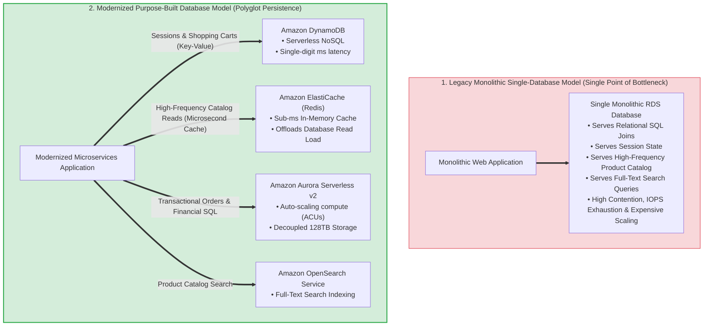
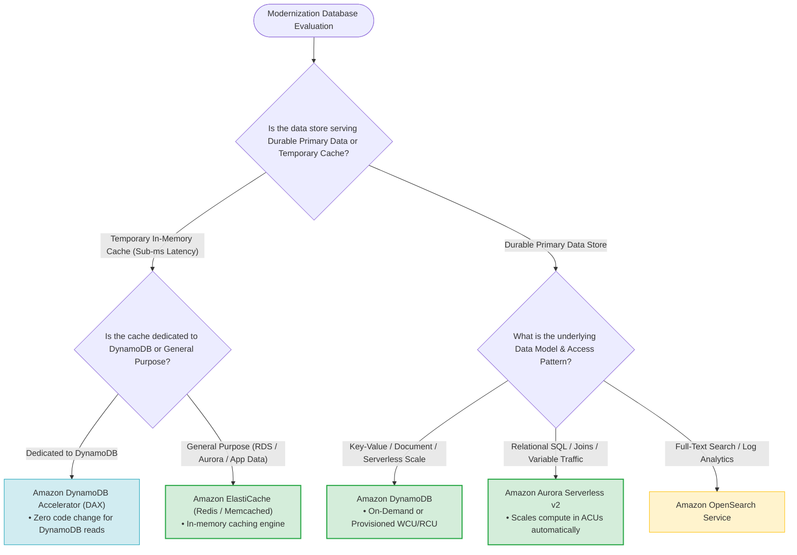
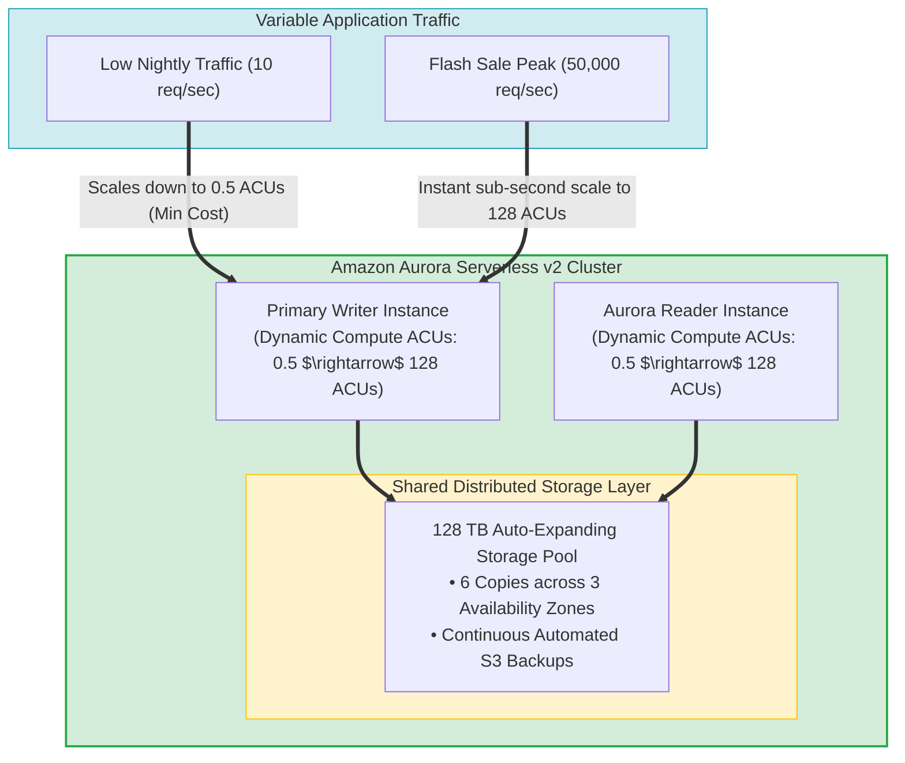
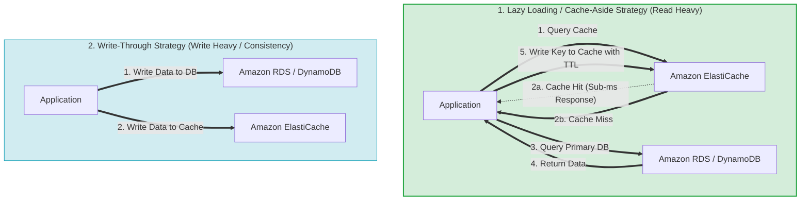
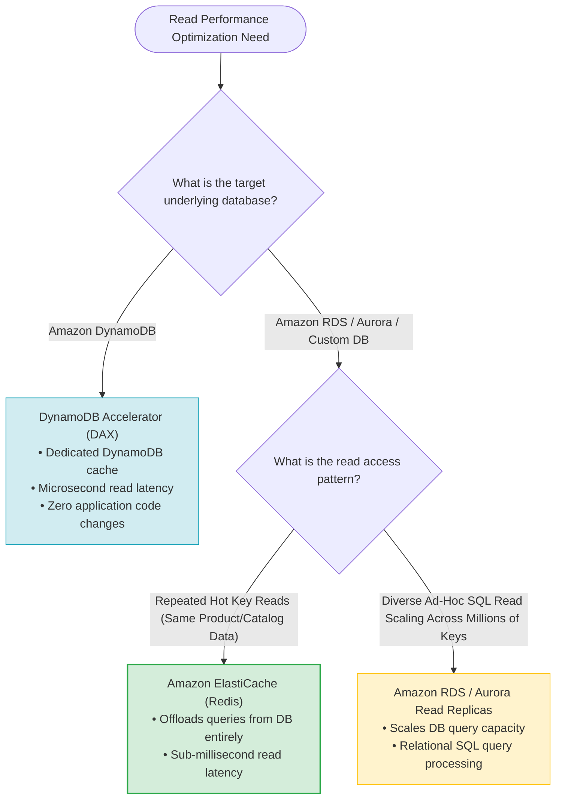
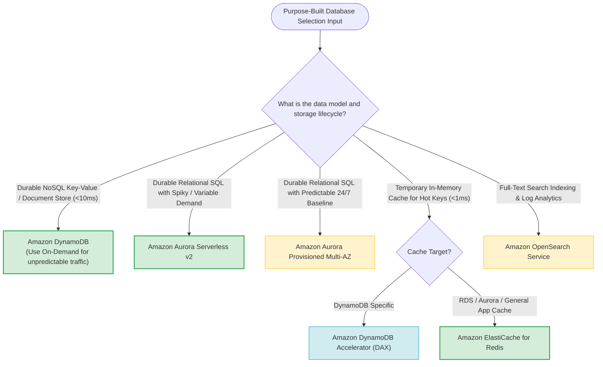

# Task 4.4: Determine Opportunities for Modernization and Enhancements — Purpose-Built Databases (Amazon DynamoDB, Amazon Aurora Serverless, Amazon ElastiCache)

> [!NOTE]
> **Exam Mindset**: For the AWS Solutions Architect Professional (SAP-C02) and AI Practitioner (AIP-C01) exams, modernization moves away from forcing all data access into a single monolithic relational database ("one size fits all"). Modern cloud-native design enforces **Purpose-Built Databases (Polyglot Persistence)** based on data structure, scaling behavior, and latency requirements:
> - **Amazon DynamoDB (Durable NoSQL Data)** = *"Serverless key-value & document database delivering single-digit millisecond latency at any scale."*
> - **Amazon Aurora Serverless v2 (Durable Relational Data)** = *"Relational SQL database (MySQL/PostgreSQL) that dynamically scales compute capacity (ACUs) in fine-grained increments based on real-time traffic."*
> - **Amazon ElastiCache (Temporary Fast Access Data)** = *"In-memory caching layer (Redis / Memcached) delivering sub-millisecond read access to reduce database query load."*

---

## 1. End-to-End Monolithic DB vs. Purpose-Built Polyglot Persistence Architecture

---

## 2. Purpose-Built Database Selection Decision Tree

---

## 3. Master Purpose-Built Database Services Comparison Matrix

| Architectural Feature | Amazon DynamoDB | Amazon Aurora Serverless v2 | Amazon ElastiCache (Redis/Memcached) |
| :--- | :--- | :--- | :--- |
| **Data Role** | Durable Primary NoSQL Database | Durable Primary Relational Database | Temporary In-Memory Performance Cache |
| **Data Model** | Key-Value & Document | Relational SQL (MySQL/PostgreSQL) | Key-Value / In-Memory Data Structures |
| **Query Flexibility** | Key-based lookups (Partition/Sort key) | Full SQL queries, multi-table joins, ACID | Key-based in-memory lookups |
| **Scaling Mechanism** | Request-based On-Demand or Provisioned | Fine-grained Auto-scaling ACUs (0.5 to 128) | Cluster Sharding & Node Sizing |
| **Latency Benchmark** | **Single-digit milliseconds** (<10 ms) | Single-digit milliseconds | **Sub-millisecond** (<1 ms) |
| **Persistence / HA** | Continuous Multi-AZ 3-way replication | 6-way storage across 3 AZs | Ephemeral RAM (Redis supports AOF/RDB snapshots & Multi-AZ replication) |
| **Primary Exam Trigger** | *"Serverless NoSQL, key-value, unpredictable traffic, single-digit ms"* | *"Variable relational database workload, SQL required, avoid overprovisioning"* | *"Sub-millisecond read latency, offload database read pressure, hot key cache"* |

---

## 4. Amazon Aurora Serverless v2 Architecture & Auto-Scaling

> [!IMPORTANT]
> **Aurora Serverless v2 Key Exam Characteristics**:
> - **Instant Fine-Grained Scaling**: Scales compute capacity in fractions of Aurora Capacity Units (**ACUs**, where 1 ACU = 2 GB RAM + CPU) instantaneously without dropping active connections.
> - **When to Choose Aurora Serverless v2**: Workloads requiring **relational SQL, joins, and ACID compliance** where traffic is **unpredictable, spiky, or intermittent** (e.g., dev/test, flash sales, periodic reporting).
> - **Provisioned vs. Serverless**: For continuous, 24/7 steady-state database traffic at high utilization, **Provisioned Aurora** with Reserved Instances is typically more cost-effective.

---

## 5. Amazon ElastiCache Architecture & Caching Strategies

### 5.1 Caching Topologies: Lazy Loading (Cache-Aside) vs. Write-Through

### 5.2 ElastiCache Engine Comparison: Redis OSS vs. Memcached

| Feature / Capability | ElastiCache for Redis OSS | ElastiCache for Memcached |
| :--- | :--- | :--- |
| **Data Structures** | Strings, Lists, Sets, Sorted Sets, Hashes, Geospatial | Simple Key-Value strings only |
| **Multithreading** | Single-threaded engine core (Multi-threaded I/O) | **Multi-threaded engine core** |
| **Persistence / Backup** | **Supported** (RDB Snapshots & AOF append log) | Not supported (Pure ephemeral memory) |
| **High Availability & Failover**| **Supported** (Multi-AZ with Auto-Failover & Replicas)| Not supported (Node failure = cache loss) |
| **Pub/Sub Messaging** | Supported | Not supported |
| **Primary Use Case** | Session stores, leaderboards, geospatial indexing, pub/sub | Simple multithreaded object caching (e.g., HTML fragments) |

---

## 6. Amazon ElastiCache vs. Amazon RDS Read Replicas vs. DynamoDB DAX

---

## 7. Real-World Exam Scenarios & Strategic Solution Patterns

### Scenario 1: Unpredictable E-Commerce Flash Sales with Relational SQL Requirements
- **Scenario**: An e-commerce retailer runs flash sales causing database traffic to surge from 100 queries/sec to 40,000 queries/sec within seconds. The application requires multi-table SQL joins and strict ACID transactions. Management wants to prevent manual database scaling and eliminate paying for idle capacity during off-peak hours.
- **Solution**: Migrate the database to **Amazon Aurora Serverless v2 (MySQL or PostgreSQL edition)**.
- **Reasoning**:
  - Aurora Serverless v2 scales compute ACUs dynamically and instantaneously in response to traffic bursts while preserving full SQL join capabilities.
  - Off-peak capacity scales down to minimum ACUs (0.5), dramatically lowering idle database costs.
  - *Exam Traps*: Do not select DynamoDB if the application strictly depends on multi-table relational SQL joins.

---

### Scenario 2: Overloaded Relational Database Facing Repeated Hot Key Catalog Reads
- **Scenario**: A news portal's RDS PostgreSQL database experiences high CPU utilization (95%) caused by millions of users repeatedly reading the same top 10 trending news articles. The team wants to reduce database CPU load and achieve sub-millisecond read latency.
- **Solution**: Implement a **Lazy Loading (Cache-Aside) caching layer using Amazon ElastiCache for Redis** in front of the RDS database.
- **Reasoning**:
  - Repeated reads for trending articles hit ElastiCache in RAM (<1 ms), offloading read queries from RDS entirely.
  - RDS CPU utilization drops, preserving database capacity for transactional write operations.
  - *Exam Traps*: Adding RDS Read Replicas still causes database queries to hit disk/database engines; ElastiCache intercepts requests in memory before they hit the database.

---

### Scenario 3: Serverless Gaming Session & Leaderboard Architecture
- **Scenario**: A mobile gaming company needs a serverless backend for 5 million concurrent players. Player profiles require key-value lookups with single-digit millisecond latency, while real-time game leaderboards require sorted set operations with sub-millisecond performance.
- **Solution**: Store player profiles in **Amazon DynamoDB** and manage real-time game leaderboards using **Amazon ElastiCache for Redis** (using Redis Sorted Sets).
- **Reasoning**:
  - DynamoDB provides serverless, highly durable key-value storage for player profiles.
  - ElastiCache for Redis natively supports `Sorted Sets` (`ZADD` / `ZRANGE`), providing in-memory real-time leaderboard computations.
  - *Exam Traps*: Forcing real-time sorted leaderboards into traditional SQL databases creates massive indexing and CPU bottlenecks under high concurrency.

---

## 8. SAP-C02 / AIP-C01 Master Purpose-Built Database Decision Engine

---

## 9. Top Exam Traps & Anti-Patterns Checklist

> [!WARNING]
> **Critical Exam Traps for Purpose-Built Databases**:
> 1. **ElastiCache is a Performance Cache, NOT a Durable Primary Database**: ElastiCache stores data in volatile RAM. Do not use ElastiCache as the sole source of truth for critical financial records without a durable backing database (DynamoDB / RDS).
> 2. **Selecting DynamoDB for Complex Multi-Table SQL Joins**: DynamoDB is a NoSQL store. If an application requires ad-hoc SQL joins across multiple tables, select **Amazon Aurora Serverless v2** or **Amazon RDS**.
> 3. **Confusing ElastiCache vs. RDS Read Replicas**:
>    - **ElastiCache**: Intercepts and caches **repeated hot-key reads** in RAM (<1 ms latency), shielding the database entirely.
>    - **RDS Read Replicas**: Scales **relational SQL query execution capacity** across multiple database instances.
> 4. **DAX vs. ElastiCache for DynamoDB**: If the requirement specifically asks for microsecond caching in front of **Amazon DynamoDB** with zero application code changes, select **DynamoDB Accelerator (DAX)** over ElastiCache.
> 5. **Aurora Serverless v2 for Steady 24/7 Baseline Workloads**: Aurora Serverless v2 is cost-effective for variable, intermittent, or spiky traffic. For constant 24/7 high-utilization production databases, **Provisioned Aurora with Reserved Instances** is more economical.
