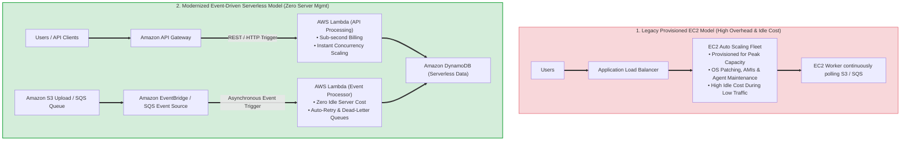
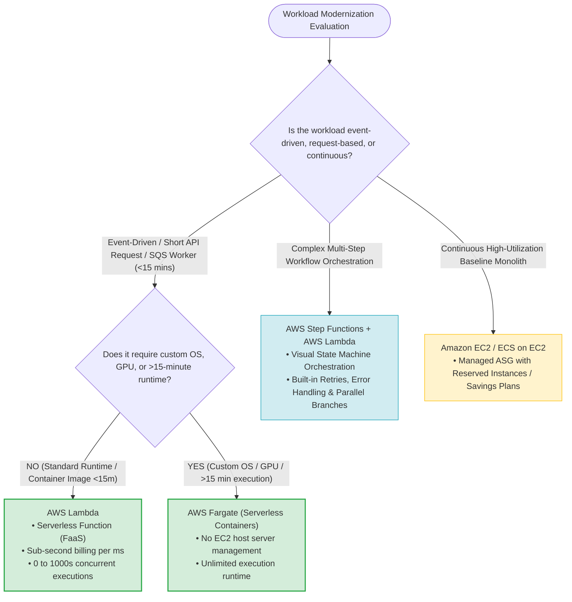
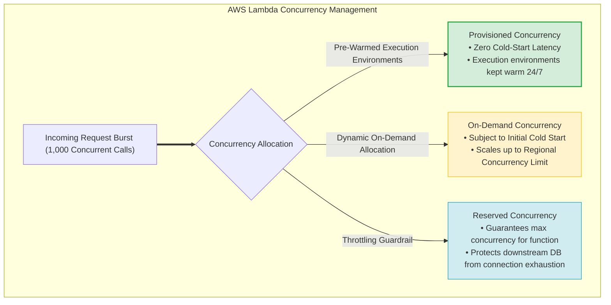
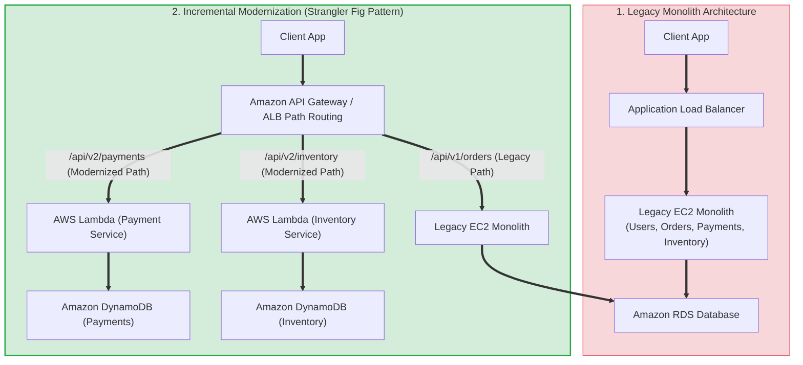
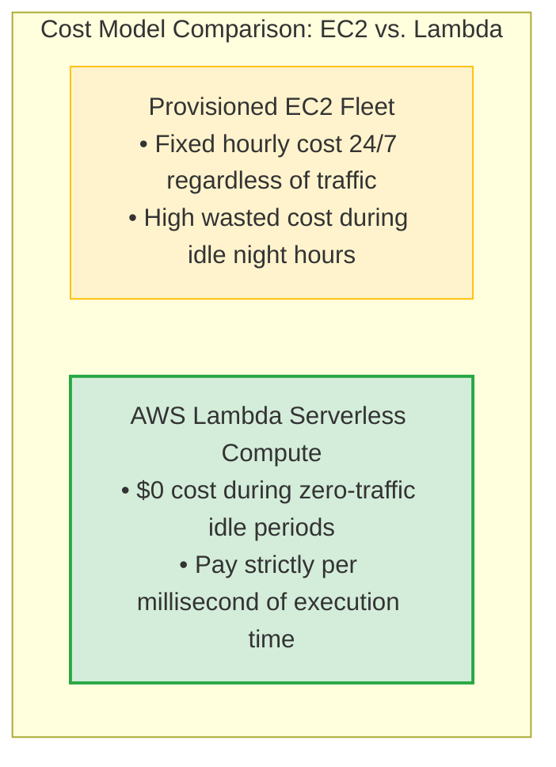
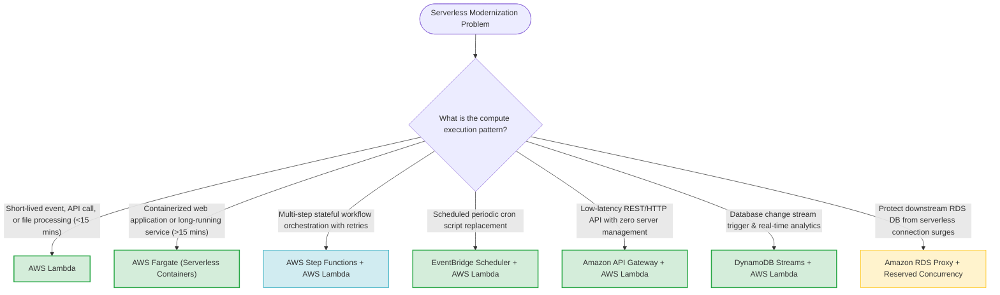

# Task 4.4: Determine Opportunities for Modernization and Enhancements — Serverless Compute Offerings (AWS Lambda)

> [!NOTE]
> **Exam Mindset**: For the AWS Solutions Architect Professional (SAP-C02) and AI Practitioner (AIP-C01) exams, serverless compute is an architectural modernization strategy designed to eliminate operational infrastructure management:
> - **Serverless Modernization Goal**: *"Remove server management, scaling overhead, and idle capacity costs while preserving or enhancing application performance, availability, and resilience."*
> - **AWS Lambda**: *"Event-driven serverless compute that automatically executes code in response to events, scales instantly from 0 to thousands of concurrent requests, and charges strictly per millisecond of execution time."*

---

## 1. End-to-End Legacy vs. Serverless Modernization Architecture

---

## 2. Serverless Compute Spectrum & Architectural Decision Tree

---

## 3. Comprehensive Provisioned Infrastructure vs. AWS Lambda Comparison Matrix

| Architectural Feature | Traditional EC2 Architecture | AWS Lambda Serverless Compute |
| :--- | :--- | :--- |
| **Infrastructure Management** | **High** (Customer manages OS, AMIs, patching, ASG) | **Zero** (AWS manages underlying compute hosts entirely) |
| **Execution Duration** | Unlimited continuous runtime | **15 minutes max per invocation** |
| **Scaling Model** | Metric-based EC2 Auto Scaling (Minutes to scale out) | **Instant concurrency scaling** (Sub-second allocation) |
| **Pricing Mechanism** | Pay per provisioned instance hour (Charged for idle) | Pay per **invocation request & execution duration (ms)** |
| **State & Persistence** | Stateful local EBS/EFS storage support | **Stateless execution** (Ephemeral `/tmp` disk storage up to 10GB) |
| **Networking Integration** | Native VPC Elastic IP / ENI attachment | Hyperplane ENI dual-stack VPC attachment |
| **Primary Use Cases** | Monoliths, continuous background daemons, GPUs | Event processing, REST APIs, S3/SQS triggers, webhooks |

---

## 4. AWS Lambda Event Integration Architecture

```mermaid
flowchart TD
    subgraph Synchronous_Triggers ["1. Synchronous Invocation (Request / Response)"]
        APIGW_Sync["Amazon API Gateway / ALB"] ==>|"Synchronous HTTP Request"| Lambda_Sync["AWS Lambda Function"]
        Lambda_Sync ==>|"Returns Immediate Response"| APIGW_Sync
    end

    subgraph Asynchronous_Triggers ["2. Asynchronous Invocation (Event-Driven)"]
        S3_Async["Amazon S3 Event"] & EventBridge_Async["Amazon EventBridge"] ==>|"Asynchronous Event Event"| Lambda_Async["AWS Lambda Function"]
        Lambda_Async ==>|"On Failure (2 Retries)"| DLQ["SQS DLQ / SNS / EventBridge Destination"]
    end

    subgraph Stream_Triggers ["3. Poll-Based Stream / Queue Invocation"]
        SQS_Poll["Amazon SQS Queue"] & Dynamo_Stream["DynamoDB Streams / Kinesis"] ==>|"AWS Manages Poller Engine"| Lambda_Stream["AWS Lambda Function"]
        Lambda_Stream ==>|"On Batch Failure"| Bisect["Bisect on Function Error / DLQ"]
    end

    style Synchronous_Triggers fill:#d1ecf1,stroke:#17a2b8,stroke-width:1px
    style Asynchronous_Triggers fill:#d4edda,stroke:#28a745,stroke-width:2px
    style Stream_Triggers fill:#fff3cd,stroke:#ffc107,stroke-width:1px
```

### 4.1 Serverless Event Trigger Integrations Matrix

| Integration Pattern | AWS Source Service | Invocation Type | Error & Retry Handling | Typical Modernization Scenario |
| :--- | :--- | :--- | :--- | :--- |
| **API Web Service** | Amazon API Gateway / ALB | Synchronous | Client receives 5xx error; application must retry | Replacing EC2 web server endpoints with serverless REST APIs |
| **Object Processing** | Amazon S3 (Object Created) | Asynchronous | AWS retries twice; routes to EventBridge Destination / DLQ | Auto-processing uploaded images, CSV transformation |
| **Queue Worker** | Amazon SQS | Poll-Based (AWS Poller) | Unprocessed messages return to SQS queue after visibility timeout | Decoupling bursty background jobs from continuous EC2 workers |
| **Stream Analytics** | DynamoDB Streams / Kinesis | Poll-Based (AWS Poller) | Retries failing batch; supports Bisect-on-Error and DLQ | Change Data Capture (CDC) processing & real-time analytics |
| **Cron Automation** | EventBridge Scheduler | Asynchronous | Scheduled trigger with automated retry policy | Replacing EC2 `cron` scripts with scheduled serverless functions |

---

## 5. Lambda Concurrency & Latency Optimization Architecture

> [!IMPORTANT]
> **Reserved Concurrency vs. Provisioned Concurrency for Exam Questions**:
> - **Reserved Concurrency**: Sets a **maximum execution ceiling** for a function (reserving capacity and capping maximum concurrent executions). Used to **protect downstream databases** (e.g., Amazon RDS) from connection pool exhaustion.
> - **Provisioned Concurrency**: Pre-warms a designated number of execution environments. Eliminates **cold-start latency** for strict low-latency synchronous APIs.

---

## 6. Incremental Monolith Modernization (Strangler Fig Pattern)

---

## 7. Cost Economics & Total Cost of Ownership (TCO) Trade-offs

> [!TIP]
> **TCO Economics Rule of Thumb for Exam Questions**:
> - **Intermittent / Variable / Event-Driven Workloads**: Serverless (AWS Lambda) provides vastly superior cost savings because idle infrastructure costs drop to **$0**.
> - **Continuous 24/7 High-Throughput Baseline Workloads**: Running continuous high-volume workloads on Lambda can be more expensive than running optimized **EC2 / Fargate fleets** backed by **Savings Plans** or **Reserved Instances**.

---

## 8. Real-World Exam Scenarios & Strategic Solution Patterns

### Scenario 1: Replacing EC2 S3 File Polling Workers with Serverless Event Processing
- **Scenario**: An enterprise application runs a fleet of EC2 instances 24/7 continuously polling an S3 bucket for incoming CSV data files. Files arrive unpredictably throughout the day. Management demands reducing operational overhead and eliminating idle server costs.
- **Solution**: Modernize the architecture by configuring **Amazon S3 Event Notifications** to trigger an **AWS Lambda function** asynchronously whenever an object is created.
- **Reasoning**:
  - Eliminates 24/7 EC2 polling infrastructure and reduces idle server cost to $0.
  - Lambda automatically scales execution instances dynamically as file upload volume surges.
  - *Exam Traps*: Do not keep EC2 worker instances running continuous polling loops when S3 Event Notifications and Lambda can process files on demand.

---

### Scenario 2: Modernizing Bursty EC2 SQS Queue Workers
- **Scenario**: A company processes background data conversion tasks submitted to an Amazon SQS queue. Worker EC2 instances struggle to scale fast enough during unexpected traffic bursts, leading to message backlogs.
- **Solution**: Configure **Amazon SQS as an Event Source for AWS Lambda**.
- **Reasoning**:
  - AWS manages the SQS poller infrastructure and automatically invokes Lambda with batched messages.
  - Lambda scales concurrency instantly up to the SQS queue depth, processing bursts without delay.
  - *Exam Traps*: Do not manage custom EC2 Auto Scaling groups based on SQS queue depth metrics if the processing task fits within Lambda's 15-minute execution limit.

---

### Scenario 3: Complex Multi-Step Order Workflow Orchestration
- **Scenario**: An order processing system requires executing 5 sequential processing steps (Validate Order $\rightarrow$ Charge Credit Card $\rightarrow$ Update Inventory $\rightarrow$ Generate Invoice $\rightarrow$ Send Confirmation Email). If any step fails, custom retry rules and compensating rollback transactions must occur.
- **Solution**: Orchestrate the workflow using **AWS Step Functions** invoking individual **AWS Lambda functions** for each processing step.
- **Reasoning**:
  - Building complex multi-step orchestration and error handling inside a single monolithic Lambda function leads to tight coupling, timeout risks, and difficult debugging.
  - Step Functions provides state management, visual tracking, parallel execution, and declarative retry/catch mechanisms.
  - *Exam Traps*: Avoid chaining Lambda functions directly (Lambda calling Lambda) for complex workflows; use AWS Step Functions instead.

---

### Scenario 4: Preventing Downstream Relational DB Exhaustion During Traffic Spikes
- **Scenario**: A serverless REST API built with API Gateway and AWS Lambda connects to a traditional Amazon RDS MySQL database. During flash sales, thousands of concurrent Lambda executions exhaust the database connection pool, causing database crashes.
- **Solution**: Set **Reserved Concurrency** on the Lambda function and deploy **Amazon RDS Proxy** between Lambda and the RDS database.
- **Reasoning**:
  - RDS Proxy pools and shares database connections, preventing connection exhaustion from ephemeral serverless functions.
  - Setting Reserved Concurrency places an upper ceiling on maximum concurrent executions to protect database IOPS.
  - *Exam Traps*: Do not increase maximum RDS database connections as a primary fix for serverless connection spikes; use Amazon RDS Proxy.

---

## 9. SAP-C02 / AIP-C01 Master Serverless Decision Engine

---

## 10. Top Exam Traps & Anti-Patterns Checklist

> [!WARNING]
> **Critical Exam Traps for Serverless Compute (AWS Lambda)**:
> 1. **AWS Lambda 15-Minute Timeout Hard Cap**: Lambda functions cannot run for longer than 15 minutes. If a batch process or migration job exceeds 15 minutes, select **AWS Batch** or **AWS Fargate**.
> 2. **Lambda Functions Calling Lambda Functions (Direct Chaining)**: Avoid chaining Lambda functions synchronously inside function code. Use **AWS Step Functions** for workflow orchestration.
> 3. **Confusing Reserved Concurrency vs. Provisioned Concurrency**:
>    - **Reserved Concurrency**: Reserves capacity and caps maximum concurrent executions (protects downstream DBs).
>    - **Provisioned Concurrency**: Pre-warms execution environments to eliminate **cold-start latency**.
> 4. **Lambda Connection Exhaustion on Relational Databases**: Serverless functions scaling to thousands of concurrent instances will exhaust connection limits on Amazon RDS. Always place **Amazon RDS Proxy** between Lambda and RDS.
> 5. **Stateless Local Storage**: Lambda local `/tmp` storage (up to 10GB) is ephemeral and non-persistent across separate invocations. Use **Amazon EFS** for shared persistent state across Lambda functions.
> 6. **Using Lambda for Continuous High-Throughput Baseline Processing**: Do not assume Lambda is always cheaper than EC2. For continuous 24/7 workloads at maximum CPU utilization, **EC2 / Fargate with Savings Plans** is typically more cost-effective.
