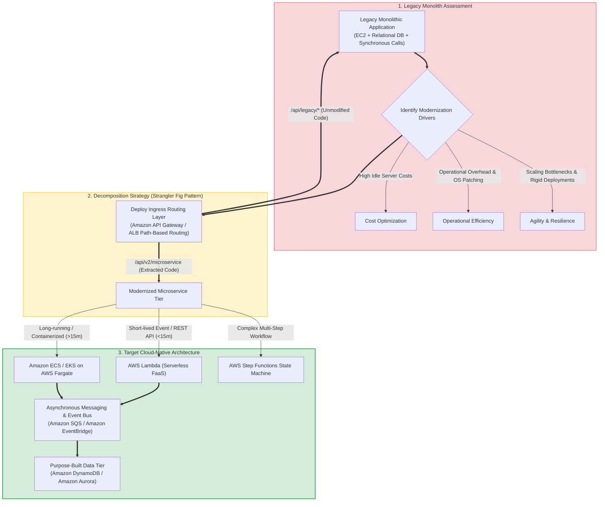
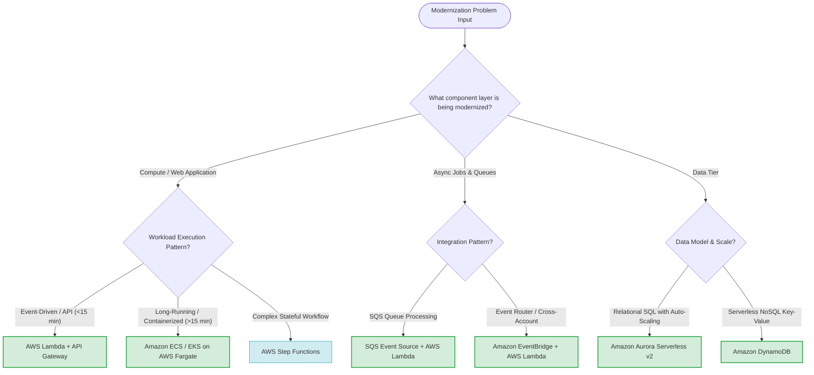

# Task 4.4: Determine Opportunities for Modernization and Enhancements — Modernization Skills Guide

> [!NOTE]
> **Exam Mindset**: For the AWS Solutions Architect Professional (SAP-C02) and AI Practitioner (AIP-C01) exams, Task 4.4 tests your ability to identify workload modernization opportunities and transform legacy architectures into cloud-native, serverless, and containerized architectures:
> **Identify Monolith Bottlenecks** $\rightarrow$ **Decompose into Microservices (Strangler Fig Pattern)** $\rightarrow$ **Select Serverless / Container Compute** $\rightarrow$ **Implement Asynchronous Decoupling (SQS/EventBridge)** $\rightarrow$ **Modernize Data Tier (DynamoDB/Aurora)**.

---

## 1. End-to-End Task 4.4 Workload Modernization Synthesis Pipeline

---

## 2. Workload Modernization Decision Matrix

| Legacy Component Pattern | Modernization Target | Primary Business & Technical Driver | Key Exam Keywords |
| :--- | :--- | :--- | :--- |
| **EC2 Polling S3 for New Uploads** | **S3 Event Notifications $\rightarrow$ AWS Lambda** | Eliminates 24/7 idle EC2 server costs and polling overhead | *"process object on upload", "S3 event", "zero idle cost"* |
| **EC2 Worker Polling SQS Queue** | **SQS Event Source Mapping $\rightarrow$ AWS Lambda** | Automatic scaling based on queue depth; zero worker host management | *"decouple", "SQS trigger", "bursty queue worker"* |
| **EC2 `cron` Scheduled Scripts** | **EventBridge Scheduler $\rightarrow$ AWS Lambda** | Removes dedicated server dependencies for periodic tasks | *"scheduled job", "cron replacement", "event bus"* |
| **Monolithic Web App on EC2** | **API Gateway $\rightarrow$ Lambda / ECS Fargate** | Incremental microservices migration via Strangler Fig pattern | *"Strangler pattern", "microservices", "serverless containers"* |
| **Monolithic SQL Database** | **Aurora Serverless / DynamoDB** | Decouples shared database bottlenecks into purpose-built stores | *"decouple database", "serverless NoSQL", "single-digit ms"* |

---

## 3. Real-World Exam Scenarios & Strategic Solution Patterns

### Scenario 1: Incremental Monolith Decomposition with Zero Downtime
- **Scenario**: An enterprise operates an on-premises monolithic application on vSphere. The company wants to modernize the system incrementally into microservices without rewriting the entire codebase at once.
- **Solution**: Implement the **Strangler Fig Pattern** using **Amazon API Gateway** (or Application Load Balancer) to route path-based traffic gradually between the legacy monolith and new **AWS Lambda / ECS Fargate** microservices.
- **Reasoning**:
  - Allows risk-free incremental extraction of individual business domains.
  - API Gateway handles request routing, rate limiting, and authentication.
  - *Exam Traps*: Avoid big-bang rewrites of enterprise monoliths when incremental modernization is requested.

---

### Scenario 2: Modernizing Long-Running Batch Workloads (>15 Minutes)
- **Scenario**: A financial firm processes nightly risk analysis batch jobs taking 45 minutes to execute. The developer team attempted to use AWS Lambda, but jobs failed due to execution timeouts.
- **Solution**: Migrate the batch workloads to **Amazon ECS on AWS Fargate** (or **AWS Batch** using Fargate Spot).
- **Reasoning**:
  - AWS Lambda has a strict 15-minute execution limit.
  - AWS Fargate provides serverless container compute without execution time caps.
  - *Exam Traps*: Do not select Lambda for workloads exceeding 15 minutes.

---

## 4. SAP-C02 / AIP-C01 Master Modernization Decision Engine

---

## 5. Top Exam Traps & Anti-Patterns Checklist

> [!WARNING]
> **Critical Exam Traps for Task 4.4 Modernization**:
> 1. **Big-Bang Rewrite vs. Strangler Fig Pattern**: On SAP-C02, prefer incremental modernization using **API Gateway path routing (Strangler Fig pattern)** over high-risk all-at-once application rewrites.
> 2. **Lambda Execution Timeout Limit**: Never select Lambda for tasks running longer than 15 minutes. Use **AWS Fargate** or **AWS Batch**.
> 3. **Polled S3 / SQS Workloads on EC2**: Continuously running EC2 instances polling S3 or SQS is an anti-pattern. Modernize with **S3 Event Notifications** or **SQS Event Source Mapping to Lambda**.
