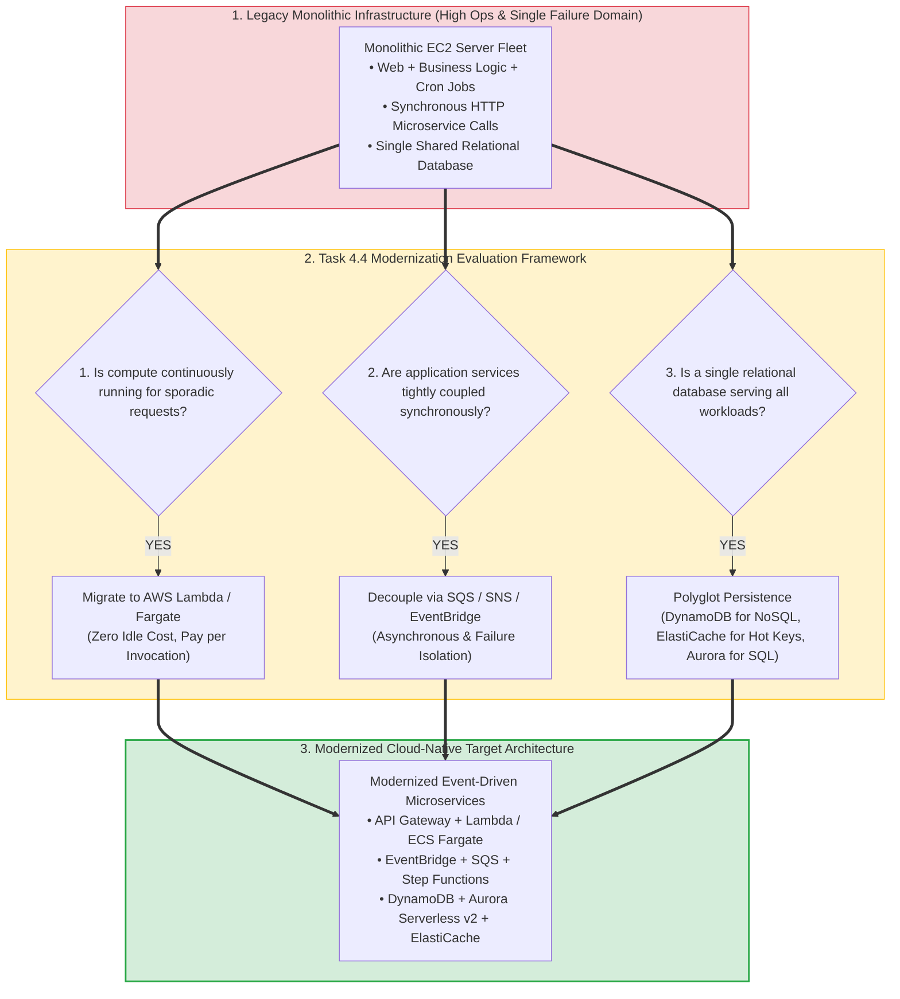
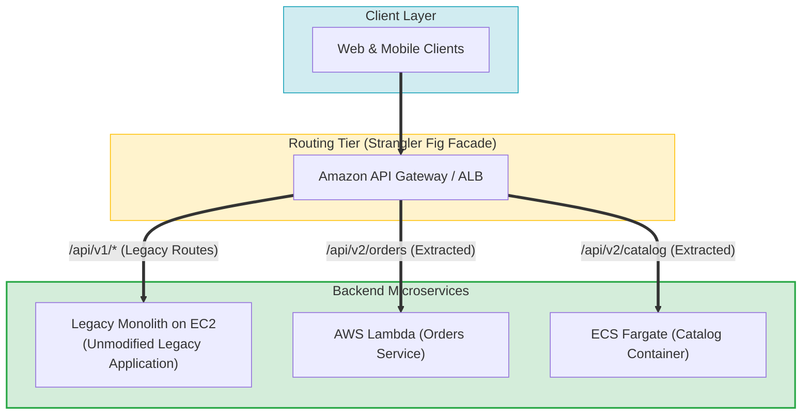
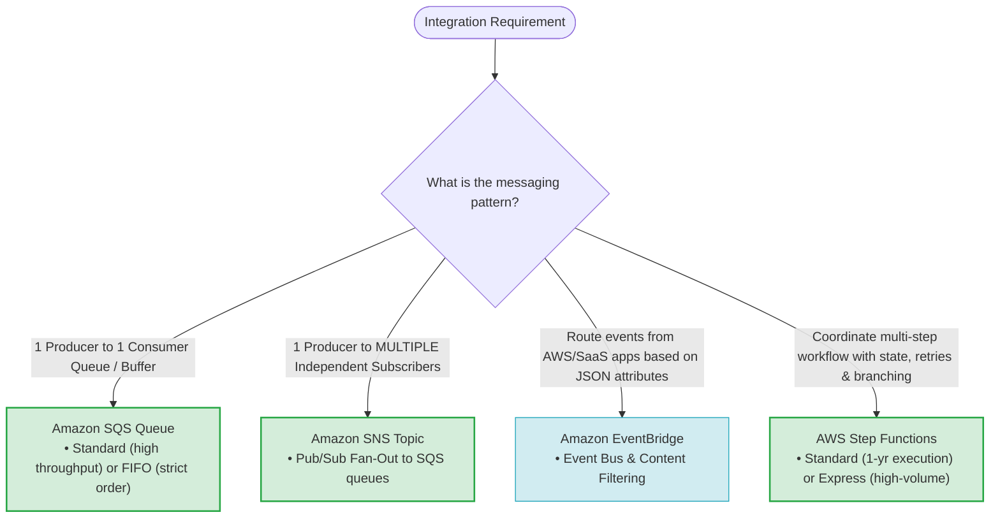
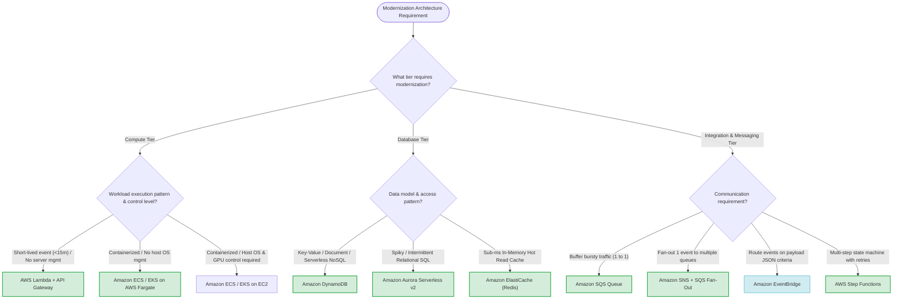

# Task 4.4: Determine Opportunities for Modernization and Enhancements — Architectural Synthesis & Skills Guide

> [!NOTE]
> **Exam Mindset**: For the AWS Solutions Architect Professional (SAP-C02) and AI Practitioner (AIP-C01) exams, Task 4.4 evaluates your ability to evaluate legacy architectures, eliminate unnecessary infrastructure management, and replace brittle monolithic designs with cloud-native abstractions:
> - **The Core Modernization Question**: *"Which managed service matches this workload, removes server patching/management, enables independent microservice auto-scaling, and delivers maximum reliability at optimal cost?"*
> - **The 5-Step Evaluation Checklist**:
>   1. **Decoupling**: Can synchronous calls be converted to asynchronous queues or event buses?
>   2. **Serverless**: Can continuously running idle servers be replaced with pay-per-invocation Lambda/Fargate?
>   3. **Containers**: Does the application require containerization via AWS-native ECS or Kubernetes EKS?
>   4. **Purpose-Built Databases**: Can a single monolithic database be replaced with purpose-built NoSQL, cache, or auto-scaling relational stores?
>   5. **Integration**: Which integration pattern (SQS queue, SNS pub/sub, EventBridge router, Step Functions state machine) fits the communication workflow?

---

## 1. End-to-End Workload Modernization Synthesis Pipeline

---

## 2. Architectural Modernization Abstraction & Operational Spectrum

```mermaid
flowchart TD
    subgraph Compute_Spectrum ["Compute Modernization Spectrum (High Overhead $\\rightarrow$ Zero Server Overhead)"]
        EC2_Node["EC2 Virtual Machines<br/>(Host OS Patching, AMIs, ASG Scaling)"] ==> ECS_EC2["ECS / EKS on EC2<br/>(Container Orchestration, Host Mgmt)"]
        ECS_EC2 ==> Fargate_Node["AWS Fargate<br/>(Serverless Container Compute, Zero Host Mgmt)"]
        Fargate_Node ==> Lambda_Node["AWS Lambda<br/>(Serverless FaaS, Zero Server Mgmt)"]
    end

    subgraph Database_Spectrum ["Database Modernization Spectrum"]
        Self_DB["Self-Managed DB on EC2"] ==> RDS_Prov["Amazon RDS / Aurora Provisioned"]
        RDS_Prov ==> Aurora_Serv["Amazon Aurora Serverless v2"]
        Aurora_Serv ==> DynamoDB_Node["Amazon DynamoDB (Serverless NoSQL)"]
    end

    style Compute_Spectrum fill:#d1ecf1,stroke:#17a2b8,stroke-width:1px
    style Database_Spectrum fill:#d4edda,stroke:#28a745,stroke-width:2px
```

---

## 3. Master Modernization Services Decision & Comparison Matrix

| Modernization Dimension | Legacy Pattern | Modernized Managed Service | Key Architecture Benefit | SAP-C02 Exam Trigger |
| :--- | :--- | :--- | :--- | :--- |
| **Monolith Decomposition** | Synchronous REST microservice calls | **Amazon API Gateway + Strangler Fig Pattern** | Enables incremental microservices migration with zero downtime | *"Decompose legacy enterprise monolith incrementally"* |
| **Asynchronous Buffering** | Continuous EC2 polling or direct calls | **Amazon SQS Queue** | Absorbs traffic spikes, provides independent consumer scaling | *"Buffer bursty traffic, decouple backend workers"* |
| **Pub/Sub Fan-Out** | Direct HTTP broadcasting | **Amazon SNS + Amazon SQS Fan-Out** | Distributes 1 event to multiple independent queues | *"One event needs to reach multiple consumers"* |
| **Event Routing** | Hardcoded conditional code branches | **Amazon EventBridge Event Bus** | Declarative JSON pattern matching, SaaS integrations | *"Route events based on payload content, SaaS rules"* |
| **Workflow State Machine** | Custom nested orchestration logic | **AWS Step Functions** | Declarative state machine with built-in retries & human approval | *"Orchestrate multi-step business process with state"* |
| **Serverless Compute** | 24/7 idle EC2 web servers | **AWS Lambda** | Zero server management, auto-scaling, pay-per-use | *"Sporadic traffic, event-driven short execution (<15m)"* |
| **Serverless Containers** | Self-managed EC2 container hosts | **Amazon ECS / EKS on AWS Fargate** | Eliminates host OS patching and cluster capacity management | *"Containerized app, zero EC2 host management"* |
| **Polyglot Database** | Single monolithic relational RDS instance | **DynamoDB + Aurora Serverless + ElastiCache** | Matches data access patterns to purpose-built data engines | *"High-frequency key lookups, hot cache, spiky SQL"* |

---

## 4. Incremental Monolith Decomposition Topology (Strangler Fig Pattern)

---

## 5. Integration Services Matrix: Selecting the Right Integration Pattern

---

## 6. Real-World Exam Scenarios & Strategic Solution Patterns

### Scenario 1: Decoupling Bursty E-Commerce Orders with Independent Microservices
- **Scenario**: An e-commerce system experiences extreme flash sale traffic. Incoming orders trigger synchronous calls to Inventory, Payment, and Shipping services, leading to timeout cascading failures when Payment services slow down.
- **Solution**: Modernize by publishing order events to an **Amazon SNS Topic**, which fans out into three separate **Amazon SQS Queues** (Inventory Queue, Payment Queue, Shipping Queue) processed independently by worker fleets.
- **Reasoning**:
  - Eliminates synchronous waiting and protects downstream microservices.
  - SQS queues buffer traffic bursts so workers scale and process messages at their own pace.
  - *Exam Traps*: Avoid invoking microservices synchronously via HTTP calls when asynchronous decoupling is feasible.

---

### Scenario 2: Modernizing Legacy Scheduled Cron Scripts to Serverless
- **Scenario**: An enterprise runs 20 Linux EC2 instances whose primary purpose is executing hourly `cron` batch scripts to aggregate telemetry logs into S3. The servers run idle 95% of the time, incurring high maintenance and instance costs.
- **Solution**: Replace the EC2 instances with **Amazon EventBridge Scheduler** triggering **AWS Lambda functions** directly.
- **Reasoning**:
  - EventBridge Scheduler replaces cron schedules without managing server infrastructure.
  - Lambda scales automatically and runs only when triggered, dropping compute costs to zero during idle periods.
  - *Exam Traps*: Do not keep EC2 instances running 24/7 purely to execute periodic cron scripts.

---

### Scenario 3: Decoupling High-Frequency Read Traffic from a Bottlenecked SQL Database
- **Scenario**: A social media application uses an RDS MySQL database. Read traffic has increased 100-fold, causing 98% CPU utilization due to repeated queries for popular user profiles.
- **Solution**: Implement **Amazon ElastiCache for Redis** using a Lazy Loading (Cache-Aside) pattern in front of RDS, and migrate session data to **Amazon DynamoDB**.
- **Reasoning**:
  - ElastiCache intercepts repeated profile read requests in memory (<1 ms), taking read pressure off RDS.
  - Offloading non-relational session data to DynamoDB aligns with purpose-built database principles.
  - *Exam Traps*: Do not scale up RDS instance classes as a long-term solution for repeated hot-key read traffic; use ElastiCache.

---

## 7. SAP-C02 / AIP-C01 Master Architectural Modernization Decision Engine

---

## 8. Top Exam Traps & Anti-Patterns Checklist

> [!WARNING]
> **Critical Exam Traps for Task 4.4 Modernization**:
> 1. **Big-Bang Monolith Rewrite Anti-Pattern**: Avoid proposing complete all-at-once application rewrites. Always choose incremental decomposition using the **Strangler Fig Pattern with Amazon API Gateway**.
> 2. **Selecting Lambda for Workloads Exceeding 15 Minutes**: AWS Lambda has a strict 15-minute execution hard cap. For tasks running longer than 15 minutes, select **Amazon ECS / EKS on AWS Fargate** or **AWS Batch**.
> 3. **Using Relational RDS Databases for Ephemeral Key-Value Sessions**: Storing user sessions or key-value shopping carts in RDS causes severe IOPS bottlenecks. Modernize session state by migrating to **Amazon DynamoDB** or **Amazon ElastiCache**.
> 4. **Fargate is NOT a Standalone Orchestrator**: Container orchestration is provided by **Amazon ECS** or **Amazon EKS**; **AWS Fargate** is the serverless compute engine underlying the orchestrator.
> 5. **Lambda Chaining vs. Step Functions Orchestration**: Chaining Lambda functions synchronously via SDK calls creates fragile dependencies and execution overhead. Use **AWS Step Functions** to orchestrate multi-step serverless workflows declaratively.
