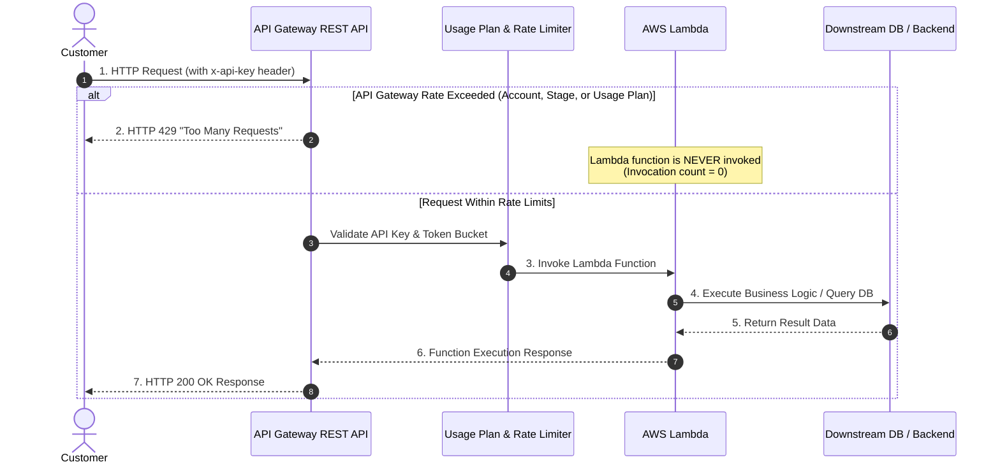
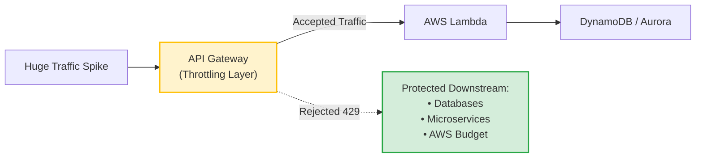
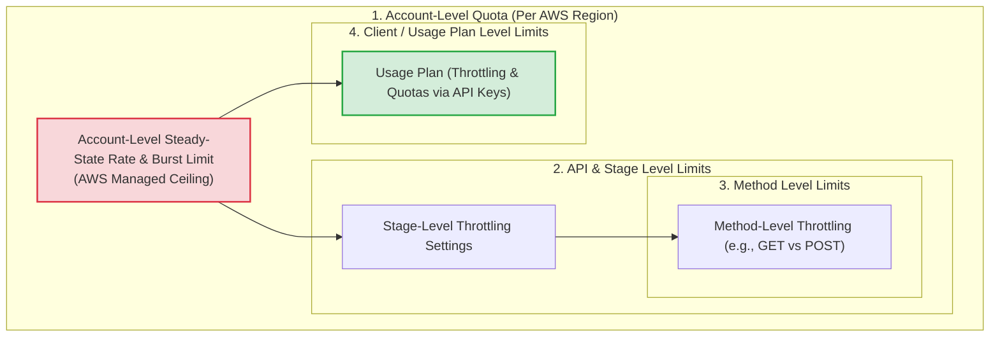
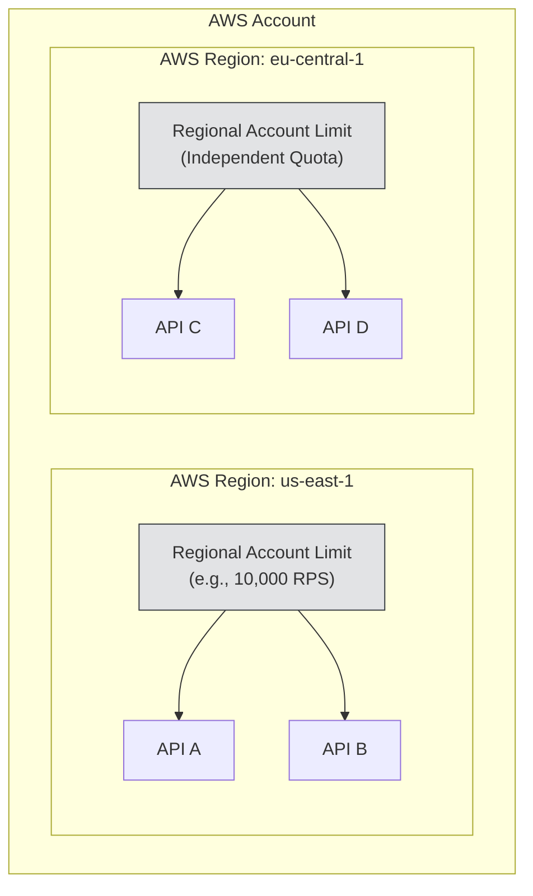
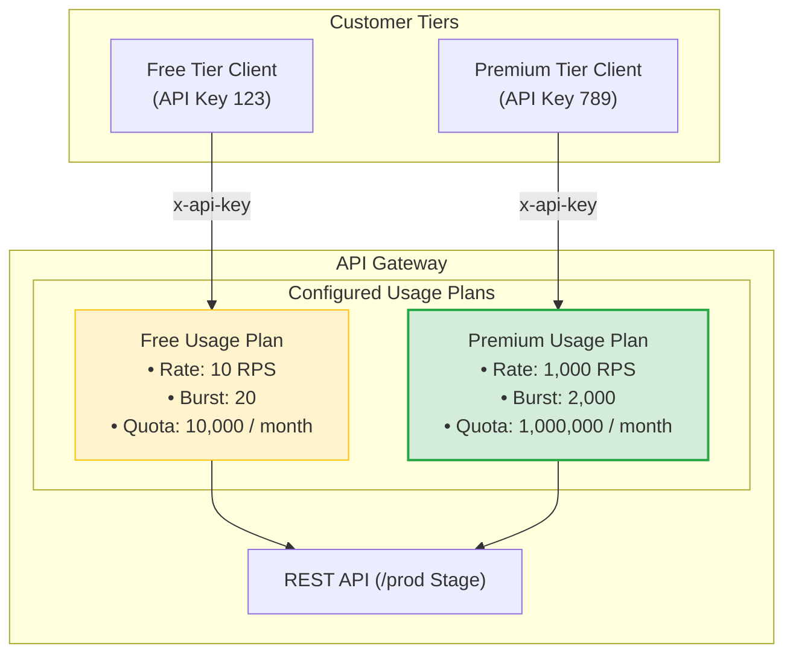
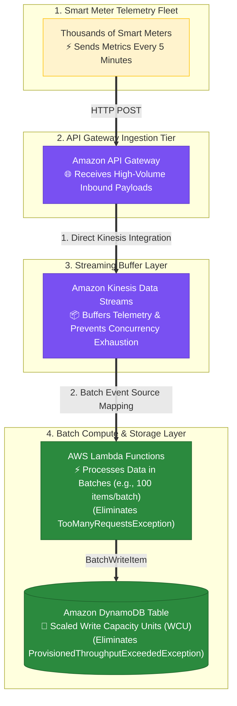
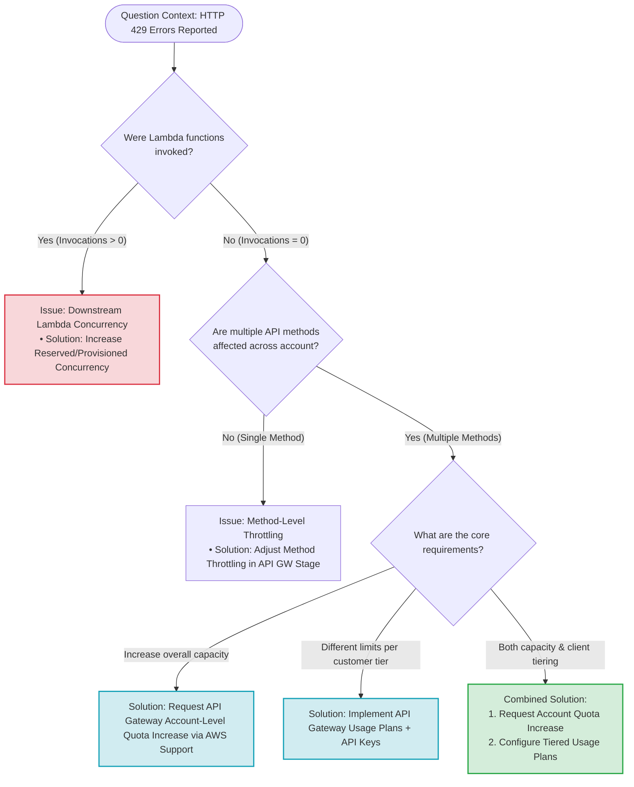

# API Gateway Throttling & Usage Plans: AWS Solutions Architect Professional (SAP-C02) & AIP-C01 Exam Guide

> [!NOTE]
> **Core Concept**: When encountering `429 Too Many Requests` where **Lambda functions have NOT been invoked**, the request was rejected at the **API Gateway tier** before reaching the compute layer. This indicates an API Gateway-level throttling configuration, not Lambda concurrency limits.

---

## 1. Request Path & Throttling Evaluation Point

To diagnose `429 Too Many Requests` errors in serverless architectures, trace the exact flow of HTTP requests through the AWS infrastructure.

### End-to-End Request Pipeline



### Architectural Key Takeaway

If Lambda execution counts and logs in CloudWatch show **zero invocations** during a 429 error spike, the throttling point is strictly **upstream** at API Gateway.

```
Customer ──> API Gateway ──> [ ✕ Throttled Here (HTTP 429) ] ───x (Lambda Never Invoked)
```

---

## 2. Why API Gateway Throttling Exists

API Gateway throttling uses a **token bucket algorithm** (steady-state request rate + burst capacity) to protect system stability across four main vectors:

1. **Lambda Concurrency Protection**: Prevents unmanaged traffic spikes from exhausting regional Lambda concurrency limits.
2. **Database Overload Prevention**: Protects downstream databases (DynamoDB, Aurora, RDS) from connection pool depletion and CPU starvation.
3. **Downstream Service Resilience**: Shield legacy or third-party HTTP endpoints integration targets.
4. **Cost Safeguarding**: Prevents denial-of-wallet scenarios caused by runaway client retry loops or DDoS attacks.



---

## 3. Exam Scenario Breakdown

### Scenario Prerequisites
- **Architecture**: REST APIs integrated with AWS Lambda across **multiple AWS Regions** within **one AWS account**.
- **Symptoms**: Peak-hour traffic causes `429 Too Many Requests` errors across **multiple API methods**.
- **CloudWatch Observation**: Lambda function invocation metrics show zero invocations during 429 occurrences.
- **Business Requirement**: Resolve the throttling issue while implementing custom rate limits and usage quotas for **Premium Customers**.

### Problem Identification
This scenario contains **two distinct requirements**:

> [!IMPORTANT]
> **Problem 1 (Infrastructure Level)**: The AWS account is exceeding its default API Gateway account-level throttling limit in the given Region.<br/>
> **Problem 2 (Business Level)**: Premium customers require dedicated, higher usage limits than standard or free users.

---

## 4. API Gateway Throttling Hierarchy & Scope

API Gateway evaluates throttling parameters in a strict hierarchical order. Broad limits constrain narrow limits.



### Hierarchy Breakdown

| Throttling Level | Scope | Managed By | Purpose |
| :--- | :--- | :--- | :--- |
| **Account-Level** | Applies across **all APIs** in a specific AWS Account & Region | AWS (Increases via Service Quotas) | Protects regional API Gateway infrastructure |
| **API / Stage Level** | Applies to a specific API deployment stage (e.g., `/prod`) | Solution Architect | Prevents a single stage from consuming all account capacity |
| **Method Level** | Applies to individual HTTP verbs (e.g., `GET /orders`) | Solution Architect | Shields heavy or resource-intensive operations |
| **Usage Plan Level** | Applies to specific clients via **API Keys** | Solution Architect | Enforces tiered monetization, customer quotas, and rate limits |

> [!WARNING]
> **The Ceiling Rule**: A lower-level throttling limit (e.g., a Usage Plan limit of 20,000 RPS) **cannot exceed** the broader Account-Level capacity (e.g., 10,000 RPS). The account limit acts as an absolute ceiling.

---

## 5. Single Method vs. Multiple Method Throttling Signals

The pattern of 429 errors provides immediate diagnostic clues:

- **Single Method Affected** (`GET /search` returns 429, but `POST /orders` works):
  - Points to a **Method-Level limit** or a targeted endpoint bottleneck.
- **Multiple API Methods Affected** (`GET /orders`, `POST /orders`, `GET /customers` all return 429):
  - Points directly to reaching the **Account-Level API Gateway throttling limit** for that AWS Region.

---

## 6. Distinguishing API Gateway Throttling from Lambda Throttling

| Diagnostic Factor | API Gateway Throttling | Lambda Concurrency Throttling |
| :--- | :--- | :--- |
| **HTTP Error Code** | `429 Too Many Requests` | `429 Too Many Requests` (or 500 depending on integration) |
| **Lambda Invocation Metric** | **0 Invocations** (Request never reaches Lambda) | **>0 Invocations** (Attempted, then throttled downstream) |
| **Execution Logs** | No CloudWatch Logs generated for Lambda | `Task timed out` or `Rate Exceeded` in Lambda CloudWatch Logs |
| **Root Cause** | Exceeded API GW Rate/Burst/Account Limit | Exceeded Regional/Reserved/Provisioned Concurrency |
| **Resolution** | Increase Account Quota / Use Usage Plans | Request Lambda Concurrency Increase / Reserve Concurrency |

---

## 7. Account-Level Limits & Regional Isolation

API Gateway throttling limits are scoped **per AWS Account, per Region**.



> [!NOTE]
> Increasing the API Gateway account quota in `us-east-1` has **no effect** on `eu-central-1`. Quota increase requests via Service Quotas / AWS Support must be submitted separately for every active Region.

---

## 8. Usage Plans & API Keys Architecture

Usage Plans allow defining distinct access tiers for different clients without duplicating API deployments.

### Multi-Tier Architecture Pattern



### Key Components of Usage Plans

1. **API Keys**: String alphanumeric tokens issued to clients and passed in HTTP headers (`x-api-key`). They identify the calling client.
2. **Throttling (Rate Limit)**: Defines maximum steady-state requests per second (RPS) and burst capacity (e.g., 500 RPS with 1,000 burst).
3. **Quota**: Controls the total number of requests allowed over a longer timeframe (day, week, or month).

---

## 9. Throttling vs. Quota Comparison

```
Throttling  ====> Controls SPEED (Requests per Second / Burst)
Quota       ====> Controls VOLUME (Total Requests per Day / Month)
```

| Dimension | Throttling (Rate Limit) | Quota (Usage Limit) |
| :--- | :--- | :--- |
| **Unit of Measurement** | Requests per Second (RPS) + Burst | Total Requests per Day / Week / Month |
| **Purpose** | Prevents sudden traffic surges & spikes | Enforces billing tiers and prevents long-term abuse |
| **Behavior on Exceeding** | Immediate `429 Too Many Requests` response | Rejects requests until quota resets at period end |
| **Example Value** | `100 requests/second` with `200 burst` | `1,000,000 requests/month` |

---

## 10. Operational Overhead: Usage Plans vs. Multi-API Anti-Pattern

### The Anti-Pattern: Duplicate APIs per Tier
Creating separate APIs for each customer tier creates significant operational friction:

```
[ Free API ] ----> Separate Stage ----> Separate Deployment ----> Separate Monitoring
[ Standard API ] -> Separate Stage ----> Separate Deployment ----> Separate Monitoring
[ Premium API ] --> Separate Stage ----> Separate Deployment ----> Separate Monitoring
```

### The Best Practice: Single API with Usage Plans

```
                                 ┌──> Free Usage Plan ──────┐
[ Customer Request + API Key ] ──┼──> Standard Usage Plan ──┼──> [ Single Unified REST API ]
                                 └──> Premium Usage Plan ───┘
```

> [!TIP]
> **Minimal Operational Overhead**: Usage plans enable maintaining **one single REST API codebase and deployment pipeline**, while dynamically enforcing different throttling rates and quotas per client via API keys.

---

## 11. Complete Solution for Exam Scenario

To solve the exam problem (multiple method 429 errors + requirement for premium customer quotas):

```
Step 1: Request API Gateway Account-Level Quota Increase (AWS Support)
        │ (Raises account ceiling in all affected AWS Regions)
        ▼
Step 2: Create API Keys & Associate with Usage Plans
        │ (Configures customer-specific rates and quotas)
        ▼
Result: Account protected, premium clients prioritized, operational overhead minimized.
```

---

## 13.1 Real-World Exam Scenario: Decoupling Smart Meter High-Volume Telemetry via API Gateway + Kinesis Batching & DynamoDB WCU Scaling (Select TWO)

- **Scenario**: Electric smart meters send telemetry every 5 minutes to API Gateway $\rightarrow$ AWS Lambda $\rightarrow$ Amazon DynamoDB. Due to new metrics and customer growth, Lambda processing time ballooned from 5-10s to 60-90s. Errors began appearing: `TooManyRequestsException` on AWS Lambda and `ProvisionedThroughputExceededException` on DynamoDB `PutItem` operations. Which TWO actions resolve these issues?
- **Architecture Solutions (Select TWO)**:
  1. **Decouple & Batch via Kinesis**: Stream incoming API Gateway requests into an **Amazon Kinesis Data Stream**. Configure Lambda to read records from Kinesis in **batches**, dramatically reducing function invocations and optimizing DynamoDB writes.
  2. **Increase DynamoDB Write Capacity**: Increase the **Write Capacity Units (WCU)** of the DynamoDB table (or switch to On-Demand capacity) to accommodate the write throughput required by the Lambda functions.



### Key Technical Rationale:
1. **Streaming Buffer (Kinesis) for Batch Processing**:
   - Long-running Lambda invocations (60-90 seconds) consume reserved/unreserved concurrency slots, causing `TooManyRequestsException`.
   - Ingesting payloads into **Amazon Kinesis Data Streams** decouples API Gateway from Lambda. Lambda reads records in batches, executing far fewer invocations and using `BatchWriteItem` to optimize DynamoDB storage writes.
2. **Scaling DynamoDB Write Throughput (WCU)**:
   - `ProvisionedThroughputExceededException` is a direct signal from DynamoDB that write throughput exceeds provisioned capacity. Increasing Write Capacity Units (WCU) resolves table throttling.

### Why Distractor Options Fail:
- *Modifying API Gateway Stage Throttling Limits (Your Selection)*:
  - **Downstream Distractor**: The errors (`TooManyRequestsException` and `ProvisionedThroughputExceededException`) occur downstream in **Lambda** and **DynamoDB**, NOT at the API Gateway tier. Raising API Gateway stage throttling limits passes even *more* unbuffered traffic downstream, worsening Lambda concurrency crashes!
- *Increasing Lambda Memory Allocation*:
  - Adjusting memory increases CPU, but performance gains plateau and costs surge. It does NOT buffer incoming spikes, implement batching, or resolve DynamoDB `ProvisionedThroughputExceededException`.
- *Increasing Smart Meter Payload & Reducing Frequency*:
  - Exceeds the API Gateway 10 MB payload limit and requires modifying firmware/code across thousands of physical deployed smart meters.

---


## 12. Exam Troubleshooting Decision Tree

Use this decision logic when evaluating serverless throttling questions on the AWS SAP-C02 or AIP-C01 exams:



---

## 13. AWS Exam Memory & Quick Reference Matrix

| Scenario / Keyword Phrase | Primary Cause | Correct AWS Action |
| :--- | :--- | :--- |
| `"429 error across multiple API methods"` | Account-level API Gateway limit reached | Request Account Quota increase via AWS Support |
| `"Lambda functions have not been invoked"` | Upstream API Gateway throttling | Focus on API Gateway configuration, not Lambda concurrency |
| `"Separate quotas for premium customers"` | Client tiering requirement | Create Usage Plans and issue API Keys |
| `"Limit requests per month"` | Monthly volume allowance | Configure Usage Plan **Quota** |
| `"Limit sudden traffic bursts"` | Instantaneous rate limit | Configure Usage Plan **Burst/Rate Limit (RPS)** |
| `"Usage plan limit set higher than account limit"` | Invalid configuration (Ceiling rule breach) | Account limit overrides Usage Plan; request account quota increase first |
| `"Set Lambda throttling in API Gateway usage plan"` | Distractor / Incorrect option | API Gateway Usage Plans do **NOT** control Lambda concurrency |

---

## 14. Final Mental Model

```
┌────────────────────────────────────────────────────────────────────────┐
│                        AWS Account & Region                            │
│ ┌────────────────────────────────────────────────────────────────────┐ │
│ │ Account-Level API Gateway Limit (AWS Support Managed Ceiling)      │ │
│ │ ┌────────────────────────────────────────────────────────────────┐ │ │
│ │ │ API Stage / Method Throttling                                  │ │ │
│ │ │ ┌────────────────────────────────────────────────────────────┐ │ │ │
│ │ │ │ Client Usage Plan (API Key: Rate Limit RPS + Quota Limit)   │ │ │ │
│ │ │ └─────────────────────────────┬──────────────────────────────┘ │ │ │
│ │ └───────────────────────────────┼────────────────────────────────┘ │ │
│ └─────────────────────────────────┼──────────────────────────────────┘ │
└───────────────────────────────────┼────────────────────────────────────┘
                                    ▼
                         [ AWS Lambda Execution ]
```

- **The account-level limit protects the AWS account.**
- **The usage plan controls individual client tiers.**
- **Lambda concurrency controls downstream compute execution.**