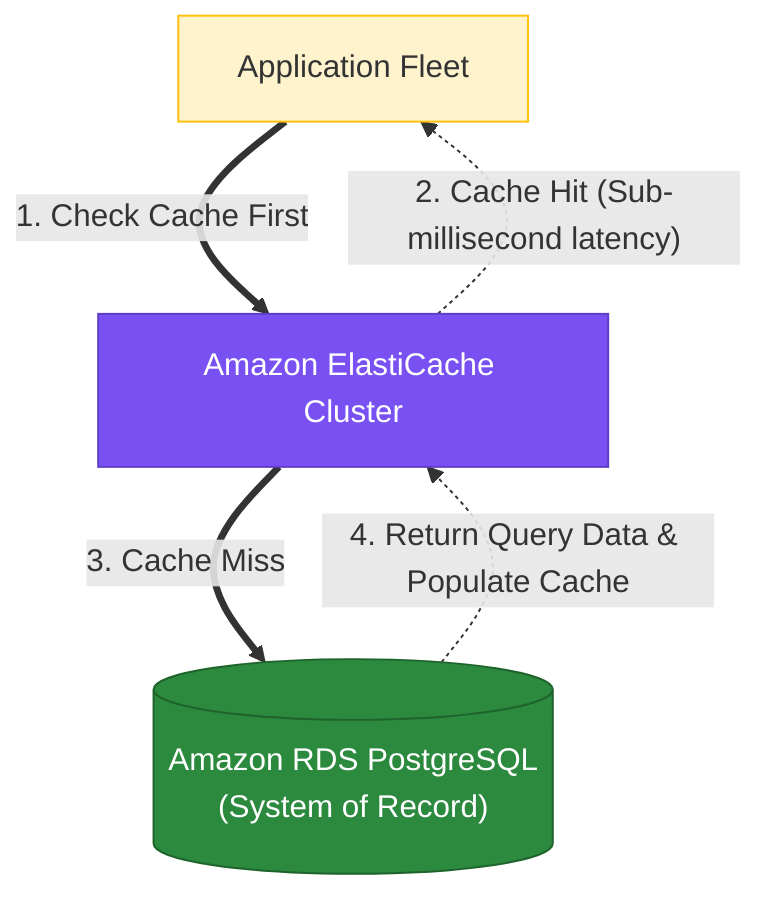
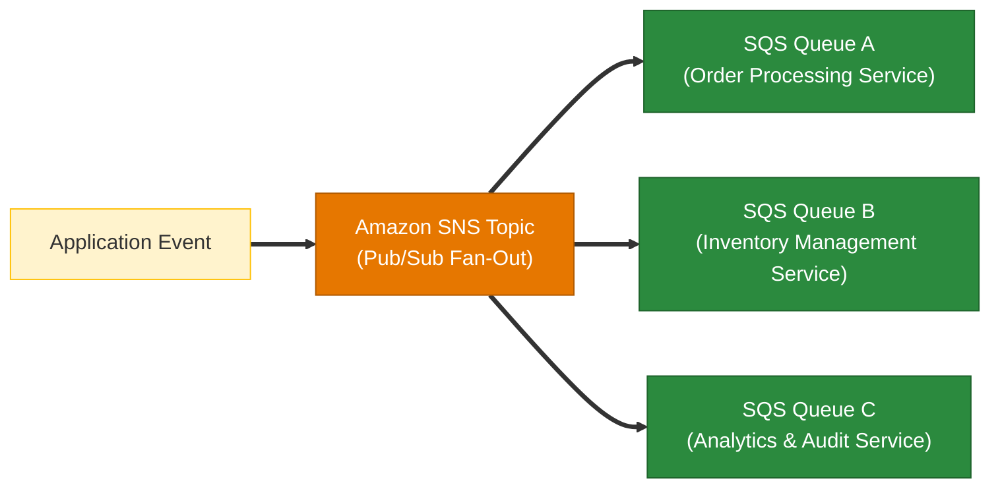
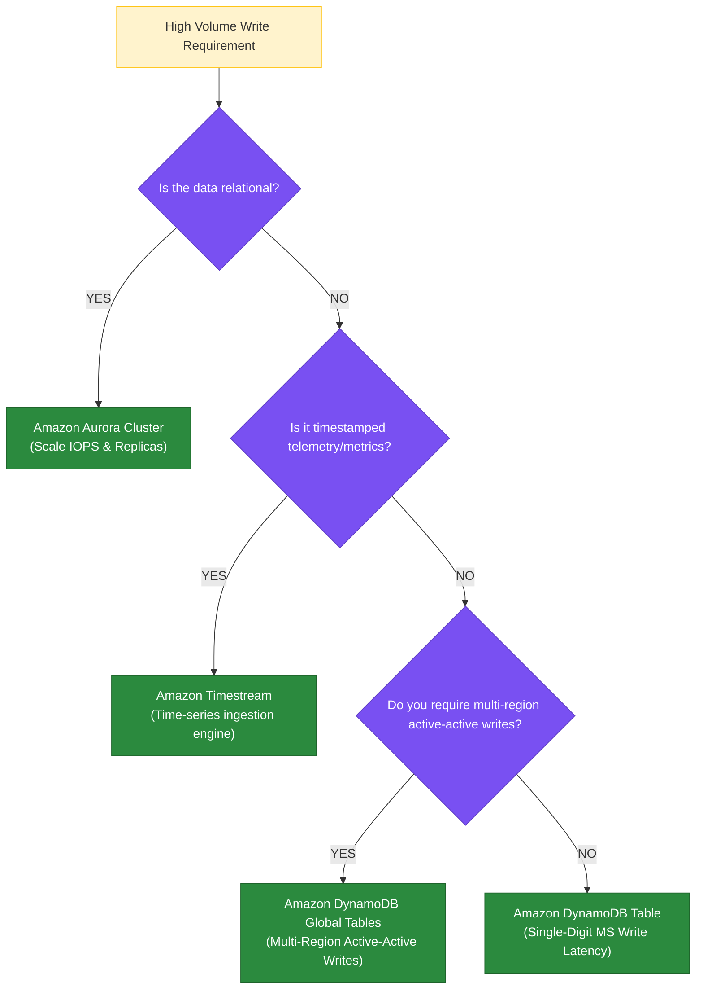

# AWS SAP-C02 Complete Services Reference & Incompatibility Guide

> **Target Exam**: AWS Certified Solutions Architect – Professional (SAP-C02)  
> **Purpose**: Definitive master lookup table listing all AWS services, core purpose, origin rationale, associated service integrations, and **critical incompatible service combinations / exam traps**.

---

## 📌 Quick Navigation Index

- [1. Compute & Hybrid Infrastructure Services](#1-compute--hybrid-infrastructure-services)
- [2. Storage & Archival Services](#2-storage--archival-services)
- [3. Databases & In-Memory Caching Services](#3-databases--in-memory-caching-services)
  - [Amazon RDS Multi-AZ vs. Read Replicas Comparison Matrix](#amazon-rds-multi-az-vs-read-replicas-vs-multi-az--read-replicas-comparison-matrix)
  - [Amazon Aurora Global Database vs. RDS Cross-Region Replication Matrix](#amazon-aurora-global-database-vs-rds-cross-region-read-replicas-vs-rds-multi-az-disaster-recovery--replication-matrix)
- [4. Networking & Content Delivery Services](#4-networking--content-delivery-services)
  - [Edge Compute Engine Comparison: CloudFront Functions vs. Lambda@Edge](#edge-compute-engine-comparison-cloudfront-functions-vs-lambdaedge)
- [5. Security, Identity & Governance Services](#5-security-identity--governance-services)
- [6. Analytics, Data Integration & Messaging Services](#6-analytics-data-integration--messaging-services)
- [7. Migration, Modernization & Management Services](#7-migration-modernization--management-services)
  - [The 7 Rs Workload Migration Strategies Framework](#the-7-rs-workload-migration-strategies-framework)
  - [AWS Deployment Strategies & Elastic Beanstalk Policies Comparison Matrix](#aws-deployment-strategies--elastic-beanstalk-policies-comparison-matrix)
- [8. Machine Learning & Specialized AI Services](#8-machine-learning--specialized-ai-services)
- [9. Final SAP-C02 Incompatibility & Trap Rule Summary](#9-final-sap-c02-incompatibility--trap-rule-summary)
- [10. Master AWS Database RPO / RTO / High Availability & Failover Comparison](#10-master-aws-database-rpo--rto--high-availability--failover-comparison)
  - [Core Exam Rules: Database RPO / RTO & High Availability](#core-exam-rules-database-rpo--rto--high-availability)
- [11. Master Database, Caching & Messaging Architectural Decision Framework](#11-master-database-caching--messaging-architectural-decision-framework)
  - [11.1 RDS PostgreSQL & In-Memory Caching (ElastiCache Redis vs. Memcached)](#111-rds-postgresql--in-memory-caching-elasticache-redis-vs-memcached)
  - [11.2 Database High Availability, Regional DR & Strict RPO/RTO Selection](#112-database-high-availability-regional-dr--strict-rporto-selection)
  - [11.3 Enterprise Messaging Services: Amazon MQ vs. Amazon SQS & Fan-Out Architectures](#113-enterprise-messaging-services-amazon-mq-vs-amazon-sqs--fan-out-architectures)
  - [11.4 Purpose-Built Databases for Semi-Structured Data & High-Write Workloads](#114-purpose-built-databases-for-semi-structured-data--high-write-workloads)
  - [11.5 High-Write Database Decision Tree & DynamoDB Capacity Modes](#115-high-write-database-decision-tree--dynamodb-capacity-modes)
  - [11.6 Master SAP-C02 Exam Decision Matrices & Evaluation Framework](#116-master-sap-c02-exam-decision-matrices--evaluation-framework)

---

## 1. Compute & Hybrid Infrastructure Services

| Service Name | What it is for? | Why it is there in the first place? | Related / Associated Services | Non-Related / Incompatible Services & Key Exam Traps |
| :--- | :--- | :--- | :--- | :--- |
| **Amazon EC2** | Scalable virtual servers in the cloud (IaaS). | Eliminates physical server hardware procurement and data center management. | EBS, VPC, Auto Scaling, ELB, IAM, CloudWatch. | ❌ Cannot automatically failover across Regions without multi-region deployment or Route 53 DNS. |
| **AWS Fargate** | Serverless compute engine for containers (ECS & EKS). | Removes the operational burden of provisioning, scaling, patching, and managing EC2 host instances. | Amazon ECS, Amazon EKS, AWS ECR, CloudWatch, ALB. | ❌ **NOT supported on AWS Outposts** (ECS/EKS on Outposts requires EC2 capacity). ❌ No direct SSH/OS access. |
| **Amazon ECS** | AWS-native container orchestration service. | Simple, zero-cost control plane for managing containerized applications on AWS. | AWS Fargate, EC2, ECR, ALB, Route 53, CloudWatch. | ❌ Does NOT support Kubernetes manifests/Helm natively without conversion. |
| **Amazon EKS** | Managed Kubernetes container orchestration service. | Allows running standard Kubernetes workloads on AWS with native CNCF tool compatibility. | AWS Fargate, EC2, ECR, Karpenter, Helm, ArgoCD. | ❌ Control plane is NOT free ($0.10/hr / $73/mo per cluster). |
| **AWS Lambda** | Event-driven serverless compute service. | Executes code in response to events without provisioning or managing servers. | API Gateway, EventBridge, SQS, SNS, S3, DynamoDB. | ❌ **15-minute max execution timeout** (cannot run long batch jobs). ❌ Cannot run custom OS kernels. |
| **AWS Outposts** | AWS physical hardware racks installed in customer data centers. | Delivers ultra-low latency (<10ms) local processing and on-premises data residency compliance. | EC2, EBS, S3 on Outposts, Direct Connect, VPC. | ❌ **AWS Fargate is NOT supported**. ❌ EKS Anywhere does NOT run on Outposts hardware. |
| **AWS Batch** | Managed batch processing for parallel/grid computing jobs. | Dynamically provisions compute resources (EC2/Fargate) based on volume and job queues. | AWS Fargate, EC2 Spot, SQS, S3, ECR. | ❌ Not designed for real-time web application request/response APIs. |
| **AWS App Runner** | Managed container application deployment service. | Fully managed deployment of web apps and APIs directly from source code or container image. | ECR, AWS Copilot, IAM, Route 53. | ❌ Does not allow low-level host tuning, custom networking plugins, or Kubernetes CRDs. |
| **AWS Wavelength** | Edge compute embedded in 5G telecommunication provider data centers. | Delivers single-digit millisecond latency to 5G mobile devices and end-users. | EC2, EBS, VPC Carrier Gateways, 5G Telco Networks. | ❌ Not for standard corporate office site-to-site VPNs or general public web hosting. |
| **AWS Local Zones** | Infrastructure deployment placed close to major population/industry centers. | Serves sub-10ms latency applications to local users without building regional data centers. | EC2, EBS, ALB, VPC. | ❌ Does not contain all AWS regional services (e.g. specialized ML hardware may be missing). |
| **AWS Elastic Beanstalk** | Managed Platform as a Service (PaaS) for deploying web applications. | Provisions EC2, ALB, ASG, and database infrastructure automatically from code bundles with zero OS tuning. | EC2, Auto Scaling, ALB, S3, RDS, CloudFormation. | ❌ **NOT for low-level custom OS/kernel extensions**; use direct CloudFormation or EC2/ECS if deep OS customization needed. |

---

## 2. Storage & Archival Services

| Service Name | What it is for? | Why it is there in the first place? | Related / Associated Services | Non-Related / Incompatible Services & Key Exam Traps |
| :--- | :--- | :--- | :--- | :--- |
| **Amazon S3** | High-durability (11 9s) object storage for files, media, and backups. | Provides unlimited, low-cost internet-accessible object storage via HTTP REST APIs. | CloudFront, IAM, KMS, Lambda, S3 Lifecycle, Athena. | ❌ **NOT block storage** (cannot mount directly as OS boot volume). ❌ Not POSIX compliant. |
| **Amazon EBS** | High-performance block storage volumes attached to single EC2 instances. | Serves persistent disk storage for databases and operating systems that survive instance reboot. | EC2, EBS Snapshots, Data Lifecycle Manager (DLM), KMS. | ❌ **Cannot be attached across multiple AZs** (Multi-Attach is single-AZ only). ❌ Not global storage. |
| **Amazon EFS** | Scalable, elastic NFS file system shared across multiple EC2 instances/Fargate. | Provides shared POSIX-compliant file storage accessible concurrently from Linux servers. | EC2, AWS Fargate, AWS Lambda, AWS DataSync, IAM. | ❌ **Linux ONLY** (Does NOT support Windows native SMB protocol). |
| **Amazon FSx for Windows** | Fully managed native Microsoft Windows file system (SMB protocol). | Provides Windows-compatible shared file storage backed by native Active Directory. | Windows EC2, AWS Directory Service, AWS DataSync. | ❌ Linux workloads requiring POSIX permissions should use EFS, not FSx for Windows. |
| **Amazon FSx for Lustre** | High-performance parallel file system for HPC, ML, and big data workloads. | Delivers sub-millisecond latency and hundreds of GB/s throughput for intensive compute tasks. | EC2, AWS Batch, S3, SageMaker. | ❌ High cost; NOT designed for long-term general-purpose cold file archiving. |
| **AWS Storage Gateway** | Hybrid cloud storage bridge (File, Volume, Tape Gateways). | Gives on-premises applications seamless access to AWS cloud storage with local caching. | Amazon S3, S3 Glacier, KMS, Direct Connect. | ❌ **File Gateway is NOT for bulk one-off data migrations** (Use AWS DataSync for migrations). |
| **AWS Snowball Edge** | Physical ruggedized appliance for offline bulk data migration (up to 80-100 TB). | Transports petabyte-scale data physically when network bandwidth is too slow/expensive. | Amazon S3, AWS SCT Extraction Agent, KMS. | ❌ **Not for continuous real-time CDC replication** (Use AWS DMS over network). |
| **AWS DataSync** | Automated network data transfer service for NFS, SMB, and S3 storage. | Accelerates bulk data migration and scheduled backups over network links. | Amazon S3, EFS, FSx, Storage Gateway. | ❌ **NOT for relational database transaction log replication** (Use AWS DMS for DBs). |
| **Amazon S3 Glacier** | Secure, durable (11 9s), extremely low-cost storage class for data archiving. | Provides long-term cold storage with flexible retrieval options (Expedited 1-5m, Standard 3-5h, Deep Archive 12h). | Amazon S3, S3 Lifecycle, Vault Lock, KMS. | ❌ **Standard retrieval takes 3–5 hours**; Deep Archive takes 12 hours. ❌ CANNOT query directly with ML services like Rekognition without restoring first. |

---

## 3. Databases & In-Memory Caching Services

| Service Name | What it is for? | Why it is there in the first place? | Related / Associated Services | Non-Related / Incompatible Services & Key Exam Traps |
| :--- | :--- | :--- | :--- | :--- |
| **Amazon RDS** | Managed relational database (MySQL, Postgres, MariaDB, Oracle, SQL Server). | Automates OS patching, DB backups, multi-AZ failover, and hardware management. | EC2, Secrets Manager, KMS, CloudWatch, Direct Connect. | ❌ **Multi-AZ Standby is PASSIVE** (Cannot be queried for read scaling; use Read Replicas). |
| **Amazon Aurora** | Cloud-native relational database (MySQL & PostgreSQL compatible). | Delivers up to 5x MySQL performance with storage auto-scaling up to 128 TiB. | Aurora Global Database, Aurora Serverless v2, Secrets Manager. | ❌ **Not multi-master across regions** (Aurora Global DB has 1 Primary Writer + Regional Readers). |
| **Amazon Aurora Global Database** | Multi-Region relational database for cross-region DR and global low-latency reads. | Enables dedicated physical storage-layer replication across regions with RPO < 1s and sub-minute regional failover (RTO < 1m). | Amazon Aurora, Route 53 Failover Routing, AWS KMS, Secrets Manager. | ❌ **NOT multi-master write across regions** (1 Primary Writer Region + Up to 5 Secondary Regions). ❌ **RDS Multi-AZ cannot span regions** (Multi-AZ is single-region only). |
| **Amazon DynamoDB** | Fully managed serverless key-value NoSQL database. | Guarantees single-digit millisecond latency at any scale without server management. | DynamoDB Global Tables, DAX, DynamoDB Streams, Lambda. | ❌ **NOT for complex multi-table SQL joins or ACID OLAP analytics** (Use Redshift/RDS). |
| **Amazon ElastiCache** | In-memory key-value cache engine (Redis / Memcached). | Offloads read pressure from databases and reduces application response latency to sub-ms. | RDS, Aurora, DynamoDB, EC2, AWS Lambda. | ❌ **Memcached does NOT support multi-AZ failover or persistence** (Use Redis for HA/Persistence). |
| **Amazon Redshift** | Fully managed petabyte-scale columnar Data Warehouse (OLAP). | Executes complex analytical queries and aggregations across massive datasets. | S3, AWS Glue, QuickSight, DMS, EMR. | ❌ **NOT for high-frequency OLTP transactional writes** (Frequent small writes degrade performance). |
| **Amazon Neptune** | Fully managed graph database (Property Graph / RDF). | Queries complex networks of highly connected data (social graphs, fraud networks). | Lambda, EC2, S3, IAM. | ❌ Not for traditional tabular relational data or standard SQL queries. |
| **Amazon Timestream** | Serverless time-series database for IoT and operational metrics. | Efficiently stores and analyzes timestamped data streams with automated lifecycle tiering. | IoT Core, Kinesis, Grafana, Lambda. | ❌ Not for general-purpose key-value lookups or relational tables. |

### Amazon RDS Multi-AZ vs. Read Replicas vs. Multi-AZ + Read Replicas Comparison Matrix

| Feature / Dimension | Amazon RDS Multi-AZ Deployment | Amazon RDS Read Replicas | Amazon RDS Multi-AZ + Read Replicas |
| :--- | :--- | :--- | :--- |
| **Primary Purpose** | **High Availability (HA) & Disaster Recovery (DR)** | **Read Performance & Horizontal Query Scaling** | **Combined HA/DR + Read Performance Scaling** |
| **Replication Mode** | **Synchronous** (Block-level storage replication) | **Asynchronous** (Engine-level binary log replication) | **Synchronous for HA** + **Asynchronous for Read Replicas** |
| **Standby / Target State** | **Passive Standby** in secondary AZ (Hidden DNS endpoint) | **Active Read-Only Endpoints** (1 to 15 replicas) | **Passive HA Standby** + **Active Read-Only Replicas** |
| **Can Query Standby/Target?**| ❌ **NO** (Standby endpoint is invisible & cannot accept reads) | ✅ **YES** (Read-only SQL queries allowed) | ✅ **YES** (Queries served by Read Replicas, not HA standby) |
| **Failover Capabilities** | **Automated (< 60s)** DNS failover to standby instance | **Manual promotion** required (can become standalone DB) | **Automated HA failover** + Read Replicas continue serving reads |
| **Cross-Region Support** | Single Region only (across 2 AZs) | **Multi-Region supported** (Cross-Region Read Replicas) | Multi-AZ within Primary Region + Cross-Region Read Replicas |
| **Primary Exam Trap** | ❌ **Multi-AZ does NOT scale read query performance** | ❌ **Read Replicas do NOT provide automated HA failover** | ✅ **Use for combined HA/DR + Read Scaling SLAs** |

### Amazon Aurora Global Database vs. RDS Cross-Region Read Replicas vs. RDS Multi-AZ (Disaster Recovery & Replication Matrix)

| Feature / Dimension | Amazon Aurora Global Database | RDS Cross-Region Read Replicas | RDS Multi-AZ Deployment |
| :--- | :--- | :--- | :--- |
| **Primary Purpose** | **Cross-Region Disaster Recovery (RPO < 1s, RTO < 1m) & Global Read Scaling** | **Cross-Region Read Scaling & Asynchronous Cross-Region DR** | **Single-Region High Availability (HA) & Automated Failover** |
| **Replication Architecture** | **Dedicated Physical Storage-Layer Replication** (No DB engine performance impact) | **Engine-Level Asynchronous Replication** (MySQL/PostgreSQL Binlogs) | **Synchronous Block-Level Storage Replication** (Between 2 AZs in 1 Region) |
| **Cross-Region RPO (Data Loss)** | **Sub-Second (Typically < 1 second)** | **Seconds to Minutes** (Subject to replication lag & network congestion) | ❌ **N/A** (Single Region Only — Zero Cross-Region Protection!) |
| **Cross-Region RTO (Downtime)** | **Sub-Minute (< 1 minute promotion)** | **Minutes to Hours** (Manual promotion + instance reboot required) | ❌ **N/A** (Single Region Only — Zero Cross-Region Protection!) |
| **Write / Read Architecture** | **1 Primary Region Writer** + Up to **5 Secondary Regions** (16 Replicas per Region) | **1 Primary Region Master** + Up to **5 Cross-Region Read Replicas** | **1 Active Writer** + **1 Passive Synchronous Standby** (No reads on standby) |
| **Failover Mechanism** | **Managed Regional Failover / Promotion** (Secondary Region promoted to Primary Writer) | **Manual Read Replica Promotion** (Requires re-routing app connections) | **Automated DNS CNAME Flip** (< 60s failover to standby in same Region) |
| **Primary Exam Trap Trigger** | ❌ **Do NOT assume Multi-AZ or RDS Replicas satisfy RPO < 1 min & RTO < 5 mins for Cross-Region DR** | ❌ **Manual promotion & DB reboots break strict < 1m RTO SLAs under heavy load** | ❌ **RDS Multi-AZ provides ZERO protection against regional AWS outages!** |

---

## 4. Networking & Content Delivery Services

| Service Name | What it is for? | Why it is there in the first place? | Related / Associated Services | Non-Related / Incompatible Services & Key Exam Traps |
| :--- | :--- | :--- | :--- | :--- |
| **Amazon VPC** | Isolated virtual network environment in the AWS Cloud. | Gives complete logical isolation and control over virtual networking, IP subnets, and routing. | EC2, Subnets, Route Tables, Internet Gateways, NAT Gateways. | ❌ VPC subnets **CANNOT span multiple Availability Zones** (A subnet resides in 1 AZ). |
| **AWS Transit Gateway** | Centralized hub connecting multiple VPCs and on-premises networks. | Simplifies network topology by replacing thousands of complex VPC peering connections. | VPC Peering, Direct Connect Gateway, AWS Site-to-Site VPN. | ❌ **Does NOT support overlapping CIDR blocks** between attached VPCs. |
| **Amazon Route 53** | Highly available and scalable DNS and domain registration service. | Resolves domain names to IP addresses and routes global user traffic using intelligent routing. | Route 53 Resolver, S3, CloudFront, ALB, Direct Connect. | ❌ **Route 53 updates propagate in < 60 seconds** (Do NOT fall for 12-hour propagation traps). |
| **AWS Direct Connect** | Dedicated private physical network connection from on-premises to AWS. | Provides predictable network performance, lower latency, and reduced data egress costs. | Direct Connect Gateway, Private VIF, Public VIF, Transit Gateway. | ❌ **Public VIF CANNOT connect to Virtual Private Gateways (VGWs) or Direct Connect Gateways** (Requires Private VIF). |
| **Amazon CloudFront** | Global Content Delivery Network (CDN) edge distribution service. | Caches static/dynamic web content at global edge locations to minimize user latency. | S3, ALB, API Gateway, AWS WAF, Route 53, Shield. | ❌ CloudFront caches content globally; **it does NOT replace database replication**. |
| **AWS Global Accelerator** | Network service that routes traffic over AWS global backbone using static Anycast IPs. | Improves availability and performance for global users by bypassing public internet congestion. | ALB, NLB, EC2, Route 53. | ❌ **Does NOT cache HTTP content at edge** (CloudFront caches content; Global Accelerator routes TCP/UDP). |
| **AWS PrivateLink** | Private, secure connection from VPC to AWS services or 3rd-party SaaS without Internet. | Eliminates exposure of internal VPC traffic to the public internet using VPC Interface Endpoints. | Network Load Balancer (NLB), VPC, IAM. | ❌ Interface Endpoints require an NLB on the service provider side, **NOT an ALB**. |
| **Lambda@Edge** | Executes Node.js/Python serverless functions globally at CloudFront Edge locations. | Customizes CDN content delivery (User-Agent device parsing, A/B testing, complex auth) close to viewers with low latency. | Amazon CloudFront, AWS Lambda, S3, AWS WAF. | ❌ **Does NOT increase CloudFront Cache Hit Ratio** (use `Cache-Control: max-age`). ❌ **Do NOT cache on raw `User-Agent` strings** (use Lambda@Edge to normalize `User-Agent` into device buckets). ❌ **Overkill for simple URL rewrites** (use CloudFront Functions for simple header tweaks). |

### Edge Compute Engine Comparison: CloudFront Functions vs. Lambda@Edge

| Feature / Dimension | CloudFront Functions | Lambda@Edge |
| :--- | :--- | :--- |
| **Execution Location** | 210+ Edge Locations (PoPs) | 13+ Regional Edge Caches (RECs) |
| **Runtime Support** | Lightweight JavaScript (ECMAScript v5.1) | Node.js & Python |
| **Event Triggers** | Viewer Request & Viewer Response ONLY | Viewer Request, Origin Request, Origin Response, Viewer Response |
| **Max Execution Time** | **< 1 millisecond** (Sub-ms execution) | **Up to 5 seconds (Viewer) / 30 seconds (Origin)** |
| **Network & File Access**| ❌ **No network access** / No request body access | ✅ **Full network access** / Access HTTP payload body & external APIs |
| **Primary Use Cases** | Simple URL rewrites, header tweaks, redirects, basic normalization | Complex authorization, body mutation, device `User-Agent` parsing, A/B testing |
| **Primary Exam Trap** | ❌ **Cannot call external APIs or inspect HTTP body** | ❌ **Higher cost & latency** than CloudFront Functions for simple header tweaks |

---

## 5. Security, Identity & Governance Services

| Service Name | What it is for? | Why it is there in the first place? | Related / Associated Services | Non-Related / Incompatible Services & Key Exam Traps |
| :--- | :--- | :--- | :--- | :--- |
| **AWS IAM** | Identity and Access Management for AWS resources and permissions. | Controls WHO can access WHICH AWS resources under WHAT conditions (least-privilege). | IAM Roles, Policies, STS, IAM Identity Center. | ❌ **Do NOT use IAM User long-lived access keys** for EC2/Lambda (Use IAM Roles). |
| **AWS IAM Identity Center**| Centralized workforce Single Sign-On (SSO) and multi-account identity management. | Connects enterprise IdPs (Okta, Azure AD) via SAML/SCIM to manage access across AWS accounts. | AWS Organizations, SAML 2.0 IdPs, SCIM, AWS STS. | ❌ **Does NOT support OpenID Connect (OIDC)** for web apps (SAML 2.0 only). |
| **AWS STS (Security Token Service)** | Issues temporary, short-lived security credentials for IAM roles and federated users. | Eliminates long-lived access keys by exchanging identity tokens (`AssumeRole`, `AssumeRoleWithSAML`, `AssumeRoleWithWebIdentity`) for temporary credentials. | AWS IAM, IAM Identity Center, Cognito, SAML 2.0 IdPs, OIDC. | ❌ **`AssumeRoleWithWebIdentity` is strictly for public social/web logins** (Facebook, Google, Cognito). ❌ **Do NOT use `AssumeRoleWithWebIdentity` for corporate SAML 2.0 logins** (Use **`AssumeRoleWithSAML`** or IAM Identity Center). |
| **AWS Directory Service** | Managed Microsoft Active Directory (AWS Managed AD, AD Connector, Simple AD) in cloud. | Connects or extends on-premises Active Directory to AWS for seamless SSO, domain join, and Forest Trusts. | IAM Identity Center, AWS Managed AD, AD Connector, WorkSpaces, Direct Connect. | ❌ **Manually creating local users in IAM Identity Center does NOT extend on-prem AD**. ❌ **Simple AD does NOT support Forest Trusts** (Use AWS Managed AD). |
| **AWS KMS** | Managed service for creating and controlling cryptographic encryption keys. | Protects sensitive data at rest across AWS services using envelope encryption. | S3, EBS, RDS, Secrets Manager, CloudTrail. | ❌ **KMS Custom Key Stores (HSM) incur high hourly costs**; default KMS keys are managed free. |
| **AWS Secrets Manager** | Rotates, manages, and retrieves secrets (database credentials, API keys). | Eliminates hardcoded credentials in application code through automated KMS-encrypted rotation. | RDS, Lambda, KMS, EC2, ECS. | ❌ **Parameter Store is cheaper for static strings**; Secrets Manager is for automated rotation. |
| **Amazon GuardDuty** | Intelligent threat detection and continuous security monitoring service. | Analyzes VPC Flow Logs, CloudTrail, and DNS logs using ML to detect compromised resources. | Security Hub, EventBridge, CloudTrail, VPC Flow Logs. | ❌ **GuardDuty DOES NOT block threats automatically** (It alerts via EventBridge for remediation). |
| **AWS WAF** | Web Application Firewall protecting web applications from Layer 7 exploits. | Filters malicious HTTP/HTTPS payloads (SQL injection, XSS, rate limiting) at edge or ALB. | CloudFront, Application Load Balancer, API Gateway. | ❌ **WAF operates at Layer 7 (HTTP/S) ONLY**; does not block Layer 3/4 SYN floods (Use Shield). |
| **AWS Shield Advanced** | Managed DDoS protection service against large-scale volumetric attacks. | Provides 24/7 access to DDoS Response Team (DRT) and cost protection against DDoS scaling bills. | CloudFront, Route 53, ALB, AWS WAF. | ❌ **Shield Standard is FREE on all AWS services**; Shield Advanced requires a $3,000/mo commit. |
| **AWS Organizations** | Policy-based management service for consolidating multiple AWS accounts. | Centralizes billing, account creation, control policies (SCPs), and resource sharing across accounts. | SCPs, AWS RAM, AWS Control Tower, IAM Identity Center. | ❌ **SCPs do NOT grant permissions** (SCPs act as boundary guardrails; IAM role still needed). |
| **AWS Config** | Continuous resource configuration tracking and compliance evaluation service. | Audits infrastructure changes over time against security baselines and internal governance rules. | Config Rules, CloudTrail, Systems Manager. | ❌ **AWS Config tracks WHAT resource state changed**; CloudTrail logs WHO called the API. |
| **AWS CloudTrail** | Continuous API user activity and identity auditing service across AWS accounts. | Records every API call (user identity, timestamp, source IP) for security compliance and post-incident investigation. | AWS Config, CloudWatch Logs, Amazon S3, EventBridge. | ❌ **CloudTrail does NOT evaluate resource configuration compliance** (AWS Config evaluates compliance state). |
| **Amazon Macie** | Automated ML-driven data security service for discovering and protecting sensitive PII. | Scans Amazon S3 buckets using machine learning to detect PII, financial data, and credentials. | Amazon S3, EventBridge, AWS Security Hub, KMS. | ❌ **AWS Shield is NOT for PII discovery** (Shield protects against DDoS; Macie discovers PII). |
| **AWS Security Hub** | Centralized security posture management dashboard and multi-account compliance engine. | Aggregates and prioritizes security findings from GuardDuty, Inspector, Macie, and Config across accounts. | GuardDuty, Inspector, Macie, AWS Config, EventBridge. | ❌ **Security Hub does NOT fix vulnerabilities directly** (It alerts and routes findings to EventBridge for remediation). |
| **AWS Control Tower** | Automated multi-account landing zone deployment and centralized governance service. | Enforces account creation baselines, mandatory guardrails (SCPs), and central logging across AWS Organizations. | AWS Organizations, AWS Config, IAM Identity Center, Service Catalog. | ❌ **Not for single-account setups**; designed for multi-account enterprise landing zones. |

---

## 6. Analytics, Data Integration & Messaging Services

| Service Name | What it is for? | Why it is there in the first place? | Related / Associated Services | Non-Related / Incompatible Services & Key Exam Traps |
| :--- | :--- | :--- | :--- | :--- |
| **Amazon Kinesis Streams** | Real-time streaming data ingestion engine for large-scale data points. | Ingests and processes hundreds of thousands of data records per second with sub-second latency. | Kinesis Firehose, Lambda, Analytics, S3. | ❌ **Not for HTTP REST message queuing** (Use SQS for application decoupling). |
| **Amazon MSK** | Managed Streaming for Apache Kafka clusters. | Runs open-source Apache Kafka workloads natively on AWS without managing Kafka brokers. | EC2, Lambda, Glue Schema Registry. | ❌ **MSK is NOT optimized for low-latency key-value single-item lookups** (Use DynamoDB). |
| **AWS Glue** | Serverless data integration and ETL (Extract, Transform, Load) service. | Automatically discovers, catalogs, cleans, and transforms structured/unstructured data for analytics. | S3, Athena, Redshift, Glue Data Catalog. | ❌ **AWS Glue is NOT for converting database engine schemas/PL-SQL** (Use AWS SCT for DB schemas). |
| **Amazon Athena** | Serverless interactive query service that analyzes data in S3 using standard SQL. | Queries S3 data lakes directly without loading data into a database or data warehouse. | Amazon S3, AWS Glue Data Catalog, QuickSight. | ❌ **NOT an OLTP database engine**; Athena queries binary or text files in S3. |
| **Amazon SQS** | Fully managed message queuing service for decoupling application components. | Eliminates message loss and handles asynchronous communication between distributed services. | AWS Lambda, EC2 Auto Scaling, SNS, EventBridge. | ❌ **SQS FIFO queues cap throughput at 3,000 msgs/sec with batching** (Standard queues are unlimited). |
| **Amazon SNS** | Managed pub/sub notification service for system-to-system and system-to-user messaging. | Fans out messages instantly to multiple subscribers (SQS, Lambda, HTTP, Email, SMS). | Amazon SQS, AWS Lambda, EventBridge, CloudWatch. | ❌ **SNS does NOT persist messages** (If no subscriber receives the payload, it is lost unless DLQ configured). |
| **Amazon EventBridge** | Serverless event bus that routes events between AWS services and SaaS applications. | Simplifies event-driven architectures by decoupling producers and consumers using rules. | Lambda, Step Functions, SQS, CloudWatch. | ❌ **Not designed for streaming high-frequency IoT video feeds** (Use Kinesis Video Streams). |
| **AWS Step Functions** | Serverless visual workflow orchestrator for complex multi-step application state machines. | Manages state, retries, and error handling for multi-step Lambda microservices. | AWS Lambda, Fargate, SQS, SNS, DynamoDB. | ❌ **Standard Workflows have execution limits**; Express Workflows are for high-volume short tasks. |
| **Amazon EMR** | Managed big data cluster processing framework (Apache Spark, Hadoop, Presto, Hive). | Processes petabyte-scale data analytics, machine learning, and batch data transformations at scale. | Amazon S3 (EMRFS), Amazon Redshift, AWS Glue, EC2, EKS. | ❌ **NOT for sub-second real-time streaming clickstream layout updates** (Use Amazon Kinesis Data Streams). |
| **Amazon Kinesis Firehose** | Fully managed near-real-time streaming delivery service for loading data into storage destinations. | Streams, transforms, buffers, and loads streaming data into S3, Redshift, OpenSearch, and HTTP endpoints. | Kinesis Data Streams, S3, Redshift, OpenSearch, Lambda. | ❌ **NOT for custom interactive consumer code (KCL)**; Firehose automatically loads data to supported storage destinations. |
| **Amazon OpenSearch Service** | Managed full-text search engine and log analytics processing service (formerly Elasticsearch). | Indexes and queries semi-structured data for full-text search, log analytics, and application monitoring. | S3, Logstash, Kinesis Firehose, Lambda, Elastic Beanstalk. | ❌ **Amazon S3 native search (prefix listing/S3 Select) lacks full-text index capabilities** (Use OpenSearch for full-text search). |
| **Amazon AppFlow** | Fully managed data integration service for securely transferring data between SaaS applications and AWS. | Automates bidirectional data flows between cloud SaaS applications (Salesforce, Slack, ServiceNow, SAP) and AWS services (S3, Redshift). | Amazon S3, Amazon Redshift, AWS Glue, KMS, IAM. | ❌ **NOT for user authentication or STS federation** (AppFlow is strictly a SaaS data transfer service; use IAM Identity Center / STS for authentication). |

---

## 7. Migration, Modernization & Management Services

| Service Name | What it is for? | Why it is there in the first place? | Related / Associated Services | Non-Related / Incompatible Services & Key Exam Traps |
| :--- | :--- | :--- | :--- | :--- |
| **AWS MGN** | Automated block-level server rehosting (lift-and-shift) migration service. | Replicates physical, virtual, or cloud servers directly into EC2 instances with minimal downtime. | EC2, EBS, AWS Migration Hub. | ❌ **Cannot migrate databases into managed Amazon RDS/Aurora engines** (Use AWS DMS). |
| **AWS DMS** | Relational and NoSQL database migration service with continuous CDC replication. | Migrates database records with minimal cutover downtime between homogeneous/heterogeneous databases. | AWS SCT, RDS, Aurora, Redshift, S3. | ❌ **DMS does NOT rewrite database DDL schemas or stored procedures** (Use AWS SCT first). |
| **AWS SCT** | Converts database DDL schemas, PL/SQL code, and views between different engines. | Translates proprietary database code (Oracle/SQL Server) into open-source target dialects (Postgres/MySQL). | AWS DMS, AWS Snowball Edge, Redshift. | ❌ **SCT does NOT migrate data records**; SCT converts database structure/code only. |
| **AWS Transfer Family** | Managed SFTP, FTPS, FTP, and AS2 endpoints for file transfers directly into S3/EFS. | Enables business partner B2B file transfer compatibility without running SFTP EC2 instances. | Amazon S3, Amazon EFS, AWS KMS, IAM. | ❌ **NOT for automated storage migration** (Use AWS DataSync for storage sync). |
| **AWS Systems Manager** | Centralized operational management hub for fleet configuration and automation. | Automates OS patching, remote shell access (Session Manager), and runbook execution without SSH. | EC2, CloudWatch, AWS Config, IAM. | ❌ **SSM Agent does NOT stream OS memory/disk metrics to CloudWatch** (Use CloudWatch Agent). |
| **SSM Maintenance Windows** | Schedules recurring time windows for executing disruptive operational tasks across instances. | Eliminates manual execution script writing and prevents maintenance tasks from running during peak business hours. | SSM Patch Manager, SSM Run Command, CloudWatch Events. | ❌ **NOT for real-time immediate script execution** (Use SSM Run Command). ❌ Does not deploy patches directly without Patch Manager. |
| **SSM Session Manager** | Provides secure, IAM-authorized, fully audited interactive terminal shell access to instances. | Eliminates bastion hosts, SSH keys, inbound Port 22/3389 security group risks, and un-audited console access. | IAM, AWS CloudTrail, Amazon S3, CloudWatch Logs, KMS. | ❌ **NOT for automated OS patching or baseline scanning** (Session Manager is strictly for interactive shell sessions). |
| **SSM State Manager** | Enforces desired OS and software configurations continuously to prevent configuration drift. | Replaces manual server configuration checks with continuous automated enforcement (agent updates, firewall rules). | SSM Inventory, SSM Distributor, SSM Run Command, AWS Config. | ❌ **NOT for one-off script execution** (Use SSM Run Command). ❌ Does not replace SSM Patch Manager for OS patch baselines. |
| **SSM Distributor** | Packages, publishes, and distributes custom software packages and security agents across fleets. | Eliminates manual software installation and agent deployment across thousands of servers using versioned packages. | SSM State Manager, SSM Agent, CloudWatch Agent, S3. | ❌ **NOT for applying OS security patches or patch baselines** (Use SSM Patch Manager). ❌ Does not build container images. |
| **AWS CloudFormation** | Infrastructure as Code (IaC) service for modeling and provisioning AWS resources via YAML/JSON. | Automates repeatable, auditable infrastructure provisioning across accounts and regions. | CloudFormation Stacks, StackSets, Change Sets. | ❌ **`DeletionPolicy: Snapshot` is NOT supported on Amazon S3 buckets** (`Retain` only). |
| **AWS Device Farm** | Application testing service for testing Android, iOS, and web apps on real physical cloud devices/browsers. | Eliminates purchasing, maintaining, and updating physical mobile device test hardware labs across OS versions. | AWS CodePipeline, AWS CodeBuild, Appium, Selenium. | ❌ **NOT for pushing production mobile notifications** (Use AWS SNS Mobile Push). ❌ Does not host live production mobile apps. |
| **Amazon Data Lifecycle Manager**| Automated policy-based backup lifecycle management service for EBS volumes and AMIs. | Automates the creation, retention, and deletion of EBS snapshots and EBS-backed AMIs on defined schedules. | Amazon EBS, EC2, AWS Backup, IAM. | ❌ **NOT for RDS database transaction backups** (Use native RDS automated backups or AWS Backup). |
| **AWS CART** | Online survey-based assessment tool for evaluating organizational cloud migration readiness. | Evaluates cloud readiness across 6 CAF perspectives (Business, People, Process, Platform, Operations, Security) to highlight skill gaps. | AWS Migration Hub, AWS CAF, AWS Professional Services. | ❌ **NOT for server hardware discovery** (CART assesses organizational skills/processes; use AWS Transform Discovery for technical server discovery). |
| **AWS Transform Discovery Tool** | Automated agentless/agent-based discovery tool for scanning on-premises VM inventory and dependencies. | Scans VMware vCenter, Microsoft Hyper-V, and physical servers to map running processes and network dependencies. | AWS Migration Hub, AWS Transform Assessment, AWS MGN. | ❌ **NOT for server block replication** (Discovery maps inventory; use **AWS MGN** for server block replication). |
| **AWS Transform Migration Assessment** | Automated TCO financial cost estimation and server right-sizing assessment tool. | Models data-driven TCO cost comparisons, automated right-sizing recommendations, and multi-scenario migration reports. | AWS Transform Discovery Tool, AWS Migration Hub, Cost Explorer. | ❌ **NOT for application microservice tracing/debugging** (Use AWS X-Ray for distributed tracing). |

### The 7 Rs Workload Migration Strategies Framework

| Migration Strategy (7 Rs) | Technical Core Approach | Operational Burden | Primary AWS Tool / Service | Key Exam Trigger Keyword |
| :--- | :--- | :--- | :--- | :--- |
| **1. Rehost** ("Lift & Shift") | Move VMs/servers directly into EC2 without code or configuration changes | High (Self-managed OS, DB patching, manual scripts) | **AWS Application Migration Service (MGN)** | *"Quickly migrate VMs without software/config changes"* |
| **2. Replatform** ("Lift, Tinker & Shift") | Replace unmanaged components with managed services (RDS, Beanstalk) | **Low (AWS manages OS patching, DB backups)** | **Amazon RDS, AWS Elastic Beanstalk** | *"Reduce management overhead by adopting Amazon RDS / Elastic Beanstalk"* |
| **3. Repurchase** ("Drop & Shop") | Abandon custom code to adopt a commercial SaaS product | Zero (SaaS vendor manages infrastructure & app) | **AWS Marketplace, SaaS Products** | *"Replace existing software with commercial SaaS product (e.g. Salesforce)"* |
| **4. Refactor / Re-architect** | Rewrite monolith into cloud-native microservices/serverless | Lowest (Full cloud-native serverless architecture) | **AWS Lambda, Amazon ECS/EKS, DynamoDB** | *"Strong business need to add features, performance, or auto-scale"* |
| **5. Relocate** | Move VMware VMs to VMware Cloud on AWS or container clusters to AWS | Low (Preserves VMware vSphere tools & IP addresses) | **VMware Cloud on AWS (VMC)** | *"Migrate on-prem VMware vSphere workloads without changing IP/mac addresses"* |
| **6. Retire** | Decommission obsolete or unused applications | Zero (Turned off completely) | N/A (Decommissioning) | *"System no longer used or provides zero business value"* |
| **7. Retain** | Keep applications on-premises without migrating | High (On-prem legacy) | N/A (Stay on-prem) | *"Strict compliance, specialized hardware, or recent upgrade on-prem"* |

### AWS Deployment Strategies & Elastic Beanstalk Policies Comparison Matrix

| Deployment Strategy / Policy | Target Infrastructure / Service | Downtime Impact | Capacity Impact During Deployment | Rollback Speed & Mechanics | Primary Exam Keyword Trigger |
| :--- | :--- | :--- | :--- | :--- | :--- |
| **All-at-Once** | EC2, Elastic Beanstalk, CodeDeploy | 🔴 **100% Downtime** (All instances updated simultaneously) | 🔴 **0% Capacity** (All instances taken out of service during update) | 🔴 **Slow** (Requires re-deploying previous application version bundle) | *"Fastest deployment / Lowest infrastructure cost / Downtime acceptable"* |
| **Rolling** | EC2, Elastic Beanstalk, CodeDeploy | 🟡 **Zero Downtime** | 🟡 **Reduced Capacity** (Instance batches taken out of service sequentially; e.g. 50% capacity during 2-batch update) | 🟡 **Slow to Moderate** (Requires rolling back updated batches sequentially) | *"Gradually update instances in batches / Zero extra infrastructure cost"* |
| **Rolling with Additional Batch** | EC2, Elastic Beanstalk | 🟢 **Zero Downtime** | 🟢 **100% Full Capacity Maintained** (Launches 1 extra instance batch before taking instances out of service) | 🟡 **Moderate** (Rolls back updated instances in batches) | *"Maintain 100% full capacity without launching a full duplicate environment"* |
| **Immutable** | EC2, Elastic Beanstalk | 🟢 **Zero Downtime** | 🟢 **100% Full Capacity Maintained** (Launches a full temporary parallel ASG fleet alongside running fleet) | 🟢 **Instant** (Terminates temporary ASG fleet if health checks fail; original fleet untouched) | *"Prevent failed deployments / Strictly maintain 100% full compute capacity without reduction / Prevent configuration drift"* |
| **Blue/Green** | EC2, ECS, CodeDeploy, Beanstalk | 🟢 **Zero Downtime** | 🟢 **100% Full Capacity Maintained** (Spins up complete parallel Green environment) | 🟢 **Instant** (Switches DNS or ALB target group back to Blue environment) | *"Zero downtime / Instant rollback / Pre-test Green environment before traffic cutover"* |
| **Canary** | Lambda, ECS, CodeDeploy | 🟢 **Zero Downtime** | 🟢 **100% Full Capacity Maintained** (Gradually shifts small % traffic e.g. 10% to new version) | 🟢 **Fast** (Reverts traffic percentage shift if CloudWatch Alarms trigger) | *"Shift small percentage of traffic / Minimize blast radius on new releases"* |

---

## 8. Machine Learning & Specialized AI Services

| Service Name | What it is for? | Why it is there in the first place? | Related / Associated Services | Non-Related / Incompatible Services & Key Exam Traps |
| :--- | :--- | :--- | :--- | :--- |
| **Amazon Rekognition** | Image and video analysis service using deep learning (facial recognition, object detection). | Automates image tagging, celebrity recognition, and content moderation in media workflows. | S3, AWS Lambda, Kinesis Video Streams. | ❌ **CANNOT query objects stored in Amazon S3 Glacier directly** in real time! |
| **Amazon Textract** | ML document processing service that extracts text, forms, and tables from scanned documents. | Automates extraction of structured data from PDFs, images, and newsprint beyond basic OCR. | S3, OpenSearch, Lambda, Step Functions. | ❌ **Amazon Rekognition is NOT for document OCR** (Use Textract for scanned text/forms). |
| **Amazon Lex** | Conversational AI service for building voice and text chatbots (ASR + NLU). | Provides Automatic Speech Recognition (ASR) and Natural Language Understanding (NLU) for IVR/bots. | Amazon Connect, AWS Lambda, Polly. | ❌ **Amazon Polly does NOT recognize incoming user speech** (Polly is Text-to-Speech only). |
| **Amazon Polly** | Text-to-Speech (TTS) service that turns written text into lifelike spoken audio. | Synthesizes written text into multi-lingual audio output for mobile applications and screen readers. | Amazon Lex, Amazon Connect, S3. | ❌ Cannot convert spoken audio input to text or recognize user intents. |
| **Amazon Comprehend** | Natural Language Processing (NLP) text analytics service for extracting sentiment and entities. | Analyzes customer feedback, emails, and documents to identify key phrases, sentiment, and PII. | S3, Glue, Lambda, OpenSearch. | ❌ Does not process live telephone speech directly without an ASR engine like Lex/Transcribe. |
| **Amazon Bedrock** | Serverless managed Generative AI service for accessing foundation models via API. | Provides single API access to leading foundation models (Claude, Llama, Titan) with custom RAG embeddings. | OpenSearch Serverless, Lambda, S3, IAM. | ❌ **NOT for training custom computer vision models from scratch** (Use SageMaker for custom model training). |
| **Amazon SageMaker** | Fully managed machine learning platform for building, training, tuning, and deploying ML models. | Automates end-to-end ML model creation, data labeling, training job clusters, and real-time inference endpoints. | S3, ECR, EC2, Bedrock, IAM. | ❌ **SageMaker inference endpoints do NOT automatically scale to 0 without Serverless Inference configuration**. |
| **Amazon QuickSight** | Cloud-native serverless Business Intelligence (BI) visualization and dashboard engine. | Renders interactive dashboards and visual reports from diverse AWS data sources with SPICE in-memory engine. | Redshift, Athena, S3, RDS, DynamoDB. | ❌ **NOT an ETL data transformation pipeline** (Use AWS Glue for ETL). |
| **Amazon Fraud Detector** | Fully managed ML service for automating online transaction and account fraud detection. | Predicts online fraudulent activities (stolen credit cards, fake account signups, checkout abuse) using custom ML models. | AWS Lambda, Amazon EventBridge, S3, IAM. | ❌ **NOT for network/application-layer DDoS attack mitigation** (Use AWS Shield Advanced + AWS WAF for DDoS/SQLi/XSS). |

---

## 9. Final SAP-C02 Incompatibility & Trap Rule Summary

1. **AWS Fargate** $\longrightarrow$ ❌ **NOT supported on AWS Outposts** (ECS/EKS on Outposts requires EC2 capacity).
2. **Public VIF (Direct Connect)** $\longrightarrow$ ❌ **CANNOT attach to Virtual Private Gateways (VGWs) or Direct Connect Gateways** (Requires Private VIF).
3. **Amazon Rekognition** $\longrightarrow$ ❌ **CANNOT query objects in S3 Glacier/Glacier Deep Archive directly** (Requires restoring to S3 Standard first).
4. **CloudFormation `DeletionPolicy: Snapshot`** $\longrightarrow$ ❌ **NOT supported on S3 Buckets** (Only `Retain` or `Delete` allowed for `AWS::S3::Bucket`).
5. **SSM Agent** $\longrightarrow$ ❌ **DOES NOT stream OS memory or disk utilization metrics** (Requires installing the **Unified CloudWatch Agent**).
6. **AWS DataSync** $\longrightarrow$ ❌ **NOT for continuous relational database replication** (Use **AWS DMS** for relational DBs).
7. **AWS SCT** $\longrightarrow$ ❌ **NOT for migrating database data records** (SCT converts DDL schema/code; **AWS DMS** migrates data).
8. **IAM Identity Center User Creation** $\longrightarrow$ ❌ **DOES NOT extend on-premises Active Directory domains** (Use **AWS Directory Service [AWS Managed Microsoft AD]** with a **Forest Trust Relationship** or **AD Connector**).
9. **AWS Device Farm** $\longrightarrow$ ❌ **NOT for delivering production push notifications** (Device Farm is an app testing service; use **AWS SNS Mobile Push** or **Amazon Pinpoint** for production push notifications).
10. **Amazon EMR (Elastic MapReduce)** $\longrightarrow$ ❌ **NOT for sub-second real-time streaming layout updates** (EMR is a big data batch/analytics processing engine; use **Amazon Kinesis Data Streams** for sub-second real-time streaming).
11. **AWS CloudTrail vs AWS Config** $\longrightarrow$ ❌ **CloudTrail DOES NOT track resource configuration state or compliance** (CloudTrail logs *WHO called what API*; **AWS Config** tracks *WHAT configuration state changed*).
12. **Amazon Macie vs AWS Shield** $\longrightarrow$ ❌ **AWS Shield DOES NOT discover PII** (Shield protects against network DDoS; **Amazon Macie** discovers and classifies sensitive PII in S3).
13. **Amazon OpenSearch vs S3 Native Search** $\longrightarrow$ ❌ **S3 native prefix listing/S3 Select CANNOT perform full-text fuzzy search** (Use **Amazon OpenSearch Service** for full-text query indexing).
14. **Amazon RDS / Aurora Oracle RAC** $\longrightarrow$ ❌ **Oracle Real Application Clusters (RAC) is NOT supported on RDS or Aurora** (Oracle RAC must be deployed on **Amazon EC2 instances** across AZs).
15. **CloudFormation EC2 Instance Profiles** $\longrightarrow$ ❌ **DO NOT wrap Role ARNs in `AWS::SSM::Parameter` to attach to EC2** (Create `AWS::IAM::InstanceProfile` and reference it directly via `!Ref InstanceProfile`).
16. **Amazon S3 Transfer Acceleration vs CloudFront** $\longrightarrow$ ❌ **CloudFront custom origins enforce a strict 60-second connection timeout that breaks large uploads** (Use **Amazon S3 Transfer Acceleration [`s3-accelerate`]** for long-distance global S3 uploads).
17. **AWS Systems Manager vs AWS Config for Security Rules** $\longrightarrow$ ❌ **SSM DOES NOT record historical Security Group / NACL rule timelines** (SSM manages OS execution tasks; use **AWS Config** for auditing historical security configurations).
18. **Amazon Kinesis Firehose vs Kinesis Data Streams** $\longrightarrow$ ❌ **Kinesis Firehose DOES NOT support custom interactive consumer code [KCL]** (Firehose automatically loads streaming data directly to S3/Redshift/OpenSearch; use **Kinesis Data Streams** for custom worker code).
19. **AWS Control Tower** $\longrightarrow$ ❌ **NOT designed for single-account governance** (Control Tower automates multi-account enterprise landing zones across AWS Organizations).
20. **Amazon Bedrock vs SageMaker** $\longrightarrow$ ❌ **Bedrock is NOT for custom ML model training from scratch** (Bedrock provides API access to serverless foundation models; use **Amazon SageMaker** for building and training custom ML models).
21. **Amazon RDS Multi-AZ vs. Read Replicas** $\longrightarrow$ ❌ **Multi-AZ standby DOES NOT offload database read queries** (Multi-AZ is a passive synchronous failover standby for HA/DR; to scale read query performance, add **RDS Read Replicas**; for both HA + read scaling, use **RDS Multi-AZ + Read Replicas**).
22. **Lambda@Edge vs. CloudFront Functions & User-Agent Caching** $\longrightarrow$ ❌ **Do NOT cache CloudFront content directly on raw `User-Agent` headers** (Raw `User-Agent` caching fragments edge caches into thousands of keys, destroying cache hit ratios; use **Lambda@Edge** to parse and normalize `User-Agent` headers into device buckets. For simple sub-ms header tweaks or URL rewrites without body/network access, select **CloudFront Functions**).
23. **The 7 Rs Migration Strategies Trade-Offs** $\longrightarrow$ ❌ **Do NOT confuse Rehost, Replatform, and Refactor** (Moving VMs directly to EC2 without changes is **Rehost**; replacing unmanaged servers with managed platforms like Amazon RDS or Elastic Beanstalk with minimal code edits is **Replatform**; rewriting monolith code into cloud-native microservices/serverless is **Refactor**; migrating VMware VMs preserving IP/vSphere tools is **Relocate**).
24. **Amazon Fraud Detector vs. AWS Shield Advanced & AWS WAF** $\longrightarrow$ ❌ **Amazon Fraud Detector DOES NOT detect or mitigate network/application-layer DDoS attacks** (Fraud Detector evaluates online account signups and transaction fraud; use **AWS Shield Advanced** for L3/L4 DDoS mitigation with 24/7 DRT support and **AWS WAF** for L7 HTTP SQLi/XSS filtering).
25. **`AssumeRoleWithSAML` vs `AssumeRoleWithWebIdentity` & Amazon AppFlow** $\longrightarrow$ ❌ **Do NOT use `AssumeRoleWithWebIdentity` or Amazon AppFlow for corporate enterprise authentication** (Corporate workforce employee logins via Active Directory require **`STS:AssumeRoleWithSAML`** or IAM Identity Center. `AssumeRoleWithWebIdentity` is strictly for public consumer social logins [Facebook, Google, OpenID Connect]. Amazon AppFlow is a managed SaaS data transfer service, NOT an authentication tool).
26. **CloudFormation Secrets Manager Dynamic Reference & App Retrieval** $\longrightarrow$ ❌ **Do NOT pass database secrets via EC2 `UserData` scripts or standard `Ref` parameters** (`UserData` exposes plaintext secrets in `/var/log/cloud-init.log` and Instance Metadata `169.254.169.254`. Standard `Ref` on a secret resource returns the Secret ARN. Use **CloudFormation Dynamic References [`{{resolve:secretsmanager:...}}`]** for RDS master passwords and retrieve secrets dynamically via **AWS SDK** inside application code).
27. **Migration Planning Tools vs. Execution Tools** $\longrightarrow$ ❌ **Do NOT select AWS MGN, Amazon Inspector, or AWS X-Ray for initial migration planning** (AWS MGN is an *execution tool* for server block replication; Amazon Inspector is an *AWS vulnerability scanner*; AWS X-Ray is an *app tracing debug tool*. For initial migration planning, discovery, organizational readiness, and TCO estimation, select **AWS Transform Discovery Tool**, **AWS CART**, and **AWS Transform Migration Assessment**).
28. **Target Account Cross-Account IAM Roles vs. Consolidated Billing & Master Roles** $\longrightarrow$ ❌ **Do NOT create cross-account roles in the Master account or rely on Consolidated Billing for permissions** (Cross-account IAM roles MUST be created in the **target member accounts** [Dev/Test] where resources reside, with trust policies trusting the Master account. IAM permissions are NEVER inherited across account boundaries, and Consolidated Billing grants ZERO IAM permissions).
29. **Storage Gateway Volume Snapshot DR vs. Storage Gateway Appliances** $\longrightarrow$ ❌ **Do NOT deploy unnecessary Storage Gateway VM appliances on EC2 during DR volume restores** (Storage Gateway volume snapshots in S3 are native **Amazon EBS Snapshots**. To achieve the **fastest RTO** during a disaster recovery event, create a native **Amazon EBS Volume** directly from the Storage Gateway snapshot and attach it directly to the EC2 instance).
30. **Cold HDD (`sc1`) vs. Provisioned IOPS (`io1`/`io2`) & AWS MGN for Infrequently Accessed DB Volumes** $\longrightarrow$ ❌ **Do NOT select Provisioned IOPS (`io1`/`io2`) or General Purpose SSD (`gp2`/`gp3`) for infrequently accessed cold data archives** (`io1`/`io2` is the most expensive EBS tier for high random IOPS OLTP. For **infrequently accessed** cold sequential data requiring maximum cost-efficiency [$0.015/GB-mo], select **Cold HDD [`sc1`]**. To migrate database tables directly to specific EC2 volumes, use **AWS DMS**, NOT AWS MGN).
31. **RDS Read Replicas vs. RDS Multi-AZ for 24/7 Write High Availability** $\longrightarrow$ ❌ **Do NOT select RDS Read Replicas to protect continuous 24/7 database write availability during outages** (RDS Read Replicas offload read query traffic asynchronously; they CANNOT accept write transactions during a primary database outage without manual promotion. To ensure continuous 24/7 write availability and 60-second automated failover for applications [e.g. content writers uploading news 24/7], select **Amazon RDS Multi-AZ**).
32. **Storage Gateway Cached Volumes (1,024 TB Limit) vs. Stored Volumes (512 TB Limit)** $\longrightarrow$ ❌ **Do NOT select Gateway-Stored Volumes for hybrid block storage datasets exceeding 512 TB** (Gateway-Stored volumes store 100% of data locally on physical SAN/NAS hardware and are hard-capped at **512 TB max volume size**. For hybrid POSIX block iSCSI datasets requiring $> 512\text{ TB}$ [e.g., 1,000 TB], select **AWS Storage Gateway — Gateway-Cached Volumes**, which store primary data in Amazon S3 and support up to **1,024 TB (1 PB)** per volume).
33. **Amazon S3 SSE-S3 Envelope Encryption Mechanics** $\longrightarrow$ ❌ **Do NOT confuse SSE-S3 with SSE-KMS or Client-Side Encryption** (Server-Side Encryption with Amazon S3-Managed Keys [SSE-S3] uses 256-bit AES envelope encryption: each S3 object is encrypted with a **unique Data Encryption Key [DEK]**, and the key itself is encrypted with an **S3 master key that Amazon S3 manages and rotates regularly**. Clients NEVER receive or manage keys in SSE-S3. Returning a data encryption key to the client for local encryption is **Client-Side Encryption**, NOT SSE-S3).
34. **Amazon S3 Versioning Pre-Existing `null` Version IDs** $\longrightarrow$ ❌ **Do NOT assume S3 retroactively assigns numeric `1` Version IDs when versioning is enabled** (Objects uploaded *before* enabling versioning on an S3 bucket have a `VersionId` value of **`null`**. Overwriting a pre-existing object creates a new version with a unique **alphanumeric Version ID** as the latest version, while the initial pre-existing version remains preserved with `VersionId = null`. Unchanged pre-existing objects retain `VersionId = null`).
35. **Declarative Infrastructure as Code (CloudFormation vs. Elastic Beanstalk PaaS)** $\longrightarrow$ ❌ **Do NOT select AWS Elastic Beanstalk for managing Infrastructure as Code (IaC)** (AWS Elastic Beanstalk is an application Platform as a Service [PaaS] for deploying web application code zip files; it cannot model, version, or manage underlying custom VPC networking, IAM policies, or arbitrary cloud infrastructure as code. To manage infrastructure as code, stage stack changes via Change Sets, roll back versions, and deploy exact copies of environments across VPCs, select **AWS CloudFormation** and use **Amazon CloudFront** as the global CDN).
36. **Flash Sale Buffer Queue & Decoupling (SQS + Cognito vs. Lex & RDS Traps)** $\longrightarrow$ ❌ **Do NOT select Amazon Lex for user authentication or RDS for flash sale purchase spikes** (Amazon Lex is a conversational chatbot engine, NOT an authentication service! Use **Amazon Cognito** for public social media identity federation [Facebook, Google]. Writing high-burst flash sale orders directly into a synchronous **Amazon RDS database** causes write connection pool exhaustion. Use **Amazon SQS** to buffer purchase requests and write asynchronously to **Amazon DynamoDB**).
37. **Zero-Overhead Serverless REST API Auth & Persistent Storage (Cognito User Pools + DynamoDB vs. Custom Authorizers & ElastiCache)** $\longrightarrow$ ❌ **Do NOT build custom API Gateway Lambda authorizers or use ElastiCache as a primary metadata store** (Creating custom Lambda authorizers adds custom code maintenance and operational overhead. Use **Amazon Cognito User Pools** authorizer natively for zero custom code maintenance. Do NOT use **Amazon ElastiCache** as a primary metadata store; ElastiCache is a transient in-memory cache. For persistent serverless metadata indexing at minimum cost, use **Amazon DynamoDB** with **S3 Presigned URLs**).
38. **Centralized Multi-Account Egress Inspection (Transit Gateway + GWLB vs. Peering, Shared VPC & VPN Tunnels)** $\longrightarrow$ ❌ **Do NOT use VPC Peering or Shared VPC for central egress inspection across thousands of accounts** (VPC Peering has a hard limit of 125 connections per VPC and lacks transitive routing; it cannot scale to thousands of accounts. Shared VPC subnets restrict participant accounts from modifying their local route tables. For central egress inspection across thousands of accounts with route table autonomy, use **AWS Transit Gateway** connected to a central inspection VPC with a **Gateway Load Balancer [GWLB]** fronting a fleet of firewall appliances).
39. **AWS IoT Greengrass Offline Edge ML Inference vs. AWS Outposts & Amazon Rekognition** $\longrightarrow$ ❌ **Do NOT select AWS Outposts + Amazon Rekognition or on-camera model deployment for offline edge computer vision** (Amazon Rekognition is NOT supported on AWS Outposts. Standard IP cameras lack the GPU/CPU compute capacity to run heavy deep-learning computer vision models directly on-device, and SageMaker Ground Truth is strictly a dataset labeling tool. For offline local ML inference and local API integration when factory internet connectivity is unavailable, deploy **AWS IoT Greengrass Core** to an on-premises local server using models trained in **Amazon SageMaker AI** and use **Greengrass components**).
40. **AWS Lambda Concurrency Quota Protection (Reserved Concurrency vs. Exponential Backoff & Timeout Traps)** $\longrightarrow$ ❌ **Do NOT write exponential backoff code or extend execution timeouts inside Lambda to prevent concurrency exhaustion** (If the regional account-level concurrency quota is reached, Lambda cannot initialize an execution environment to run your code or backoff algorithm! Extending execution timeouts holds concurrency slots open longer, exacerbating exhaustion. To protect critical functions from high-burst non-urgent Lambda workloads with the **LEAST development effort**, configure a **Reserved Concurrency Limit** on the non-urgent function and monitor the **CloudWatch `Throttles` metric**).
41. **Multi-Region Passive DR Scope (ALB + ASG per Region & Route 53 Failover Routing)** $\longrightarrow$ ❌ **Do NOT assume ALBs or Auto Scaling Groups can span multiple AWS Regions** (An Application Load Balancer and an EC2 Auto Scaling Group exist strictly within a single AWS Region across multiple AZs; they CANNOT span multiple regions even with Inter-Region VPC Peering! For passive multi-region disaster recovery, deploy independent ALB + ASG stacks in both the primary and secondary regions, and configure **Amazon Route 53** with a **Failover Routing Policy** and health checks enabled).
42. **AWS CloudHSM Hardware SSL Offloading & Durable S3 SSE Log Storage** $\longrightarrow$ ❌ **Do NOT store raw SSL private keys in S3 or persist audit logs to ephemeral instance store volumes** (Storing raw SSL private key files in S3 exposes keys to disk storage and IAM policy risks. For dedicated hardware key protection, store private keys in **AWS CloudHSM** [FIPS 140-2 Level 3] and offload SSL via **TCP pass-through ELB**. Furthermore, do NOT persist audit logs to **ephemeral / instance store volumes**, which are non-durable and wiped upon instance termination. Always persist audit logs to a private **Amazon S3 bucket with Server-Side Encryption [SSE]**).
43. **Free ACM Public Certificates on ALB vs. Paid Private CA & EC2 Export** $\longrightarrow$ ❌ **Do NOT select ACM Private CA or attempt to export ACM Public Certificates to EC2 instances** (Public SSL/TLS certificates generated in AWS Certificate Manager [ACM] are **100% FREE** and integrate natively with **Application Load Balancers [ALBs]**, CloudFront, and API Gateway. ACM Private CA incurs a heavy monthly fee [$400/month per Private CA]. Furthermore, ACM public certificates **cannot be exported** to raw private key files for installation on EC2 OS instances. To secure a public web application at minimum cost and complexity, generate a free **Public Certificate in ACM** and bind it directly to the **ALB HTTPS listener**).
44. **RDS Database Low RTO/RPO DR Strategy (S3 CRR & Continuous PITR vs. S3 Glacier 3-Hr Delay & Multi-AZ Standby Traps)** $\longrightarrow$ ❌ **Do NOT select S3 Glacier storage for RTO < 2 hours or rely on Multi-AZ synchronous replication as a database backup strategy** (S3 Glacier Flexible Retrieval requires 3 to 5 hours to initiate snapshot retrieval, which directly violates RTO < 2 hours [RTO > 3 hours]. Furthermore, Multi-AZ synchronous replication is an HA failover mechanism, NOT a point-in-time backup strategy; data corruption on the primary is instantly mirrored to the standby! To meet RTO < 2 hours and RPO < 10 minutes, export hourly DB snapshots + 5-minute transaction logs to S3 with **Cross-Region Replication [CRR]** and enable **AWS Backup Continuous Backups / Point-in-Time Recovery [PITR]**).
45. **VPC Peering Longest Prefix Match (LPM) with Overlapping CIDRs (Specific `/32` Host Route vs. NACL & BGP Traps)** $\longrightarrow$ ❌ **Do NOT use NACLs or broader `/24` static routes to isolate overlapping CIDRs across VPC Peering connections** (Route tables evaluate traffic destinations using **Longest Prefix Match [LPM]** before NACLs inspect traffic. Adding a broader `/24` route to a peering link forces all traffic in that `/24` range to route to that peer; NACLs can drop traffic, but **NACLs CANNOT redirect packets to a different route**. Furthermore, VPC Peering does NOT support BGP dynamic route propagation! To route traffic from `VPC-A` to a single host IP in `VPC-B` while routing all other overlapping traffic to `VPC-C`, add a specific `/32` static host route [e.g. `10.0.0.77/32`] pointing to `pcx-aaaabbbb` and a broader `/16` static network route [`10.0.0.0/16`] pointing to `pcx-aaaacccc`).
46. **Outbound Layer 7 Domain/URL Whitelisting (Forward Web Proxy vs. NAT Gateway, NACL & Security Group Traps)** $\longrightarrow$ ❌ **Do NOT select NAT Gateway, Network ACLs, Security Groups, or Route Table replacements for domain URL whitelisting** (Network ACLs, Security Groups, and NAT Gateways operate strictly at Layer 3/4 [IP addresses and ports]; they **CANNOT inspect HTTP/HTTPS headers or filter traffic based on domain names or URLs**. Furthermore, route tables only contain IP destination forwarding rules, not URL filtering logic. Moving public web servers into a private subnet behind a NAT Gateway blocks all inbound-initiated traffic from public users! To restrict outbound HTTP/HTTPS package requests to specific external URLs while explicitly denying all other internet connections, deploy a **forward web proxy server [Forward Proxy / Squid]** in the VPC, manage outbound access using URL-based rules, and remove default `0.0.0.0/0` routes to force traffic through the proxy).

47. **Low-Bandwidth Bulk VM Migration (AWS MGN + AWS Data Transfer Terminal / VM Import/Export vs. Direct Connect & SFTP Traps)** $\longrightarrow$ ❌ **Do NOT select SFTP online uploads or expensive Direct Connect upgrades for migrating multi-TB VM datasets over low bandwidth** (Uploading 40 TB over a 12 Mbps link takes 308+ days [> 10 months], making online uploads mathematically impossible within a 3-month deadline. Requesting a 1 Gbps Direct Connect connection is cost-prohibitive. To migrate 150 VMs with 40 TB storage over a 12 Mbps connection within 3 months, use **AWS Application Migration Service [AWS MGN]** to continuously replicate mission-critical VMs for minimal cutover downtime, and export non-critical VM images to **AWS Data Transfer Terminal** [or Snowball physical transport] to upload to Amazon S3 and convert via **VM Import/Export**).
48. **Self-Service AWS Resource Provisioning (AWS Service Catalog vs. Custom S3/Lambda Portals & Local CLI Traps)** $\longrightarrow$ ❌ **Do NOT build custom S3/API Gateway/Lambda web forms or force non-technical users to execute local CLI scripts for self-service resource provisioning** (Writing custom web applications or forcing users to execute local CLI scripts introduces high operational and code maintenance overhead. To create a self-service portal that enables non-technical end users [e.g. data scientists] to launch pre-approved, pre-encrypted AWS resources [e.g. SageMaker AI Jupyter notebooks encrypted with a KMS key] with the **LEAST operational overhead**, publish CloudFormation templates into an **AWS Service Catalog** portfolio).
49. **Restricting Private Content Access via CloudFront Signed URLs + OAC vs. Signed Cookies & Distribution ID Principal Traps** $\longrightarrow$ ❌ **Do NOT use CloudFront Signed Cookies for single file access, omit Origin Access Control (OAC), or assign CloudFront Distribution ID as S3 Principal** (A raw CloudFront distribution ID [e.g. `EDFDVBD632BHDS`] is **NOT a valid IAM Principal** string in S3 bucket policies! IAM bucket policies require service principals [`Service: cloudfront.amazonaws.com`] or account ARNs in the `Principal` block, while the distribution ID is passed in the `Condition` block [`AWS:SourceArn`]. CloudFront Signed Cookies are designed for granting access to **multiple restricted files/pages** at once [e.g. an entire subscriber website or video HLS segments]. For restricting access to **a single specific file**, use **CloudFront Signed URLs** or **Amazon S3 Presigned URLs**. To securely restrict S3 bucket access so objects are ONLY accessible via CloudFront, create an **Origin Access Control (OAC)**, associate it with the distribution, and update the S3 bucket policy to grant read access strictly to the OAC).

50. **AWS PrivateLink + NLB Security Group & Subnet NACL Rules (NLB SG + NLB Subnet NACL vs. Client IP & Direct Endpoint Traps)** $\longrightarrow$ ❌ **Do NOT authorize client IP blocks on target EC2 Security Groups or skip NLB subnets in NACL rules** (In a PrivateLink + NLB architecture, target EC2 instances receive traffic directly from the **NLB nodes / NLB Security Group**, NOT directly from raw client IPs. Allowing client IP blocks on target EC2 security groups fails! Target EC2 security groups must allow inbound traffic from the **NLB's security group** [or NLB node IPs], and the NLB security group must allow inbound traffic from the **interface endpoint subnet**. Furthermore, NACLs on EC2 target subnets must permit traffic to/from the **NLB subnets**, NOT the interface endpoint subnets directly).
51. **RDS Multi-AZ Failover DNS Mechanics (CNAME Endpoint Flip vs. IP Switch & New Instance Traps)** $\longrightarrow$ ❌ **Do NOT assume IP addresses are swapped between AZs or new instances are created during RDS Multi-AZ failover** (Private IP addresses are bound to specific network interfaces inside their respective AZ subnets and cannot move across Availability Zones. Furthermore, the standby instance is pre-provisioned and synchronously updated. During an automatic failover [e.g. during OS patching, hardware failure, or AZ outage], Amazon RDS alters the **Canonical Name Record (CNAME)** for the DB endpoint DNS hostname to point to the promoted standby DB instance IP address).
52. **Third-Party Cross-Account IAM Access (`sts:ExternalId` vs. Confused Deputy & Static Keys Traps)** $\longrightarrow$ ❌ **Do NOT omit `External ID` from IAM cross-account role trust policies or create static IAM user credentials for third-party vendors** (Omitting `sts:ExternalId` in multi-tenant third-party scenarios leaves your AWS account vulnerable to the **Confused Deputy Problem** where unauthorized third-party tenants exploit role assumption. Furthermore, sharing long-term static IAM user credentials violates AWS security best practices. To securely delegate cross-account access to a third-party vendor with maximum security, have the third-party generate a unique **External ID**, configure the target IAM role's trust policy with `Condition: { "StringEquals": { "sts:ExternalId": "unique-id" } }`, and require the third-party to assume the role via **AWS STS**).
53. **Decoupling Serverless High-Volume Telemetry (API GW + Kinesis Batching & DynamoDB WCU vs. API GW Throttling Limits Trap)** $\longrightarrow$ ❌ **Do NOT attempt to resolve downstream Lambda concurrency throttling (`TooManyRequestsException`) or DynamoDB storage write limits (`ProvisionedThroughputExceededException`) by modifying API Gateway stage throttling limits** (API Gateway stage throttling limits govern requests entering API Gateway; modifying them does NOT resolve downstream Lambda execution concurrency depletion or DynamoDB Write Capacity Unit [WCU] limits. Increasing API Gateway stage limits passes even *more* unbuffered traffic to Lambda, worsening downstream throttling! To resolve high-volume telemetry surges, stream API Gateway requests into an **Amazon Kinesis Data Stream** to decouple requests and allow Lambda to process records in **batches**, and adjust the **Write Capacity Units (WCU)** [or enable On-Demand capacity] on the DynamoDB table).
54. **Outbound Package Updates & Data Leak Protection (Forward Web Proxy Server vs. NACL & Route Table Traps)** $\longrightarrow$ ❌ **Do NOT use Network ACLs, Security Groups, or Route Table route replacements to restrict outbound internet traffic to specific package update URLs** (Network ACLs and Security Groups operate strictly at Layer 3/4 [IP addresses and ports] and **cannot filter requests based on URLs or domain names**. Route tables only specify destination gateway routes, not URL-based filtering logic. To explicitly deny all outbound internet connections while allowing EC2 instances to retrieve software packages/patches from specific third-party URLs, deploy a **forward web proxy server** [e.g. Squid] in the VPC, manage outbound access using **URL-based rules**, and **remove default routes** (`0.0.0.0/0`) from subnet route tables).
55. **Separation of SSL Private Key Duties (ELB SSL Termination + IAM Policy vs. SCP Authorization & S3 Traps)** $\longrightarrow$ ❌ **Do NOT attempt to "authorize access" via SCPs, store SSL private keys in S3, or perform SSL termination on EC2 instances when instance admins must be restricted from accessing private keys** (Service Control Policies [SCPs] specify maximum permission boundaries and **NEVER grant access**! Positive permissions MUST be granted using an **IAM Policy**. Furthermore, downloading SSL/TLS certificates to EC2 instances or storing private keys in S3 exposes the private keys to DevOps engineers who log into those EC2 instances. To enforce separation of duties so instance administrators cannot access the SSL private key, configure an **IAM Policy** granting ACM certificate access ONLY to the Cybersecurity team, and **terminate SSL/TLS on the ELB** [Load Balancer] level).
56. **Automated Audio Call Recording Transcription & Serverless Portal (Amazon Transcribe + S3 Glacier + Lambda vs. AWS IQ & Amazon Translate Traps)** $\longrightarrow$ ❌ **Do NOT select AWS IQ or Amazon Translate for automated speech-to-text audio transcriptions** (AWS IQ is an AWS freelance expert marketplace platform, NOT a machine learning service! Amazon Translate is a text-to-text language translation service, NOT an audio speech recognition service. To automate call recording transcriptions and archive files after 90 days at minimum cost, store audio files in **Amazon S3**, transition objects older than 90 days to **Amazon S3 Glacier** via S3 Lifecycle policies, trigger an **AWS Lambda function** on S3 upload events to start a transcription job using **Amazon Transcribe**, and host web portals serverlessly on **S3 + API Gateway + Lambda**).
57. **SAML 2.0 Identity Federation Troubleshooting (IdP Role Assertion + Role Trust Policy + STS Payload vs. VPC DNS Reachability Traps — Select THREE)** $\longrightarrow$ ❌ **Do NOT assume AWS VPC resources need DNS reachability to on-premises IdPs or check IAM User permission policies for SAML federation** (SAML 2.0 web-based identity federation is a client browser redirect flow. The user's web browser authenticates to the on-premises IdP and posts the SAML assertion directly to AWS STS [`https://signin.aws.amazon.com/saml`]. AWS VPC resources do NOT connect to the on-premises IdP! Furthermore, federated users do NOT have IAM user accounts in AWS. To troubleshoot SAML 2.0 federation failures, ensure: 1. IdP SAML assertions map IAM Roles to users/groups [`https://aws.amazon.com/SAML/Attributes/Role`], 2. IAM Role trust policies specify the SAML Provider ARN as `Principal`, and 3. The identity web portal passes `SAMLProviderArn`, `RoleArn`, and the SAML assertion when calling `AWS STS AssumeRoleWithSAML`).
58. **High-Volume IoT Telemetry Enrichment & S3 Data Lake Delivery (IoT Basic Ingest + Firehose + Lambda vs. Timestream, Step Functions & EC2 Traps)** $\longrightarrow$ ❌ **Do NOT use Amazon Timestream, Step Functions, or EC2 Auto Scaling fleets to enrich and stream high-volume IoT sensor telemetry to S3** (Amazon Timestream is an analytical time-series DB, NOT a streaming buffer queue; querying Timestream via Lambda to write to S3 creates double database/query costs. Triggering Step Functions state machines for high-frequency IoT data [50 msgs/sec] generates massive per-transition costs [~130M executions/month]. EC2 fleets add server patching and auto-scaling management overhead. To collect, enrich, and deliver high-volume IoT telemetry to an S3 Data Lake at minimum cost and maximum scalability, use **AWS IoT Core Basic Ingest** [bypasses message broker fees], route payloads via IoT rules to **Amazon Data Firehose**, perform inline payload enrichment via **AWS Lambda**, and configure a 300s Firehose buffer interval).
59. **High Availability Outbound IPv4 Internet Access (AWS Managed NAT Gateway vs. Egress-Only IGW & NAT Instance Traps)** $\longrightarrow$ ❌ **Do NOT select Egress-Only Internet Gateway or EC2 NAT instance scaling for outbound IPv4 Internet connectivity** (Egress-Only Internet Gateways are strictly designed for **IPv6 traffic (`::/0`)** and cannot perform IPv4 NAT. Upscaling or doubling EC2 NAT instances creates single points of failure, custom failover script maintenance, and high administrative overhead. To provide high availability, automatic bandwidth scaling up to 100 Gbps, and minimal administrative effort for private subnet outbound IPv4 connections, deploy an **AWS Managed NAT Gateway** in a public subnet with an Elastic IP and direct private subnet `0.0.0.0/0` routes to `nat-xxxxxxxx`).
60. **Compliance Auditor Resource Log Access (CloudTrail + IAM ReadOnly User vs. Attaching Roles to S3/DynamoDB & Emailing Logs Traps)** $\longrightarrow$ ❌ **Do NOT attempt to attach IAM roles to S3 buckets/DynamoDB tables, email CloudTrail logs via SNS, or contact AWS Support for auditor access** (IAM roles CANNOT be attached to S3 buckets or DynamoDB tables! Furthermore, emailing raw audit log files via SNS is a severe security data leak risk, and AWS Support does NOT manage customer account auditor permissions under the Shared Responsibility Model. To provide external compliance auditors access to AWS resource API activity logs, enable **AWS CloudTrail** logging across all required resources, create an **IAM user** [or federated IAM role] with **`ReadOnlyAccess` permissions**, and securely provide access credentials to the auditor).
61. **High-Performance Real-Time Streaming Pipeline (Direct Connect + KPL + API GW WebSockets vs. VPN, KCL & AppSync Traps — Select THREE)** $\longrightarrow$ ❌ **Do NOT select Site-to-Site VPN for consistent network performance, use KCL for ingestion, or use AppSync with `@connections`** (Site-to-Site VPN routes over the public Internet, causing variable latency and jitter. The Kinesis Consumer Library [KCL] is for *reading* out of streams, NOT writing/producing data into streams! The `@connections` callback API is a feature of **API Gateway WebSocket APIs**, NOT AWS AppSync GraphQL. To build a consistent, high-performance real-time streaming pipeline: 1. Use **AWS Direct Connect** for dedicated private connectivity, 2. Push data into **Amazon Kinesis Data Streams** using the **Kinesis Producer Library [KPL]**, and 3. Deliver updates to clients using **AWS Lambda + API Gateway WebSocket API `@connections` callbacks**).
62. **Unauthorized EC2 Instance Termination Protection (IAM Policy Revocation + ABAC Tag Deny vs. Security Groups & MFA Traps — Select TWO)** $\longrightarrow$ ❌ **Do NOT attempt to use Security Groups, MFA requirements, or `PowerUserAccess` policies to prevent EC2 instance termination** (Security Groups control Layer 3/4 network traffic [ports/protocols] and have ZERO impact on IAM API calls like `ec2:TerminateInstances`! MFA adds authentication prompts but does NOT revoke termination permissions once MFA is submitted. `PowerUserAccess` still permits EC2 termination. To prevent unauthorized termination of production EC2 instances, 1. Modify developer IAM roles/policies to **remove/revoke `ec2:TerminateInstances` permissions**, and 2. Attach a policy with an **explicit Deny** condition based on tags [`Deny ec2:TerminateInstances IF aws:ResourceTag/Environment = Production`]).
63. **Snowball Edge Small Files Parallel Ingestion & Encryption Overhead (Parallel Copy Sessions + Archive Batching vs. S3 Adapter, USB 3.0 & Clustering Traps)** $\longrightarrow$ ❌ **Do NOT assume slow Snowball Edge copy speeds on millions of small files are caused by file interface limits or require switching to S3 Adapter** (When transferring millions of small files [<= 1 MB], slow copy performance is caused by **per-file hardware encryption and metadata overhead**, NOT file interface throughput limits! Switching to the S3 Adapter or clustering Snowball devices does NOT eliminate single-threaded encryption latency. USB 3.0 cables are unsupported. To optimize Snowball Edge copy speeds on small file datasets, **open multiple terminal sessions to initiate parallel copy jobs** from multiple threads/computers, and **batch small files into single tar archives** [which auto-extract upon S3 import]).
64. **Dual Origin CloudFront Restriction for Static S3 & Dynamic ALB (OAC + Custom Header AWS WAF on ALB vs. NACLs & WAF on CloudFront Traps — Select TWO)** $\longrightarrow$ ❌ **Do NOT attach AWS WAF Web ACLs checking custom headers to CloudFront or use subnet NACLs for ALB restriction** (Attaching a Web ACL requiring a custom header to CloudFront blocks public end-users at the edge before CloudFront ever injects the origin custom header! Hardcoding dynamic CloudFront IPs into subnet NACLs is unmaintainable. To restrict access to CloudFront ONLY: 1. Use **Origin Access Control (OAC)** for private S3 origins, and 2. Configure CloudFront **Origin Custom Headers** and attach an **AWS WAF Web ACL to the Application Load Balancer (ALB)** to deny requests missing the secret header).
65. **Zero-Code-Modification MongoDB & Java Migration (Multi-AZ EC2 ASG + Multi-AZ Amazon DocumentDB vs. Aurora, DynamoDB & Single-AZ Traps)** $\longrightarrow$ ❌ **Do NOT select Amazon Aurora, Amazon DynamoDB, or single-AZ DocumentDB when migrating MongoDB without application code changes** (Migrating NoSQL MongoDB to Aurora [relational SQL] or DynamoDB [different SDK/API] requires rewriting database drivers and queries, violating zero-code-modification constraints. Single-AZ DocumentDB fails database high availability requirements. To migrate an unmodifiable Java + MongoDB workload with Multi-AZ high availability: 1. Deploy the Java app on **Amazon EC2 instances in an Auto Scaling Group spanning multiple AZs**, and 2. Migrate MongoDB to **Amazon DocumentDB (with MongoDB compatibility) across multiple AZs**).
66. **Cost-Optimized Queue Processing & Cold Archival (SQS-Based EC2 Spot ASG + Amazon Glacier vs. SNS, S3 Standard-IA & Standalone CloudWatch Traps)** $\longrightarrow$ ❌ **Do NOT select Amazon SNS for queue processing, S3 Standard-IA for tape replacement, or standalone CloudWatch alarms to kill instances** (Amazon SNS is a push notification service and cannot queue/buffer job messages for worker polling. S3 Standard-IA [$0.0125/GB-mo] is designed for active infrequent data, NOT cold tape library replacement. Standalone CloudWatch alarms terminating instances break ASG health check management. To replicate an on-premises queue-to-tape media processing pipeline at minimum cost: 1. Scale an **Auto Scaling Group of EC2 Spot Instances based on SQS queue depth**, and 2. Archive processed data to **Amazon S3 Glacier / Glacier Deep Archive** [$0.004/GB-mo]).
67. **Sub-Second RPO & Sub-5-Minute RTO Cross-Region DB Disaster Recovery (Aurora Global Database + Route 53 Failover vs. RDS Multi-AZ & Read Replica Traps)** $\longrightarrow$ ❌ **Do NOT select RDS Multi-AZ, standard RDS cross-region read replicas, or snapshot restores for cross-region disaster recovery targets (RPO < 1 min / RTO < 5 mins)** (RDS Multi-AZ operates strictly within a single AWS Region across AZs and provides ZERO protection against regional outages. Standard RDS cross-region read replicas use asynchronous binlog replication requiring manual promotion and database reboots that break strict RTO/RPO SLAs. To achieve sub-second RPO [< 1s] and sub-minute RTO [< 1m] cross-region disaster recovery with low operational overhead: 1. Migrate database workloads to an **Amazon Aurora Global Database** [Primary in active region, Secondary in DR region], and 2. Configure **Amazon Route 53 DNS entry with health checks and a Failover Routing Policy**).
68. **Full Capacity & Zero Downtime Enterprise Deployment (Elastic Beanstalk Immutable Policy + CodeDeploy Blue/Green vs. All-at-Once, Rolling & Lightsail Traps)** $\longrightarrow$ ❌ **Do NOT select Elastic Beanstalk All-at-Once, Rolling, or Amazon Lightsail when deployments must strictly maintain 100% full compute capacity without reduction** (All-at-Once takes all running instances down simultaneously, causing 100% downtime. Rolling deployments update instances in batches, taking each batch out of service sequentially and reducing overall compute capacity. Amazon Lightsail is for simple Dev/Test workloads, lacking enterprise deployment controls. To achieve zero downtime and guarantee zero compute capacity reduction during deployments: 1. Host web apps in **AWS Elastic Beanstalk with the deployment policy set to `Immutable`** [which launches a temporary parallel ASG fleet alongside the running fleet], 2. Provision serverless/DB resources via **AWS CloudFormation**, and 3. Manage cutovers via **AWS CodeDeploy Blue/Green**).
69. **Provisioning Developer Access via Least Privilege (`PowerUserAccess` AWS Managed Policy vs. `AdministratorAccess` & `SystemAdministrator` Traps)** $\longrightarrow$ ❌ **Do NOT attach `AdministratorAccess` or `SystemAdministrator` managed policies when provisioning developer team access** (`AdministratorAccess` grants full unrestricted administrative rights [`Action: "*", Resource: "*"`] including IAM policy editing and Organizations management account changes, severely violating least privilege. `SystemAdministrator` lacks the required AWS Organizations read permissions to view organization limits and management account details. To provision application developer access with least privilege while allowing developers to view organization details, attach the **`PowerUserAccess` AWS managed policy** [which uses `NotAction: ["iam:*", "organizations:*"]` while explicitly granting read-only access to AWS Organizations]).
70. **Storage Gateway Volume Gateway DR to AWS EC2 (EBS Snapshot -> EBS Volume -> EC2 Attachment vs. S3 Bucket, EFS & Storage Gateway VM Traps)** $\longrightarrow$ ❌ **Do NOT select restoring to S3 buckets, creating EFS file systems, or deploying Storage Gateway VMs on EC2 when recovering Volume Gateway data for EC2 app servers** (Storage Gateway Volume Gateways [stored or cached volumes] asynchronously back up volume data as native **Amazon EBS Snapshots**, NOT as raw browsable objects in S3 buckets or EFS file systems. Deploying a Storage Gateway VM appliance on EC2 adds unnecessary management overhead. To restore Volume Gateway static content to an AWS EC2 application server during an on-premises outage: 1. Generate an **Amazon EBS Snapshot** from the Storage Gateway service, 2. Restore an **Amazon EBS Volume** from the snapshot, and 3. Attach the EBS volume directly to the target EC2 application server instance).
71. **Normalizing Inconsistent Query Strings to Boost CloudFront Cache Hit Ratio (Lambda@Edge Viewer Request vs. Case-Insensitive, Reverse Proxy & Disable Caching Traps)** $\longrightarrow$ ❌ **Do NOT assume CloudFront has a case-insensitive setting, disable query string caching, or use a VPC reverse proxy to fix edge cache hit ratios** (CloudFront cache keys are strictly case-sensitive and there is NO "case-insensitive" setting. Disabling query string caching causes CloudFront to return incorrect cached data for different query parameters. Normalizing parameters at a VPC reverse proxy occurs *after* CloudFront has already registered a cache miss and forwarded traffic to the origin. To dramatically increase the CloudFront cache hit ratio when incoming requests contain inconsistent query parameter casing or order: deploy a **Lambda@Edge function** triggered at **`Viewer Request`** [before edge cache lookup] that converts parameter keys/values to **lowercase** and **alphabetically sorts query keys**).
72. **Securing Serverless API Gateway Endpoints & Distributed Tracing (`AWS_IAM` SigV4 + AWS X-Ray vs. CORS, CloudWatch Logs, Client Certs & Custom Authorizer Traps)** $\longrightarrow$ ❌ **Do NOT select CORS, CloudWatch Logs, client certificates, or custom Lambda authorizers validating raw secret keys when securing API Gateway for IAM users and requesting end-to-end service maps** (CORS is a browser cross-origin policy, NOT an IAM authorization mechanism. CloudWatch Logs captures text execution logs but CANNOT generate visual end-to-end service maps or component latency trace graphs. Client certificates authenticate origin backends, NOT IAM users. Passing raw secret keys to custom authorizers is a severe security risk. To restrict API Gateway access strictly to IAM users/roles while enabling distributed end-to-end tracing and service maps: 1. Configure method authorization to **`AWS_IAM`** [requiring **AWS Signature V4 (SigV4)** signing], 2. Grant `execute-api:Invoke` on the API ARN via IAM policies, and 3. Enable **AWS X-Ray** tracing).
73. **High-Scale Household IoT Telemetry Ingestion (AWS IoT Core MQTT + Direct DynamoDB Rule vs. EC2 ASG + NLB + EFS & Greengrass Traps)** $\longrightarrow$ ❌ **Do NOT select EC2 Auto Scaling fleets behind NLBs with EFS, AWS IoT Greengrass, or firmware timers when replacing crashing custom MQTT brokers for household sensors** (Building EC2 MQTT broker clusters behind NLBs introduces massive server management overhead, custom state sync scripts, and high infrastructure/EFS storage costs. AWS IoT Greengrass is edge software installed on physical gateway devices, NOT a cloud MQTT endpoint service. To scale MQTT telemetry ingestion to millions of devices at minimal cost with zero server management: 1. Use **AWS IoT Core** with MQTT to create a **Data-ATS endpoint** [point Route 53 DNS to it], and 2. Create an **AWS IoT Rule** to directly insert incoming MQTT data payloads into **Amazon DynamoDB** [bypassing EC2 servers and Lambda]).
74. **Automated FSx for Windows Storage Capacity Expansion (CloudWatch Alarm + EventBridge + Lambda `update-file-system` vs. Manual Migration, Step Functions & Dynamic Allocate Traps)** $\longrightarrow$ ❌ **Do NOT select creating new FSx file systems, running manual data migration scripts, or selecting "Dynamically Allocate" when expanding FSx for Windows storage** (FSx for Windows File Server does NOT have a native "Dynamically Allocate" console setting. Creating a new FSx file system and manually running data copy scripts across 10 TB is slow, disruptive, and unnecessary. FSx natively handles in-place storage capacity expansion and transparent background data migration on the existing file system ID. To automatically expand storage capacity when disk space is depleted: 1. Create a **CloudWatch Alarm** on `FreeStorageCapacity`, 2. Configure an **Amazon EventBridge** rule on alarm state change, and 3. Trigger an **AWS Lambda function** executing `aws fsx update-file-system --storage-capacity <new_size>`).
75. **Real-Time Continuous Telemetry Stream Ingestion & Analytics Pipeline (Kinesis Data Streams + KCL + EMR + Redshift vs. API Gateway SQS, Firehose S3 & S3 Direct Traps)** $\longrightarrow$ ❌ **Do NOT select API Gateway + SQS, Amazon Data Firehose + S3 for KCL, or QuickSight data lakes when continuous near-real-time stream ingestion and data warehousing are required** (Amazon SQS is a discrete job queue designed for worker job decoupling, NOT continuous high-frequency stream analytics. SQS lacks ordered stream partition processing or shared multi-consumer analytics. KCL [Kinesis Client Library] reads from Kinesis Data Streams, NOT directly from S3 object files! QuickSight is a BI visualization tool, NOT a data warehouse. To ingest continuous high-frequency telemetry streams [e.g., 8KB/s genomic data] in near-real-time and deliver results to a data warehouse: 1. Ingest via **Amazon Kinesis Data Streams (KDS)**, 2. Process in real-time via **Kinesis Client Library (KCL)** apps, 3. Aggregate/transform via **Amazon EMR**, and 4. Load output into an **Amazon Redshift** data warehouse cluster).
76. **Fully Managed Large-File Storage & Encryption for Redshift Spectrum (S3 SSE-KMS + HTTPS Bucket Policy vs. DynamoDB 400KB Limit, EC2 EBS & File Gateway Traps)** $\longrightarrow$ ❌ **Do NOT select DynamoDB tables, EC2 encrypted EBS volumes, Storage Gateway File Gateway, or SSE-S3 when storing large encrypted files for Redshift Spectrum analytics** (DynamoDB has a strict **400 KB item limit** and cannot store large data files. Redshift Spectrum queries files directly in **Amazon S3**, NOT DynamoDB! EC2 instances with EBS volumes add unnecessary server patching/backup management and lack S3's multi-AZ 11 9s durability. SSE-S3 uses AWS-managed S3 keys where customers cannot manage custom key policies or rotation. To store large sensitive files in a fully managed, highly durable storage tier with customer-managed KMS key rotation, HTTPS transit encryption, and Redshift Spectrum support: 1. Store files in an **Amazon S3 bucket**, 2. Enable **SSE-KMS (`aws:kms`)** with customer-managed KMS key rotation, and 3. Apply an S3 bucket policy enforcing HTTPS [`aws:SecureTransport: false` Deny]).
77. **Pre-Migration Telemetry Collection & TCO Analysis (AWS Application Discovery Service vs. Migration Hub Alone, AWS MGN & AWS SAM Traps)** $\longrightarrow$ ❌ **Do NOT select AWS Migration Hub alone, AWS Application Migration Service (MGN), or AWS SAM when collecting server utilization data for pre-migration TCO analysis** (AWS Migration Hub is a tracking dashboard portal, NOT a server telemetry collection agent. AWS MGN is a block-level volume replication tool for migrating server disks to EC2, NOT a pre-migration assessment/TCO tool. AWS SAM is an IaC framework for serverless applications. To gather detailed configuration, CPU/RAM utilization, running processes, and network process dependency data from on-premises servers to perform a Total Cost of Ownership [TCO] analysis and plan migration waves: deploy **AWS Application Discovery Service [ADS]** [Agent-based or Agentless] and export CSV inventory reports).
78. **Rapid Traffic Offloading for On-Premises Web Server Bursts (CloudFront Custom Origin vs. Full Migration, Hybrid ALB ASG & S3 Failover Traps)** $\longrightarrow$ ❌ **Do NOT select full database/VM migration, hybrid ALB ASGs without Direct Connect/VPN, or S3 static website failover when rapidly absorbing traffic spikes for on-premises web servers under tight deadlines** (Full DB replication and VM image conversion take months to test and plan, failing tight deadlines [e.g., a few weeks]. ALBs cannot target on-premises IP addresses without pre-configured Direct Connect or VPN connections. S3 static hosting cannot execute dynamic application logic or database queries. To rapidly absorb unpredictable web traffic bursts and prevent on-premises server crashes with zero code changes: set up an **Amazon CloudFront distribution** with the on-premises load balancer configured as a **Custom Origin**).
79. **Preventing Deployment Outages (CodeBuild Testing + CFN Change Sets + CodeDeploy Blue/Green vs. Manual QA & IDE Validation Traps)** $\longrightarrow$ ❌ **Do NOT select manual QA testing, IDE validation plugins, CLI `validate-template`, or manual SSH instance logins when preventing production deployment downtime** (Manual QA testing or manual instance logins introduce human error and slow deployment cycles. IDE plugins and CLI `validate-template` only check syntax; they CANNOT preview resource replacements or logical errors in CloudFormation templates. To eliminate deployment downtime and prevent production outages: 1. Add an **AWS CodeBuild stage** to CodePipeline to automate non-production testing, 2. Leverage **CloudFormation Change Sets** to preview resource modifications and replacements prior to stack updates, and 3. Implement **AWS CodeDeploy Blue/Green deployments** for automated zero-downtime cutover and instant rollback).
80. **External Third-Party Security Auditor Access (Cross-Account IAM Role Assumption vs. Static IAM User Keys, Credential Sharing & Active Directory Traps)** $\longrightarrow$ ❌ **Do NOT select sharing static passwords/usernames, creating static IAM users with access keys, or provisioning Active Directory accounts for external third-party auditors** (Sharing credentials violates security best practices and PCI DSS compliance rules instantly. Static IAM users with long-term API access keys [`AKIA...`] create credential leak risks and manual cleanup overhead. Active Directory SSO is for internal enterprise users. To grant an external third-party auditor read-only access across company accounts securely: 1. Create an **IAM Role** in each target account, 2. Configure a **Trust Policy (`sts:AssumeRole`)** listing the auditor's AWS account ARN as the trusted principal, and 3. Attach a **read-only permissions policy** [e.g., `ReadOnlyAccess` / `SecurityAudit`]).
81. **Automated EC2 Windows OS Patching (SSM Patch Manager vs. AppSync, CloudShell & Lightsail Lambda Traps)** $\longrightarrow$ ❌ **Do NOT select AWS CloudShell, AWS AppSync, or Amazon Lightsail with EventBridge/Lambda scripts when managing Windows OS server patching at minimal overhead** (AWS CloudShell is a browser CLI shell, NOT a server host! AWS AppSync is a GraphQL API service. Amazon Lightsail does NOT feature an OS upgrade API and custom Lambda polling scripts add high management overhead. To automate OS patching across EC2 Windows/Linux servers with the least administrative overhead: 1. Host servers on **Amazon EC2**, and 2. Use **AWS Systems Manager Patch Manager** with **Patch Baselines** to auto-approve and apply security patches upon release).
82. **Multi-AZ Windows Server CMS Shared Storage (FSx for Windows File Server vs. EFS, FSx for Lustre & EBS Multi-Attach Traps)** $\longrightarrow$ ❌ **Do NOT select Amazon EFS, FSx for Lustre, or EBS Multi-Attach when providing shared file storage for Windows EC2 fleets requiring Windows ACLs across multiple AZs** (Amazon EFS uses NFSv4 for Linux and lacks Windows ACL/SMB support. FSx for Lustre is a POSIX HPC file system for Linux, not Windows. EBS Multi-Attach only attaches to instances within the **SAME Availability Zone** and requires cluster-aware Linux file systems. To provide high availability shared file storage across multiple AZs for Windows EC2 fleets requiring Windows ACLs [NTFS permissions] and Microsoft Active Directory integration: deploy **Amazon FSx for Windows File Server** [Multi-AZ SMB]).
83. **Short-Lived EMR Batch Cluster Purchasing Strategy (On-Demand Master/Core + Spot Task Nodes vs. Reserved Instances & Spot Master Traps)** $\longrightarrow$ ❌ **Do NOT select Reserved Instances or Spot instances for EMR Master/Core nodes on short-lived one-time batch jobs** (Reserved Instances require 1-year or 3-year commitments for 24/7 workloads; purchasing RIs for a single 8-hour batch run is extremely wasteful. Spot Master nodes cause immediate total cluster termination if interrupted. Spot Core nodes cause HDFS data block loss and corruption. To run a transient, one-time large EMR batch job [e.g., 300 TB 8-hour run] at lowest cost: 1. Use **On-Demand EC2 Instances** for the **Master node** [cluster coordination] and **Core nodes** [HDFS storage], and 2. Use **Spot EC2 Instances** for **Task nodes** [stateless compute workers]).
84. **Multi-Domain HTTPS Certificate Management (ALB SNI & CloudFront Custom Certificates vs. SAN Certificate & Wildcard Traps)** $\longrightarrow$ ❌ **Do NOT select SAN certificates, wildcard certificates, or Gateway Load Balancers when enabling HTTPS across multiple distinct domain names without certificate re-provisioning** (Adding a domain to a SAN certificate requires re-authenticating, re-issuing, and re-provisioning the entire certificate. Wildcard certificates [`*.example.com`] cover sub-domains for a SINGLE apex domain, NOT distinct domain names. Gateway Load Balancers do not terminate TLS. To serve HTTPS traffic across multiple distinct domains without re-provisioning existing certificates when adding new domains: 1. Bind multiple SSL certificates to an **Application Load Balancer (ALB) HTTPS listener (443)** using **Server Name Indication (SNI)**, or 2. Configure an **Amazon CloudFront web distribution** with custom SSL certificates via SNI).
85. **Direct Mobile App AWS Resource Access via STS Web Identity Federation (AssumeRoleWithWebIdentity vs. Static Key Embedding, AssumeRole & SAML Traps)** $\longrightarrow$ ❌ **Do NOT select static AWS access keys, standard `AssumeRole`, or `AssumeRoleWithSAML` when authorizing public mobile app clients to access S3/DynamoDB directly** (Embedding static IAM access keys [`AKIA...`] in mobile binaries is a severe security violation. Standard `AssumeRole` requires callers to ALREADY have IAM credentials. `AssumeRoleWithSAML` is for enterprise SAML 2.0 IdPs. To allow public mobile app users logging in via social IdPs [Google, Facebook, Amazon, OIDC] to directly read/write S3 and DynamoDB securely: 1. Register with social identity providers, 2. Create an **IAM Role** with S3/DynamoDB permissions, and 3. Use **AWS STS `AssumeRoleWithWebIdentity`** to exchange the social IdP token for short-lived temporary security credentials).
86. **Decoupling Unpredictable E-Commerce Promotional Sale DB Writes (Amazon SQS Queue + Lambda vs. Memcached Write Buffer, DynamoDB Migration & Manual Scaling Traps)** $\longrightarrow$ ❌ **Do NOT select ElastiCache for Memcached, manual RDS vertical scaling, or DynamoDB migration when buffering unpredictable e-commerce DB write spikes without data model changes** (ElastiCache for Memcached is a volatile in-memory READ cache; it lacks persistence, replication, or queuing mechanisms and will suffer catastrophic data loss during write surges. Manual RDS scaling causes downtime and cannot handle unpredictable bursts. DynamoDB migration requires changing the relational data model. To absorb sudden database write spikes durably without changing the relational data model: 1. Place an **Amazon SQS Queue** between web servers and the RDS database, and 2. Use an **AWS Lambda function** to consume SQS messages in controlled batches and perform writes into the RDS database).
87. **Serverless Canary Lambda Deployment & End-to-End Tracing (CodeDeploy Canary + AWS X-Ray vs. Linear, AWS Config & Rolling Traps)** $\longrightarrow$ ❌ **Do NOT select Linear deployment, All-at-Once, AWS Config, or Elastic Beanstalk Rolling policies when shifting serverless Lambda traffic in two steps and tracing requests** (Linear deployment shifts traffic in equal periodic steps [e.g. 10% every min], NOT in two increments. AWS Config audits resource compliance, NOT runtime request latency/downstream calls. "Rolling with additional batch" is an Elastic Beanstalk EC2 policy, NOT a CodeDeploy Lambda policy. To shift Lambda traffic in two increments [e.g., 10% initially, 90% 5 mins later] and trace event sources down to downstream SDK calls: 1. Configure a **Canary deployment configuration** in CodeDeploy [e.g., `Canary10Percent5Minutes`], and 2. Enable **Active Tracing on Lambda to integrate AWS X-Ray**).
88. **Rapid OS Vulnerability Mitigation & Patch Compliance Auditing (SSM Patch Manager + AWS Config vs. Weekly AMI, State Manager & Control Tower Traps)** $\longrightarrow$ ❌ **Do NOT select weekly AMI rolling, SSM State Manager + OpenSearch, or Control Tower + Grafana when patching EC2 vulnerabilities and auditing compliance history** (Weekly AMI rolling lacks fine-grained control over individual patches and fails to record compliance timelines. SSM State Manager is for static node configuration state, not OS patch baselines, and OpenSearch adds unnecessary cost/ops overhead. Control Tower builds landing zones, not EC2 OS patches. To deploy security patches rapidly to EC2 fleets and record patch/association compliance timelines: 1. Deploy patches using **AWS Systems Manager Patch Manager**, and 2. Audit and record resource patch compliance history using **AWS Config**).
89. **Redshift KMS Cross-Region Snapshot Replication (Destination KMS Key + Snapshot Copy Grant vs. Cross-Region Copy Alone & Lambda Traps)** $\longrightarrow$ ❌ **Do NOT select enabling cross-region snapshot copy alone, scheduled Lambda scripts, or CloudFormation S3 CRR when copying KMS-encrypted Redshift snapshots cross-region** (KMS keys are region-specific; enabling cross-region snapshot copy alone on a KMS-encrypted cluster WILL FAIL without a destination region KMS key and grant. Custom Lambda scripts add unnecessary code complexity. To replicate KMS-encrypted Amazon Redshift snapshots across regions for DR: 1. Create a KMS key [CMK] in the **destination region**, 2. Create a **Snapshot Copy Grant** in the destination region authorizing Redshift to re-encrypt snapshots with the destination key, and 3. Enable **Cross-Region Snapshot Copy** in Redshift, specifying the destination region, KMS key, and Snapshot Copy Grant).
90. **Preventing Accidental Public Exposure of S3 Data (Amazon S3 Block Public Access vs. IAM Canned ACL, AWS Config & SCP Traps)** $\longrightarrow$ ❌ **Do NOT select IAM policy `PutObject` canned ACL restrictions, AWS Config managed rules alone, or AWS Organizations SCPs when prohibiting public S3 access with minimal effort** (Crafting IAM policies requires high operational effort and does not block bucket policy modifications. AWS Config managed rules audit asynchronously and emit notifications, but CANNOT actively block `PutObject` requests in real time. Organizations SCPs add excessive setup complexity. To prevent public read/write access and prohibit public file uploads to S3 with minimal operational effort: enable **Amazon S3 Block Public Access** at the bucket or account level).
91. **High-Frequency Deployments & Instant Rollback (Elastic Beanstalk CNAME Swap vs. Lightsail, AMI Baking & ASG Launch Template Traps)** $\longrightarrow$ ❌ **Do NOT select Amazon Lightsail + Route 53 weighted routing, AMI baking, or ASG launch template updates when deploying multiple times an hour with instant rollback** (Amazon Lightsail is for simple Dev/Test sites, not high-frequency production CI/CD. Route 53 Weighted Routing suffers from client DNS caching delays, preventing instant rollback. Baking AMIs or updating ASG launch templates takes 15–30+ minutes per rollout, making deployments several times an hour impossible. To support high-frequency deployments [multiple times per hour] with instant rollback: deploy via **AWS Elastic Beanstalk** to parallel Staging/Production environments and **Swap Environment CNAME URLs**).
92. **Multi-Data Center Hybrid VPN High Availability (Second Customer Gateway vs. Multiple VGWs & NAT Gateway Traps)** $\longrightarrow$ ❌ **Do NOT select creating a second Virtual Private Gateway (VGW) or deploying NAT Gateways on-premises when eliminating hybrid VPN single points of failure** (A VPC can ONLY have EXACTLY ONE Virtual Private Gateway [VGW] attached at a time; creating a second VGW violates AWS VPC limits. NAT Gateways are AWS-side VPC components for outbound internet, not on-premises devices. To eliminate on-premises VPN single points of failure across multi-data center environments: 1. Create a **second Customer Gateway [CGW]** in the second on-premises data center, and 2. Set up a **second dual-tunnel Site-to-Site VPN connection** to the **SAME existing Virtual Private Gateway [VGW]** attached to the VPC).
93. **Distributed Parallel Processing & ASG SQS Backlog Scaling (Amazon S3 + SQS Queue Backlog vs. EBS Provisioned IOPS & SNS Traps)** $\longrightarrow$ ❌ **Do NOT select EBS Provisioned IOPS or scaling Auto Scaling Groups on SNS notification counts when distributing file processing workloads across parallel workers** (EBS volumes are single-AZ block storage locked to one EC2 instance at a time. SNS is a push notification topic that does NOT maintain queue backlogs or queue length metrics. To distribute batch file processing across parallel worker instances and reduce processing time: 1. Store input/output files in **Amazon S3** [multi-AZ object storage], 2. Buffer tasks using an **Amazon SQS queue**, and 3. Scale an **EC2 Auto Scaling Group** based on the **length of the SQS queue** [`ApproximateNumberOfMessagesVisible`]).
94. **Large Digital Asset Storage & Full-Text Search Engine (AWS CloudFormation + S3 + OpenSearch + EC2 vs. CodeDeploy, RDS & Kinesis Traps)** $\longrightarrow$ ❌ **Do NOT select CodeDeploy S3 native search, RDS for 50 TB documents, or CodePipeline Kinesis storage when provisioning large asset storage and full-text search engine stacks** (CodeDeploy deploys application code to compute instances, not S3 bucket infrastructure, and S3 lacks full-text indexing search engines. Storing 50 TB of documents in RDS SQL tables is cost-prohibitive and lacks text search indexing. Kinesis is an ephemeral stream buffer, not a long-term data store. To provision a 50 TB digital library stack with full-text search functionality: 1. Deploy infrastructure declaratively using **AWS CloudFormation**, 2. Store documents in **Amazon S3** [durable object storage], 3. Index and query collection text using **Amazon OpenSearch Service**, and 4. Host dynamic web apps on **Amazon EC2**).
95. **High-Availability City-Wide Portal & Route 53 Alias Record (Multi-AZ EC2 ASG + Aurora Replicas + Route 53 Alias vs. CNAME & Standard A Record Traps)** $\longrightarrow$ ❌ **Do NOT select standard CNAME records, standard A records, or MySQL RDS when configuring dynamic load balancer routing and sub-second RTO/RPO databases** (Standard CNAME records cannot be created at the zone apex [`example.com`] per DNS RFC standards and incur extra DNS hops/fees. Standard A records require static IPs, whereas ELBs have dynamic IPs. Standard MySQL RDS Multi-AZ relies on 30-60s failover. To satisfy strict RTO/RPO targets and high availability for dynamic web applications: 1. Deploy an **EC2 Auto Scaling Group across 3 Availability Zones** behind an **Application Load Balancer (ALB)**, 2. Use **Amazon Aurora with Aurora Replicas** [sub-second storage failover], and 3. Create a **Route 53 Alias record** [Type A Alias = Yes] pointing directly to the ELB).
96. **Non-SAML On-Premises LDAP Authentication via Custom Identity Broker & AWS STS (Identity Broker + `AssumeRole` vs. Direct IAM LDAP Integration & SAML Traps)** $\longrightarrow$ ❌ **Do NOT select direct IAM LDAP integration, direct SAML federation on raw LDAP servers, or calling STS without LDAP verification when authenticating non-SAML corporate users** (AWS IAM does NOT directly connect to or authenticate against custom on-premises LDAP servers. Raw LDAP servers [port 389/636] store directory trees and cannot issue SAML 2.0 assertions without an IdP. Calling STS without LDAP check bypasses corporate authentication. To enable corporate employees to log into AWS using non-SAML LDAP credentials over VPN: 1. Develop a **custom Identity Broker application** that authenticates users against the **on-premises LDAP server**, 2. Have the Identity Broker call **AWS STS (`AssumeRole` / `GetFederationToken`)** to issue short-lived temporary security credentials, and 3. Pass these temporary credentials back to employees to access AWS resources).
97. **Long-Running Batch Processing & Cost-Effective ASG Scaling (Amazon SQS + EC2 ASG + S3 vs. AWS Lambda 15-Min Timeout, Amazon MQ & EFS Traps)** $\longrightarrow$ ❌ **Do NOT select AWS Lambda, Amazon MQ, or Amazon EFS when processing media files taking up to 30 minutes and storing output cost-effectively** (AWS Lambda has a strict, unchangeable 15-minute maximum execution timeout; tasks taking up to 30 minutes WILL FAIL on Lambda. Amazon MQ adds unnecessary broker overhead compared to native SQS. Amazon EFS [$0.30/GB-mo] is 10x more expensive than Amazon S3 [$0.023/GB-mo] for media asset storage. To process long-running batch tasks [>15 mins] at lowest cost: 1. Publish messages to **Amazon SQS**, 2. Scale an **EC2 Auto Scaling Group** based on **SQS queue length** [`ApproximateNumberOfMessagesVisible`] to process jobs up to 30 mins, and 3. Store processed files in **Amazon S3**).
98. **Automated DynamoDB Modification Detection & Verification (DynamoDB Streams + AWS Lambda vs. DocumentDB Migration, SNS & SSM Traps)** $\longrightarrow$ ❌ **Do NOT select DocumentDB migration, ECS SNS topic triggers, or Systems Manager Automation when automatically detecting new DynamoDB table entries with minimal configuration** (Migrating key-value DynamoDB to DocumentDB requires rewriting schemas, drivers, and application logic, violating minimal configuration requirements. SNS topics require modifying container application code. Systems Manager Automation manages EC2 instance maintenance runbooks, NOT item-level database insertions. To automatically detect new entries added to a DynamoDB table and trigger an AWS Lambda function for verification tests with minimal configuration changes: 1. Enable **DynamoDB Streams** on the table, and 2. Configure an **AWS Lambda Event Source Mapping** attached to the DynamoDB Stream ARN).
99. **Long-Running Outbound Connection Timeouts & NAT Instance TCP FIN Termination (AWS Managed NAT Gateway RST Packet vs. NAT Instance FIN Packet, Missing IGW & Placement Group Traps)** $\longrightarrow$ ❌ **Do NOT select missing IGW, missing VGW/VPN, or EC2 Placement Groups when resolving long-running patch update connection timeouts behind legacy NAT devices** (Missing IGWs block 100% of internet egress. VGWs are for IPSec VPNs to on-premises networks. Placement Groups optimize inter-instance LAN latency inside the VPC without affecting outbound NAT egress or TCP timeout behavior. Legacy EC2 NAT instances send a `FIN` packet on connection timeout, force-closing TCP connections and causing patch failures. To resolve connection timeouts for long-running patch updates behind private subnets: replace the legacy NAT Instance with an **AWS Managed NAT Gateway**, which sends an `RST` [Reset] packet on timeout to allow applications to retry transparently while auto-scaling bandwidth up to 100 Gbps).
100. **Desktop Client App WAN Latency & Remote User Experience Optimization (WorkSpaces Applications / AppStream 2.0 + Aurora MySQL vs. WorkSpaces DaaS, DynamoDB & Redshift Traps)** $\longrightarrow$ ❌ **Do NOT select Amazon WorkSpaces full DaaS, Amazon DynamoDB migration, CloudFront, or Amazon Redshift when streaming thick desktop applications with minimal code change** (Amazon WorkSpaces provisions dedicated persistent virtual desktops per user and is far more expensive than streaming individual applications. Direct migration from relational MySQL to NoSQL DynamoDB requires rewriting SQL queries and app code. CloudFront cannot stream desktop application executables. Amazon Redshift is an OLAP data warehouse for analytics, NOT an OLTP transactional database. To eliminate WAN latency for remote users running thick desktop client applications with minimal code changes: 1. Stream desktop applications via **Amazon WorkSpaces applications [formerly AppStream 2.0]**, 2. Migrate MySQL VM to **Amazon Aurora MySQL**, and 3. Host presentation/application tiers in an **EC2 Auto Scaling Group behind an Application Load Balancer**).
101. **Spiky Event Traffic & Hybrid Compute Purchasing (Reserved Instances + On-Demand & Spot ASG vs. Pure Spot & Static Allocation Traps)** $\longrightarrow$ ❌ **Do NOT select replacing all instances with Spot instances in a single AZ or deploying fixed static instance counts without Auto Scaling when handling spiky event traffic** (Running baseline steady-state traffic exclusively on Spot in a single AZ risks total application outage if Spot capacity is revoked or if that AZ fails. Fixed static allocations without an Auto Scaling Group incur high unnecessary costs during non-peak hours and cannot dynamically scale out during massive concert/game spikes or replace failed AZ instances. To optimize compute costs while maintaining high availability and rapid multi-AZ fault recovery during event spikes: 1. Use **Reserved Instances / Savings Plans** for steady-state baseline traffic, 2. Configure an **Auto Scaling Group across 3 Availability Zones** with a **Mixed Instances Policy [Spot + On-Demand]** to scale out during peak surges, and 3. Automatically scale in when peak usage subsides).
102. **Global Multi-Account AWS Organizations Auditing (Organization CloudTrail Trail + S3 SSE-KMS & MFA Delete vs. Single Account Trail, 3-Bucket & SNS Traps)** $\longrightarrow$ ❌ **Do NOT select single account trails, creating 3 separate trails for Console/CLI/SDK, or SNS notifications alone when auditing multi-account organization resources globally** (Single account trails miss API calls executed in member accounts. CloudTrail natively captures Console, CLI, and SDK calls in a single trail—launching 3 separate trails and 3 S3 buckets creates unnecessary overhead and 3x cost. SNS notifications deliver delivery alerts but do not aggregate multi-account logs across regions. To establish the most durable and secure logging solution across all organization accounts and regions: 1. Launch a **CloudTrail Organization Trail** in the management account with **"Enable for all accounts in my organization"** checked, and 2. Enable **MFA Delete** and **Log Encryption (SSE-KMS)** on the destination central S3 bucket).
103. **Automated Scanned Form OCR & NLP Entity Extraction (Step Functions + Lambda + Textract + Comprehend vs. Rekognition, EKS Open-Source OCR & SageMaker Traps)** $\longrightarrow$ ❌ **Do NOT select Amazon Rekognition + Transcribe, open-source OCR on EKS, or custom SageMaker models when automating scanned form text extraction and NLP parsing** (Amazon Rekognition detects objects/faces in images and Transcribe converts speech audio to text—neither does document OCR or form NLP parsing. Open-source OCR on EKS and custom SageMaker model training introduce massive unnecessary infrastructure and development overhead. To automate scanned form data extraction, table parsing, and NLP entity analysis serverlessly with minimum operational effort: 1. Orchestrate stages using **AWS Step Functions and AWS Lambda**, 2. Extract text, tables, and form key-values using **Amazon Textract**, 3. Parse entities and insights using **Amazon Comprehend**, and 4. Store structured JSON output in **Amazon S3**).
104. **Global Web Performance & DB Acceleration (Amazon CloudFront Edge Caching + Amazon ElastiCache DB Caching vs. Multi-Region Stack, ASG CPU Trigger 30% & SSM Traps)** $\longrightarrow$ ❌ **Do NOT select scaling ASG CPU triggers to 30%, deploying duplicate multi-region stacks, or using SSM State Manager when accelerating global web load times cost-effectively** (Lowering ASG CPU triggers increases EC2 instance costs without solving database query latency or global network transit delays. Provisioning duplicate multi-region stacks is extremely expensive and complex. SSM State Manager manages node configuration compliance, NOT application performance optimization. To reduce global web page load times from 7s to under 3s in the most cost-effective way: 1. Deploy **Amazon CloudFront** to edge-cache static S3 assets and terminate TLS close to global users, and 2. Add an **Amazon ElastiCache** in-memory caching layer [Redis/Memcached] in front of Amazon RDS to store user sessions and frequent read queries).
105. **Pre-Production Server Isolation & SSL VPN Remote Access (Private Subnet EC2 + SSL VPN Client vs. Public Subnet Placement & Direct Connect Traps)** $\longrightarrow$ ❌ **Do NOT select launching application servers in public subnets, IPsec VPNs with public subnet EC2s, or Direct Connect for remote individual employee laptops when isolating servers from internet exposure** (Launching EC2 application servers in a public subnet assigns them public IPs and internet routes, directly violating mandatory security requirements that servers must NOT be exposed to the Internet. Direct Connect requires physical data center leased lines and cannot connect remote individual laptops over public internet. To isolate pre-production application servers while allowing employees to test remotely over the internet: 1. Deploy application EC2 instances in a **private subnet** [no public IP & no direct IGW route], 2. Configure an **SSL VPN / AWS Client VPN endpoint in a public subnet**, and 3. Install **SSL VPN client software** on employee workstations to establish encrypted TLS access to private subnet servers).
106. **Multi-Region Active-Active Semi-Structured Web Portal (DynamoDB Global Tables On-Demand + ECS Fargate ASG + Route 53 Latency Routing vs. DocumentDB, S3 CRR & Aurora Traps)** $\longrightarrow$ ❌ **Do NOT select DocumentDB Global Clusters, S3 Cross-Region Replication, or Aurora Global Database when building a multi-region active-active read and write semi-structured application portal** (DocumentDB Global Clusters and Aurora Global Database support single-region primary writes only; secondary regions are read-only read replicas. S3 CRR is asynchronous [up to 15 mins delay] and not a transactional database engine. EC2 instances take minutes to boot OS and run User Data scripts, making them too slow for short load spikes. To build a multi-region active-active web portal that handles sudden load spikes and regional AWS outages: 1. Store semi-structured data in **Amazon DynamoDB Global Tables using On-Demand capacity mode** [multi-active bi-directional reads AND writes across regions with instant scaling], 2. Run web containers on **Auto Scaling Amazon ECS Fargate clusters behind ALBs** [scales compute in seconds], and 3. Create **Route 53 Alias records with Latency Routing and Health Checks** enabled).
107. **Offloading On-Premises BASE Database Write Bursts (Amazon SQS Write Buffer + Consumer Worker vs. EMR Cluster + DynamoDB, RDS & S3DistCp Traps)** $\longrightarrow$ ❌ **Do NOT select Amazon EMR Map functions with DynamoDB, Amazon RDS Multi-AZ with Elastic Transcoder, or S3DistCp when buffering write spikes to an on-premises BASE database** (Running a 24/7 Hadoop/Spark EMR cluster to read DynamoDB and flush to on-prem databases adds thousands of dollars in cluster costs and massive operational complexity. Elastic Transcoder is a media video transcoding service, not a database proxy. S3DistCp is designed specifically to copy data between S3 and HDFS. To buffer high volumes of write requests to an on-premises BASE/eventually consistent database in a cost-effective way: 1. Create an **Amazon SQS queue** to buffer incoming write requests asynchronously, 2. Update application EC2 instances to write directly to the SQS queue, and 3. Develop a **consumer worker process** to poll the SQS queue and flush writes to the on-premises database at a controlled, safe ingestion rate).
108. **Enterprise Cost Allocation Tagging & Organization SCP Enforcement (Tag Editor Bulk Tagging + Billing Cost Allocation Tags + SCP Tag Enforcement vs. AWS Config & IAM Policy Traps)** $\longrightarrow$ ❌ **Do NOT select waiting 24 hours without SCP enforcement, updating federated IAM role policies in every account, or AWS Config rules with scheduled Lambda functions when enforcing cost allocation tagging globally** (Bulk tagging without an SCP allows developers to continue creating untagged resources in the future. Updating individual IAM policies across dozens of accounts creates massive administrative overhead and drift. AWS Config rules and Lambda scripts detect untagged resources reactively after creation, failing to prevent untagged resource launches in real time. To bulk-tag existing resources, gain billing visibility, and enforce mandatory tag keys on future creations across an AWS Organization: 1. Bulk-tag existing resources across accounts using **AWS Tag Editor**, 2. Create and activate user-defined **Cost Allocation Tags** on the Billing and Cost Management console, and 3. Apply an **AWS Organizations Service Control Policy (SCP)** on target OUs that denies resource creation actions when mandatory tag keys are missing).
109. **End-to-End HTTPS Encryption for CloudFront Custom Domains & ALB Origins (CloudFront HTTP-to-HTTPS Redirect + ACM Public Certs on CloudFront & ALB vs. Default Cert & Self-Signed Traps)** $\longrightarrow$ ❌ **Do NOT select CloudFront default certificate (`*.cloudfront.net`), self-signed certificates, or purchasing third-party CA certificates when configuring end-to-end HTTPS for custom domain CloudFront distributions and ALB origins** (The CloudFront default certificate only matches `*.cloudfront.net` and causes domain mismatch errors on custom domains like `www.tutorialsdojonews.com`. Self-signed certificates are blocked as untrusted by public browsers and CloudFront. Third-party CA certificates introduce unnecessary financial costs and manual rotation. To establish end-to-end HTTPS for custom domains cost-effectively: 1. Configure CloudFront Viewer Protocol Policy to **Redirect HTTP to HTTPS**, 2. Request a free public SSL certificate via **AWS Certificate Manager (ACM) in `us-east-1`** for the CloudFront distribution, and 3. Request an **ACM public SSL certificate in the ALB region** for the ALB HTTPS listener).
110. **Proactive Creation-Time Tag Enforcement via IaC & Service Catalog (CloudFormation Resource Tags + Service Catalog Auto-Tags vs. Systems Manager Automation & AWS Config Traps)** $\longrightarrow$ ❌ **Do NOT select Systems Manager Automation, AWS Config rules, or AWS generated billing tags alone when enforcing mandatory resource tagging upon creation across an AWS Organization** (Systems Manager Automation executes post-provisioning maintenance runbooks on existing resources, failing creation-time tagging requirements. AWS Config evaluates compliance reactively after creation, failing creation-time enforcement. AWS-generated billing tags track metadata in billing reports but do not provide IaC templates or self-service product provisioning with mandatory custom tags. To proactively enforce tag application upon resource creation across all organization accounts: 1. Specify the **`Tags` property in AWS CloudFormation templates** [infrastructure-as-code], and 2. Use **AWS Service Catalog** to provision IT service portfolios, automatically applying **Auto-Tags** [portfolio, product, user ID] to resources at instantiation).
111. **Oracle RAC / RAC One Node Migration & Automated EBS Snapshots (EC2 Self-Hosted Oracle RAC + Amazon Data Lifecycle Manager DLM vs. Amazon RDS & Manual Shell Script Traps)** $\longrightarrow$ ❌ **Do NOT select Amazon RDS for Oracle, RDS Multi-AZ, or custom manual shell scripts when migrating Oracle RAC / RAC One Node workloads to AWS with automated backups** (Amazon RDS does NOT support Oracle Real Application Clusters [RAC] or RAC One Node! Oracle RAC requires shared block storage and multicast cluster interconnects that RDS masks. Writing custom shell scripts to trigger manual snapshots adds unnecessary operational overhead and script management. To migrate Oracle RAC workloads to AWS with automated backups: 1. Deploy the NGINX web server and Oracle RAC database on self-hosted **Amazon EC2 instances**, 2. Attach **EBS volumes** to the database EC2 instance, and 3. Automate scheduled EBS volume snapshots using **Amazon Data Lifecycle Manager (DLM)**).
112. **S3 Server-Side Encryption with Customer-Provided Keys (SSE-C HTTP Request Headers & Presigned URLs vs. SSE-S3 & SSE-KMS Traps)** $\longrightarrow$ ❌ **Do NOT select SSE-S3, SSE-KMS, or attempting to view SSE-C objects in the AWS S3 Console when customer compliance mandates that AWS NEVER stores raw encryption keys** (SSE-S3 uses S3-managed keys and SSE-KMS uses KMS-managed keys where AWS stores key material. The S3 Console does NOT support SSE-C because AWS does not log or store customer keys. For Server-Side Encryption with Customer-Provided Keys [SSE-C], every API call [`PUT`, `POST`, `GET`, `HEAD`, `COPY`] MUST include three HTTP request headers: 1. `x-amz-server-side-encryption-customer-algorithm: AES256`, 2. `x-amz-server-side-encryption-customer-key: <Base64-Key>`, and 3. `x-amz-server-side-encryption-customer-key-MD5: <Base64-MD5-Digest>`. **Presigned URL Rule**: When generating S3 Presigned URLs for SSE-C objects, you MUST specify the encryption algorithm using `x-amz-server-side-encryption-customer-algorithm` during URL generation, and the client must supply matching key headers upon execution).

---

## 10. Master AWS Database RPO / RTO / High Availability & Failover Comparison

| Database Service & Architecture Option | RPO (Data Loss Target) | RTO (Outage Duration Target) | High Availability (HA) Scope | Replication Type | Failover Mechanism | SAP-C02 Exam Decision Rule |
| :--- | :---: | :---: | :---: | :---: | :--- | :--- |
| **Amazon Aurora (Multi-AZ with Aurora Replicas)** | **RPO = 0** *(Zero Data Loss)* | **RTO < 30 seconds** | **Multi-AZ** *(6 storage copies across 3 AZs)* | Quorum-based storage replication | Automatic promotion of Aurora Replica; cluster CNAME DNS endpoint updated automatically. | **Best choice for strict RTO < 30s & RPO = 0** in relational workloads. Storage scales automatically to 128 TiB without downtime. |
| **Amazon Aurora Global Database (Cross-Region)** | **RPO < 1 second** | **RTO < 1 minute** | **Multi-Region** *(Up to 5 secondary Regions)* | Storage-level physical replication | Managed cross-region failover; promotes secondary Region cluster to primary writer. | **Best choice for Cross-Region DR with RPO < 1s & RTO < 1 min**. Zero performance impact on primary cluster. |
| **Amazon RDS Multi-AZ DB Cluster (3 AZs)** | **RPO = 0** *(Zero Data Loss)* | **RTO < 35 seconds** | **Multi-AZ** *(1 Writer + 2 Readable Standbys in 3 AZs)* | Synchronous block-level replication | Automatic failover to one of the 2 readable standby instances. | Select when needing **readable standby instances** in RDS (MySQL/PostgreSQL) with fast failover across 3 AZs. |
| **Amazon RDS Multi-AZ DB Instance (1 Primary + 1 Standby)** | **RPO = 0** *(Zero Data Loss)* | **RTO = 60–120 seconds** | **Multi-AZ** *(2 AZs: 1 Active + 1 Passive Standby)* | Synchronous storage volume replication | Automatic CNAME DNS endpoint failover to standby DB instance. | Select for **standard relational HA** when Aurora is not specified. Standby is strictly passive (cannot serve read traffic!). |
| **Amazon RDS Single-AZ + Read Replicas (Cross-AZ/Region)** | **RPO = Minutes to Hours** *(Data Loss Risk)* | **RTO = Minutes to Tens of Mins** | **Single-AZ Write** *(Read scaling across AZs/Regions)* | Asynchronous replication | **Manual promotion** required. Application must update connection strings to new endpoint. | **Read scaling ONLY**. ❌ **Never select for HA or strict RPO/RTO mandates** (Primary crash loses un-replicated data; manual failover is slow!). |
| **Amazon DynamoDB (Single-Region Multi-AZ)** | **RPO = 0** *(Zero Data Loss)* | **RTO = Near-Zero** *(Seconds)* | **Multi-AZ** *(Automated across 3 AZs by default)* | Synchronous partition replication | Automatic transparent partition failover managed by AWS. | **Default Serverless NoSQL HA**. Native multi-AZ resilience built-in without cluster management. |
| **Amazon DynamoDB Global Tables (Multi-Region)** | **RPO < 1 second** | **RPO = Near-Zero** *(Sub-second)* | **Multi-Region Active-Active** | Asynchronous multi-master replication | Active-Active routing; clients write to nearest local Region. | **Best choice for Multi-Region Active-Active NoSQL** with global single-digit millisecond latency. |
| **Amazon ElastiCache for Redis (Multi-AZ + Auto-Failover)** | **RPO = Seconds** *(Data Loss Risk)* | **RTO < 1 minute** | **Multi-AZ** *(1 Primary + up to 5 Replicas per shard)* | Asynchronous replication | Automatic failover via Redis Sentinel / ElastiCache manager promoting replica to primary. | **In-memory sub-millisecond caching HA**. Data in RAM is asynchronous; not for primary ACID transaction persistence! |
| **Amazon Redshift (RA3 Multi-AZ)** | **RPO = Minutes** | **RTO < 60 seconds** | **Multi-AZ** *(High availability data warehouse)* | Redshift data sharing & storage virtual replication | Automatic node failover across AZs. | Select for **High Availability Data Warehousing** requiring sub-minute RTO. |
| **Amazon Redshift (Provisioned + Cross-Region Snapshots)** | **RPO = Hours** *(Snapshot frequency)* | **RTO = Hours** *(Cluster spin-up time)* | **Disaster Recovery** *(Backup & Restore)* | Snapshot replication via Snapshot Copy Grant | **Manual restoration** of new Redshift cluster from snapshot in secondary Region. | Select for **Cost-Effective Cross-Region DR** when RTO/RPO of several hours is acceptable. |

---

### Core Exam Rules: Database RPO / RTO & High Availability

1. **Aurora vs. RDS Multi-AZ Failover Speed**:
   - **Amazon Aurora** achieves **RTO < 30 seconds** because database storage is decoupled from compute and replicated 6 ways across 3 AZs. Promoted replicas attach to the existing storage volume instantly without crash recovery logs.
   - **Amazon RDS Multi-AZ DB Instance** takes **60 to 120 seconds** to fail over because the standby instance must mount the mirrored EBS volume, run database engine recovery/redo logs, and update DNS records.

2. **Readable Standbys vs. Passive Standby**:
   - In **Amazon RDS Multi-AZ DB Instance**, the standby node in the 2nd AZ is **passive and invisible**—you CANNOT run `SELECT` queries against it!
   - If read scaling + HA is required on RDS, select **Amazon RDS Multi-AZ DB Cluster** (which provides 2 readable standbys across 3 AZs) or **Amazon Aurora** (where all up to 15 Aurora Replicas serve read queries).

3. **Cross-Region Replication RPO**:
   - **Amazon Aurora Global Database**: Physical storage-level replication delivers **RPO < 1 second** with **zero impact** on primary database write performance.
   - **DynamoDB Global Tables**: Multi-master replication delivers **sub-second cross-region updates**.
   - **RDS Cross-Region Read Replicas**: Logical asynchronous replication can experience replication lag under high write loads, risking minutes of data loss.

4. **Synchronous vs. Asynchronous Replication Golden Rule**:
   - **Synchronous Replication** (RDS Multi-AZ, Aurora 6-way storage, DynamoDB 3-AZ) $\rightarrow$ **RPO = 0 (Zero Data Loss)** within a single AWS Region.
   - **Asynchronous Replication** (Read Replicas, ElastiCache Redis, Cross-Region Replicas) $\rightarrow$ **RPO > 0 (Potential Data Loss)** during unannounced primary failures.

---

## 11. Master Database, Caching & Messaging Architectural Decision Framework

> [!IMPORTANT]
> **SAP-C02 Exam Evaluation Principle**: Do NOT select a database or messaging service based on a single keyword alone (e.g. *"semi-structured data"*). Always evaluate:
> $$\text{Data Structure} \longrightarrow \text{Access Pattern} \longrightarrow \text{Read/Write Ratio} \longrightarrow \text{Consistency SLA} \longrightarrow \text{RPO/RTO} \longrightarrow \text{Operational Overhead}$$

---

### 11.1 RDS PostgreSQL & In-Memory Caching (ElastiCache Redis vs. Memcached)

#### Architecture Overview

- **Core Rule**: Amazon RDS PostgreSQL works natively with both **ElastiCache for Redis** and **ElastiCache for Memcached**. RDS PostgreSQL remains the primary **system of record**, while ElastiCache offloads repetitive database read traffic.
- **When to Use ElastiCache with RDS PostgreSQL**:
  - Frequently accessed / repeating query results.
  - Decreasing database read IOPS & CPU load.
  - Requiring sub-millisecond read latency on read-heavy applications.
- **Exam Trigger Keywords**: *"Reduce database read load"*, *"Cache frequent query results"*, *"Sub-millisecond read latency"* $\longrightarrow$ **Amazon ElastiCache**.

#### ElastiCache Engine Decision Matrix: Redis vs. Memcached

| Requirement / Capability | ElastiCache for Redis | ElastiCache for Memcached |
| :--- | :---: | :---: |
| **Simple Key-Value Caching** | Yes | Yes |
| **Temporary / Transient Cache Data** | Yes | Yes |
| **Data Persistence (Snapshots/AOF)** | **Yes** | ❌ No |
| **Replication & Multi-AZ Auto-Failover** | **Yes** | ❌ No |
| **Pub/Sub Messaging Features** | **Yes** | ❌ No |
| **Advanced Data Structures (Hashes, Sets, Lists, Geospatial)** | **Yes** | ❌ No |
| **Multithreaded Architecture (Scale out across CPU cores)** | ❌ Single-threaded core | **Yes** (Multithreaded) |
| **Operational Complexity** | Medium | **Low** |

- **Use Memcached When**: Cache data is purely temporary, losing the cache is acceptable, no replication/failover is required, and a lightweight multithreaded key-value cache is sufficient.
  - *Exam Shortcut*: *"Simple cache + temporary data"* $\longrightarrow$ **Memcached**.
- **Use Redis When**: High availability, multi-AZ failover, read replicas, data persistence, geospatial indices, or Pub/Sub messaging are required.
  - *Exam Shortcut*: *"Replication + failover + persistence + advanced data structures"* $\longrightarrow$ **Redis**.

---

### 11.2 Database High Availability, Regional DR & Strict RPO/RTO Selection

- **Same-Region High Availability (Aurora Multi-AZ)**:
  - Uses an Aurora Cluster with 6 storage copies across 3 AZs and up to 15 Aurora Replicas.
  - *Exam Clue*: *"AZ failure"*, *"High availability"*, *"Sub-30s automatic failover"* $\longrightarrow$ **Aurora Multi-AZ**.
- **Regional Disaster Recovery (Aurora Global Database)**:
  - Replicates database storage to up to 5 secondary Regions with **RPO < 1 second** and **RTO < 1 minute**.
  - *Exam Clue*: *"Regional disaster"*, *"Very low RPO (<1s)"*, *"Very low RTO (<1m)"*, *"Global database"* $\longrightarrow$ **Aurora Global Database**.
- **PostgreSQL Native Cross-Region DR (RDS Read Replica)**:
  - Uses asynchronous logical replication to create an RDS PostgreSQL Read Replica in a secondary Region.
  - *Exam Clue*: *"PostgreSQL compatibility"*, *"Cross-Region DR"*, *"Aurora not specified"* $\longrightarrow$ **RDS PostgreSQL Cross-Region Read Replica**.

---

### 11.3 Enterprise Messaging Services: Amazon MQ vs. Amazon SQS & Fan-Out Architectures

#### Amazon MQ vs. Amazon SQS Decision Matrix

| Capability / Dimension | Amazon MQ | Amazon SQS |
| :--- | :--- | :--- |
| **Service Type** | Managed Message Broker | Serverless Distributed Message Queue |
| **Target Workload** | **Legacy Application Migration** | **New Cloud-Native Microservices** |
| **Supported Protocols** | **JMS, AMQP, MQTT, STOMP, OpenWire** | Native HTTP/HTTPS AWS API |
| **Engine Compatibility** | Apache ActiveMQ & RabbitMQ | Native SQS Standard / SQS FIFO |
| **Operational Overhead** | Moderate (Broker nodes managed by AWS) | **Zero (Fully Serverless)** |
| **Scaling Mechanism** | Vertical broker resizing / Active-Standby | **Automatic infinite scaling** |
| **Cost Model** | Hourly broker instance fee | Pay per million API requests |

- **Use Amazon MQ When**: Migrating existing applications using traditional message brokers (ActiveMQ, RabbitMQ) or standard enterprise messaging protocols (JMS, AMQP, MQTT, STOMP) with minimal code changes.
  - *Exam Shortcut*: *"Existing ActiveMQ/RabbitMQ application"*, *"JMS / AMQP"* $\longrightarrow$ **Amazon MQ**.
- **Use Amazon SQS When**: Building new AWS microservices, decoupling components, buffering flash spikes, or requiring serverless operational simplicity.
  - *Exam Shortcut*: *"Decouple microservices"*, *"Asynchronous processing"*, *"Serverless queue"* $\longrightarrow$ **Amazon SQS**.

#### SQS FIFO vs. SQS Standard
- **SQS Standard**: Nearly unlimited throughput, at-least-once delivery, best-effort ordering.
- **SQS FIFO**: Strict first-in-first-out ordering, exactly-once processing via deduplication IDs, up to 3,000 msgs/sec with batching.
  - *Exam Clue*: *"Strict message ordering"*, *"Prevent duplicate execution"* $\longrightarrow$ **SQS FIFO**.

#### SNS + SQS Fan-Out Architecture Pattern

- *Exam Clue*: *"Fan-out"*, *"Multiple independent consumers require isolated message queues"* $\longrightarrow$ **SNS + SQS**.

---

### 11.4 Purpose-Built Databases for Semi-Structured Data & High-Write Workloads

#### Database Engine Alignment for Semi-Structured Data

| Requirement / Data Model | Preferred AWS Database | Key Exam Keywords |
| :--- | :--- | :--- |
| **Key-Value / JSON Document + Massive Scale** | **Amazon DynamoDB** | *"Single-digit ms latency"*, *"Serverless NoSQL"*, *"Key-value"* |
| **MongoDB Compatibility** | **Amazon DocumentDB** | *"MongoDB-compatible"*, *"Existing MongoDB app"* |
| **Relational SQL + Flexible JSON Attributes** | **Amazon Aurora PostgreSQL** | *"Relational + JSONB"*, *"SQL joins + JSON schema"* |
| **Full-Text Search & Log Filtering** | **Amazon OpenSearch Service** | *"Full-text search"*, *"Log analytics"*, *"JSON filtering"* |
| **Complex Connected Graph Relationships** | **Amazon Neptune** | *"Social graphs"*, *"Fraud network graphs"*, *"SPARQL/Gremlin"* |
| **Timestamped IoT & Telemetry Metrics** | **Amazon Timestream** | *"Time-series"*, *"IoT telemetry"*, *"Timestamp metrics"* |

---

### 11.5 High-Write Database Decision Tree & DynamoDB Capacity Modes

#### High-Write Database Selection Flowchart

#### DynamoDB Capacity Modes & Global Tables
- **Unpredictable / Spiky Traffic** $\longrightarrow$ **DynamoDB On-Demand Capacity Mode**: Instantly absorbs sudden traffic spikes without capacity planning.
- **Predictable / Known Traffic** $\longrightarrow$ **DynamoDB Provisioned Capacity + Auto Scaling**: Cost-optimized for predictable baseline workloads.
- **Multi-Region Active-Active Writes** $\longrightarrow$ **DynamoDB Global Tables**: Enables local read/write access globally with sub-second replication.

---

### 11.6 Master SAP-C02 Exam Decision Matrices & Evaluation Framework

#### Master SAP-C02 Database & Messaging Decision Matrix

| Exam Scenario Requirement | Recommended AWS Service | Key Technical Rationale |
| :--- | :--- | :--- |
| **Simple, temporary in-memory cache** | **ElastiCache Memcached** | Multithreaded, lightweight key-value cache with zero persistence. |
| **Persistent, replicated in-memory cache** | **ElastiCache Redis** | Supports multi-AZ auto-failover, data persistence, and pub/sub. |
| **Relational SQL ACID database** | **Amazon RDS / Aurora** | Managed relational engine supporting complex joins and transactions. |
| **Relational SQL + Flexible JSON attributes** | **Aurora PostgreSQL** | Supports native `JSONB` columns alongside relational SQL tables. |
| **Massive key-value / document write scale** | **Amazon DynamoDB** | Single-digit millisecond latency with auto-partitioning. |
| **MongoDB application migration** | **Amazon DocumentDB** | 100% MongoDB wire-protocol compatibility. |
| **Full-text search & log analytics** | **Amazon OpenSearch** | Sub-second indexing and full-text search aggregations. |
| **Graph relationships & fraud networks** | **Amazon Neptune** | Optimized graph traversal across connected entities. |
| **IoT telemetry & time-series metrics** | **Amazon Timestream** | Automated time-based lifecycle tiering and retention. |
| **Legacy message broker migration** | **Amazon MQ** | Native JMS, AMQP, STOMP, MQTT support for ActiveMQ/RabbitMQ. |
| **Cloud-native serverless queueing** | **Amazon SQS** | Fully managed pull queue with zero broker management overhead. |
| **Strict message ordering & deduplication** | **Amazon SQS FIFO** | Guarantees ordering and exactly-once processing. |
| **Message fan-out to multiple queues** | **Amazon SNS + SQS** | SNS topic pushes events to independent SQS worker queues. |
| **Sub-30s single-region database HA** | **Amazon Aurora Multi-AZ** | 6 storage copies across 3 AZs with instant replica failover. |
| **Cross-Region DR with RPO < 1s & RTO < 1m** | **Aurora Global Database** | Physical storage replication to secondary regions without app impact. |
| **PostgreSQL Cross-Region DR** | **RDS PostgreSQL Read Replica** | Cross-Region read replica for standard RDS PostgreSQL engines. |
| **Multi-Region active-active writes** | **DynamoDB Global Tables** | Multi-master bi-directional replication across global regions. |

---

#### 🏆 The 13-Step Professional Exam Evaluation Sequence

When evaluating database and messaging scenarios on the AWS SAP-C02 exam, apply this sequence:

$$\text{Data Type} \longrightarrow \text{Access Pattern} \longrightarrow \text{Read vs. Write Ratio} \longrightarrow \text{Relational vs. NoSQL} \longrightarrow \text{Transaction Scope} \longrightarrow \text{Consistency SLA}$$
$$\longrightarrow \text{Scale Bound} \longrightarrow \text{Availability Target} \longrightarrow \text{RPO / RTO} \longrightarrow \text{Regional Topology} \longrightarrow \text{Legacy Protocol Needs} \longrightarrow \text{Operational Overhead} \longrightarrow \text{Total Cost}$$

