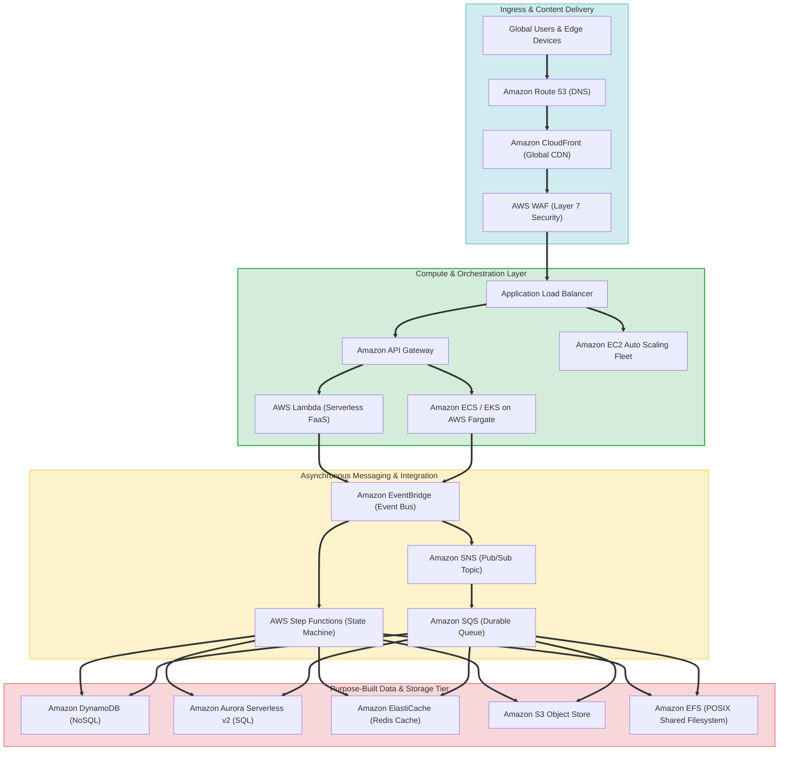

# AWS SAP-C02 & AIP-C01 Complete Services Reference & Decision Guide

> [!NOTE]
> **Exam Mindset**: For the AWS Solutions Architect Professional (SAP-C02) and AI Practitioner (AIP-C01) exams, service mastery requires understanding architectural intent and trade-offs rather than memorizing isolated definitions:
> **Requirement & Constraints** $\rightarrow$ **Architectural Pattern** $\rightarrow$ **Target Managed AWS Service** $\rightarrow$ **Operational & Cost Trade-Offs**.

---

## 1. AWS Services Architectural Ecosystem Overview

---

## 2. Analytics Services

| Service Name | Primary Architectural Purpose | Key Exam Trigger Keywords |
| :--- | :--- | :--- |
| **Amazon Athena** | Serverless SQL query engine directly on S3 objects | *"serverless SQL", "S3 data lake", "ad hoc queries", "pay per query"* |
| **AWS Data Exchange** | Subscribe to and consume 3rd-party commercial datasets | *"third-party data", "data marketplace", "external data subscriptions"* |
| **Amazon Data Firehose** | Near-real-time streaming ingestion into S3, Redshift, OpenSearch | *"streaming ingestion", "managed delivery", "buffering", "S3 delivery"* |
| **Amazon EMR** | Large-scale Big Data processing (Apache Spark, Hadoop, Presto) | *"Spark", "Hadoop", "big data analytics", "distributed cluster processing"* |
| **AWS Glue** | Serverless data integration, ETL pipelines, and Data Cataloging | *"ETL", "data catalog", "crawlers", "schema discovery", "data lake transformation"* |
| **Amazon Kinesis Data Streams** | Custom real-time streaming data ingestion with shard replaying | *"real-time streaming", "shards", "custom producers/consumers", "stream replay"* |
| **AWS Lake Formation** | Centrally govern, catalog, and secure data lakes on S3 | *"data lake security", "centralized permissions", "column-level access control"* |
| **Amazon MSK** | Fully managed Apache Kafka streaming clusters | *"Apache Kafka", "Kafka compatibility", "managed brokers", "streaming partitions"* |
| **Amazon OpenSearch Service** | Real-time full-text search, log analytics, and operational dashboards | *"full-text search", "log analytics", "indexing", "OpenSearch Dashboards"* |
| **Amazon QuickSight** | Serverless business intelligence (BI) visualization and dashboards | *"BI dashboards", "visualization", "SPICE engine", "business analytics"* |

---

## 3. Application Integration Services

| Service Name | Primary Architectural Purpose | Key Exam Trigger Keywords |
| :--- | :--- | :--- |
| **Amazon AppFlow** | No-code data transfers between SaaS apps (Salesforce) and AWS | *"SaaS integration", "Salesforce data sync", "no-code data transfer"* |
| **AWS AppSync** | Managed GraphQL API engine with real-time subscriptions | *"GraphQL API", "real-time data sync", "web/mobile offline sync"* |
| **Amazon EventBridge** | Event bus for event-driven systems and JSON pattern routing | *"event-driven", "event bus", "content-based filtering", "SaaS events"* |
| **Amazon MQ** | Managed traditional message broker for ActiveQueue and RabbitMQ | *"ActiveMQ", "RabbitMQ", "JMS", "AMQP", "legacy broker migration"* |
| **Amazon SNS** | One-to-many Pub/Sub notification fan-out service | *"fan-out", "pub/sub topic", "push notifications", "multiple subscribers"* |
| **Amazon SQS** | Durable point-to-point message queuing and burst buffering | *"message queue", "asynchronous decoupling", "buffer traffic spikes", "DLQ", "FIFO"* |
| **AWS Step Functions** | Visual state machine workflow orchestrator for microservices | *"state machine", "workflow orchestration", "retries", "human approval"* |

---

## 4. Compute Services

| Service Name | Primary Architectural Purpose | Key Exam Trigger Keywords |
| :--- | :--- | :--- |
| **Amazon EC2** | Virtual machine control (Host OS, custom drivers, root access) | *"virtual machine", "OS root control", "custom software", "EC2 instance types"* |
| **Amazon EC2 Auto Scaling** | Automatically adjust EC2 instance capacity based on metrics | *"ASG", "scaling policy", "target tracking", "health check replacement"* |
| **AWS Lambda** | Serverless event-driven function-as-a-service execution | *"serverless function", "<15 min execution", "pay per request", "stateless"* |
| **AWS Fargate** | Serverless container compute engine (no EC2 host management) | *"serverless containers", "no EC2 host OS patching", "ECS/EKS task"* |
| **AWS App Runner** | Managed platform for deploying web applications and container APIs | *"fully managed web app", "deploy from source code/container", "zero infra"* |
| **AWS Batch** | Run large-scale compute-heavy batch workloads on Spot/EC2/Fargate | *"batch computing", "job queues", "compute-intensive batch jobs"* |
| **AWS Elastic Beanstalk** | PaaS for uploading application code while AWS provisions infrastructure | *"PaaS", "quick deployment", "managed web platform", "code upload"* |
| **AWS Outposts** | Run native AWS compute and storage infrastructure on-premises | *"on-premises AWS infrastructure", "hybrid cloud", "local data residency"* |

---

## 5. Containers

| Service Name | Primary Architectural Purpose | Key Exam Trigger Keywords |
| :--- | :--- | :--- |
| **Amazon ECR** | Fully managed Docker container image registry | *"container registry", "Docker images", "image vulnerability scanning", "lifecycle policy"* |
| **Amazon ECS** | AWS-native container orchestration without Kubernetes complexity | *"containers", "AWS-native orchestrator", "task definition", "service scheduler"* |
| **Amazon EKS** | Managed Kubernetes control plane compatible with CNCF tools | *"Kubernetes", "k8s API", "pods", "Helm charts", "Kubernetes operators"* |

---

## 6. Database Services

| Service Name | Primary Architectural Purpose | Key Exam Trigger Keywords |
| :--- | :--- | :--- |
| **Amazon Aurora** | Enterprise high-performance MySQL/PostgreSQL relational database | *"relational SQL", "MySQL/PostgreSQL compatible", "6-way storage", "global database"* |
| **Aurora Serverless v2** | Auto-scaling relational database capacity (ACUs) for spiky traffic | *"variable relational demand", "auto-scaling ACUs", "intermittent SQL workload"* |
| **Amazon DynamoDB** | Fully managed serverless NoSQL key-value & document database | *"key-value", "document store", "serverless NoSQL", "single-digit ms", "Global Tables"* |
| **Amazon ElastiCache** | Managed in-memory caching engine (Redis OSS / Memcached) | *"Redis", "Memcached", "sub-millisecond read latency", "hot key cache", "offload DB"* |
| **Amazon RDS** | Managed relational database engine (MySQL, Postgres, SQL Server, Oracle) | *"managed relational database", "Multi-AZ", "read replicas", "automated backups"* |
| **Amazon Redshift** | Petabyte-scale OLAP column-store data warehouse for analytics | *"data warehouse", "OLAP", "columnar storage", "SQL analytics", "Redshift Spectrum"* |
| **Amazon DocumentDB** | Managed document database compatible with MongoDB workloads | *"document database", "MongoDB compatibility", "JSON documents"* |
| **Amazon Neptune** | Managed graph database for connected relationships | *"graph database", "knowledge graphs", "social networks", "Gremlin", "SPARQL"* |
| **Amazon Timestream** | Purpose-built fast, scalable time-series database for IoT & metrics | *"time-series", "IoT telemetry", "timestamp metrics", "automated lifecycle"* |

---

## 7. Networking & Content Delivery

| Service Name | Primary Architectural Purpose | Key Exam Trigger Keywords |
| :--- | :--- | :--- |
| **Amazon VPC** | Isolated virtual network environment in AWS | *"subnets", "security groups", "NACLs", "route tables", "NAT gateway", "internet gateway"* |
| **Amazon CloudFront** | Global Content Delivery Network (CDN) with edge caching | *"global CDN", "edge caching", "low latency", "static assets", "OAC"* |
| **Amazon Route 53** | Highly available DNS service with latency, geolocation & failover routing | *"DNS", "hosted zone", "health checks", "latency routing", "failover routing", "alias record"* |
| **AWS Direct Connect** | Dedicated private physical network connection from on-premises to AWS | *"dedicated connection", "private physical link", "bypasses public internet", "DX"* |
| **AWS Transit Gateway** | Central hub connecting thousands of VPCs and on-premises networks | *"hub-and-spoke networking", "centralized VPC routing", "scalable transit hub"* |
| **AWS PrivateLink** | Private VPC connectivity to AWS/SaaS services via Interface Endpoints | *"private endpoint", "bypasses internet", "overlapping IP VPCs", "SaaS endpoint"* |
| **AWS Global Accelerator** | Anycast static IPs routing traffic over AWS global network for speed | *"static anycast IPs", "global network routing", "TCP/UDP acceleration", "fast failover"* |
| **Elastic Load Balancing** | Distributes traffic across targets (ALB for HTTP, NLB for TCP/UDP) | *"load balancer", "ALB path routing", "NLB ultra-low latency", "health checks"* |

---

## 8. Security, Identity & Compliance

| Service Name | Primary Architectural Purpose | Key Exam Trigger Keywords |
| :--- | :--- | :--- |
| **AWS IAM** | Granular access control for AWS resources (Users, Roles, Policies) | *"roles", "least privilege", "IAM policies", "assume role", "permission boundary"* |
| **AWS IAM Identity Center** | Central workforce Single Sign-On (SSO) across multi-account environments | *"workforce SSO", "centralized access", "SAML 2.0", "multi-account login"* |
| **AWS KMS** | Managed hardware key management for data-at-rest encryption | *"encryption keys", "KMS keys", "envelope encryption", "customer managed key (CMK)"* |
| **AWS Secrets Manager** | Securely store, rotate, and retrieve database credentials and API keys | *"secrets rotation", "database credentials", "API keys", "automated rotation"* |
| **Amazon GuardDuty** | Intelligent threat detection monitoring VPC Flow Logs, CloudTrail, DNS | *"threat detection", "malicious activity", "anomaly detection", "machine learning"* |
| **AWS Security Hub** | Centralized security posture management and compliance aggregation | *"security posture", "aggregated findings", "CIS benchmarks", "centralized security"* |
| **Amazon Inspector** | Automated vulnerability management scanning EC2, ECR, and Lambda | *"vulnerability scanning", "CVE lookup", "ECR image scanning", "package vulnerabilities"* |
| **Amazon Macie** | Automated sensitive data (PII) discovery in S3 using ML | *"PII discovery", "sensitive data in S3", "data privacy scanning"* |
| **AWS WAF** | Web Application Firewall protecting against Layer 7 exploits (SQLi, XSS) | *"Layer 7 security", "SQL injection", "XSS", "web ACL", "rate-based rules"* |
| **AWS Shield** | Automated Layer 3/4 DDoS protection for CloudFront, Route 53, ALB | *"DDoS protection", "SYN floods", "Shield Advanced", "DDoS mitigation response"* |

---

## 9. Storage Services

| Service Name | Primary Architectural Purpose | Key Exam Trigger Keywords |
| :--- | :--- | :--- |
| **Amazon S3** | Massively scalable, 11 9s durable object storage | *"object storage", "11 9s durability", "bucket policies", "lifecycle rules", "data lake"* |
| **Amazon S3 Glacier** | Extremely low-cost archival storage classes (Flexible & Deep Archive) | *"archive", "long-term retention", "Deep Archive ($0.00099/GB)", "retention lock"* |
| **Amazon EFS** | Managed POSIX shared filesystem for concurrent Linux instances | *"shared POSIX filesystem", "NFSv4 protocol", "multi-instance Linux storage"* |
| **Amazon EBS** | Persistent block storage volumes dedicated to single EC2 instances | *"block storage", "EC2 boot volume", "low-latency disk", "gp3/io2 volume"* |
| **AWS FSx for Windows** | Managed Windows File Server supporting SMB and Active Directory | *"Windows SMB file share", "Active Directory integration", "POSIX SMB"* |
| **AWS FSx for Lustre** | High-performance parallel filesystem for HPC and S3 data processing | *"HPC storage", "parallel filesystem", "fast S3 data processing", "Lustre"* |
| **AWS Storage Gateway** | Hybrid storage appliance connecting on-premises to S3/EBS (File/Volume/Tape) | *"hybrid storage", "on-premises S3 access", "File Gateway", "Volume Gateway", "Tape"* |

---

## 10. The Ultimate SAP-C02 Master Service Recognition Map

```mermaid
flowchart TD
    Start(["Requirement Recognition Input"]) --> Q1{"What core problem does the scenario present?"}

    Q1 -- "Message Queue & Buffering" --> SQS["Amazon SQS"]
    Q1 -- "Pub/Sub 1-to-Many Fan-Out" --> SNS["Amazon SNS"]
    Q1 -- "Event Routing & JSON Filtering" --> EventBridge["Amazon EventBridge"]
    Q1 -- "Multi-Step Stateful Workflow" --> StepFn["AWS Step Functions"]

    Q1 -- "Serverless Short Function (<15m)" --> Lambda["AWS Lambda"]
    Q1 -- "Serverless Container Execution" --> Fargate["AWS Fargate"]
    Q1 -- "AWS-Native Container Orchestrator" --> ECS["Amazon ECS"]
    Q1 -- "Kubernetes API & Helm Compatibility" --> EKS["Amazon EKS"]

    Q1 -- "Serverless NoSQL Key-Value (<10ms)" --> DynamoDB["Amazon DynamoDB"]
    Q1 -- "Spiky Auto-Scaling Relational SQL" --> AuroraServ["Amazon Aurora Serverless v2"]
    Q1 -- "Sub-ms In-Memory Hot Read Cache" --> ElastiCache["Amazon ElastiCache"]
    Q1 -- "Petabyte Data Warehouse Analytics" --> Redshift["Amazon Redshift"]

    Q1 -- "Massive Scalable Object Storage" --> S3["Amazon S3"]
    Q1 -- "Shared Linux POSIX Filesystem" --> EFS["Amazon EFS"]
    Q1 -- "Dedicated EC2 Block Storage" --> EBS["Amazon EBS"]
    Q1 -- "Windows SMB File Share" --> FSxWin["AWS FSx for Windows"]

    style SQS fill:#d4edda,stroke:#28a745,stroke-width:2px
    style SNS fill:#d4edda,stroke:#28a745,stroke-width:2px
    style EventBridge fill:#d1ecf1,stroke:#17a2b8,stroke-width:1px
    style StepFn fill:#d4edda,stroke:#28a745,stroke-width:2px
    style Lambda fill:#d4edda,stroke:#28a745,stroke-width:2px
    style Fargate fill:#d4edda,stroke:#28a745,stroke-width:2px
    style DynamoDB fill:#d4edda,stroke:#28a745,stroke-width:2px
    style AuroraServ fill:#d4edda,stroke:#28a745,stroke-width:2px
    style ElastiCache fill:#d4edda,stroke:#28a745,stroke-width:2px
    style S3 fill:#d4edda,stroke:#28a745,stroke-width:2px
    style EFS fill:#d4edda,stroke:#28a745,stroke-width:2px
```

---

## 11. Top SAP-C02 Architectural Decision Sequence

> [!TIP]
> **The 12-Step SAP-C02 Decision Elimination Method**:
> 1. **Workload Model**: Is the application synchronous (REST HTTP call) or asynchronous (Queue/Event)?
> 2. **Compute Choice**: Does the application require full OS control (EC2), containers (ECS/EKS), or serverless functions (Lambda)?
> 3. **Data Model**: Is the data structure key-value (DynamoDB), relational SQL (RDS/Aurora), in-memory cache (ElastiCache), or object (S3)?
> 4. **Storage Interface**: Does the application need HTTP API access (S3), mounted shared NFS (EFS), Windows SMB (FSx), or block disk (EBS)?
> 5. **Messaging Pattern**: Does the communication require 1-to-1 queuing (SQS), 1-to-many fan-out (SNS), or payload routing (EventBridge)?
> 6. **Scaling Requirements**: Is traffic steady-state (Provisioned instances) or spiky/unpredictable (Serverless on-demand)?
> 7. **Operational Overhead**: Does the question demand *"minimum operational management"*? Prefer managed AWS abstractions over EC2 self-hosted solutions.
