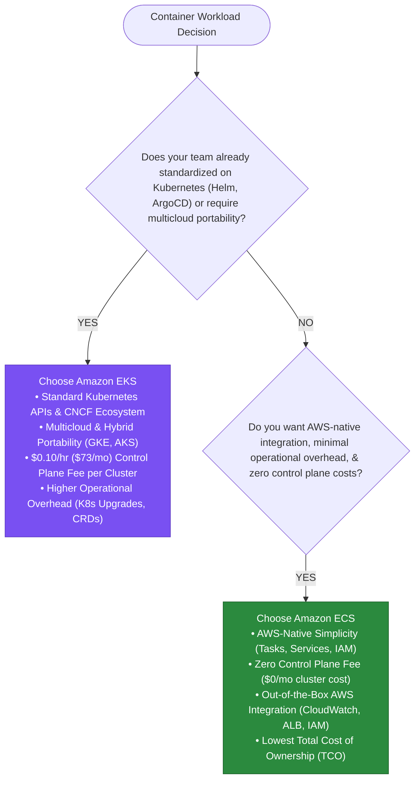
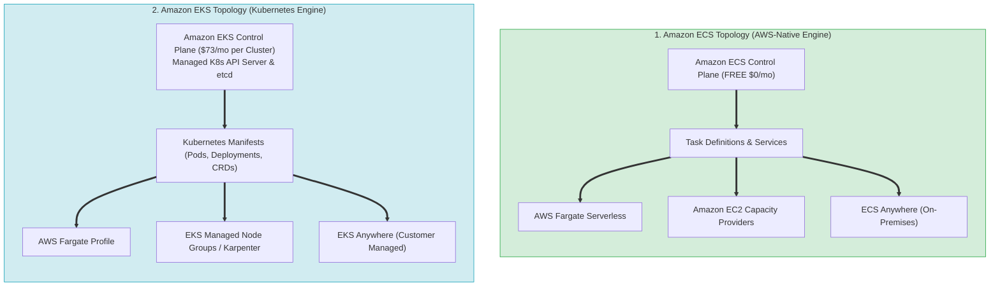
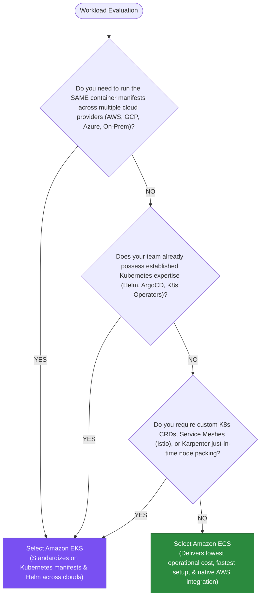

# Amazon ECS vs. Amazon EKS: Architectural Decision Guide

> **Domain Focus**: AWS Certified Solutions Architect – Professional (SAP-C02) & AWS Cloud Architecture  
> **Core Dilemma**: *"Should we choose Amazon ECS for AWS-native simplicity and lowest operational overhead, or Amazon EKS for Kubernetes ecosystem standard, portability, and complex orchestration?"*

---

## Executive Overview & Architectural Mindset

When selecting a container orchestration engine on AWS, architects are not comparing raw compute performance—underneath, both services launch containers on **AWS Fargate** or **Amazon EC2**. Instead, the choice evaluates **operational complexity, team skillsets, ecosystem lock-in, and financial overhead**:



---

## 1. High-Level Architecture Comparison



---

## 2. Core Operational & Technical Trade-Offs

### 1. Control Plane & Operational Overhead
- **Amazon ECS**:
  - **Zero Control Plane Management**: AWS manages the ECS control plane completely behind the scenes.
  - **Zero Version Upgrades**: There are no control plane versions to upgrade, no EOL Kubernetes API deprecations, and no etcd database backups to maintain.
  - **Minimal Configuration**: Workloads are defined using simple JSON/YAML Task Definitions that directly reference native AWS parameters (e.g. `executionRoleArn`, `logConfiguration`).
- **Amazon EKS**:
  - **Significant Maintenance Overhead**: Teams must actively maintain the Kubernetes cluster lifecycle. Kubernetes releases a new minor version roughly every 4 months, and AWS supports versions for ~14 months.
  - **Upgrade Friction**: Upgrading an EKS cluster requires updating the control plane, updating Managed Node Groups, updating core add-ons (CoreDNS, kube-proxy, VPC CNI), and refactoring deprecated Kubernetes API versions.
  - **Add-on Governance**: You are responsible for configuring, updating, and monitoring ingress controllers (e.g., AWS Load Balancer Controller), metrics servers, mesh control planes (Istio/Linkerd), and security agents.

### 2. IAM & Security Model Integration
- **Amazon ECS**:
  - **Native IAM Alignment**: Uses two simple, distinct IAM roles:
    1. `executionRoleArn`: Used by the ECS agent to pull container images from ECR and send logs to CloudWatch.
    2. `taskRoleArn`: Attached directly to the running container container process (equivalent to an EC2 instance profile) for calling AWS APIs (DynamoDB, S3, SQS).
  - Fine-grained IAM policy scoping is simple and intuitive.
- **Amazon EKS**:
  - **Dual Identity Layer Complexity**: Kubernetes maintains its own internal Role-Based Access Control (RBAC) engine (`Roles`, `ClusterRoles`, `RoleBindings`).
  - Mapping AWS IAM identities to Kubernetes RBAC requires managing **EKS Pod Identities** or **IAM Roles for Service Accounts (IRSA)** via OpenID Connect (OIDC) identity providers and service account annotations.

### 3. Tooling & Ecosystem
- **Amazon ECS**:
  - Standard AWS tooling ecosystem: AWS Management Console, AWS CLI, AWS CloudFormation, AWS CDK, and AWS Copilot CLI.
  - Ideal for teams that want a single pane of glass within standard AWS tools.
- **Amazon EKS**:
  - Cloud Native Computing Foundation (CNCF) ecosystem: `kubectl`, `helm`, `kustomize`, ArgoCD, Flux, Prometheus, Grafana, Jaeger, Falco, and Kyverno.
  - Enables GitOps deployment pipelines and declarative cluster state definitions.

---

## 3. Detailed Cost Comparison Matrix

| Cost Component | Amazon ECS | Amazon EKS |
| :--- | :--- | :--- |
| **Control Plane Fee** | **$0.00 / month (FREE)** | **$0.10 per hour (~$73.00 / month per cluster)** |
| **Compute Cost (AWS Fargate)** | Standard Fargate vCPU & Memory rates | Standard Fargate vCPU & Memory rates (Identical) |
| **Compute Cost (Amazon EC2)** | Standard EC2 instance pricing | Standard EC2 instance pricing (Identical) |
| **Auto Scaling Engine** | ECS Service Auto Scaling (Target Tracking / Step Scaling) | Cluster Autoscaler or **Karpenter** (Just-in-Time node provisioning) |
| **Third-Party Add-on Overhead** | None required | Resource overhead for CoreDNS, VPC CNI, Monitoring agents running on nodes |
| **Hidden Engineering Labor Cost**| **Lowest**: Minimal maintenance engineering required | **Higher**: Requires dedicated DevOps / K8s platform engineers for cluster lifecycle management |

> [!IMPORTANT]
> **Multi-Environment Cluster Cost Impact**:
> If an enterprise provisions 10 isolated environments (Dev, Test, Staging, Prod across 3 regions):
> - **Amazon ECS**: $0 control plane cost.
> - **Amazon EKS**: 10 clusters $\times$ $73/mo = **$730/month ($8,760/year)** purely in control plane fees before running any application workloads.

---

## 4. Comprehensive Feature Trade-Off Matrix

| Dimension | Amazon ECS | Amazon EKS |
| :--- | :--- | :--- |
| **Primary Philosophy** | AWS-Native Simplicity & Deep Integration | Kubernetes Open-Source Standard & Flexibility |
| **Learning Curve** | Low (Hours to days for AWS engineers) | High (Weeks to months; requires K8s expertise) |
| **Multicloud Portability** | Low (Tied to AWS ECS APIs) | **High** (Runs on GKE, AKS, On-Premises K8s) |
| **Hybrid On-Premises Option** | **Amazon ECS Anywhere** | **Amazon EKS Anywhere** |
| **Deployment Specification** | ECS Task Definitions (JSON/YAML) | Kubernetes Manifests / Helm Charts |
| **Network CNI** | AWS VPC Native (`awsvpc` mode gets dedicated ENI IP) | AWS VPC CNI (Pods assigned VPC IP addresses) |
| **Service Mesh** | AWS App Mesh / ECS Service Connect | Istio, Linkerd, AWS App Mesh |
| **Advanced Scheduling** | Basic placement constraints (distinct instance, binpack) | Advanced Affinity, Anti-Affinity, Taints, Tolerations, Custom CRDs |
| **Extensibility** | AWS Feature set | Custom Resource Definitions (CRDs) & Custom Operators |

---

## 5. Decision Framework: When to Choose One Over the Other



### Choose Amazon ECS when:
1. **You want the lowest Total Cost of Ownership (TCO)**: Your team wants to focus 100% on application code without spending engineering hours managing Kubernetes cluster upgrades, CNI plugins, or API deprecations.
2. **You are building an AWS-native serverless architecture**: You plan to run containers on **AWS Fargate** integrated directly with AWS Application Load Balancers, EventBridge, Step Functions, and IAM.
3. **Small or Medium-Sized Engineering Teams**: You lack dedicated Kubernetes platform engineers and want to avoid the steep Kubernetes learning curve.
4. **Micro-environments / Cost Sensitivity**: You need to spin up dozens of isolated feature-branch test environments without incurring the $73/month per-cluster fee.

### Choose Amazon EKS when:
1. **Multicloud or Hybrid Portability is Mandatory**: Your organization mandates running identical container workloads on-premises (OpenShift/K8s), Google Cloud (GKE), Azure (AKS), and AWS.
2. **Existing Kubernetes Investment**: Your engineering organization has already built deployment pipelines around `helm`, `kustomize`, ArgoCD, or Flux, and engineers are already fluent in `kubectl`.
3. **Complex Scheduling & Operator Ecosystem**: You require custom Kubernetes Operator CRDs, specialized sidecar patterns, complex pod anti-affinity topology constraints, or **Karpenter** for high-speed node autoscaling.
4. **Third-Party CNCF Ecosystem Dependencies**: Your application stack relies heavily on CNCF projects like Istio, Prometheus Operator, Kyverno policy engine, or Falco security agents.

---

## 6. Real-World Exam Scenarios & Common Traps (SAP-C02)

### Scenario 1: Minimal Operational Overhead Container Migration
- **Question**: A company wants to migrate 50 monolithic applications to containers on AWS. The company has a small IT team with zero Kubernetes experience and wants to **minimize operational overhead and management cost**.
- **Correct Choice**: **Amazon ECS on AWS Fargate**.
- **Why**: ECS eliminates container host management and control plane maintenance, requiring zero Kubernetes expertise.

### Scenario 2: Multicloud Consistency with GitOps
- **Question**: A global enterprise runs containerized microservices across AWS, Azure, and an on-premises data center. The development team uses **Helm charts and ArgoCD** for GitOps deployments and requires identical deployment manifests across all environments.
- **Correct Choice**: **Amazon EKS**.
- **Why**: EKS provides standard Kubernetes API compatibility, allowing the exact same Helm charts and ArgoCD pipelines to operate seamlessly across AWS, Azure (AKS), and on-premises clusters.

### Scenario 3: Hybrid On-Premises & Fargate Cluster Management
- **Question**: A company runs production containers in AWS Fargate. To save costs, developers need to run development tasks on **existing customer-managed physical servers on-premises** within the **same container cluster** as Fargate.
- **Correct Choice**: **Amazon ECS Anywhere**.
- **Why**: ECS Anywhere allows registering customer-managed on-premises servers into the **same Amazon ECS cluster** alongside AWS Fargate tasks (`EXTERNAL` capacity provider).

---

## 7. Final Mental Model

```
        Do you need Kubernetes Ecosystem / Multicloud Portability?
                            /            \
                           /              \
                        YES                NO
                        /                    \
                       ▼                      ▼
                Amazon EKS               Amazon ECS
        (Portability, CNCF Tools,   (AWS-Native, $0 Cluster Fee,
         Karpenter, $73/mo fee)      Lowest Operational Overhead)
```
