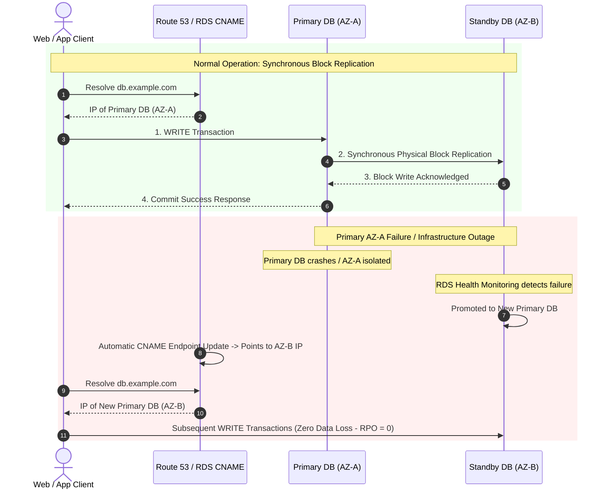
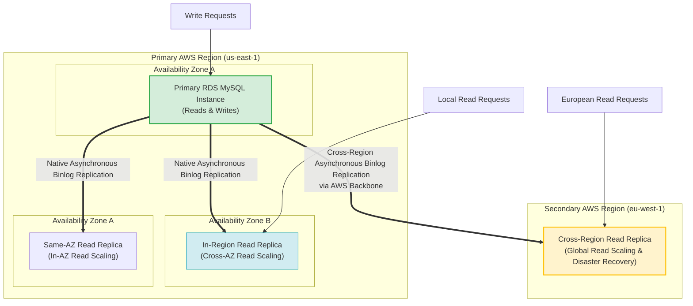
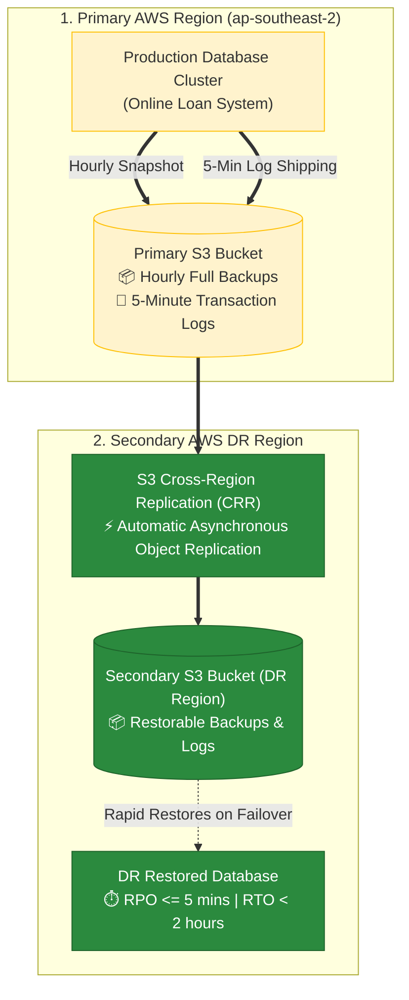
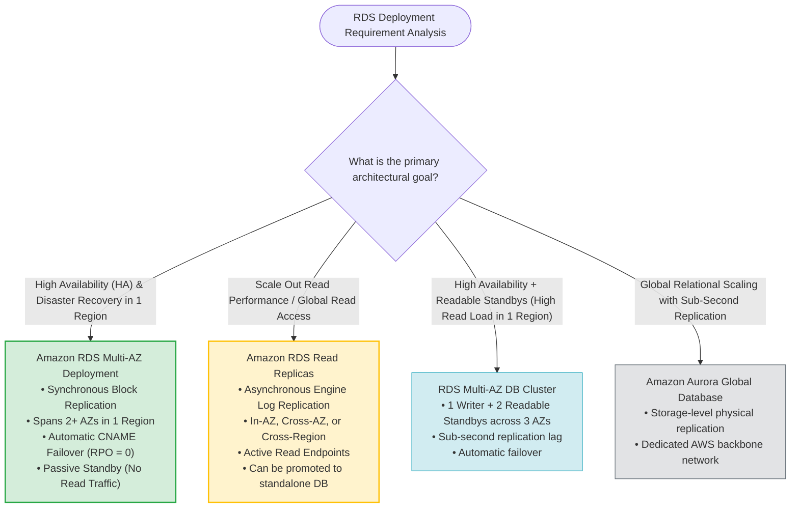

# Amazon RDS Multi-AZ vs. Read Replicas Replication: AWS SAP-C02 & AIP-C01 Exam Guide

> [!NOTE]
> **Core Exam Concept**: In Amazon RDS, **Multi-AZ deployments use SYNCHRONOUS replication** across at least two Availability Zones within a single AWS Region for High Availability (HA) and Disaster Recovery (DR). In contrast, **Read Replicas use ASYNCHRONOUS replication** (engine-native) and can be deployed within an Availability Zone, Cross-AZ, or Cross-Region for Read Scaling.

---

## 1. Exam Question Breakdown & Verification

### Practice Scenario
> A company operating a global vacation rental platform uses an Amazon RDS for MySQL DB cluster. The team utilizes Multi-AZ deployment for automated replication and data durability, alongside Read Replicas. An intern wants to clarify the replication capabilities of Multi-AZ vs. Read Replicas.

### Question Options Evaluation

```
Option A: Multi-AZ = Asynchronous (Single AZ) | Read Replicas = Synchronous             [INCORRECT]
Option B: Multi-AZ = Synchronous (2+ AZs, 1 Region) | Read Replicas = Asynchronous (In-AZ/Cross-AZ/Cross-Region) [CORRECT ✔]
Option C: Multi-AZ = Asynchronous (2+ AZs) | Read Replicas = Asynchronous             [INCORRECT]
Option D: Multi-AZ = Asynchronous (2+ AZs) | Read Replicas = Synchronous              [INCORRECT]
```

### Key Answer Takeaway
> [!IMPORTANT]
> **Correct Option**: **Multi-AZ follows synchronous replication and spans at least two Availability Zones within a single region. Read Replicas follow asynchronous replication and can be within an Availability Zone, Cross-AZ, or Cross-Region.**

---

## 2. Multi-AZ Deployments: High Availability & Disaster Recovery

Amazon RDS Multi-AZ deployments provide enhanced availability and durability for production workloads by automatically provisioning a primary DB instance and a passive standby DB instance in a different Availability Zone within the same AWS Region.

### Synchronous Replication & Failover Sequence



### Key Technical Attributes of Multi-AZ
- **Replication Type**: **Synchronous** block-level physical storage replication.
- **Geographic Scope**: Spans **at least 2 Availability Zones within a single AWS Region** (cannot cross regions).
- **Primary Purpose**: High Availability (HA) and Disaster Recovery (DR).
- **Access Constraint**: The Standby instance is **passive**; it **CANNOT serve read or write queries** directly.
- **Failover Mechanism**: Automatic DNS CNAME record flip to the Standby instance endpoint during failures (RPO = 0, RTO = 60-120 seconds).
- **Zero I/O Suspension Backups**: Automated backups and snapshots are taken from the passive Standby instance, avoiding I/O suspension on the Primary instance.

---

## 3. Read Replicas: Elastic Read Scaling & Global Reach

Amazon RDS Read Replicas scale out beyond the compute and memory capacity constraints of a single DB instance for read-heavy database workloads.

### Asynchronous Replication Topology



### Key Technical Attributes of Read Replicas
- **Replication Type**: **Asynchronous** engine-native log replication (e.g., MySQL binlog, PostgreSQL WAL).
- **Geographic Scope**: Can be deployed **In-AZ**, **Cross-AZ (Same Region)**, or **Cross-Region**.
- **Primary Purpose**: Read scaling and multi-region disaster recovery.
- **Access Constraint**: Read Replicas are **active endpoints** that serve **READ-ONLY queries**.
- **Promotion Capability**: A Read Replica can be promoted to an independent, standalone writable database instance.

---

## 4. Enterprise Architecture: Multi-AZ HA + Cross-Region Read Replicas

For mission-critical production systems requiring both high availability in the primary region and global low-latency reads, architects combine **Multi-AZ** with **Cross-Region Read Replicas**.

```mermaid
flowchart TD
    subgraph Region_US ["AWS Region: us-east-1 (Primary)"]
        subgraph AZ_1 ["Availability Zone A"]
            Primary_Node["Primary DB Instance<br/>(Active Read/Write Endpoint)"]
        end

        subgraph AZ_2 ["Availability Zone B"]
            Standby_Node["Standby DB Instance<br/>(Passive Synchronous Replica<br/>NO Direct Queries Allowed)"]
        end

        subgraph AZ_3 ["Availability Zone C"]
            Local_RR["Read Replica 1<br/>(Active Read Endpoint)"]
        end

        Primary_Node <==>|Synchronous Block-Level Replication<br/>(Zero Data Loss RPO=0)| Standby_Node
        Primary_Node ==>|Asynchronous Engine Log Replication| Local_RR
    end

    subgraph Region_EU ["AWS Region: eu-central-1 (DR & Global Scale)"]
        Remote_RR["Cross-Region Read Replica<br/>(Active Regional Read Endpoint)"]
    end

    Primary_Node ==>|Asynchronous Cross-Region Log Replication| Remote_RR

    App_Writes["Application Writes"] --> Primary_Node
    App_Reads_US["US Analytics / Reads"] --> Local_RR
    App_Reads_EU["EU Analytics / Reads"] --> Remote_RR

    style Primary_Node fill:#d4edda,stroke:#28a745,stroke-width:2px
    style Standby_Node fill:#f8d7da,stroke:#dc3545,stroke-width:2px
    style Local_RR fill:#d1ecf1,stroke:#17a2b8,stroke-width:1px
    style Remote_RR fill:#fff3cd,stroke:#ffc107,stroke-width:1px
```

---

## 5. Comprehensive Feature Comparison Matrix

| Architectural Feature | RDS Multi-AZ Deployment | RDS Read Replicas | RDS Multi-AZ DB Cluster (3 AZs) |
| :--- | :--- | :--- | :--- |
| **Replication Mode** | **Synchronous** | **Asynchronous** | **Semisynchronous** |
| **Geographic Scope** | Spans 2+ AZs in **Single Region** | In-AZ, Cross-AZ, or **Cross-Region** | Spans 3 AZs in **Single Region** |
| **Primary Goal** | High Availability (HA) & DR | Scalable Read Performance & Global DR | HA + Local Read Scaling |
| **Standby / Replica Status** | **Passive** (No query access allowed) | **Active** (Read-Only queries allowed) | **Active** (2 Readable Standby instances) |
| **Failover Mechanism** | Automatic DNS CNAME flip | Manual promotion to standalone DB | Automatic DNS failover (< 35 sec) |
| **Impact on Backups** | Zero I/O suspension (Taken on Standby) | Can take snapshots from Replica | Taken on Standby instances |
| **RPO (Recovery Point Objective)** | **RPO = 0** (Zero data loss) | **RPO > 0** (Subject to replication lag) | **RPO ≈ 0** (Minimal lag) |

---

## 6. Common AWS Exam Traps & Distractor Analysis

> [!WARNING]
> **Trap 1: Attempting to Direct Read Queries to a Multi-AZ Standby**
> - *Mistake*: Assuming a Multi-AZ Standby instance can offload read queries.
> - *Correction*: Standby instances in standard Multi-AZ deployments are **passive and unreachable**. To offload read queries, deploy a **Read Replica** (or use an RDS Multi-AZ DB Cluster).

> [!CAUTION]
> **Trap 2: Assuming Multi-AZ Can Cross AWS Regions**
> - *Mistake*: Selecting Multi-AZ for multi-region disaster recovery.
> - *Correction*: Multi-AZ is strictly **single-region**. Multi-region database resilience requires **Cross-Region Read Replicas** or **Aurora Global Database**.

> [!TIP]
> **Trap 3: Synchronous vs. Asynchronous Replication**
> - Multi-AZ = **Synchronous** (block-level storage copy).
> - Read Replicas = **Asynchronous** (database engine log streaming).

---

## 6.1 Real-World Exam Scenario: RDS Multi-AZ Automatic Failover DNS Mechanics (CNAME Flip vs. IP Address Switch & Standby Creation Traps)

- **Scenario**: A web application relies on an Amazon RDS database deployed in a Multi-AZ configuration. During a scheduled maintenance window, the operating system of the primary DB instance undergoes software patching, which triggers an automatic failover. What happens to the database during failover?
- **Architecture Solution**:
  - The **Canonical Name Record (CNAME)** for the RDS DB endpoint is altered to point from the primary database instance to the newly promoted standby database instance.

### Key Technical Rationale:
1. **CNAME DNS Endpoint Redirection**:
   - Applications connect to Amazon RDS using a single endpoint DNS hostname (e.g. `mydb.c1234567890.us-east-1.rds.amazonaws.com`).
   - During failover (triggered by OS patching, primary DB hardware failure, or AZ outage), Amazon RDS updates the **CNAME DNS record** in Route 53 to point to the IP address of the pre-provisioned standby DB instance in the second AZ.
   - Applications seamlessly reconnect to the promoted standby database using the exact same DNS endpoint string.

### Why Distractor Options Fail:
- *Switching the IP Address of the primary DB instance to the standby DB instance*:
  - **IP Address Isolation**: Private IP addresses are bound to specific Elastic Network Interfaces (ENIs) inside their respective AZ subnets and **cannot be transferred across Availability Zones**. Only the **DNS CNAME record** is updated to point to the standby instance's IP address.
- *Creating a new DB instance to replace the primary database*:
  - **Pre-Provisioned Standby**: The standby DB instance is already provisioned and kept continuously up to date via **synchronous block-level replication**. No new DB instance needs to be created during failover.
- *The RDS DB instance will automatically reboot*:
  - **Failover Promotion**: Failover promotes the pre-existing passive standby instance to become the active primary writer; it does not simply reboot the primary instance.

---

## 6.2 Real-World Exam Scenario 2: Achieving Strict RTO (< 2 Hours) & RPO (<= 10 Mins) for Regional Disaster Recovery (Hourly S3 Full Backups + 5-Min Transaction Logs + Cross-Region Replication vs. Multi-AZ, Glacier & EBS Traps)

- **Scenario**: An online credit application system running across multiple Availability Zones in `ap-southeast-2` experienced a database incident at 12:00 PM. Transactions from 10:30 AM onwards were lost (90-minute data loss), breaching the company's Disaster Recovery Plan targets of **RTO < 2 hours** and **RPO <= 10 minutes**. How can the solutions architect modify the architecture to achieve RTO < 2 hours and RPO <= 10 minutes during a system or regional outage?
- **Architecture Solution**:
  - Create **database backups every hour** and store them in an **Amazon S3 bucket with Cross-Region Replication (CRR)** enabled.
  - Store **transaction logs in the same S3 bucket every 5 minutes**.



### Key Technical Rationale:
1. **5-Minute Transaction Log Shipping for RPO <= 10 Minutes**:
   - Shipping database transaction logs every 5 minutes ensures that the maximum potential data loss is strictly capped at **5 minutes**, easily satisfying the RPO <= 10-minute SLA requirement.
2. **S3 Standard Storage + Cross-Region Replication (CRR) for RTO < 2 Hours**:
   - Storing hourly backups and 5-minute transaction logs in S3 Standard with CRR automatically replicates data to a secondary AWS Region. S3 Standard allows immediate file downloads to rebuild database instances in the secondary DR region within 2 hours, even if the primary region suffers a complete outage.

### Why Distractor Options Fail:
- *Synchronous Multi-AZ Source-Replica Replication Alone (Your Selection)*:
  - **Single-Region Regional Outage Vulnerability**: Multi-AZ synchronous replication only protects against single Availability Zone hardware failures. If an outage strikes the entire AWS Region (`ap-southeast-2`), both primary and standby AZ instances become completely unreachable. It does NOT satisfy cross-region DR requirements.
- *Store Database Backups in S3 Glacier for Archiving*:
  - **Glacier Retrieval Delay Violates RTO**: Restoring data from S3 Glacier (Flexible Retrieval or Deep Archive) takes 3 to 12+ hours. Restoring from Glacier will breach the strictly mandated **RTO < 2 hours** target.
- *Perform Database Backups to Amazon EBS Volumes*:
  - **Single-Region Storage & Restores Complexity**: EBS volume backups remain in a single region. Replicating and restoring EBS volumes across regions increases complexity and risks breaching the 2-hour RTO target.

---

## 7. AWS RDS Deployment Selection Decision Tree



---

## 8. Exam Memory Cheat Sheet

```
Multi-AZ Deployment    ──> SYNCHRONOUS Replication ──> 2+ AZs (1 Region) ──> High Availability (HA)
Read Replicas          ──> ASYNCHRONOUS Replication ──> In-AZ/Cross-AZ/Cross-Region ──> Read Scaling
Multi-AZ Standby Access──> PASSIVE (Cannot serve queries)
Read Replica Access    ──> ACTIVE (Serves READ-ONLY queries)
Multi-AZ Failover      ──> Automatic DNS CNAME flip (RPO = 0)
Read Replica Failover  ──> Manual promotion to standalone writable database
Backup Advantage       ──> Multi-AZ snapshots taken on Standby (Zero Primary I/O suspension)
```

---

## 9. References & Official AWS Documentation
- [AWS Amazon RDS Multi-AZ Features](https://aws.amazon.com/rds/features/multi-az/)
- [AWS Amazon RDS Read Replicas Features](https://aws.amazon.com/rds/features/read-replicas/)