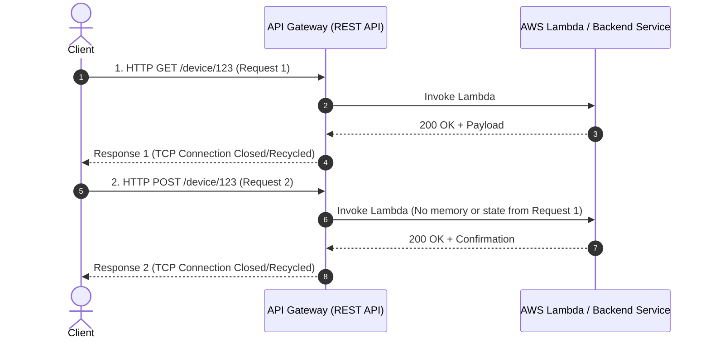
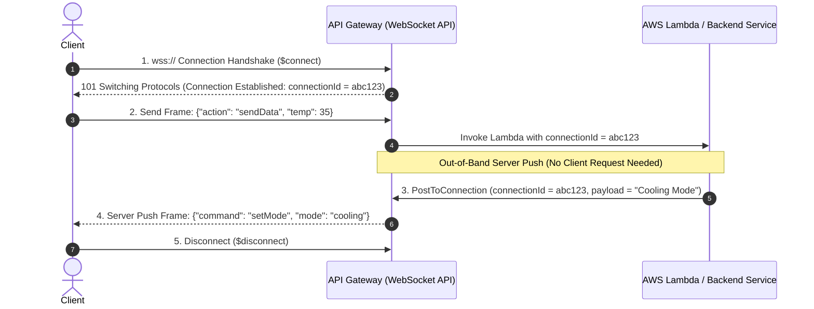
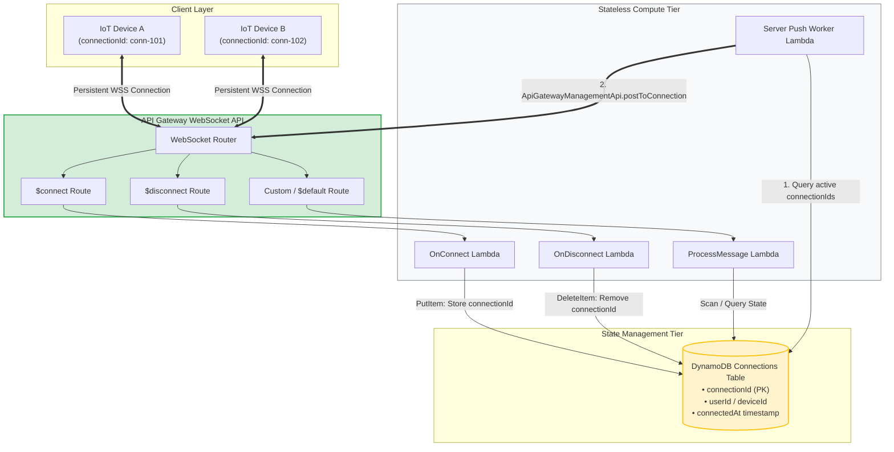
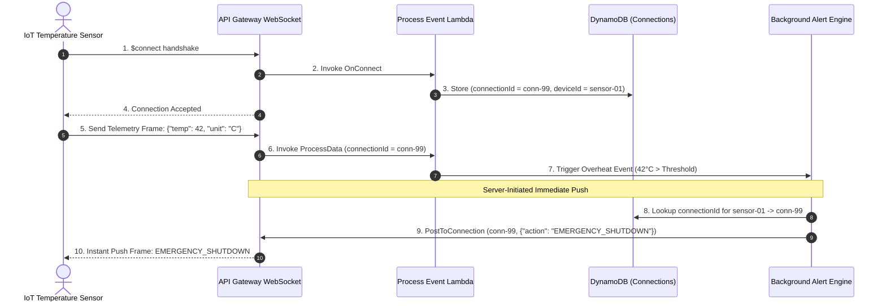
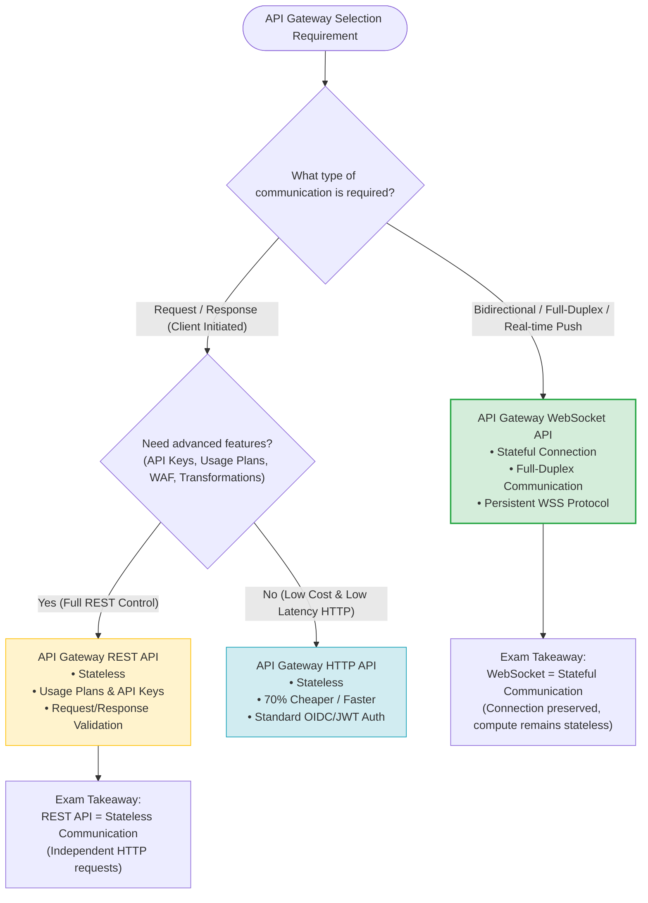

# REST API vs. WebSocket API Architecture: AWS SAP-C02 & AIP-C01 Exam Guide

> [!NOTE]
> **Core Exam Concept**: In API Gateway, **REST APIs are STATELESS** (independent HTTP request/response cycles), whereas **WebSocket APIs are STATEFUL** (persistent, full-duplex communication connection). Understanding the distinction between **Stateful Communication** and **Stateless Compute** is a frequent requirement on the AWS Solutions Architect Professional (SAP-C02) and AI Practitioner (AIP-C01) exams.

---

## 1. Problem Statement & Exam Scenario Analysis

### The Core Distinctions

```
REST API       ──> Stateless Communication (HTTP)     ──> Request-Response Only
WebSocket API  ──> Stateful Communication (WSS)      ──> Full-Duplex / Bidirectional / Push
```

### Exam Question Matrix: Identifying the Correct Pattern

| Scenario Requirement | Communication Pattern | API Gateway Choice | Statefulness |
| :--- | :--- | :--- | :--- |
| Standard CRUD Operations / Web APIs | Request / Response | REST API / HTTP API | **Stateless** |
| Real-time IoT Sensor Telemetry & Remote Control | Bidirectional Push | WebSocket API | **Stateful** |
| Chat Applications / Live Sports Scores | Server-Initiated Push | WebSocket API | **Stateful** |
| Financial Market Data Feeds | Persistent Streaming | WebSocket API | **Stateful** |

---

## 2. Why REST API is Stateless

REST (Representational State Transfer) relies on standard HTTP/HTTPS protocols where every request is executed independently.



### Key REST Attributes
- Neither API Gateway nor the backend retains connection state between consecutive requests.
- Each request must contain all context (authentication tokens, resource IDs) required to process it.
- **Server Push is impossible without client polling** (e.g., Long Polling / SSE).

---

## 3. Why WebSocket API is Stateful

WebSocket API establishes a persistent, long-lived TCP connection using a `wss://` handshake, enabling **full-duplex, bidirectional communication**.



### Key WebSocket Attributes
- **Persistent Connection**: The TCP socket remains open between client and API Gateway.
- **Connection Identifier**: API Gateway assigns a unique `connectionId` to every active connection.
- **Bi-Directional**: Both client and server can transmit data frames asynchronously at any time.

---

## 4. Crucial Exam Distinction: Stateful Communication vs. Stateless Compute

> [!IMPORTANT]
> **Stateful Communication ≠ Stateful Compute**
> - **Stateful Communication**: API Gateway maintains the persistent WebSocket TCP connection (`connectionId`).
> - **Stateless Compute**: Backend compute services (like AWS Lambda) remain **stateless and horizontally scalable**.
> - **Connection Management**: Connection metadata (`connectionId`, `userId`, `deviceId`) is typically persisted in an external database such as **Amazon DynamoDB**.

### Serverless WebSocket Architecture Pattern



---

## 5. IoT Real-Time Use Case Breakdown

In IoT workloads, devices transmit high-frequency telemetry and require immediate server-initiated commands (e.g., emergency shutdowns, firmware update notifications, mode adjustments).



---

## 6. Comprehensive Technology Matrix

| Feature / Dimension | REST API | HTTP API | WebSocket API |
| :--- | :--- | :--- | :--- |
| **Protocol** | HTTP / HTTPS (1.1, 2.0) | HTTP / HTTPS (1.1, 2.0) | WSS / WS (TCP) |
| **Communication Model** | Request / Response | Request / Response | Bidirectional / Full-Duplex |
| **Connection Type** | Ephemeral per request | Ephemeral per request | **Persistent long-lived connection** |
| **Statefulness** | **Stateless** | **Stateless** | **Stateful** |
| **Server-Initiated Push** | No (Requires Polling) | No (Requires Polling) | **Yes (`PostToConnection`)** |
| **Built-in Routes** | Custom HTTP Verbs/Paths | Custom HTTP Verbs/Paths | `$connect`, `$disconnect`, `$default` |
| **Billing Model** | Per million API calls | Per million API calls (cheaper) | Per million messages + Connection minutes |
| **Best For** | Traditional web APIs, CRUD | Cost-optimized web APIs | **Chat, IoT, Real-time dashboards** |

---

## 7. Common AWS Exam Traps & Distractor Analysis

### Exam Question Trap Matrix

```
Question Option Combinations:
------------------------------------------
Option A: REST = Stateless | WebSocket = Stateless   [INCORRECT]
Option B: REST = Stateful  | WebSocket = Stateless   [INCORRECT]
Option C: REST = Stateful  | WebSocket = Stateful    [INCORRECT]
Option D: REST = Stateless | WebSocket = Stateful    [CORRECT ✔]
```

> [!WARNING]
> **Trap 1: Assuming WebSocket Requires Stateful Compute**
> - *Mistake*: Thinking that because WebSocket is stateful, Lambda cannot be used as the backend.
> - *Correction*: Lambda is stateless; API Gateway maintains the connection state (`connectionId`) and passes it to Lambda. Lambda saves the state in DynamoDB.

> [!TIP]
> **Trap 2: Choosing REST API for Real-Time Server Push**
> - *Mistake*: Selecting REST API with HTTP Polling for real-time notifications.
> - *Correction*: Polling adds high overhead and latency. For real-time bidirectional push, select **WebSocket API**.

---

## 8. API Gateway Selection Decision Tree



---

## 9. Exam Memory Cheat Sheet

```
REST API                    ──> Stateless Communication (Request / Response)
WebSocket API               ──> Stateful Communication (Full-Duplex / Persistent WSS)
WebSocket Route Key Names   ──> $connect, $disconnect, $default
Server Push Mechanism       ──> ApiGatewayManagementApi.postToConnection
Connection State Persistence──> DynamoDB Table storing connectionId
Stateless Compute Tier      ──> AWS Lambda
```

---

## 10. Final Exam Takeaway

- **REST APIs** process independent requests where no connection state is preserved (**Stateless**).
- **WebSocket APIs** maintain long-lived TCP connections with assigned connection IDs (**Stateful**).
- **Stateless Lambda compute** can be paired with **Stateful WebSocket connections** by storing `connectionId` records in **DynamoDB**.