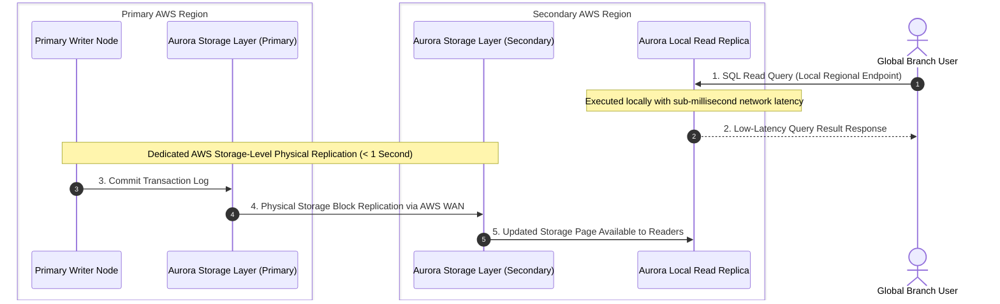
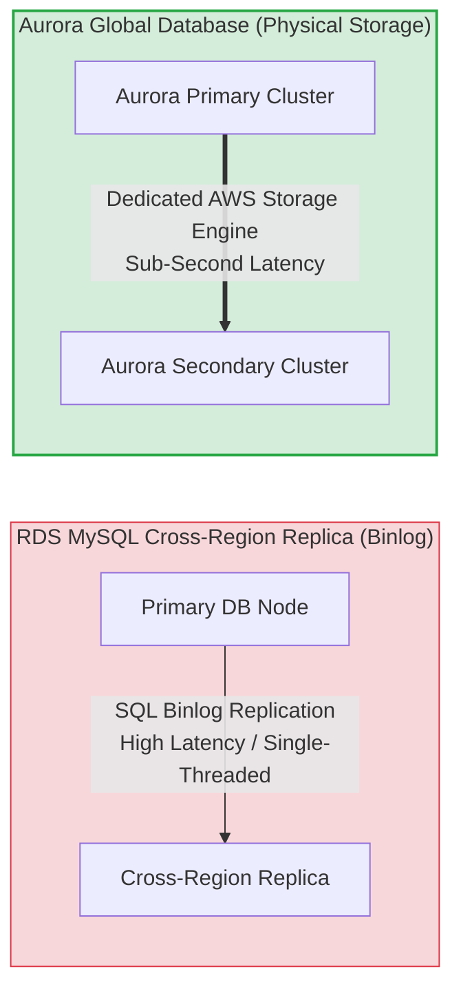
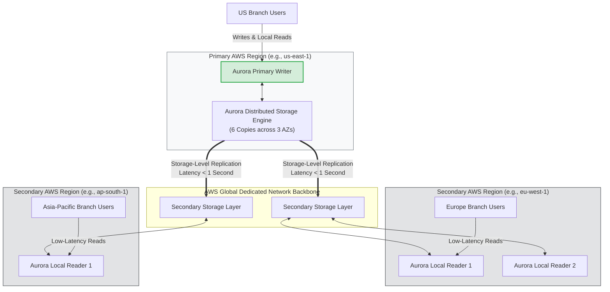
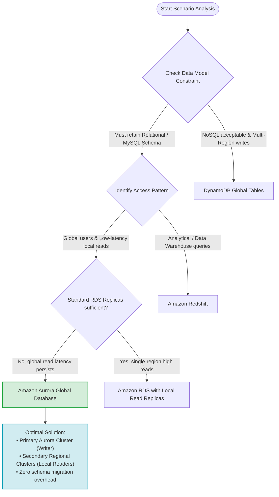

# Read Replicas & Global Database Architecture: AWS SAP-C02 & AIP-C01 Exam Guide

> [!NOTE]
> **Core Exam Concept**: When an application on Amazon RDS for MySQL faces read performance bottlenecks across **globally distributed users**, and the business constraint specifies that the **relational schema must remain intact**, standard RDS Read Replicas are insufficient. The correct architectural solution is **Amazon Aurora Global Database**.

---

## 1. Problem Statement & Scenario Analysis

### Scenario Prerequisites
- **Current Architecture**: Relational database running on Amazon RDS for MySQL with local Read Replicas.
- **User Distribution**: Branch offices and end-users distributed globally across multiple geographic regions.
- **Symptoms**: Severe read latency and performance bottlenecks despite using RDS Read Replicas.
- **Constraints**:
  - Must provide **fast, low-latency global reads**.
  - Must **NOT move away** from the underlying relational database schema (MySQL compatibility required).
  - Must deliver the **most cost-effective and high-performance** solution with minimal operational overhead.

### Key Architectural Clues

```
"Relational schema must remain"  ──> Eliminates DynamoDB Global Tables (NoSQL)
"Global branch offices"         ──> Eliminates Single-Region RDS Read Replicas
"Read performance issues"        ──> Eliminates standard RDS MySQL Cross-Region Replicas
"Transactional OLTP workload"    ──> Eliminates Amazon Redshift (OLAP / Data Warehouse)
```

---

## 2. Architecture Comparison: RDS Read Replicas vs. Aurora Global Database

### End-to-End Replication Architecture



---

## 3. Why Standard RDS Read Replicas Are Insufficient for Global Scale

Amazon RDS for MySQL supports both in-region and cross-region Read Replicas using **MySQL binary log (binlog) replication**. However, this mechanism presents limitations for global read workloads:

1. **Replication Lag**: Binlog replication is asynchronous and single-threaded at the SQL application layer, leading to high replication lag under heavy read/write traffic.
2. **Connection Management**: Client applications in distant regions must maintain database connections across long-haul internet/WAN paths to the primary region if regional read endpoints are not properly decoupled.
3. **Operational Overhead**: Managing cross-region failover and binlog replication topology in RDS MySQL requires manual intervention or custom orchestration scripts.



---

## 4. Amazon Aurora Global Database Architecture

Amazon Aurora Global Database is designed for globally distributed applications with read-heavy workloads requiring fast local read performance and disaster recovery.



### Key Technical Capabilities of Aurora Global Database
- **Sub-Second Global Replication**: Physical storage-level replication incurs minimal latency (typically < 1 second), decoupled from database engine compute load.
- **Local Read Performance**: Up to 5 secondary AWS Regions can be added, each hosting up to 16 read replicas to serve local application traffic.
- **Zero Impact on Writer Performance**: Replication is handled directly by the storage layer, ensuring write throughput in the primary region is unaffected by secondary read loads.
- **Disaster Recovery (DR)**: Enables cross-region RTO of under 1 minute in failover scenarios.

---

## 5. Detailed Distractor Analysis (Why Other Options Fail)

```mermaid
graph TD
    Req["Requirement: Global Scale + Read Performance"] --> Q_Rel{"Preserve Relational<br/>Schema?"}

    Q_Rel -- "No (NoSQL Allowed)" --> Dyn["DynamoDB Global Tables<br/>• Multi-Region Active-Active Writes<br/>• Key-Value / Document Model<br/>• Requires Schema Migration"]
    
    Q_Rel -- "Yes (Relational Required)" --> Q_Workload{"Workload Type?"}
    
    Q_Workload -- "OLAP / Analytics" --> Red["Amazon Redshift<br/>• Columnar Data Warehouse<br/>• Complex Analytical Queries"]

    Q_Workload -- "OLTP / Transactional" --> Q_Ops{"Management Requirement?"}

    Q_Ops -- "Self-Managed Control" --> EC2["EC2 + Self-Managed MySQL<br/>• High Operational Overhead<br/>• OS & DB Management Required"]

    Q_Ops -- "Managed Service" --> Q_Geo{"Global Low-Latency<br/>Reads Needed?"}

    Q_Geo -- "Single Region" --> RDS["Amazon RDS MySQL / Read Replicas<br/>• In-Region Read Scaling"]
    
    Q_Geo -- "Globally Distributed" --> Aurora["Amazon Aurora Global Database<br/>• Low-Latency Local Reads<br/>• Managed Relational Engine<br/>• Sub-Second Global Replication"]

    style Aurora fill:#d4edda,stroke:#28a745,stroke-width:2px
    style Dyn fill:#fff3cd,stroke:#ffc107,stroke-width:1px
    style Red fill:#e2e3e5,stroke:#6c757d,stroke-width:1px
    style EC2 fill:#f8d7da,stroke:#dc3545,stroke-width:1px
```



### 1. Why Not DynamoDB Global Tables?
> [!WARNING]
> While DynamoDB Global Tables provide multi-region active-active writes and fast local reads, migrating from RDS MySQL to DynamoDB requires **transforming the underlying data model from Relational (SQL) to NoSQL (Key-Value/Document)**.<br/>
> The exam prompt explicitly states: *"Do not move away from the underlying relational database schema."*

### 2. Why Not Amazon Redshift?
> [!NOTE]
> Amazon Redshift is an **OLAP (Online Analytical Processing)** columnar data warehouse engineered for complex aggregation queries over petabytes of data. It is not designed to replace transactional **OLTP (Online Transactional Processing)** databases like MySQL.

### 3. Why Not EC2 + Self-Managed MySQL?
> [!CAUTION]
> Running self-managed MySQL on EC2 instances across multiple regions introduces **excessive operational overhead**: OS patching, database installation, manual cross-region replication configuration, automated failover scripts, and backup routines. AWS managed services (RDS/Aurora) are always preferred unless full OS-level database control is mandatory.

---

## 6. Comprehensive Technology Matrix

| Attribute / Requirement | RDS MySQL (Cross-Region) | Aurora Global Database | DynamoDB Global Tables | Amazon Redshift | EC2 + Self-Managed MySQL |
| :--- | :--- | :--- | :--- | :--- | :--- |
| **Data Model** | Relational (SQL) | Relational (SQL) | NoSQL (Key-Value / Doc) | Relational (Columnar) | Relational (SQL) |
| **MySQL Compatibility** | 100% | 100% | 0% (Requires Rewrite) | Partial (PostgreSQL syntax) | 100% |
| **Workload Type** | Transactional (OLTP) | Transactional (OLTP) | Transactional / Key-Value | Analytical (OLAP) | Transactional (OLTP) |
| **Global Replication** | Asynchronous Binlog | Physical Storage Engine | Multi-Active Global Engine | Manual Cross-Region Snapshot | Custom Replication Setup |
| **Replication Latency** | Seconds to Minutes | **< 1 Second** | Sub-second | N/A (Snapshot based) | Variable / High |
| **Multi-Region Writes** | Single Primary Writer | Single Primary Writer* | **Multi-Region Active-Active** | Single Cluster | Custom Multi-Primary |
| **Operational Overhead** | Low | **Low** | Low | Low | **Extremely High** |

*\*Note: Aurora Global Database supports Write Forwarding from secondary regions, but physical writes are executed in the Primary Writer Region.*

---

## 7. OLTP vs. OLAP Decision Guide

```
┌────────────────────────────────────────────────────────────────────────┐
│                        Database Workload Classification                │
├───────────────────────────────────┬────────────────────────────────────┤
│ OLTP (Online Transactional)       │ OLAP (Online Analytical)           │
├───────────────────────────────────┼────────────────────────────────────┤
│ • Row-oriented storage            │ • Column-oriented storage          │
│ • High frequency of fast reads/   │ • Low frequency of complex, heavy  │
│   writes (INSERT, UPDATE, DELETE) │   aggregation queries (SUM, AVG)   │
│ • Low latency (< 10ms)            │ • Scans millions/billions of rows  │
│ • Target: Amazon RDS / Aurora     │ • Target: Amazon Redshift / Athena │
└───────────────────────────────────┴────────────────────────────────────┘
```

---

## 8. Total Cost of Ownership (TCO) & Efficiency

The exam prompt requests the **"MOST cost-effective and high-performance"** architecture.

> [!TIP]
> **Understanding "Cost-Effective" in AWS Exams**:
> "Cost-effective" does **NOT** mean selecting the lowest hourly instance pricing. It accounts for **Total Cost of Ownership (TCO)**, including:
> 1. **Engineering Cost**: Redesigning an application schema for DynamoDB can cost hundreds of thousands of dollars in developer hours.
> 2. **Operational Overhead**: Managing self-managed MySQL on EC2 requires dedicated DBA maintenance time.
> 3. **Infrastructure Efficiency**: Aurora Global Database eliminates unnecessary compute overhead by handling replication natively at the storage tier.

---

## 9. AWS Exam Decision Tree Flowchart



---

## 10. Exam Memory Cheat Sheet

| Trigger Phrase in Exam Question | Primary Candidate | Rationale |
| :--- | :--- | :--- |
| `"Existing MySQL + Global Users + Low Latency Reads + Preserve Schema"` | **Aurora Global Database** | Relational preservation + sub-second cross-region read scaling |
| `"Global Users + Multi-Region Active-Active Writes + NoSQL"` | **DynamoDB Global Tables** | Multi-master global write architecture for NoSQL workloads |
| `"Billions of rows + Complex aggregation + Analytics"` | **Amazon Redshift** | Purpose-built columnar OLAP data warehouse |
| `"Full OS access + Custom database extensions required"` | **EC2 Self-Managed DB** | Required when AWS managed services cannot support custom OS hooks |
| `"Read performance issues in a single AWS Region"` | **RDS Read Replicas** | Scaling read operations locally within one AWS Region |
| `"Multi-AZ Deployment vs Read Replica"` | **Multi-AZ = HA / DR<br/>Read Replica = Scaling Reads** | Multi-AZ is synchronous for failover; Read Replica is asynchronous for read performance |

---

## 11. Core Summary

When scaling database read workloads globally while maintaining an existing relational schema:

1. **Do not migrate to NoSQL (DynamoDB)** if the question mandates keeping the relational model.
2. **Do not use Redshift** for transactional OLTP application backends.
3. **Do not choose EC2 self-managed MySQL** due to massive operational overhead.
4. **Choose Aurora Global Database** to achieve sub-second cross-region replication and low-latency local reads across global branch offices with minimal operational effort.