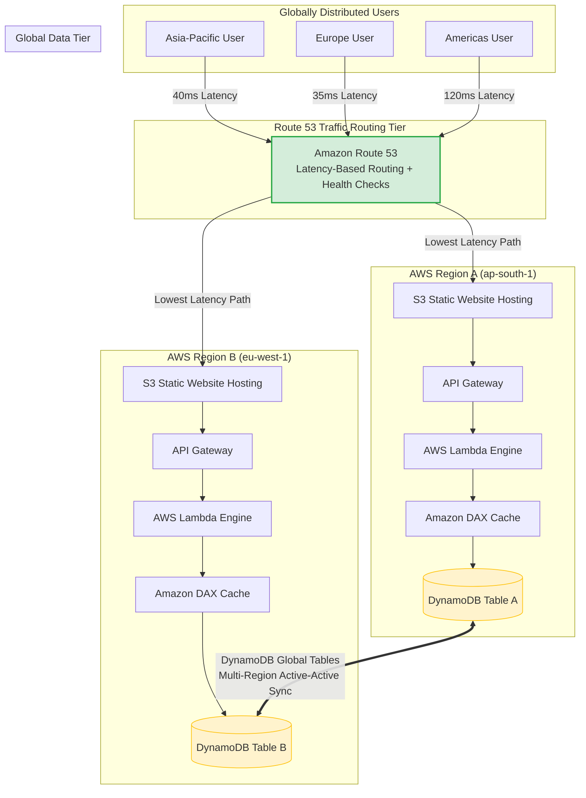
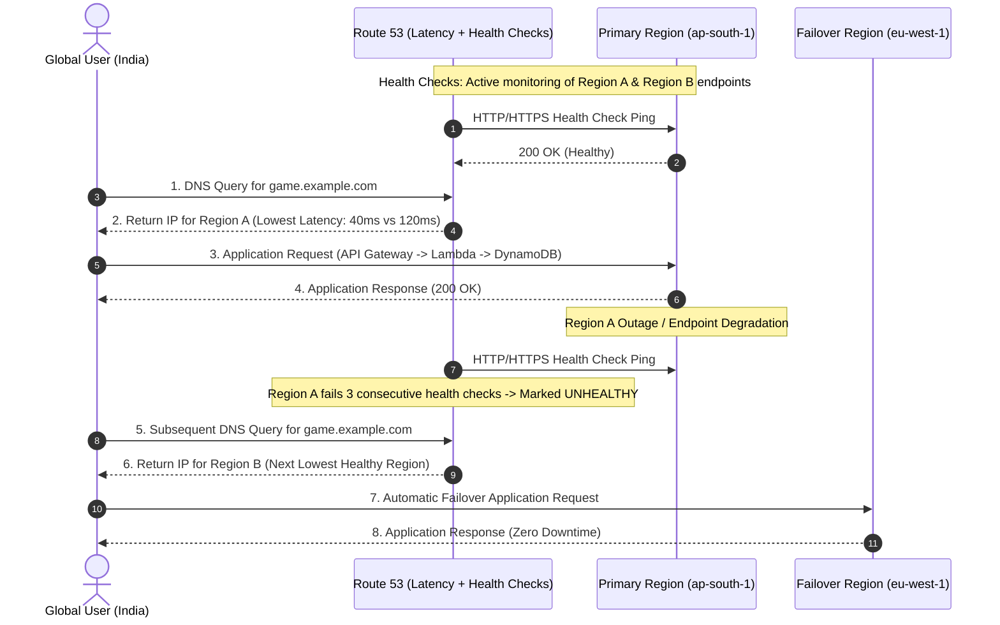
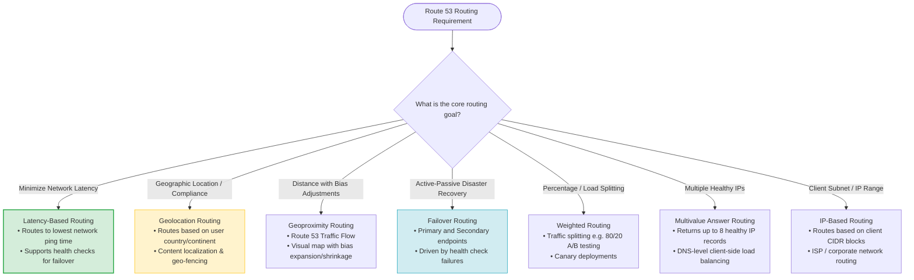
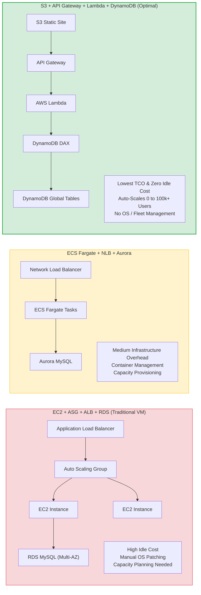
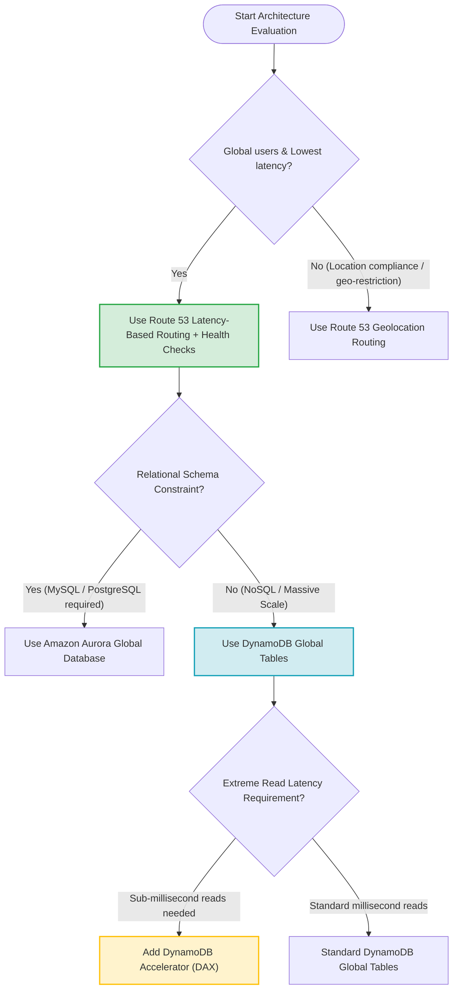

# Multi-Region Serverless Routing & Traffic Management: AWS SAP-C02 & AIP-C01 Exam Guide

> [!NOTE]
> **Core Exam Concept**: When building a globally available, high-concurrency application (hundreds of thousands of concurrent users) targeting **99.99% availability**, **lowest network latency**, and **lowest total cost of ownership**, the optimal architecture combines **Route 53 Latency-Based Routing with Health Checks**, **S3 Static Website Hosting**, **API Gateway + AWS Lambda**, and **DynamoDB Global Tables with DAX**.

---

## 1. Problem Statement & Scenario Analysis

### Scenario Requirements & Architectural Implications

| Scenario Requirement | Architectural Solution | Key AWS Service |
| :--- | :--- | :--- |
| **99.99% Availability SLA** | Multi-AZ and Multi-Region failure isolation | Route 53 + Multi-Region Deployments |
| **Global User Base** | Route users to the best performing AWS Region | Route 53 Latency-Based Routing |
| **Hundreds of Thousands of Concurrent Users** | Horizontally scalable serverless compute | AWS Lambda + API Gateway |
| **Lowest Possible Network Latency** | Edge routing & in-memory caching | Route 53 Latency Routing + Amazon DAX |
| **Automatic Regional Failover** | Instant detection and re-routing around regional outages | Route 53 Health Checks |
| **Lowest Operational Cost & TCO** | Pay-per-use serverless infrastructure | S3 + API Gateway + Lambda + DynamoDB |
| **Global Multi-Master Data Access** | Low-latency active-active database access | DynamoDB Global Tables |

### Key Exam Trigger Phrase
```
"Global users + high concurrency + low latency + automatic failover + lowest cost"
      │
      ├──> Route 53 Latency-Based Routing with Health Checks
      ├──> Serverless Compute (API Gateway + AWS Lambda)
      ├──> Static Front-End (S3 / CloudFront)
      └──> Global Database (DynamoDB Global Tables + DAX)
```

---

## 2. End-to-End Multi-Region Serverless Architecture



---

## 3. Route 53 Latency-Based Routing vs. Health Check Failover

### Route 53 Latency-Based Routing
Latency-based routing directs user DNS requests to the AWS Region that provides the lowest network latency for that specific client location. Route 53 continuously measures latency from worldwide edge locations to AWS Regions.

```
Client Ping Measurement:
• ap-south-1:  40 ms  <-- Selected by Route 53
• eu-west-1:  120 ms
• us-east-1:  220 ms
```

### Sequence Flow: Health Check Failover Integration



> [!IMPORTANT]
> **Exam Distinction**: You do **NOT** need to configure a Route 53 Failover Routing policy to achieve automatic regional failover. Associating **Health Checks** with **Latency-Based Routing records** automatically routes traffic away from unhealthy regions to the next lowest-latency healthy region.

---

## 4. Latency-Based vs. Geolocation vs. Other Route 53 Policies



### Comprehensive Routing Policy Comparison

| Routing Policy | Primary Goal | Use Case Example | Health Check Support |
| :--- | :--- | :--- | :--- |
| **Latency-Based** | **Lowest network response time** | Global user routing to fastest region | Yes (Automatic failover) |
| **Geolocation** | **Location compliance / Licensing** | Restrict EU content to EU users | Yes |
| **Geoproximity** | **Geographic distance + Bias tuning** | Shift traffic boundary between regions | Yes (Traffic Flow) |
| **Failover** | **Strict Active-Passive DR** | Primary data center with standby DR | Yes |
| **Weighted** | **Percentage traffic distribution** | A/B testing & Blue/Green releases | Yes |
| **Multivalue Answer** | **DNS-level load balancing** | Return up to 8 healthy IP records | Yes |
| **IP-Based** | **Subnet / CIDR based routing** | Custom ISP or internal network paths | Yes |

> [!WARNING]
> **The "Round-Robin" Exam Trap**: There is **NO** Route 53 policy named "Round-Robin Routing". Any exam option proposing a "Route 53 Round-Robin policy" is a distractor and must be immediately eliminated.

---

## 5. Component Deep Dive & Justifications

### 1. Static Content Hosting: S3 (or S3 + CloudFront)
- **Why S3**: Hosting static website assets on S3 eliminates web server infrastructure costs, scales automatically with traffic spikes, and costs pennies compared to running EC2 fleets.
- **Exam Nuance**: S3 alone gives the lowest cost. Adding **CloudFront** in front of S3 adds edge caching for global static content acceleration.

### 2. Compute Layer: API Gateway + AWS Lambda
- **Why Serverless Compute**: Hundreds of thousands of concurrent gaming users require rapid horizontal scaling.
- **EC2 / ASG Limitations**: EC2 Auto Scaling Groups require capacity pre-provisioning, AMI management, OS patching, and incur idle compute costs.
- **Lambda Advantage**: Scales dynamically from 0 to tens of thousands of concurrent executions instantly with pay-per-request pricing.

### 3. Data Tier: DynamoDB Global Tables + DAX
- **DynamoDB Global Tables**: Provides multi-region, active-active replication with sub-second replication latency, allowing users in any region to read and write locally.
- **DynamoDB Accelerator (DAX)**: An in-memory cache for DynamoDB delivering microsecond read latencies (`< 1ms`) for read-heavy gaming workloads (e.g., leaderboards, player profiles).

```
┌────────────────────────────────────────────────────────────────────────┐
│ DAX vs. DynamoDB Global Tables                                         │
├───────────────────────────────────┬────────────────────────────────────┤
│ DAX                               │ DynamoDB Global Tables             │
├───────────────────────────────────┼────────────────────────────────────┤
│ • In-memory cache                 │ • Cross-Region data replication    │
│ • Microsecond read latency        │ • Multi-master active-active sync  │
│ • Reduces database read load      │ • Global availability & DR         │
└───────────────────────────────────┴────────────────────────────────────┘
```

---

## 6. Compute & Storage TCO Comparison



### Operational Overhead & Cost Matrix

| Feature / Metric | EC2 + ASG + RDS | ECS Fargate + Aurora | S3 + API GW + Lambda + DynamoDB |
| :--- | :--- | :--- | :--- |
| **Server Management** | High (OS, AMIs, Patching) | Medium (Containers) | **Zero (Fully Serverless)** |
| **Scaling Agility** | Slow (Minutes for EC2 spin up) | Medium (Container launch time) | **Instant (Milliseconds for Lambda)** |
| **Multi-Region Data** | Custom Binlog / Backup Scripting | Aurora Global Database | **DynamoDB Global Tables (Native)** |
| **Idle Cost** | High (Always-on EC2 instances) | Medium (Running Fargate tasks) | **Zero (Pay strictly per request/GB)** |
| **Overall TCO** | High | Medium | **Lowest** |

---

## 7. Availability Math: Achieving 99.99% SLA

99.99% availability (the "four nines") allows for a maximum of **52.56 minutes of total downtime per year** across the entire stack.

```
99.99% SLA Calculation:
• Downtime per year:    52.56 minutes
• Downtime per month:    4.38 minutes
• Downtime per week:    60.48 seconds
```

To meet this stringent SLA:
1. **Eliminate Single Points of Failure (SPOFs)** by deploying redundantly across multiple Availability Zones and AWS Regions.
2. **Use Managed Serverless Services** with built-in multi-AZ availability (S3, API Gateway, Lambda, DynamoDB).
3. **Automate Failure Detection & Rerouting** using Route 53 Health Checks.

---

## 8. Common SAP-C02 & AIP-C01 Exam Traps

> [!CAUTION]
> **Trap 1: Choosing Geolocation for Latency Requirements**
> - *Mistake*: Selecting Geolocation Routing because users are "globally distributed."
> - *Correction*: Geolocation routes based on *user location/country*, not performance. If the question asks for *lowest latency*, select **Latency-Based Routing**.

> [!WARNING]
> **Trap 2: Selecting Route 53 Failover Routing for Multi-Region Active-Active**
> - *Mistake*: Using Failover Routing when all regions should actively process traffic.
> - *Correction*: Failover Routing is for *Active-Passive* setups. For active-active multi-region setups, use **Latency-Based Routing with Health Checks**.

> [!NOTE]
> **Trap 3: Confusing RDS Multi-AZ with Multi-Region Resilience**
> - *Mistake*: Selecting RDS Multi-AZ to protect against regional outages.
> - *Correction*: Multi-AZ provides in-region high availability across subnets. Protecting against full regional disasters requires multi-region replication (DynamoDB Global Tables or Aurora Global Database).

---

## 9. Exam Decision Matrix



---

## 10. Exam Memory Cheat Sheet

```
Global Users + Lowest Latency         ──> Route 53 Latency-Based Routing
Automatic Regional Failure Rerouting  ──> Route 53 Health Checks
Static Website + Lowest Cost          ──> S3 Static Hosting
Variable Massive Scale + Serverless   ──> API Gateway + AWS Lambda
Global Multi-Region NoSQL Database    ──> DynamoDB Global Tables
DynamoDB Microsecond Read Caching     ──> Amazon DAX
Country / Compliance Based Routing    ──> Geolocation Routing
Active-Passive Disaster Recovery      ──> Failover Routing
"Round-Robin Route 53 Policy"        ──> INVALID OPTION (Eliminate immediately)
```

---

## 11. Final Exam Mental Model

```
                     [ Global Users ]
                            │
                            ▼
              [ Route 53 Latency Routing ]
                            │
        ┌───────────────────┴───────────────────┐
        ▼                                       ▼
  [ Region A ]                            [ Region B ]
  • S3 Static Site                        • S3 Static Site
  • API Gateway                           • API Gateway
  • AWS Lambda                            • AWS Lambda
  • DAX Cache                             • DAX Cache
        │                                       │
        └───────────────► ◄─────────────────────┘
             [ DynamoDB Global Tables ]
             (Active-Active Sync < 1s)
```