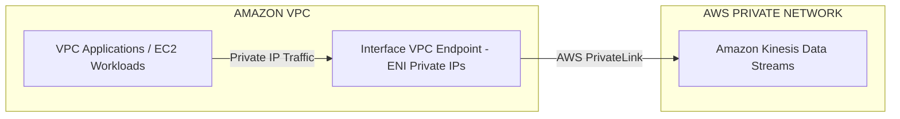
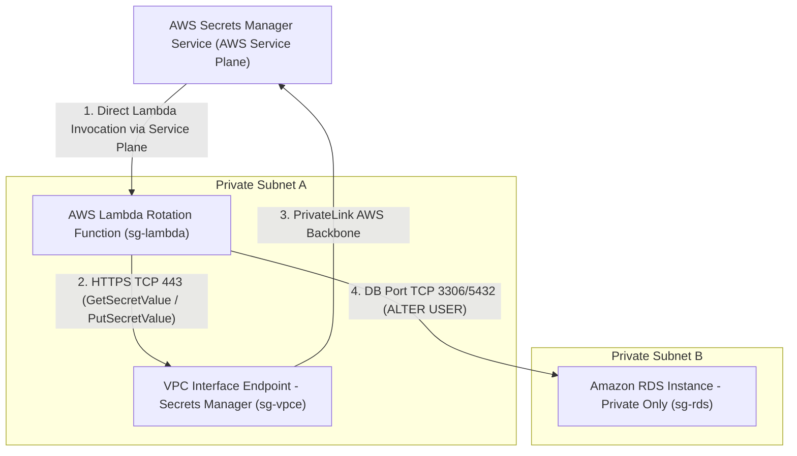

**Set up an interface VPC endpoint for Kinesis Data Streams in the VPC. Ensure that the VPC endpoint policy allows traffic from the applications**

You can use an interface VPC endpoint to keep traffic between your Amazon VPC and Kinesis Data Streams from leaving the Amazon network. <font color="#2DC26B">Interface VPC endpoints don't require an internet gateway, NAT device, VPN connection, or AWS Direct Connect connection</font>. <mark style="background:#fff88f">Interface VPC endpoints are powered by AWS PrivateLink</mark>, an AWS technology that enables private communication between AWS services using an elastic network interface with private IPs in your Amazon VPC. You do not need to change the settings for your streams, producers, or consumers. Simply create an interface VPC endpoint for your Kinesis Data Streams traffic from and to your Amazon VPC-based applications to start flowing through the interface VPC endpoint.

VPC endpoint policies enable you to control access by either attaching a policy to a VPC endpoint or by using additional fields in a policy that is attached to an IAM user, group, or role to restrict access to only occur via the specified VPC endpoint. These policies can be used to restrict access to specific streams to a specified VPC endpoint when used in conjunction with the IAM policies to only grant access to Kinesis data stream actions via the specified VPC endpoint.

### 🏗️ Kinesis Data Streams Interface VPC Endpoint Flow




 via - [https://docs.aws.amazon.com/streams/latest/dev/vpc.html](https://docs.aws.amazon.com/streams/latest/dev/vpc.html)

Incorrect options:

**Set up an interface VPC endpoint for Kinesis Data Streams in the VPC. Ensure that the applications have the required IAM permissions to use the interface VPC endpoint** - Although you can use an IAM policy to restrict access to specific streams to a specified VPC endpoint by only granting access to Kinesis data stream actions via the specified VPC endpoint. However, you need to make changes in the code for the different applications to assume the relevant IAM role and then make changes in the permissions policy attached to the IAM role to grant access to Kinesis Data Streams via the VPC endpoint. This is not an elegant solution when compared to just using the VPC endpoint policy.

**Set up a gateway VPC endpoint for Kinesis Data Streams in the VPC. Ensure that the VPC endpoint policy allows traffic from the applications**

**Set up a gateway VPC endpoint for Kinesis Data Streams in the VPC. Ensure that the applications have the required IAM permissions to use the gateway VPC endpoint**

There are three types of VPC endpoints. You must create the type of VPC endpoint that's required by the endpoint service.

Interface - Create an interface endpoint to send traffic to endpoint services that use a Network Load Balancer to distribute traffic. Traffic destined for the endpoint service is resolved using DNS.

GatewayLoadBalancer - Create a Gateway Load Balancer endpoint to send traffic to a fleet of virtual appliances using private IP addresses. You route traffic from your VPC to the Gateway Load Balancer endpoint using route tables. The Gateway Load Balancer distributes traffic to the virtual appliances and can scale with demand.

Gateway - Create a gateway endpoint to send traffic to Amazon S3 or DynamoDB using private IP addresses. You route traffic from your VPC to the gateway endpoint using route tables. Gateway endpoints do not enable AWS PrivateLink.

<mark style="background:#fff88f">You cannot set up a gateway VPC endpoint for Kinesis Data Streams. Gateway VPC endpoint is only supported for S3 and DynamoDB.</mark> Therefore, both these options are incorrect.

References:

[https://docs.aws.amazon.com/streams/latest/dev/vpc.html](https://docs.aws.amazon.com/streams/latest/dev/vpc.html)

[https://docs.aws.amazon.com/vpc/latest/privatelink/vpc-endpoints-access.html](https://docs.aws.amazon.com/vpc/latest/privatelink/vpc-endpoints-access.html)

**Configure an Amazon VPC interface endpoint to access your Secrets Manager Lambda rotation function and private Amazon Relational Database Service (Amazon RDS) instance**

*Secrets Manager can't rotate secrets for AWS services running in Amazon VPC private subnets because these subnets don't have internet access. To rotate the keys successfully you need to configure an Amazon VPC interface endpoint to access your Secrets Manager Lambda function and private Amazon Relational Database Service (Amazon RDS) instance.*

Steps that need to be followed: 
1. Create security groups for the Secrets Manager VPC endpoint, Amazon RDS instance, and the Lambda rotation function 
2. Add rules to Amazon VPC endpoint and Amazon RDS instance security groups 
3. Attach security groups to AWS resources 
4. Create an Amazon VPC interface endpoint for the Secrets Manager service and associate it with a security group 
5. Verify that the Secrets Manager can rotate the secret

Incorrect options:

**Configure an Amazon VPC interface endpoint for the Lambda service to enable access for your Secrets Manager Lambda rotation function and private Amazon Relational Database Service (Amazon RDS) instance** - As explained above, you need to create an Amazon VPC interface endpoint for the Secrets Manager and not for the Lambda service. This option has been added as a distractor.

**Interface VPC endpoints support traffic only over HTTP. If this is incorrectly configured, the AWS Lambda function can timeout** - This statement is incorrect.<mark style="background:#fff88f"> Interface VPC endpoints support traffic only over TCP.</mark>

**Your Lambda rotation function might be based on an older template that doesn't support SSL/TLS. To support connections that use SSL/TLS, you must recreate your Lambda rotation function** - Rotation functions for Amazon RDS (except Amazon RDS for Oracle) and Amazon DocumentDB automatically use SSL/TLS to connect to your database if it's available. If you set up secret rotation before December 20, 2021, then your rotation function might be based on an older template that doesn't support SSL/TLS. To support connections that use SSL/TLS, you must recreate your rotation function. If this is the issue then the following error crops up ": setSecret: Unable to log into the database with previous, current, or the pending secret of secret".

References:

[https://aws.amazon.com/premiumsupport/knowledge-center/rotate-secrets-manager-secret-vpc/](https://aws.amazon.com/premiumsupport/knowledge-center/rotate-secrets-manager-secret-vpc/)

[https://docs.aws.amazon.com/vpc/latest/privatelink/create-interface-endpoint.html#vpce-interface-limitations](https://docs.aws.amazon.com/vpc/latest/privatelink/create-interface-endpoint.html#vpce-interface-limitations)

[https://aws.amazon.com/premiumsupport/knowledge-center/rotate-secret-db-ssl/](https://aws.amazon.com/premiumsupport/knowledge-center/rotate-secret-db-ssl/)

- **Secrets Manager vs. Lambda VPC Endpoints:**
    
    - Secrets Manager invokes Lambda using AWS service-plane routing (outside your VPC). You **do not** need a VPC endpoint for AWS Lambda to trigger rotation. You **only** need the VPC endpoint for **AWS Secrets Manager** so the Lambda function can talk back to Secrets Manager.

- **Missing Private DNS on VPC Endpoint:**
    
    - If Private DNS is disabled on the Interface Endpoint, the standard AWS SDK calls targeting `secretsmanager.<region>.amazonaws.com` will attempt to resolve to public IPs and timeout.

- **Dual-User Rotation Strategy:**
    
    - For zero-downtime production applications, use the **alternating dual-user rotation pattern** (`user_1` and `user_2`), ensuring ongoing client traffic never uses the credential currently being rotated.

### 🏗️ Secrets Manager VPC Endpoint Rotation Architecture



```
 ┌───────────────────────────────────────────────────────────────────────────────────────────┐
 │ AWS SERVICE PLANE (Outside VPC)                                                           │
 │                                                                                           │
 │  ┌─────────────────────────────────────────────────────────────────────────────────────┐  │
 │  │ AWS Secrets Manager Service                                                         │  │
 │  │  • Triggers 4-Step Rotation Workflow                                                │  │
 │  └───────┬──────────────────────────────────────────────────────────────────────▲──────┘  │
 └──────────┼──────────────────────────────────────────────────────────────────────┼─────────┘
            │                                                                      │
            │ 1. Direct Lambda Invocation                                          │ 3. PrivateLink
            │    (AWS Service-Plane Routing)                                         │    AWS Backbone
            ▼                                                                      │
 ┌─────────────────────────────────────────────────────────────────────────────────┼─────────┐
 │ Amazon VPC                                                                      │         │
 │                                                                                 │         │
 │  ┌──────────────────────────────────────────────────────────────────────────────┴──────┐  │
 │  │ VPC Interface Endpoint (com.amazonaws.<region>.secretsmanager)                      │  │
 │  │  • Elastic Network Interfaces (ENIs) with Private IPs in each Subnet                │  │
 │  │  • Security Group: sg-vpce (Inbound TCP 443 from sg-lambda)                         │  │
 │  └──────────────────────────────────▲──────────────────────────────────────────────────┘  │
 │                                     │                                                     │
 │                                     │ 2. Inbound HTTPS (TCP 443)                          │
 │                                     │    [GetSecretValue / PutSecretValue / FinishRotation]│
 │                                     │                                                     │
 │  ┌──────────────────────────────────┴───────────────────┐                                 │
 │  │ Private Subnet A (AZ-A)                              │                                 │
 │  │                                                      │                                 │
 │  │  ┌────────────────────────────────────────────────┐  │                                 │
 │  │  │ AWS Lambda Rotation Function                   │  │                                 │
 │  │  │  • Security Group: sg-lambda                   │  │                                 │
 │  │  │  • Execution Role: AWSSecretsManagerRotation   │  │                                 │
 │  │  └───────────────────────┬────────────────────────┘  │                                 │
 │  └──────────────────────────┼───────────────────────────┘                                 │
 │                             │                                                             │
 │                             │ 4. Inbound DB Port (MySQL 3306 / Postgres 5432)             │
 │                             │    [ALTER USER ... IDENTIFIED BY ...]                       │
 │                             ▼                                                             │
 │  ┌──────────────────────────────────────────────────────┐                                 │
 │  │ Private Subnet B (AZ-B)                              │                                 │
 │  │                                                      │                                 │
 │  │  ┌────────────────────────────────────────────────┐  │                                 │
 │  │  │ Amazon RDS Instance (Private Only)             │  │                                 │
 │  │  │  • Security Group: sg-rds                      │  │                                 │
 │  │  │  • Inbound: DB Port from sg-lambda             │  │                                 │
 │  │  └────────────────────────────────────────────────┘  │                                 │
 │  └──────────────────────────────────────────────────────┘                                 │
 └───────────────────────────────────────────────────────────────────────────────────────────┘
```

