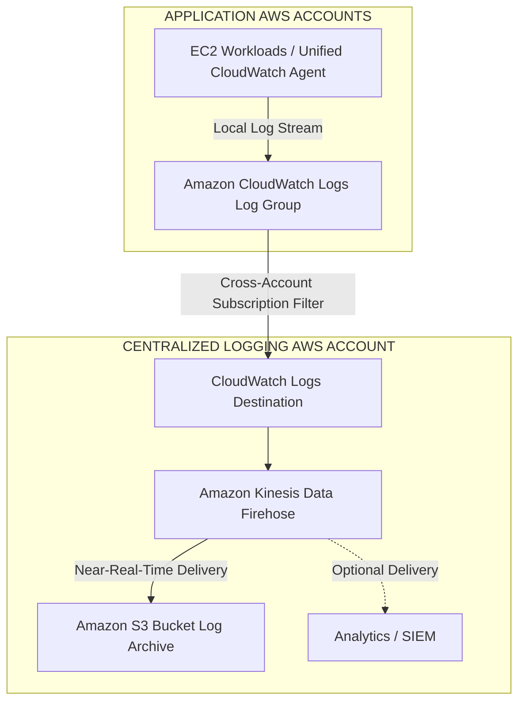

**Set up Kinesis Data Firehose in the logging account and then subscribe the delivery stream to CloudWatch Logs streams in each application AWS account via subscription filters. Persist the log data in an Amazon S3 bucket inside the logging AWS account**

You can configure Amazon Kinesis Data Firehose to aggregate and collate CloudWatch Logs from different AWS accounts and receive their log events in a centralized logging AWS Account (this is known as cross-account data sharing) by using a CloudWatch Logs destination and then creating a Subscription Filter. This log event data can be read from a centralized Amazon Kinesis Firehose delivery stream to perform downstream processing and analysis.

You can collaborate with an owner of a different AWS account and receive their log events on your AWS resources, such as an Amazon Kinesis or Amazon Kinesis Data Firehose stream (this is known as cross-account data sharing). You can use a subscription filter with Kinesis Streams, Lambda, or Kinesis Data Firehose. Logs that are sent to a receiving service through a subscription filter are Base64 encoded and compressed with the gzip format.

Incorrect options:

**Set up a new IAM role in each application AWS account with permissions to view CloudWatch Logs. Create a Lambda function to assume this new role and perform an hourly export of each AWS account's CloudWatch Logs data to an S3 bucket in the centralized logging AWS account** - As the Lambda function is performing an hourly export, so it's not a near-real time soluton. In addition, Lambda is not the right choice to build a high volume and high-velocity streaming solution which is better handled by using the Kinesis Family of services.

**Set up CloudWatch Logs agents to publish data to a Kinesis Data Firehose stream in the centralized logging AWS account. Create a Lambda function to read messages from the stream and push messages to Kinesis Data Firehose and then store the data in S3** - The CloudWatch Logs agent (on the path to deprecation) supports the collection of logs from only servers running Linux. It is recommended to use the unified CloudWatch agent. It enables you to collect both logs and advanced metrics with one agent. It offers support across operating systems, including servers running Windows Server. This agent also provides better performance. CloudWatch Logs agent cannot publish data to a Kinesis Data Firehose stream, so this option is incorrect.

**Set up CloudWatch Logs streams in each application AWS account to forward events to CloudWatch Logs in the centralized logging AWS account. In the centralized logging AWS account, subscribe a Kinesis Data Firehose stream to Amazon EventBridge events and further use the Firehose stream to store the log data in S3** - You can use a subscription filter with Kinesis Streams, Lambda, or Kinesis Data Firehose. So you cannot just forward events directly to CloudWatch Logs in another account. In addition, Kinesis Data Firehose stream cannot subscribe to EventBridge events, so this option is incorrect.

References:

[https://docs.aws.amazon.com/AmazonCloudWatch/latest/logs/CrossAccountSubscriptions.html](https://docs.aws.amazon.com/AmazonCloudWatch/latest/logs/CrossAccountSubscriptions.html)

[https://docs.aws.amazon.com/AmazonCloudWatch/latest/logs/SubscriptionFilters.html](https://docs.aws.amazon.com/AmazonCloudWatch/latest/logs/SubscriptionFilters.html)

[https://aws.amazon.com/blogs/architecture/stream-amazon-cloudwatch-logs-to-a-centralized-account-for-audit-and-analysis/](https://aws.amazon.com/blogs/architecture/stream-amazon-cloudwatch-logs-to-a-centralized-account-for-audit-and-analysis/)

### 🏗️ Architecture Diagram



```
┌─────────────────────────────────────────────────────────────────────────┐
│           APPLICATION AWS ACCOUNTS (Account A, B, ... N)                 │
│                                                                         │
│  ┌──────────────────────────────────────────────────────────────────┐   │
│  │ EC2 Instances / Workloads                                        │   │
│  │ • Unified CloudWatch Agent                                       │   │
│  └─────────────────────────────────┬────────────────────────────────┘   │
│                                    │ (Local Log Stream)                 │
│                                    ▼                                    │
│  ┌──────────────────────────────────────────────────────────────────┐   │
│  │ Amazon CloudWatch Logs                                           │   │
│  │ • Log Group: /aws/app/security-events                            │   │
│  │ • Subscription Filter (FilterPattern: "[...]")                   │   │
│  └─────────────────────────────────┬────────────────────────────────┘   │
└────────────────────────────────────┼────────────────────────────────────┘
                                     │
                                     │ Cross-Account PutLogEvents
                                     │ (Assumes IAM Role via Logs Destination)
                                     ▼
┌─────────────────────────────────────────────────────────────────────────┐
│               CENTRALIZED LOGGING & SECURITY AWS ACCOUNT                │
│                                                                         │
│  ┌──────────────────────────────────────────────────────────────────┐   │
│  │ CloudWatch Logs Destination                                      │   │
│  │ • ARN: arn:aws:logs:...:destination:central-dest                 │   │
│  │ • Access Policy: Allows Member Accounts / Org ID                 │   │
│  │ • Trust Role: Allows CW Logs -> Firehose PutRecord               │   │
│  └─────────────────────────────────┬────────────────────────────────┘   │
│                                    │                                    │
│                                    ▼                                    │
│  ┌──────────────────────────────────────────────────────────────────┐   │
│  │ Amazon Kinesis Data Firehose                                     │   │
│  │ • Buffer: 5 MB or 60-300 seconds                                 │   │
│  │ • Data Transformation: Optional (Inline Lambda)                  │   │
│  │ • Backup: Source records S3 backup                               │   │
│  └─────────────┬─────────────────────────────────────┬──────────────┘   │
│                │                                     │                  │
│                ▼ (Near-Real-Time Delivery)           ▼ (Optional)       │
│  ┌───────────────────────────┐         ┌──────────────────────────────┐ │
│  │ Amazon S3 Bucket          │         │ Analytics / SIEM             │ │
│  │ (Log Archive & Compliance)│         │ (OpenSearch / Splunk)        │ │
│  │ • SSE-KMS Encrypted       │         └──────────────────────────────┘ │
│  │ • S3 Object Lock (WORM)   │                                          │
│  │ • S3 Lifecycle to Glacier │                                          │
│  └───────────────────────────┘                                          │
└─────────────────────────────────────────────────────────────────────────┘
```