# Part 1: Amazon Redshift — Deep-Dive for Architects

### 1. What is Amazon Redshift?

**Amazon Redshift** is a fully managed, petabyte-scale<font color="#2DC26B"> **OLAP (Online Analytical Processing)** </font>data warehouse service. It is designed to <u>run complex SQL aggregations, reporting, business intelligence (BI) workloads, and analytical queries across massive structured and semi-structured datasets.</u>

#### Key Architectural Highlights

- **Columnar Storage:** Data is stored column by column rather than row by row. This drastically reduces disk I/O when aggregating columns (e.g., `SELECT SUM(revenue) FROM sales`).

- **MPP (Massively Parallel Processing):** Distributes data and query execution across all compute nodes and CPU cores ("slices") to run operations in parallel.

- **Modern Node Architecture (RA3 Nodes):** Separates **Compute** from **Storage** using _Redshift Managed Storage (RMS)_ backed by S3. You scale compute and storage independently.

- **Deployment Models:**

    - **Provisioned Clusters:** You choose node types (e.g., `ra3.4xlarge`), node counts, and maintenance windows.

    - **Redshift Serverless:** Automatically provisions and scales data warehouse capacity (measured in Redshift Processing Units - RPUs) based on workload demand with zero cluster management.


### 2. When to Use Amazon Redshift

- **Enterprise Data Warehousing & BI:** Running scheduled reporting tools (QuickSight, Tableau) on multi-terabyte to petabyte-scale datasets.

- **Complex Multi-Table Joins & Aggregations:** When queries require high-performance joins, nested subqueries, and window functions across billions of rows.

- **Lakehouse Architecture (Redshift Spectrum):** Querying live open-format data (Parquet, ORC, CSV) residing in Amazon S3 directly without ingesting it into Redshift tables.

- **Near Real-Time Operational Analytics (Zero-ETL):** Built-in Zero-ETL integration with Amazon Aurora (MySQL/PostgreSQL), RDS, and DynamoDB to analyze operational data within seconds without writing custom Glue/Lambda pipelines.

- **Cross-Organizational Data Sharing:** Sharing live data across different Redshift clusters, AWS accounts, or AWS Regions securely without copying or moving data.


### 3. Anti-Patterns & Trade-Offs (When NOT to Use)

|**Scenario / Anti-Pattern**|**Why Redshift Fails**|**Better Alternative**|
|---|---|---|
|**High-frequency OLTP** (point reads, single `INSERT/UPDATE/DELETE`)|Columnar storage causes massive write amplification and table bloat with single-row modifications.|**Amazon Aurora / RDS**|
|**Simple Key-Value / Document Lookups** ($<10\text{ ms}$ latency)|Not designed for high concurrency point-lookups.|**Amazon DynamoDB / ElastiCache**|
|**Infrequent / Ad-Hoc queries on S3 files** (a few queries/week)|Running a provisioned cluster 24/7 is not cost-effective; requires maintenance.|**Amazon Athena**|
|**Unstructured data processing / Custom Spark ML**|Redshift is SQL-centric. Complex unstructured data transformation (images, logs, deep learning) needs distributed frameworks.|**Amazon EMR / AWS Glue**|
|**Full-text search / Log analytics**|Lacks inverted indexing and fuzzy matching capabilities.|**Amazon OpenSearch Service**|

### 4. Service Comparison & Decision Matrix (Crucial for SAP-C02)

|**Service**|**Best Use Case**|**Operational Overhead**|**Setup / Maintenance Complexity**|**Cost Model**|
|---|---|---|---|---|
|**Redshift Serverless**|Frequent BI/OLAP, unpredictable traffic, fast response times needed|**Low** (Auto-scales compute, manages maintenance)|**Low**|Pay per RPU-hour consumed|
|**Redshift Provisioned**|Steady, predictable 24/7 heavy analytics, reserved capacity|**Medium-High** (Requires WLM tuning, vacuuming, node sizing)|**Medium-High**|Hourly cluster price + Reserved Instances|
|**Amazon Athena**|Ad-hoc SQL queries directly on S3 data lake, infrequent jobs|**Lowest** (Truly serverless, zero infra)|**Lowest**|Pay per TB of data scanned|
|**Amazon EMR (Spark/Presto)**|Massive ETL, custom data science, unstructured data pipelines|**High** (Cluster management, Spark tuning) _(Lower with EMR Serverless)_|**High**|Instance hours / EMR Serverless execution|
|**Amazon Aurora**|High-throughput transactional OLTP systems ($<10\text{ TB}$)|**Low-Medium**|**Low**|Provisioned instance or Aurora Serverless v2|

### 5. Architectural Optimization & "Least Operational Overhead" Keys

For the **Solutions Architect Professional exam**, AWS frequently frames questions around choosing the option with the **"least operational overhead"** or **"most cost-effective scaling"**. Remember these features:

1. **Minimizing Management:**

    - Choose **Redshift Serverless** or **Athena** over Provisioned Redshift when the prompt asks to _"eliminate capacity planning, patching, and maintenance overhead."_

    - Use **Zero-ETL Integrations** (e.g., Aurora to Redshift) instead of custom Kinesis/Glue/Lambda data pipelines.

2. **Handling Concurrency Spikes:**

    - **Concurrency Scaling:** Automatically adds transient cluster capacity in seconds to handle bursts of concurrent read/write queries without downtime.

3. **Data Organization & Tuning (Provisioned):**
    
    - **Distribution Styles (DISTSTYLE):**

        - `AUTO`: AWS decides (recommended for least overhead).

        - `KEY`: Distributes matching values to the same node slice (eliminates network shuffle on heavy `JOIN` keys).

        - `ALL`: Copies full table to all nodes (best for small, static dimension tables).

        - `EVEN`: Round-robin distribution (for tables without clear join keys).
 
    - **Sort Keys (SORTKEY):**
        
        - `Compound`: Best for hierarchical filters (e.g., `WHERE year = 2026 AND month = 08`).
 
        - `Interleaved`: Equal weight to multiple columns regardless of query order.

4. **Disaster Recovery (DR) & High Availability:**

    - **Multi-AZ Deployment:** Provides automated recovery in case of an AZ failure with a single endpoint (RPO = 0, RTO in minutes).
 
    - **Cross-Region Snapshot Copy:** Automatically copies automated/manual snapshots to a secondary region for cross-region disaster recovery.

# Part 2: AWS Solutions Architect Professional (SAP-C02) Strategy & Plan

The SAP-C02 exam tests your ability to make multi-dimensional architectural trade-offs across **cost, security, reliability, operational excellence, and performance**.

### 1. Exam Blueprint Overview

|**Domain**|**Weight**|**Core Topics**|
|---|---|---|
|**Domain 1: Design for Organizational Complexity**|**26%**|AWS Organizations, Control Tower, SCPs, IAM Identity Center (SSO), RAM (Resource Access Manager), Multi-account networking (Transit Gateway), Centralized logging (CloudTrail/Config org aggregators), Cost allocation/tags.|
|**Domain 2: Design for New Solutions**|**29%**|Multi-region active-active/active-passive DR, RPO/RTO strategies, Storage selection (S3, EFS, FSx, EBS), Database selection (Aurora, DynamoDB, Redshift), Decoupling (SQS, SNS, EventBridge, Step Functions).|
|**Domain 3: Continuous Improvement for Existing Solutions**|**25%**|Performance optimization, Cost reduction (Savings Plans, Compute Optimizer, S3 Lifecycle/Intelligent-Tiering), Security hardening (WAF, Shield Advanced, KMS, Secrets Manager), Operational automation.|
|**Domain 4: Accelerate Workload Migration & Modernization**|**20%**|6/7 Rs of migration, AWS Application Migration Service (MGN), AWS Database Migration Service (DMS), AWS DataSync, Snow Family, Direct Connect + VPN migration architectures.|

### 2. High-Frequency Exam Topics & Architectural Traps

#### A. Networking (The #1 filter for SAP-C02 candidates)

- **Direct Connect (DX):** Private VIF vs. Public VIF vs. Transit VIF.
    
- **DX Backup / Failover:**
    
    - _High resiliency (cost-effective):_ 1 Direct Connect + IPSec VPN over Internet (BGP failover).
        
    - _Maximum resiliency (production):_ 2 Direct Connect connections with diverse data center paths + Transit Gateway.
        
- **Hybrid DNS:** Route 53 Inbound Resolvers (on-prem resolving AWS domains) vs. Outbound Resolvers (AWS VPCs forwarding queries to on-prem AD/DNS).
    

#### B. Multi-Account & Governance

- **SCPs (Service Control Policies):** Deny rules take absolute precedence; SCPs cannot restrict the Management/Root account itself; SCPs do not grant permissions—they set the maximum boundary.
    
- **AWS RAM:** Sharing subnets, Transit Gateways, Route 53 Resolver Rules, and License Manager configurations across accounts without duplicating resources.
    

#### C. Database & Storage Selection

- **DynamoDB Global Tables:** Multi-region active-active, single-digit millisecond latency.
    
- **Aurora Global Database:** Dedicated storage replication across regions for low-latency global reads and fast disaster recovery ($<1\text{ min}$ RTO).

- **EFS vs. FSx:**

    - _Amazon EFS:_ Linux, POSIX-compliant, scalable NFS.

    - _FSx for Windows File Server:_ Native SMB, NTFS permissions, Microsoft Active Directory integration.

    - _FSx for Lustre:_ High-performance computing (HPC), machine learning, fast scratch storage directly linked to S3.

#### D. Disaster Recovery (DR) Tiers

- **Backup & Restore:** Highest RTO/RPO, cheapest.

- **Pilot Light:** Minimal core version running in DR region (e.g., replicated DBs ready, minimal compute stopped).

- **Warm Standby:** Scaled-down version of full environment always running in DR region.

- **Multi-Region Active-Active:** Zero downtime, lowest RTO/RPO, highest cost.


### 3. Step-by-Step 8-Week Preparation Roadmap

```
Week 1-2: Multi-Account Governance & Advanced Networking
Week 3-4: Resilient Compute, Multi-Region DR & Serverless Patterns
Week 5: Big Data (Redshift/Athena/EMR) & Large-Scale Migrations
Week 6-8: Practice Exams, Time Management & Scenario Analysis
```

#### Weeks 1–2: Governance, Security & Networking

- Deep-dive into AWS Organizations, Control Tower, Permission Boundaries, SCP inheritance, and IAM Identity Center.
    
- Master Transit Gateway (route table segmentation, peering), Direct Connect topologies, and Route 53 Resolver architectures.
    
- Practice KMS key policies (multi-region keys, cross-account KMS usage).
    

#### Weeks 3–4: Resiliency, High Availability & Data Stores

- Study multi-region architectures: Route 53 latency/failover routing, Aurora Global Database, DynamoDB Global Tables, and CloudFront origin groups.
    
- Review S3 Storage Classes, S3 Object Lock (Compliance vs. Governance mode), and cross-region replication (CRR with KMS).
    
- Understand Step Functions (Standard vs. Express workflows) and EventBridge integration.
    

#### Weeks 5: Data Analytics & Enterprise Migrations

- Review Big Data workflows: Redshift Serverless, Redshift Spectrum, Athena, EMR, AWS Glue, and Kinesis Data Streams vs. Firehose.
    
- Learn migration tools: AWS MGN (block-level continuous replication), AWS DMS (Change Data Capture - CDC), DataSync (NFS/SMB to S3/EFS), and Snowball Edge/Snowmobile.
    

#### Weeks 6–8: Practice Exams & Scenario Breakdown

- Take full-length, timed practice tests (e.g., Jon Bonso / Tutorials Dojo, Stephane Maarek, AWS Skill Builder official practice tests).
    
- Aim for consistent scores of **$\ge 80-85\%$** on practice exams before scheduling.
    
- Review every incorrect answer and understand _why_ the distractors were wrong.
    

### 4. Exam-Day Technique for Answering Scenario Questions

1. **Read the Last Sentence First:** SAP-C02 questions often feature 2–3 paragraphs of context. The last sentence tells you the actual goal (e.g., _"Which solution meets these requirements with the LEAST operational overhead?"_ or _"Which solution provides the LOWEST cost?"_).
    
2. **Identify the Hard Constraints:**
    
    - If it says **"Least operational overhead"** → Look for Serverless / Managed Native solutions (e.g., Redshift Serverless, Athena, Aurora Serverless, Control Tower).
        
    - If it says **"Zero downtime"** or **"Active-Active"** → Eliminate solutions relying on manual DNS failover or single-region resources.
        
    - If it says **"Legacy lift-and-shift with minimal re-architecture"** → Prefer AWS MGN and EC2/VM-based approaches over refactoring to Lambda/ECS.
        
3. **Pacing:** You have **180 minutes for 75 questions** ($\sim 2.4$ minutes per question). If a scenario is overly long or confusing, flag it, pick your best intuition, and move on to ensure you finish.

### 5. Architectural & Exam Blueprint Mindmap

#### Structured Outline View
- **AWS SAP-C02 & Redshift Overview**
  - **Amazon Redshift**
    - **Architecture:** Columnar Storage | MPP Slices | RA3 Nodes (Separate Compute & Storage)
    - **Deployment Models:** Serverless (Auto-scale RPU & Least Ops) | Provisioned RA3 (24x7 Workloads)
    - **Key Capabilities:** Spectrum Query (S3 Data Lake) | Zero-ETL (Aurora/RDS/DynamoDB) | Concurrency Scaling | Data Sharing
    - **Performance Tuning:** DISTSTYLE (AUTO, KEY, ALL, EVEN) | SORTKEY (Compound vs Interleaved)
  - **Database Decision Trees**
    - **OLAP Data Warehouse:** Amazon Redshift
    - **Ad-hoc S3 SQL:** Amazon Athena
    - **OLTP Relational:** Aurora Global DB
    - **NoSQL Key-Value:** DynamoDB Global Tables
    - **Big Data & Spark:** Amazon EMR & AWS Glue
    - **Search & Logs:** Amazon OpenSearch Service
  - **Advanced Networking**
    - **Direct Connect (DX):** Private VIF | Transit VIF | IPSec VPN Backup | Dual DX Diverse Paths
    - **Hybrid DNS:** Route 53 Inbound (On-Prem to AWS) | Route 53 Outbound (AWS to On-Prem)
    - **Transit Gateway (TGW):** Inter-VPC Peering & Cloud Hub | Segmented Route Tables
  - **Governance & Multi-Account**
    - **Control Tower & Organizations:** SCPs (Maximum Security Boundary)
    - **AWS RAM:** Share Subnets & Transit Gateway Attachments
    - **IAM Identity Center:** SSO, SAML 2.0, Permission Sets
  - **Disaster Recovery Tiers**
    - **Backup & Restore:** Highest RTO/RPO (Cheapest)
    - **Pilot Light:** Replicated Core DB + Stopped Compute
    - **Warm Standby:** Scaled-down Core Environment
    - **Multi-Region Active-Active:** Zero Downtime (Lowest RTO/RPO)
  - **Enterprise Migration**
    - **AWS MGN:** Continuous Server Replication
    - **AWS DMS:** Database CDC with Minimal Downtime
    - **AWS DataSync:** NFS/SMB to S3 & EFS
    - **Snow Family:** Offline Multi-TB/PB Data Ingestion

AWS Database Migration Service helps you migrate databases to AWS quickly and securely. The source database remains fully operational during the migration, minimizing downtime to applications that rely on the database. With AWS Database Migration Service, you can continuously replicate your data with high availability and consolidate databases into a petabyte-scale data warehouse by streaming data to Amazon Redshift and Amazon S3.

Continuous Data Replication 


 via - https://aws.amazon.com/dms/

You can migrate data to Amazon Redshift databases using AWS Database Migration Service. Amazon Redshift is a fully managed, petabyte-scale data warehouse service in the cloud. With an Amazon Redshift database as a target, you can migrate data from all of the other supported source databases.

The Amazon Redshift cluster must be in the same AWS account and the same AWS Region as the replication instance. During a database migration to Amazon Redshift, AWS DMS first moves data to an Amazon S3 bucket. When the files reside in an Amazon S3 bucket, AWS DMS then transfers them to the proper tables in the Amazon Redshift data warehouse. AWS DMS creates the S3 bucket in the same AWS Region as the Amazon Redshift database. The AWS DMS replication instance must be located in that same region.
#### Visual Mermaid Diagram

```mermaid
graph TD
    A[AWS SAP-C02 and Redshift Overview] --> B[Amazon Redshift]
    B --> B1[Architecture]
    B1 --> B1a[Columnar Storage]
    B1 --> B1b[MPP Slices]
    B1 --> B1c[RA3 Nodes - Separate Compute and Storage]
    
    B --> B2[Deployment Models]
    B2 --> B2a[Serverless - Auto-scale RPU and Least Ops]
    B2 --> B2b[Provisioned RA3 for 24x7 Workloads]
    
    B --> B3[Key Capabilities]
    B3 --> B3a[Spectrum Query - S3 Data Lake]
    B3 --> B3b[Zero-ETL - Aurora, RDS, DynamoDB]
    B3 --> B3c[Concurrency Scaling - Burst Queries]
    B3 --> B3d[Data Sharing - Cross-Cluster and Account]
    
    B --> B4[Performance Tuning]
    B4 --> B4a[DISTSTYLE - AUTO, KEY, ALL, EVEN]
    B4 --> B4b[SORTKEY - Compound vs Interleaved]

    A --> C[Database Decision Trees]
    C --> C1[OLAP Data Warehouse: Amazon Redshift]
    C --> C2[Ad-hoc S3 SQL: Amazon Athena]
    C --> C3[OLTP Relational: Aurora Global DB]
    C --> C4[NoSQL Key-Value: DynamoDB Global Tables]
    C --> C5[Big Data and Spark: Amazon EMR and AWS Glue]
    C --> C6[Search and Logs: Amazon OpenSearch Service]

    A --> D[Advanced Networking]
    D --> D1[Direct Connect DX]
    D1 --> D1a[Private VIF - VPC Direct]
    D1 --> D1b[Transit VIF - Transit Gateway]
    D1 --> D1c[Cost-effective Backup - IPSec VPN]
    D1 --> D1d[Max Resiliency - Dual DX Diverse Paths]
    
    D --> D2[Hybrid DNS]
    D2 --> D2a[Route 53 Inbound - On-Prem to AWS]
    D2 --> D2b[Route 53 Outbound - AWS to On-Prem]
    
    D --> D3[Transit Gateway TGW]
    D3 --> D3a[Inter-VPC Peering and Cloud Hub]
    D3 --> D3b[Segmented Route Tables]

    A --> E[Governance and Multi-Account]
    E --> E1[Control Tower and Organizations - SCPs]
    E --> E2[AWS RAM - Resource Access Manager]
    E --> E3[IAM Identity Center - SSO, SAML 2.0]

    A --> F[Disaster Recovery Tiers]
    F --> F1[Backup and Restore - Highest RTO/RPO]
    F --> F2[Pilot Light - Replicated DB, Stopped Compute]
    F --> F3[Warm Standby - Scaled-down Environment]
    F --> F4[Multi-Region Active-Active - Zero Downtime]

    A --> G[Enterprise Migration]
    G --> G1[AWS MGN - Continuous Server Replication]
    G --> G2[AWS DMS - Database CDC Minimal Downtime]
    G --> G3[AWS DataSync - NFS/SMB to S3/EFS]
    G --> G4[Snow Family - Offline Multi-TB/PB Ingestion]
```
