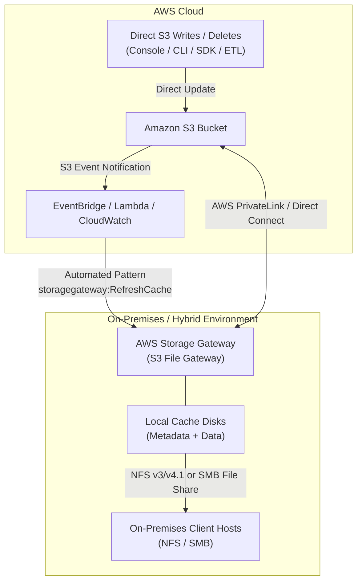
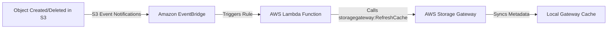

**When a new Amazon S3 bucket is created, it takes up to 24 hours before the bucket name propagates across all AWS Regions**

After you create an Amazon S3 bucket, up to 24 hours can pass before the bucket name propagates across all AWS Regions. During this time, you might receive the 307 Temporary Redirect response for requests to Regional endpoints that aren't in the same Region as your bucket.

To avoid the 307 Temporary Redirect response, send requests only to the Regional endpoint in the same Region as your S3 bucket. If you're using an Amazon CloudFront distribution with an Amazon S3 origin, CloudFront forwards requests to the default S3 endpoint ( s3.amazonaws.com). The default S3 endpoint is in the us-east-1 Region. If you must access Amazon S3 within the first 24 hours of creating the bucket, you can change the origin domain name of the distribution. The domain name must include the Regional endpoint of the bucket. For example, if the bucket is in us-west-2, you can change the origin domain name from <font color="#2DC26B">awsexamplebucketname.s3.amazonaws.com to awsexamplebucket.s3.us-west-2.amazonaws.com.</font>

S3 Cross-Region Replication (CRR) is used to copy objects across Amazon S3 buckets in different AWS Regions. CRR can help you do the following - meet compliance requirements, minimize latency and increase operational efficiency. CRR however, cannot resolve the HTTP 307 error.

----------

**Storage Gateway doesn't automatically update the cache when you upload a file directly to Amazon S3. Perform a `RefreshCache` operation to see the changes on the file share**

Storage Gateway updates the file share cache automatically when you write files to the cache locally using the file share. However, Storage Gateway doesn't automatically update the cache when you upload a file directly to Amazon S3. When you do this, you must perform a `RefreshCache` operation to see the changes on the file share. If you have more than one file share, then you must run the `RefreshCache` operation on each file share.

You can refresh the cache using the Storage Gateway console and the AWS Command Line Interface (AWS CLI).

Incorrect options:

**Uploading files from your file gateway to Amazon S3 when S3 Versioning is enabled results in cache update issues. Disable versioning on the S3 bucket** - Carefully consider the use of S3 Versioning and Cross-Region Replication (CRR) in Amazon S3 when you're uploading data from your file gateway. Uploading files from your file gateway to Amazon S3 when S3 Versioning is enabled results in at least two versions of an S3 object. This option is not relevant to the given issue and has just been added as a distractor.

**Storage Gateway doesn't automatically update the cache when you upload a file directly to Amazon S3. Perform a `ResetCache` operation to see the changes on the file share** - 'ResetCache', resets all cache disks that have encountered an error, and make the disks available for reconfiguration as cache storage. When a cache is reset, the gateway loses its cache storage. At this point, you can reconfigure the disks as cache disks. This operation is only supported in the cached volume and tape gateway types.

**Configure correct permissions in Amazon S3 bucket policy to allow automatic refresh of cache** - This statement is incorrect and has just been added as a distractor.

References:

[https://docs.aws.amazon.com/filegateway/latest/files3/GettingStartedCreateFileShare.html](https://docs.aws.amazon.com/filegateway/latest/files3/GettingStartedCreateFileShare.html)

[https://aws.amazon.com/premiumsupport/knowledge-center/storage-gateway-s3-changes-not-showing/](https://aws.amazon.com/premiumsupport/knowledge-center/storage-gateway-s3-changes-not-showing/)

[https://docs.aws.amazon.com/filegateway/latest/files3/refresh-cache.html](https://docs.aws.amazon.com/filegateway/latest/files3/refresh-cache.html)

[https://docs.aws.amazon.com/storagegateway/latest/APIReference/API_RefreshCache.html](https://docs.aws.amazon.com/storagegateway/latest/APIReference/API_RefreshCache.html)

# High-Level Design (HLD): Amazon S3 & AWS Storage Gateway (S3 File Gateway) Cache Synchronization

## 1. Executive Summary & Root Cause Analysis

### The Problem

When files are added, modified, or deleted **directly in Amazon S3** (via AWS Management Console, AWS CLI, SDKs, or third-party pipelines), the AWS Storage Gateway (S3 File Gateway) local cache is **not automatically invalidated or updated**. Consequently, on-premises clients connecting via NFS or SMB continue to see stale cached metadata and file contents.

### The Underlying Cause

- **Gateway-to-S3 (Upstream):** When an on-premises client writes a file to the File Gateway, the gateway writes to its local cache disk and automatically synchronizes the object upstream to S3.
    
- **S3-to-Gateway (Downstream):** S3 is an object store and does not push file system metadata updates to Storage Gateways by default. Storage Gateway only checks S3 when an uncached object is requested or when an explicit cache refresh occurs.
    

### The Solution

Execute a **`RefreshCache`** operation on the Storage Gateway file share to discover direct changes in S3 and synchronize the local metadata cache.

## 2. High-Level Architecture Diagram



## 3. Data Flow & Operation Comparison

```mermaid
flowchart TD
    subgraph FlowA["Flow A: Normal Write Path (Gateway → S3)"]
        A1["Client Write"] --> A2["S3 File Gateway"]
        A2 --> A3["Local Cache Disk"]
        A3 -->|Auto-Upload| A4["Amazon S3 Bucket"]
        A4 --> A5["✅ S3 & Local Cache stay 100% in sync"]
    end

    subgraph FlowB["Flow B: Direct S3 Update WITHOUT RefreshCache (Stale State)"]
        B1["Direct Upload / Delete"] --> B2["Amazon S3 (Updated)"]
        B2 -.-x|No push notification to Gateway| B3["S3 File Gateway"]
        B4["Client Read"] --> B3
        B3 --> B5["Checks Local Cache"] --> B6["❌ Stale / Missing Data!"]
    end

    subgraph FlowC["Flow C: Resolution via RefreshCache"]
        C1["Trigger RefreshCache API"] --> C2["S3 File Gateway queries S3"]
        C2 --> C3["Updates Local Cache"] --> C4["✅ Client sees synced data"]
    end
```



## 4. Architectural Component Details

|**Component**|**Responsibility in Architecture**|**Cache Behavior & Role**|
|---|---|---|
|**Amazon S3 Bucket**|Cloud-native durable object storage for client data.|Acts as the primary backend store. Direct modifications here bypass the file gateway local cache.|
|**S3 File Gateway**|Virtual Appliance (VMware/Hyper-V/KVM or EC2) presenting S3 objects as local file systems (NFS/SMB).|Maintains a local disk cache of frequently accessed data and directory tree metadata.|
|**Local Cache Storage**|Attached block storage (EBS/NVMe/SAN) on the Gateway.|Holds read/write caches. Does **not** poll S3 continuously for external changes to prevent API throttling and excessive S3 cost.|
|**On-Premises Clients**|Applications, database dumps, and user workstations.|Mounts file shares using native NFS/SMB protocols.|

## 5. Implementation & Automation Patterns

### Pattern 1: Manual On-Demand Refresh (Ad-Hoc / CLI)

Used when direct S3 uploads occur infrequently or in batch maintenance windows:

```bash
# Refresh cache across the specific file share
aws storagegateway refresh-cache \
    --file-share-arn "arn:aws:storagegateway:us-east-1:111122223333:share/share-12345678" \
    --folder-list "s3://client-data-bucket/folder1/" "s3://client-data-bucket/folder2/" \
    --recursive
```

### Pattern 2: Automated Real-Time Sync (Enterprise Production Architecture)

To eliminate manual intervention and human error in production environments:



- **Step 1: Amazon S3 Event Notifications:** Enable S3 to emit events on `s3:ObjectCreated:*` and `s3:ObjectRemoved:*` directly to Amazon EventBridge.
    
- **Step 2: Amazon EventBridge Rule:** Filters events based on bucket name and key prefix.
    
- **Step 3: AWS Lambda Function:** Extracts the updated folder path and invokes the `storagegateway:RefreshCache` API with `--folder-list` targeting only the affected directory (avoids refreshing the entire multi-TB share).
    

## 6. Key Operational & Exam Watch-Outs (SAP-C02)

- **`RefreshCache` vs. `ResetCache`:**
    
    - **`RefreshCache`:** Re-indexes and pulls updated metadata from S3 into the file gateway cache. Non-destructive and safe for production.
        
    - **`ResetCache`:** Used only on Cached Volume Gateways and Tape Gateways to wipe corrupted cache disks. **Destroys all local cache disks.**
        
- **Cost & Performance Optimization:**
    
    - Specifying a targeted `--folder-list` in `RefreshCache` processes significantly faster and consumes fewer `ListBucket` API calls than a full root-level recursive scan on multi-million object buckets.
        
- **Multiple File Shares:**
    
    - If the same S3 bucket or prefix is mounted on multiple file shares, `RefreshCache` must be invoked on **each file share ARN individually**.


____________
**Enable Amazon S3 server access logging to capture all bucket-level and object-level events**

**Enable AWS CloudTrail data events to enable object-level logging for S3 bucket**

To find the IP addresses for object-level requests to Amazon S3 (uploads and downloads), you must first enable one of the following logging methods:

1. Amazon S3 server access logging captures all bucket-level and object-level events. These logs use a format similar to Apache web server logs. After you enable server access logging, review the logs to find the IP addresses used with each upload to your bucket.
    
2. AWS CloudTrail data events capture the last 90 days of bucket-level events (for example, PutBucketPolicy and DeleteBucketPolicy), and you can enable object-level logging. These logs use a JSON format. After you enable object-level logging with data events, review the logs to find the IP addresses used with each upload to your bucket. It might take a few hours for AWS CloudTrail to start creating logs.

_________
An Amazon S3 bucket is shared by three different teams (managing their own separate AWS accounts) for document uploads. Initially, the S3 bucket settings were set to default. Later, the bucket sees the following updates:

After week 1, S3 Object Ownership bucket-level settings were used and all Access Control Lists (ACLs) were disabled. The three teams uploaded their documents to the shared bucket with this new setting.

After week 2, S3 bucket level settings were again set back to default and the ACLs were enabled once more

What is the outcome of these action(s) on the documents uploaded after week 1 and what are the key points of consideration for future S3 bucket configurations? (Select two)

Correct options:

**You, as the bucket owner, still own any objects that were written to the bucket while the `bucket owner enforced` setting was applied. These objects are not owned by the `object writer`, even if you re-enable ACLs**

**If you used object ACLs for permissions management before you applied the `bucket owner enforced` setting and you didn't migrate these object ACL permissions to your bucket policy after you re-enable ACLs, these permissions are restored** -

You can re-enable ACLs by changing from the bucket owner-enforced setting to another Object Ownership setting at any time. If you used object ACLs for permissions management before you applied the bucket owner-enforced setting and you didn't migrate these object ACL permissions to your bucket policy, after you re-enable ACLs, these permissions are restored. Additionally, objects written to the bucket while the bucket owner enforced setting was applied are still owned by the bucket owner.

For example, if you change from the bucket owner-enforced setting back to object writer, you, as the bucket owner, no longer own and have full control over objects that were previously owned by other AWS accounts. Instead, the uploading accounts again own these objects. Objects owned by other accounts use ACLs for permissions, so you can't use policies to grant permissions to these objects. However, you, as the bucket owner, still own any objects that were written to the bucket while the bucket owner-enforced setting was applied. These objects are not owned by the object writer, even if you re-enable ACLs.

Changes introduced by disabling ACLs: 


 via - [https://docs.aws.amazon.com/AmazonS3/latest/userguide/about-object-ownership.html](https://docs.aws.amazon.com/AmazonS3/latest/userguide/about-object-ownership.html)

Incorrect options:

**If you used object ACLs for permissions management before you applied the `bucket owner enforced` setting and you didn't migrate these object ACL permissions to your bucket policy after you re-enable ACLs, these permissions are not restored** - As explained above, the permissions are restored for this scenario. So this option is incorrect.

**To simplify permissions management and auditing, use the `Bucket owner preferred` S3 bucket setting** - This statement is incorrect. AWS recommends that you disable ACLs by choosing the `bucket owner enforced` setting and use your bucket policy to share data with users outside of your account as needed. This approach simplifies permissions management and auditing. You can disable ACLs on both newly created and already existing buckets.

**You, as the bucket owner, will not own the objects that were written to the bucket while the `bucket owner enforced setting` was applied. These objects will again be owned by the object writer, when you re-enable the ACLs** - This statement is incorrect. You, as the bucket owner, still own any objects that were written to the bucket while the bucket owner-enforced setting was applied. These objects are not owned by the object writer, even if you re-enable ACLs.

Reference:

[https://docs.aws.amazon.com/AmazonS3/latest/userguide/about-object-ownership.html](https://docs.aws.amazon.com/AmazonS3/latest/userguide/about-object-ownership.html)

### S3 Object Ownership Modes Comparison

| **Ownership Setting**                         | **ACLs Status**                   | **Who Owns New Uploads?**                                                  | **Access Managed By**           |
| --------------------------------------------- | --------------------------------- | -------------------------------------------------------------------------- | ------------------------------- |
| **Bucket Owner Enforced** _(AWS Recommended)_ | **Disabled** (Completely ignored) | **Bucket Owner**                                                           | Bucket Policies & IAM only      |
| **Bucket Owner Preferred**                    | Enabled                           | **Bucket Owner** (if uploaded with `bucket-owner-full-control` canned ACL) | Bucket Policy + ACLs            |
| **Object Writer** _(Legacy Default)_          | Enabled                           | **Uploading AWS Account**                                                  | Object & Bucket ACLs + Policies |
**Use S3 Glacier vault to store the sensitive archived data and then use a vault lock policy to enforce compliance controls**

Amazon S3 Glacier is a secure, durable, and extremely low-cost Amazon S3 cloud storage class for data archiving and long-term backup. It is designed to deliver 99.999999999% durability, and provide comprehensive security and compliance capabilities that can help meet even the most stringent regulatory requirements.

An S3 Glacier vault is a container for storing archives. When you create a vault, you specify a vault name and the AWS Region in which you want to create the vault. S3 Glacier Vault Lock allows you to easily deploy and enforce compliance controls for individual S3 Glacier vaults with a vault lock policy. You can specify controls such as “write once read many” (WORM) in a vault lock policy and lock the policy from future edits. Therefore, this is the correct option.

Incorrect options:

**Use S3 Glacier to store the sensitive archived data and then use an S3 lifecycle policy to enforce compliance controls** - You can use lifecycle policy to define actions you want Amazon S3 to take during an object's lifetime. For example, use a lifecycle policy to transition objects to another storage class, archive them, or delete them after a specified period. It cannot be used to enforce compliance controls. Therefore, this option is incorrect.

**Use S3 Glacier vault to store the sensitive archived data and then use an S3 Access Control List to enforce compliance controls** - Amazon S3 access control lists (ACLs) enable you to manage access to buckets and objects. It cannot be used to enforce compliance controls. Therefore, this option is incorrect.

**Use S3 Glacier to store the sensitive archived data and then use an S3 Access Control List to enforce compliance controls** - Amazon S3 access control lists (ACLs) enable you to manage access to buckets and objects. It cannot be used to enforce compliance controls. Therefore, this option is incorrect.

References:

[https://docs.aws.amazon.com/amazonglacier/latest/dev/working-with-vaults.html](https://docs.aws.amazon.com/amazonglacier/latest/dev/working-with-vaults.html)

[https://docs.aws.amazon.com/amazonglacier/latest/dev/vault-lock.html](https://docs.aws.amazon.com/amazonglacier/latest/dev/vault-lock.html)

[https://docs.aws.amazon.com/AmazonS3/latest/user-guide/create-lifecycle.html](https://docs.aws.amazon.com/AmazonS3/latest/user-guide/create-lifecycle.html)