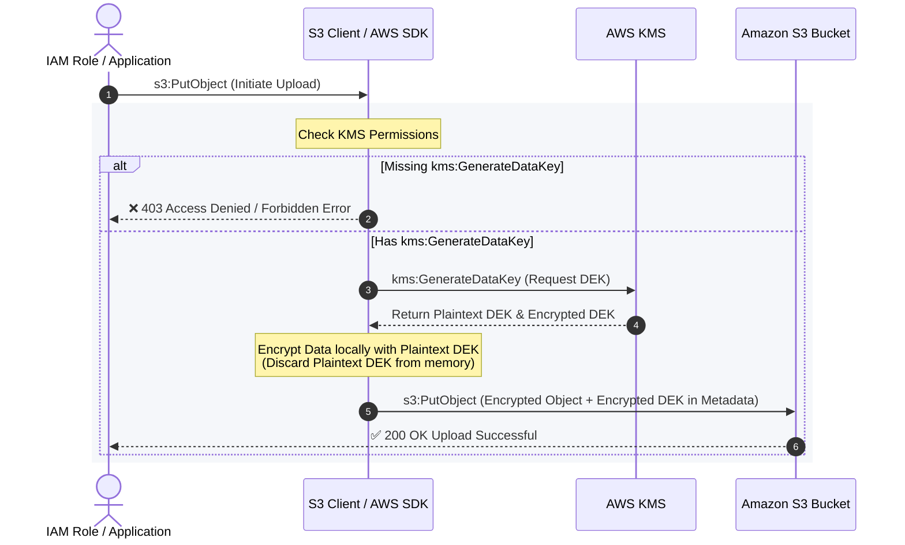
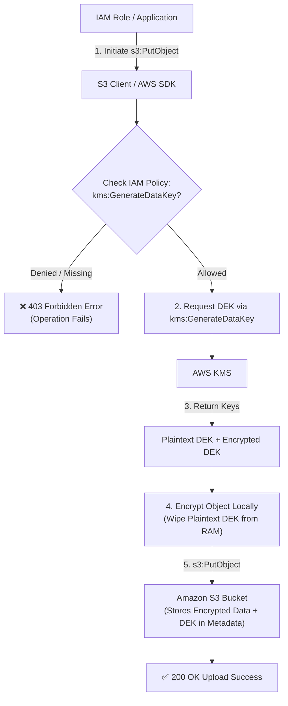

- **Client-Side Envelope Encryption Workflow:**

    - When implementing client-side encryption, the client does not send the raw object directly to KMS for encryption (since KMS can only encrypt payloads up to 4 KB).

    - Instead, the client calls the AWS KMS **`GenerateDataKey`** API to request a unique symmetric Data Encryption Key (DEK).

    - KMS returns:

        - A **plaintext data key** (used locally by the client SDK to encrypt the object).

        - A **ciphertext/encrypted data key** (stored alongside the encrypted object in S3 metadata).

- **Why Getting Objects Succeeded, but Putting Failed:**
    
    - **Downloading/Reading:** The client reads the encrypted data key from the object's metadata and calls **`kms:Decrypt`** to retrieve the plaintext key and decrypt the object locally. Because `kms:Decrypt` was present, `GetObject` operations succeeded.


    - **Uploading/Writing:** The client must first generate a new data key via **`kms:GenerateDataKey`** before encrypting and calling `s3:PutObject`. Without this permission, the operation fails with an access denied / forbidden error.

```json
{
  "Version": "2012-10-17",
  "Id": "key-policy-1",
  "Statement": [
    {
      "Sid": "GetPut",
      "Effect": "Allow",
      "Action": [
        "s3:GetObject",
        "s3:PutObject"
      ],
      "Resource": "arn:aws:s3:::ExampleBucket/*"
    },
    {
      "Sid": "KMS",
      "Effect": "Allow",
      "Action": [
        "kms:Decrypt",
        "kms:Encrypt",
        "kms:GenerateDataKey"
      ],
      "Resource": "arn:aws:kms:us-west-1:111122223333:key/keyid-12345"
    }
  ]
}
```

### Client-Side Envelope Encryption Workflow Diagram



#### Flowchart View



### Description of Steps

- **Step 1:** The IAM role initiates an upload request (`s3:PutObject`).
- **Step 2:** The AWS SDK checks the policy permissions required for client-side encryption.
- **[Denied] Branch:** Without `kms:GenerateDataKey`, the upload fails immediately with a **403 Forbidden / Access Denied** error.
- **[Allowed] Branch:** With `kms:GenerateDataKey` granted, permission check succeeds.
- **Step 3:** The SDK calls the AWS KMS API (`kms:GenerateDataKey`) using the target KMS key.
- **Step 4:** AWS KMS generates a unique symmetric Data Encryption Key (DEK) and encrypts one copy using the KMS Customer Managed Key (CMK).
- **Step 5:** KMS returns both the **Plaintext DEK** and the **Encrypted DEK** to the SDK client.
- **Step 6:** The S3 Client encrypts the data locally in memory using the **Plaintext DEK**, then securely wipes the Plaintext DEK from RAM.
- **Step 7:** The client prepares the upload payload containing the ciphertext data and attaches the **Encrypted DEK** in object metadata.
- **Step 8:** The client executes `s3:PutObject`, persisting the encrypted payload and metadata to the Amazon S3 bucket.

**kms:GenerateDataKey**

GenerateDataKey returns a unique symmetric data key for use outside of AWS KMS. This operation returns a plaintext copy of the data key and a copy that is encrypted under a symmetric encryption KMS key that you specify. The bytes in the plaintext key are random; they are not related to the caller or the KMS key. You can use the plaintext key to encrypt your data outside of AWS KMS and store the encrypted data key with the encrypted data.


 via - [https://docs.aws.amazon.com/kms/latest/APIReference/API_GenerateDataKey.html](https://docs.aws.amazon.com/kms/latest/APIReference/API_GenerateDataKey.html)

Incorrect options:

**kms:GetPublicKey** - This option returns the public key of an asymmetric KMS key. Unlike the private key of an asymmetric KMS key, which never leaves AWS KMS unencrypted, callers with kms:GetPublicKey permission can download the public key of an asymmetric KMS key. It cannot be used for a client-side encryption mechanism.

**kms:GetKeyPolicy** - This option gets a key policy attached to the specified KMS key. It cannot be used for a client-side encryption mechanism.

**kms:GetDataKey** - This is a made-up option that serves as a distractor.

References:

[https://docs.aws.amazon.com/kms/latest/APIReference/API_GenerateDataKey.html](https://docs.aws.amazon.com/kms/latest/APIReference/API_GenerateDataKey.html)

[https://docs.aws.amazon.com/kms/latest/APIReference/API_GetKeyPolicy.html](https://docs.aws.amazon.com/kms/latest/APIReference/API_GetKeyPolicy.html)


|**AWS KMS API / Feature**|**Primary Purpose**|**Returned Data / Output**|**Key Type / Scope**|**Typical Use Case**|
|---|---|---|---|---|
|**`GenerateDataKey`**|Generates a unique symmetric **Data Encryption Key (DEK)** to perform **envelope encryption** locally on large datasets without streaming payloads to KMS.|• **Plaintext Data Key** (used in-memory to encrypt)<br><br>  <br><br>• **Ciphertext / Encrypted Data Key** (saved with data)|Symmetric KMS Keys|Client-side encryption for S3, database field encryption, disk/file encryption.|
|**`GetPublicKey`**|Retrieves the **public key** portion of an asymmetric KMS key pair so encryption or signature verification can be done locally or outside AWS.|• **Public Key material** (DER-encoded X.509 format)<br><br>  <br><br>• Key specs / algorithm metadata|Asymmetric KMS Keys (RSA, ECC, SM2)|Off-AWS encryption (on-premises apps encrypting before sending to AWS), external digital signature verification.|
|**`GetKeyPolicy`**|Retrieves the resource-based **JSON key policy document** governing who (principals/roles/accounts) can access and manage a specific KMS key.|• **JSON Key Policy Document** attached to the specified KMS key|All KMS Keys (Resource Policy)|Security auditing, compliance checks, verifying least-privilege access, CI/CD and IaC drift detection.|