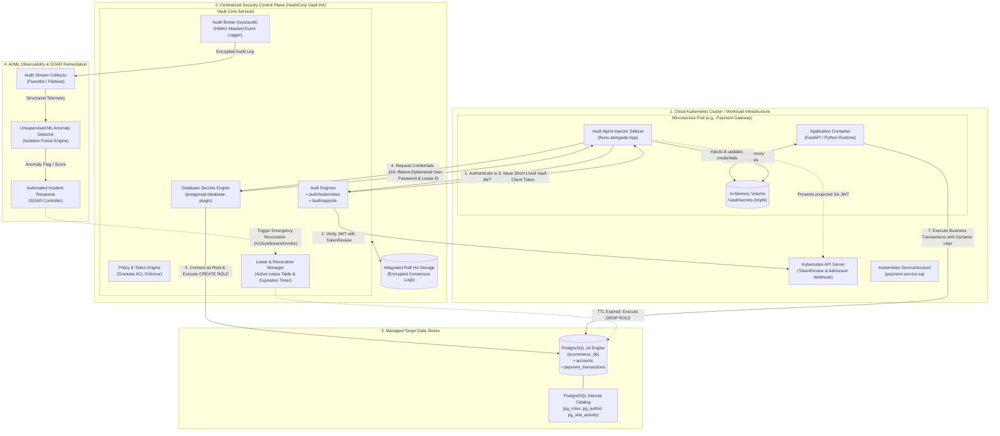
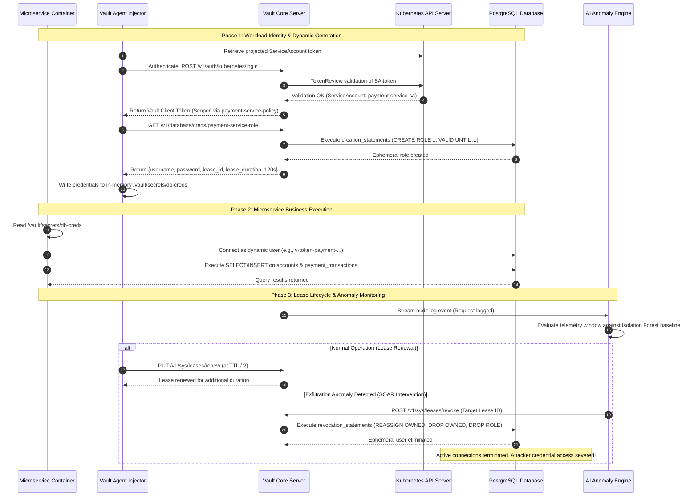
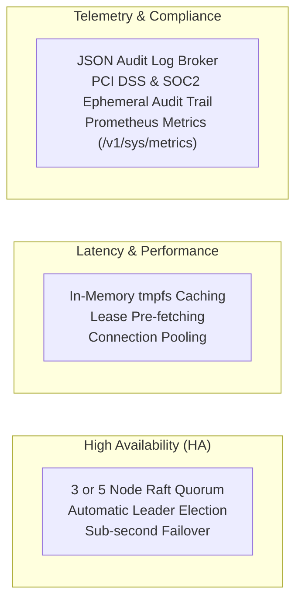

# High-Level Design (HLD): Dynamic Secret Injection for Microservices in Cloud Environments

> [!NOTE]
> This High-Level Design (HLD) specifies the system architecture, component interactions, threat models, and operational frameworks for **Dynamic Secret Injection** in cloud-native microservice architectures. It integrates **HashiCorp Vault**, **Kubernetes Workload Attestation**, **PostgreSQL Target Data Stores**, and an **Unsupervised AI/ML Anomaly Defense Subsystem**.

---

## 1. Executive Summary & Problem Context

In traditional distributed environments, application microservices rely on **static, long-lived credentials** (API tokens, database credentials, TLS certificates) provisioned via environment variables, Kubernetes ConfigMaps, or static secret vaults. This paradigm introduces critical security vulnerabilities:
1. **Unbounded Blast Radius:** Compromised static credentials remain valid indefinitely until manual administrative intervention.
2. **Secret Sprawl:** Secrets leak into build logs, source control repositories, container images, and monitoring dumps.
3. **Operational Overhead:** Rotating static database credentials requires coordinated microservice restarts and risks application downtime.

### The Solution: Dynamic Secret Injection
This architecture replaces static secrets with **short-lived, ephemeral, on-demand credentials** generated dynamically at runtime:
* Credentials have strict, deterministic **Time-To-Live (TTL)** limits (e.g., 2 minutes to 1 hour).
* Every secret is cryptographically tied to a tracked **Lease ID**.
* Access enforces the **Principle of Least Privilege (PoLP)** via fine-grained role templates.
* Expired or anomalous credentials are **automatically and immediately dropped** from the target database without human intervention.

---

## 2. High-Level System Architecture

---

## 3. Core Architectural Subsystems

### 3.1 Workload Identity & Attestation Subsystem
* **Zero Secret Zero:** The microservice starts with **no embedded secrets**, certificates, or passwords.
* **Kubernetes Projected Tokens:** Authentication leverages short-lived Kubernetes Service Account OIDC tokens mounted directly by the kubelet into the pod.
* **TokenReview Verification:** Vault validates the ServiceAccount JWT against the Kubernetes API Server TokenReview API (`/apis/authentication.k8s.io/v1/tokenreviews`), confirming pod namespace, service account name, and pod UID before issuing a Vault token.

### 3.2 Vault Dynamic Database Secrets Engine
* Acts as an authenticated proxy and database role provisioning broker.
* Connects to target database instances (PostgreSQL, MySQL, Oracle, MongoDB) using dedicated administrative credentials.
* **Root Password Rotation (`rotate-root`):** Upon initial setup, Vault randomizes the root database administrator password. The password is never stored in human-accessible vaults, effectively eliminating administrative compromise vectors.
* **Role Templating:** Generates transient usernames matching pattern:
  $$\text{Username} = \text{v-token-} + \text{RoleName} + \text{-RandomHash-} + \text{Timestamp}$$

### 3.3 Sidecar Injection & Memory Safety
* **Vault Agent Injector:** Operates as a Mutating Admission Webhook controller in Kubernetes.
* **Sidecar Deployment:** Automatically injects `vault-agent` alongside the application container in target pods based on pod annotations (`vault.hashicorp.com/agent-inject: "true"`).
* **In-Memory `tmpfs` IPC:** The agent fetches dynamic credentials and writes them to an in-memory `tmpfs` volume shared only within the pod boundaries. Secrets are **never written to disk or container storage layers**.
* **Automatic Renewal:** The agent proactively renews active leases at half the lease duration ($T_{\text{renew}} = \frac{1}{2} \text{TTL}$).

### 3.4 AI/ML Anomaly Detection & SOAR Remediation
* Implements an automated feedback loop between security monitoring and active credential control.
* **Telemetry Source:** Vault audit broker logs (`/sys/audit/file`), capturing all authentication, credential requests, lease renewals, and revocation attempts.
* **Machine Learning Pipeline:** An unsupervised `IsolationForest` model evaluates rolling 60-second telemetry windows against a trained baseline.
* **Autonomous SOAR Intervention:** When an anomaly score indicates credential abuse or mass exfiltration, the system triggers real-time lease revocation (`/v1/sys/leases/revoke`), dropping active database connections in $< 350\text{ ms}$.

---

## 4. End-to-End Dynamic Credential Lifecycle

---

## 5. Security & Threat Modeling (STRIDE Analysis)

| Threat Category | Attack Vector | Mitigation in Dynamic Secret Architecture |
| :--- | :--- | :--- |
| **Spoofing** | Compromised pod masquerading as payment service | Kubelet-projected ServiceAccount token validation via Kubernetes TokenReview API prevents arbitrary workload identity spoofing. |
| **Tampering** | Modifying database credentials in transit or rest | Mutual TLS (mTLS) across all Vault and database channels; credentials stored strictly in non-persistent `tmpfs` RAM. |
| **Repudiation** | Denying who performed database mutations | Vault audit device logs every dynamic credential generation, linking the exact ephemeral user to the Vault token and pod identity. |
| **Information Disclosure** | Secret leakage via container image or Git repo | Elimination of static credentials. Ephemeral usernames expire within minutes; zero hardcoded secrets exist in repository or images. |
| **Denial of Service** | Exhausting database connections via credential spam | Vault role limits (`max_ttl`, connection pooling constraints) and AI Anomaly Detector rate-limiting rogue requesting pods. |
| **Elevation of Privilege** | Compromised microservice attempting DB drop/alter | Strict Least-Privilege creation statements: dynamic role is only granted `SELECT, INSERT` on specific tables and cannot alter schema. |

---

## 6. Non-Functional Requirements (NFRs) & Resilience

* **Availability Target:** 99.99% uptime via multi-node Vault cluster operating Integrated Raft Consensus Storage across multiple cloud availability zones.
* **Latency Overhead:** Secret acquisition occurs out-of-band via the background Vault Agent sidecar; application database transactions experience **0 ms additional network latency** during query execution.
* **Compliance Posture:** Satisfies PCI-DSS 4.0 Requirement 8.3 (strong authentication and ephemeral privilege control) and NIST SP 800-207 Zero-Trust Architecture guidelines.
