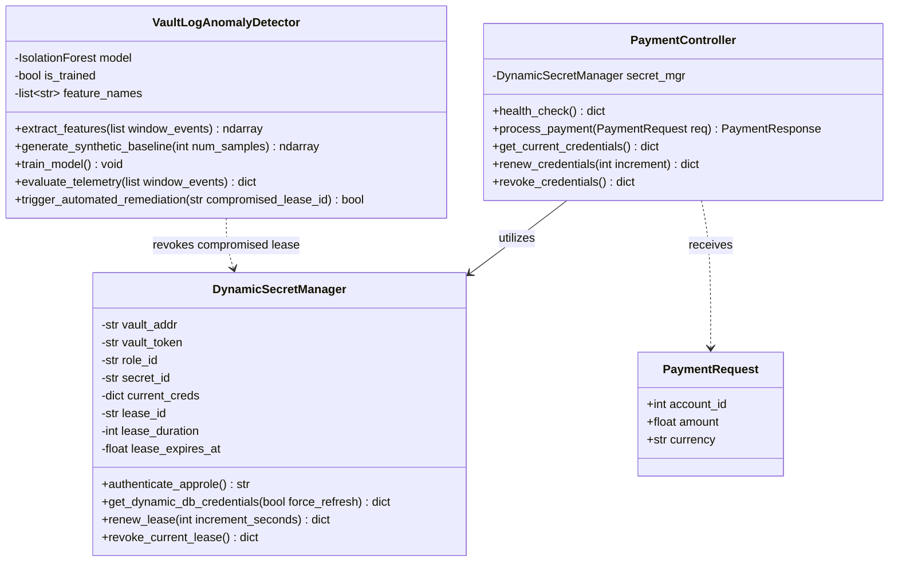
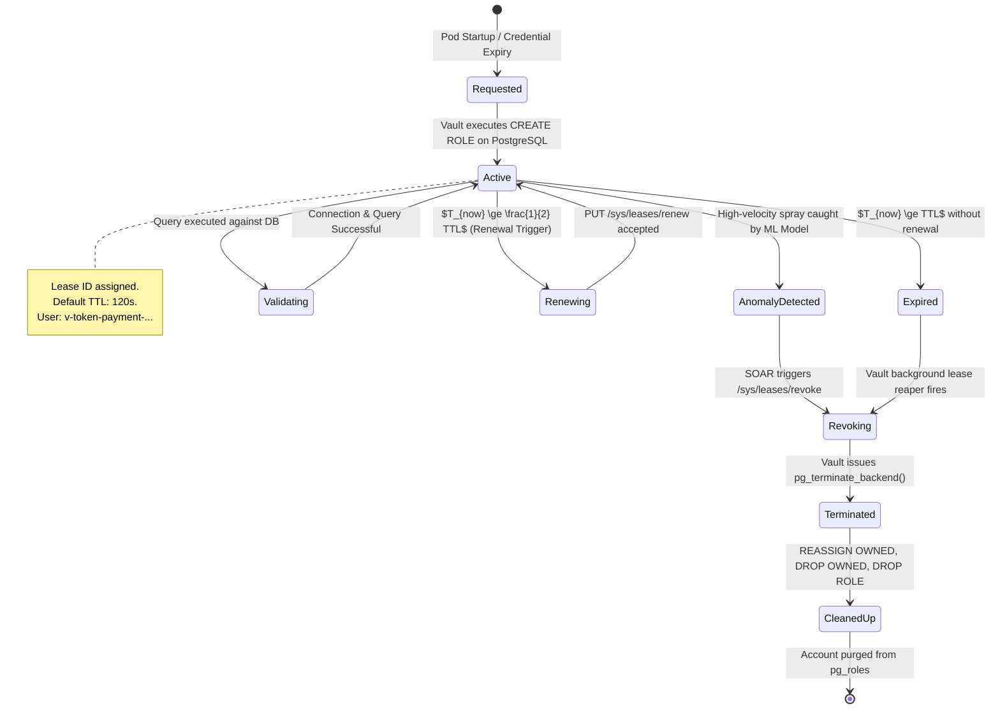
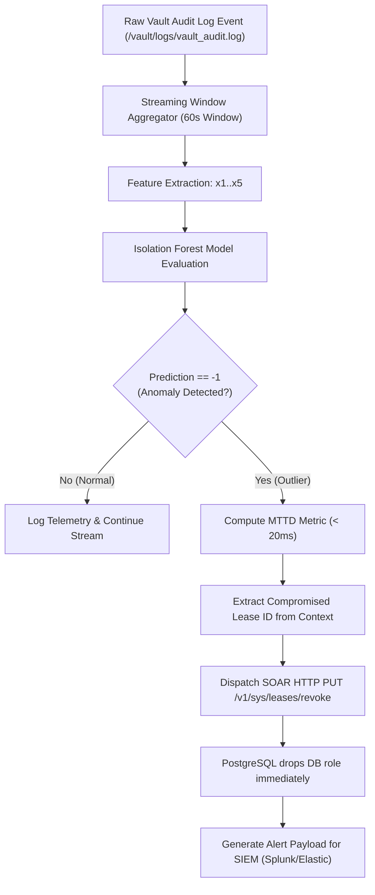

# Low-Level Design (LLD): Dynamic Secret Injection for Microservices

> [!NOTE]
> This Low-Level Design (LLD) provides detailed implementation specifications, class designs, database DDL/DML templates, API request/response schemas, state transition machines, and algorithm definitions for the **Dynamic Secret Injection** framework.

---

## 1. Class Architecture & Component Design

The microservice and threat detection engine are implemented in Python using asynchronous and object-oriented abstractions.



---

## 2. State Machine: Ephemeral Secret Lifecycle

Every dynamic database credential follows a deterministic finite-state lifecycle managed across Vault, PostgreSQL, and the client microservice:



---

## 3. Database Schema & SQL Role Lifecycle Engine

### 3.1 Base Relational Schema (`ecommerce_db`)
The schema enforces business separation and provides transactional entities for least-privilege verification.

```sql
-- Accounts Entity
CREATE TABLE IF NOT EXISTS accounts (
    account_id SERIAL PRIMARY KEY,
    customer_name VARCHAR(100) NOT NULL,
    email VARCHAR(150) UNIQUE NOT NULL,
    balance NUMERIC(12, 2) DEFAULT 0.00,
    created_at TIMESTAMP WITH TIME ZONE DEFAULT CURRENT_TIMESTAMP
);

-- Payment Transactions Entity
CREATE TABLE IF NOT EXISTS payment_transactions (
    transaction_id SERIAL PRIMARY KEY,
    account_id INT REFERENCES accounts(account_id),
    amount NUMERIC(12, 2) NOT NULL,
    currency VARCHAR(3) DEFAULT 'USD',
    status VARCHAR(20) NOT NULL,
    transaction_ref VARCHAR(64) UNIQUE NOT NULL,
    processed_by_role VARCHAR(100),
    created_at TIMESTAMP WITH TIME ZONE DEFAULT CURRENT_TIMESTAMP
);
```

### 3.2 Dynamic Role Creation Statement
When a microservice requests credentials from `database/creds/payment-service-role`, Vault interpolates the templates `{{name}}`, `{{password}}`, and `{{expiration}}` into the following SQL script:

```sql
-- 1. Create temporary role with login privileges and explicit expiry timestamp
CREATE ROLE "{{name}}" WITH LOGIN PASSWORD '{{password}}' VALID UNTIL '{{expiration}}' INHERIT;

-- 2. Grant basic network connection privileges to database
GRANT CONNECT ON DATABASE ecommerce_db TO "{{name}}";

-- 3. Scope schema visibility to public
GRANT USAGE ON SCHEMA public TO "{{name}}";

-- 4. Enforce strict Least Privilege: Read balance and insert completed transactions only
GRANT SELECT ON accounts TO "{{name}}";
GRANT SELECT, INSERT ON payment_transactions TO "{{name}}";
GRANT USAGE, SELECT ON ALL SEQUENCES IN SCHEMA public TO "{{name}}";
```

### 3.3 Dynamic Role Revocation Statement
To drop the user without encountering `SQLSTATE 2BP01: role cannot be dropped because some objects depend on it`, Vault executes the cleanup sequence:

```sql
-- 1. Terminate any active, hanging TCP sessions for the role
SELECT pg_terminate_backend(pid) 
FROM pg_stat_activity 
WHERE usename = '{{name}}';

-- 2. Reassign object ownership to administrative superuser
REASSIGN OWNED BY "{{name}}" TO postgres;

-- 3. Drop all dependent granted privileges across schemas
DROP OWNED BY "{{name}}";

-- 4. Purge the role from PostgreSQL catalog
DROP ROLE IF EXISTS "{{name}}";
```

---

## 4. API Specifications & Data Contracts

### 4.1 Internal Vault API Calls (Executed by Secret Manager)

#### Endpoint 1: AppRole Authentication
* **HTTP Method:** `POST`
* **Path:** `/v1/auth/approle/login`
* **Request Payload:**
```json
{
  "role_id": "b7055085-dbdf-274f-87bb-ca0d8e6b4242",
  "secret_id": "972cea08-ac16-e5a2-4f49-dbde538c7282"
}
```
* **Response Payload (Extract):**
```json
{
  "auth": {
    "client_token": "hvs.CAESIJ_qN-sample-token-string",
    "policies": ["payment-service"],
    "lease_duration": 3600,
    "renewable": true
  }
}
```

#### Endpoint 2: Ephemeral Database Credential Generation
* **HTTP Method:** `GET`
* **Path:** `/v1/database/creds/payment-service-role`
* **Headers:** `X-Vault-Token: <client_token>`
* **Response Payload:**
```json
{
  "request_id": "c1f73b6b-4e1a-4d44-93be-3b3ea3504bf1",
  "lease_id": "database/creds/payment-service-role/hltIpBkV23o3A1UX4GxPwIdN",
  "renewable": true,
  "lease_duration": 120,
  "data": {
    "username": "v-token-payment--yCFespuZRVv4prSORikm-1791041333",
    "password": "A1_x9PasswordGeneratedSecurely"
  }
}
```

#### Endpoint 3: Lease Renewal
* **HTTP Method:** `PUT`
* **Path:** `/v1/sys/leases/renew`
* **Headers:** `X-Vault-Token: <client_token>`
* **Request Payload:**
```json
{
  "lease_id": "database/creds/payment-service-role/hltIpBkV23o3A1UX4GxPwIdN",
  "increment": 120
}
```

#### Endpoint 4: Immediate Revocation (Kill Switch)
* **HTTP Method:** `PUT`
* **Path:** `/v1/sys/leases/revoke`
* **Headers:** `X-Vault-Token: <token_with_sudo_or_lease_rights>`
* **Request Payload:**
```json
{
  "lease_id": "database/creds/payment-service-role/hltIpBkV23o3A1UX4GxPwIdN"
}
```

---

### 4.2 Microservice Client API

#### Process Payment Transaction
* **Endpoint:** `POST /payments/process`
* **Request Body:**
```json
{
  "account_id": 1,
  "amount": 99.50,
  "currency": "USD"
}
```
* **Success Response (`200 OK`):**
```json
{
  "status": "SUCCESS",
  "transaction_reference": "PAY-8E3F0FE621CD",
  "account_id": 1,
  "customer_name": "Alice Johnson",
  "amount": 99.50,
  "currency": "USD",
  "security_context": {
    "dynamic_db_user": "v-token-payment--y3BDE2xGoNRQ9Pg3W3Bs-1791041477",
    "lease_id": "database/creds/payment-service-role/GzrPxkyBH5RXt0c2T9f95smr",
    "lease_duration": 120,
    "least_privilege_enforced": true
  }
}
```

---

## 5. Machine Learning Threat Detection Engine (Low-Level Algorithm)

### 5.1 Feature Vector Formulation
For any 60-second time sliding window $W$, the detector extracts a 5-dimensional numerical observation vector $\vec{x} \in \mathbb{R}^5$:

$$\vec{x} = \begin{bmatrix} x_1 \\ x_2 \\ x_3 \\ x_4 \\ x_5 \end{bmatrix} = \begin{bmatrix} \text{Requests per minute} \\ \text{Error ratio } (\frac{N_{\text{errors}}}{N_{\text{total}}}) \\ \text{Path entropy } (\frac{N_{\text{unique paths}}}{N_{\text{total}}}) \\ \text{Credential acquisition velocity} \\ \text{High-privilege path access ratio} \end{bmatrix}$$

### 5.2 Model Hyperparameters & Decision Threshold
* **Algorithm:** Unsupervised `IsolationForest`
* **Number of Estimators ($N$):** 100 decision trees
* **Subsampling Size:** $\min(256, N_{\text{samples}})$
* **Contamination Factor ($\alpha$):** 0.05
* **Decision Function:**
  $$s(\vec{x}, n) = 2^{-\frac{\mathbb{E}(h(\vec{x}))}{c(n)}}$$
  Where:
  * $h(\vec{x})$ is the path length of observation $\vec{x}$ across random trees.
  * $c(n)$ is the average path length of unsuccessful search in a Binary Search Tree.
  * $\text{Score} < 0 \implies \text{Classified as ANOMALY / OUTLIER}$.

### 5.3 Automated Remediation Flowchart



---

## 6. Kubernetes Sidecar Injection & Volume Layout

In production Kubernetes clusters, the pod architecture utilizes an in-memory `tmpfs` volume created by the Kubernetes kubelet:

```text
/
├── app/
│   └── main.py                   # Reads credentials from /vault/secrets/db-creds
├── vault/
│   └── secrets/
│       └── db-creds              # In-memory tmpfs mount (0 bytes persistent disk)
│           ├── DB_USER="v-token-payment-..."
│           ├── DB_PASSWORD="secret-password"
│           ├── LEASE_ID="database/creds/..."
│           └── LEASE_DURATION="120"
```

### Consul-Template Syntax Used in Annotations:
```gotemplate
{{- with secret "database/creds/payment-service-role" -}}
DB_USER="{{ .Data.username }}"
DB_PASSWORD="{{ .Data.password }}"
LEASE_ID="{{ .LeaseID }}"
LEASE_DURATION="{{ .LeaseDuration }}"
{{- end -}}
```
When the Vault Agent sidecar renews the lease or generates a new credential upon expiration, it rewrites `/vault/secrets/db-creds` in place. The microservice detects changes via inotify or file polling and refreshes its connection pool transparently.
