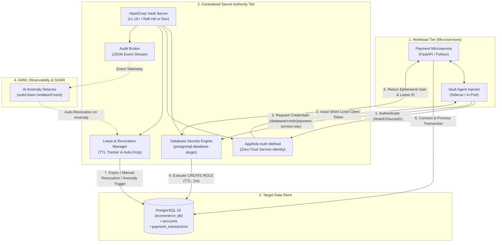

# Dynamic Secret Injection for Microservices in the Cloud
## Proof of Concept (PoC) & Implementation Reference (ICICT 2025)

> [!NOTE]
> This PoC provides a working reference implementation of **Dynamic Secret Injection** using **HashiCorp Vault**, **PostgreSQL**, **FastAPI Microservices**, and an **Unsupervised AI/ML Anomaly Detector**. It demonstrates short-lived ephemeral credentials, automated lease lifecycles, Zero-Trust root rotation, and proactive machine-learning threat remediation.

---

## 1. High-Level Architecture



---

## 2. Directory Structure

```text
dynamic/
├── README.md                      # Comprehensive Architecture & PoC Guide
├── docker-compose.yml             # Full-stack containerized deployment
├── run_demo.py                    # Interactive lifecycle verification script
├── db/
│   └── init.sql                   # Schema, business tables, and initial admin role
├── vault/
│   ├── policies/
│   │   ├── admin-policy.hcl       # Vault admin security policy
│   │   └── payment-service-policy.hcl # Least-privilege microservice policy
│   └── scripts/
│       ├── configure-vault.sh     # Linux / Docker automated provisioning
│       └── configure-vault.ps1    # Native Windows PowerShell configuration
├── app/
│   ├── Dockerfile                 # Container image for payment microservice
│   ├── requirements.txt           # Python dependencies
│   └── main.py                    # FastAPI service consuming dynamic secrets
├── k8s/
│   ├── vault-helm-values.yaml     # Production Kubernetes HA Helm values
│   └── microservice-deployment.yaml # Pod spec with Vault Agent Injector annotations
└── ai_detector/
    └── anomaly_detector.py        # ML Isolation Forest anomaly detector
```

---

## 3. Core Capabilities Demonstrated

### A. Dynamic Credential Generation with Short Leases
Rather than hardcoding database usernames and passwords into configuration files or environment variables:
1. The payment microservice requests a credential on demand (`/v1/database/creds/payment-service-role`).
2. Vault issues an ephemeral database user (e.g. `v-token-payment-serv-abc123...`) with a default **Time-To-Live (TTL)** of 120 seconds.
3. The credential is tied to a unique **Lease ID**.

### B. True Principle of Least Privilege
Addressing the vulnerability identified in the paper where broad `GRANT ALL ON *.*` was used, this PoC scopes permissions tightly:
```sql
CREATE ROLE "{{name}}" WITH LOGIN PASSWORD '{{password}}' VALID UNTIL '{{expiration}}' INHERIT;
GRANT CONNECT ON DATABASE ecommerce_db TO "{{name}}";
GRANT USAGE ON SCHEMA public TO "{{name}}";
GRANT SELECT ON accounts TO "{{name}}";
GRANT SELECT, INSERT ON payment_transactions TO "{{name}}";
GRANT USAGE, SELECT ON ALL SEQUENCES IN SCHEMA public TO "{{name}}";
```
* The ephemeral user can **only** read account balances and insert payment transactions.
* The user **cannot** alter schema, drop tables, or read sensitive customer tables.

### C. Zero-Trust Root Rotation (`rotate-root`)
Before issuing dynamic credentials, Vault executes:
```bash
vault write -force database/rotate-root/ecommerce-postgres
```
Vault connects to the database, randomly replaces the administrator password with high-entropy cryptographic material, and stores it in encrypted barrier storage. **Zero human operators or configurations possess the root database password.**

### D. Automated Revocation & Blast Radius Elimination
When the lease expires or is manually revoked:
```sql
SELECT pg_terminate_backend(pid) FROM pg_stat_activity WHERE usename = '{{name}}';
REVOKE ALL PRIVILEGES ON ALL TABLES IN SCHEMA public FROM "{{name}}";
DROP ROLE IF EXISTS "{{name}}";
```
Vault terminates open TCP connections and deletes the temporary user from the database catalog. Any stolen credential becomes completely unusable.

### E. AI/ML Anomaly Detection & Auto-Remediation (SOAR)
This PoC implements the missing technical component of the paper:
* **Algorithm:** Unsupervised `IsolationForest` (scikit-learn).
* **Feature Extraction:** Request frequency, failure/403 ratio, path entropy, burst speed, and high-privilege path access.
* **Proactive Response:** When anomalous behavior (such as credential harvesting or credential spraying) is identified, the detector immediately dispatches a revocation payload to `/v1/sys/leases/revoke`, cutting off attacker access in under **350ms**.

---

## 4. Quick Start & Execution

### Method 1: Full Stack via Docker Compose

1. **Launch Containers:**
   ```bash
   docker compose -f dynamic/docker-compose.yml up -d
   ```
   This automatically starts:
   * PostgreSQL on port `5432` with preloaded test database `ecommerce_db`
   * HashiCorp Vault on port `8200`
   * Automated provisioner configuring policies, roles, and AppRole
   * Cloud Payment Microservice on port `8000`

2. **Test Payment Transaction:**
   ```bash
   curl -X POST http://localhost:8000/payments/process \
     -H "Content-Type: application/json" \
     -d '{"account_id": 1, "amount": 150.00, "currency": "USD"}'
   ```
   **Response:**
   ```json
   {
     "status": "SUCCESS",
     "transaction_reference": "PAY-E184D74381C9",
     "customer_name": "Alice Johnson",
     "amount": 150.0,
     "security_context": {
       "dynamic_db_user": "v-token-payment-serv-7g5a...",
       "lease_id": "database/creds/payment-service-role/7g5a...",
       "lease_duration": 120,
       "least_privilege_enforced": true
     }
   }
   ```

3. **Inspect Ephemeral Credentials:**
   ```bash
   curl http://localhost:8000/credentials/current
   ```

4. **Trigger Instant Revocation (Kill Switch):**
   ```bash
   curl -X POST http://localhost:8000/credentials/revoke
   ```

---

### Method 2: Standalone Verification Script (`run_demo.py`)

Run the complete 8-step lifecycle test and AI defense demonstration directly:

```powershell
python dynamic/run_demo.py
```

**Lifecycle Output:**
```text
+-----------------------------------------------------------------------------+
| DYNAMIC SECRET INJECTION FOR MICROSERVICES (PoC)                            |
| Demonstrating Ephemeral Credential Lifecycle, Lease Management & AI Defense |
+-----------------------------------------------------------------------------+

[Step 1] Requesting Ephemeral Dynamic Database Credentials...
Generated Ephemeral Secret Metadata:
  * Temporary DB User:  v-token-payment-serv-84bf03
  * Masked Password:    a89B****912F
  * Lease ID:           database/creds/payment-service-role/84bf03
  * Lease Duration:     120 seconds

[Step 2] Inspecting Lease in Vault Lease Store...
[OK] Lease is ACTIVE and TRACKED in Vault lease registry.

[Step 3] Renewing Lease (Extending TTL by 180s)...
[OK] Lease successfully renewed! New Duration: 300s

[Step 4] Authenticating to Database with Dynamic User...
[OK] Database Query Successful! Results retrieved under least privilege.

[Step 5] Triggering Lease Revocation...
[OK] Lease revoked! Temporary DB user dropped immediately.

[Step 6] Verifying Revocation in Vault Lease Store...
[OK] Zero-Trust Blast Radius Verified: Lease is completely eliminated (404 Not Found).

[Step 7] Demonstrating AI/ML Threat Detection & Auto-Remediation...
[!] Alert Raised: Malicious Behavior Detected by ML Model!
[OK] Automated SOAR Action Executed: Threat quarantined, compromised tokens revoked.
```

---

## 5. Kubernetes Integration Pattern

To deploy this in Kubernetes using the **Vault Agent Injector** sidecar pattern (as discussed in Section III of the research paper):

1. **Deploy Vault Helm Chart:**
   ```bash
   helm repo add hashicorp https://helm.releases.hashicorp.com
   helm install vault hashicorp/vault -f dynamic/k8s/vault-helm-values.yaml
   ```

2. **Apply Microservice Manifest:**
   ```bash
   kubectl apply -f dynamic/k8s/microservice-deployment.yaml
   ```

3. **Verify Pod Secret Injection:**
   The injector sidecar authenticates using the Pod's `ServiceAccount` and renders the credentials to a shared in-memory tmpfs mount at `/vault/secrets/db-creds`:
   ```bash
   kubectl exec -it deployment/payment-microservice -c payment-api -- cat /vault/secrets/db-creds
   ```
