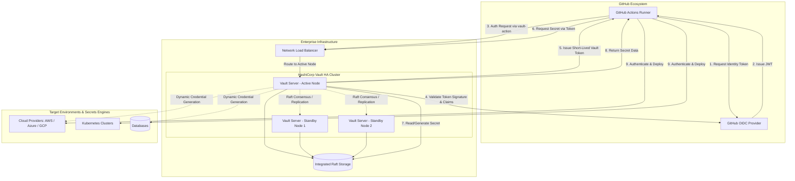

```mermaid
flowchart TD
    subgraph GH ["GitHub Ecosystem"]
        GHA["GitHub Actions Runner"]
        OIDC["GitHub OIDC Provider"]
    end

    subgraph Infra ["Enterprise Infrastructure"]
        LB["Network Load Balancer"]
        
        subgraph VaultCluster ["HashiCorp Vault HA Cluster"]
            VA["Vault Server - Active Node"]
            VS1["Vault Server - Standby Node 1"]
            VS2["Vault Server - Standby Node 2"]
            
            VA -.->|"Raft Consensus / Replication"| VS1
            VA -.->|"Raft Consensus / Replication"| VS2
        end
        
        Storage[("Integrated Raft Storage")]
        VA --> Storage
        VS1 --> Storage
        VS2 --> Storage
    end

    subgraph TargetEnv ["Target Environments & Secrets Engines"]
        AWS["Cloud Providers: AWS / Azure / GCP"]
        K8s["Kubernetes Clusters"]
        DB[("Databases")]
    end

    %% Authentication Flow
    GHA -->|"1. Request Identity Token"| OIDC
    OIDC -->|"2. Issue JWT"| GHA
    GHA -->|"3. Auth Request via vault-action"| LB
    LB -->|"Route to Active Node"| VA
    VA -->|"4. Validate Token Signature & Claims"| OIDC
    VA -->|"5. Issue Short-Lived Vault Token"| GHA
    
    %% Secrets Retrieval Flow
    GHA -->|"6. Request Secret via Token"| LB
    VA -->|"7. Read/Generate Secret"| Storage
    VA -->|"8. Return Secret Data"| GHA
    
    %% Deployment Action
    GHA -->|"9. Authenticate & Deploy"| AWS
    GHA -->|"9. Authenticate & Deploy"| K8s
    VA -.->|"Dynamic Credential Generation"| AWS
    VA -.->|"Dynamic Credential Generation"| DB
```