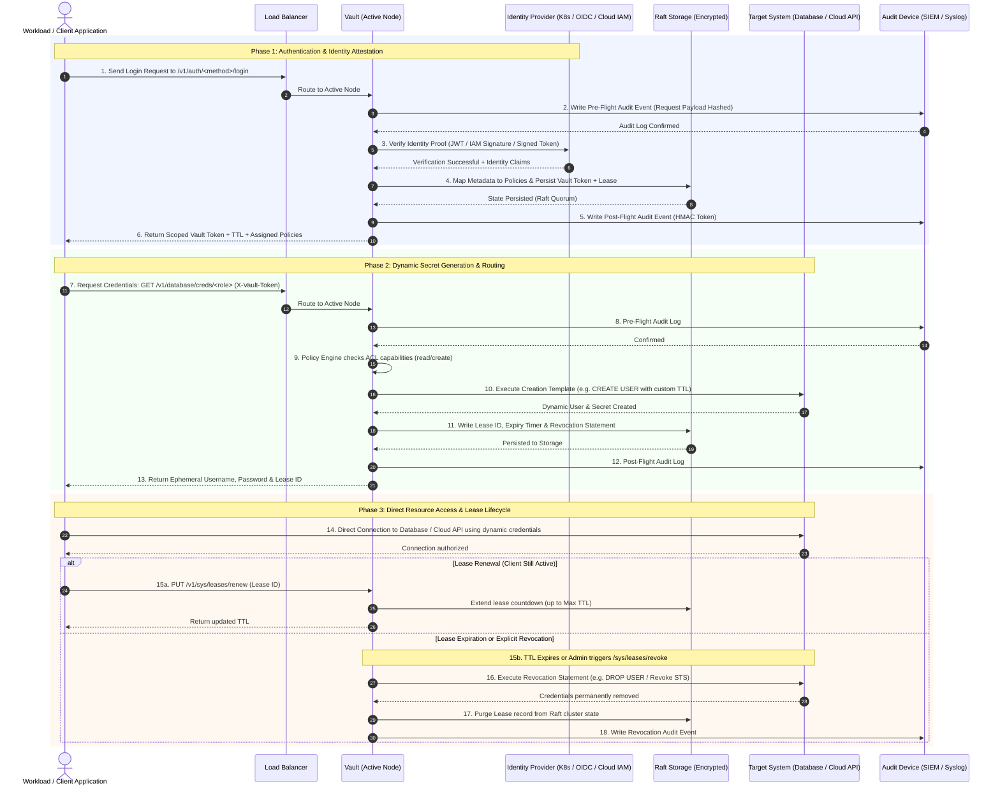

# HashiCorp Vault Core Architecture & High-Level Design (HLD)

> [!NOTE]
> This High-Level Design (HLD) outlines the core architecture of **HashiCorp Vault**, including cluster topology, internal cryptographic subsystems, authentication verification, dynamic secret engine integration, and the complete end-to-end request lifecycle.

---

## 1. High-Level Architecture Diagram

```mermaid
flowchart TD
    %% Clients & Workload Tier
    subgraph Clients ["1. Clients & Workload Tier"]
        App["Microservices & Applications\n(Kubernetes / VMs / Serverless)"]
        CICD["CI/CD Automation\n(Pipelines & Job Runners)"]
        Admin["Security Operators & Admins\n(CLI / Web UI / Terraform)"]
    end

    %% Network & Traffic Ingress
    subgraph IngressTier ["2. Ingress & Traffic Management Tier"]
        LB["Network / Application Load Balancer\n(TLS Termination / Health Checking)"]
    end

    %% Vault Core Infrastructure
    subgraph VaultSystem ["3. HashiCorp Vault Enterprise / HA Architecture"]
        subgraph VaultCluster ["Vault HA Cluster"]
            VA["Vault Server: Active Node\n(Stateful Read/Write & Lease Manager)"]
            VS1["Vault Server: Standby Node 1\n(Request Forwarding & Raft Follower)"]
            VS2["Vault Server: Standby Node 2\n(Request Forwarding & Raft Follower)"]
            
            VA -.->|"Raft Consensus & Log Replication"| VS1
            VA -.->|"Raft Consensus & Log Replication"| VS2
        end

        subgraph CoreEngine ["Vault Core Subsystems (Inside Active Node)"]
            AuthEngine["Auth Methods (/auth/*)\n(AppRole, K8s, JWT/OIDC, IAM, TLS)"]
            PolicyToken["Policy Engine & Token Store\n(Path-based RBAC, Leases, Identity Broker)"]
            SecretsManager["Secrets Engines Router\n(KV v2, Database, PKI, Transit, Cloud STS)"]
            AuditBroker["Audit Broker (/sys/audit)\n(Pre/Post HMAC-Masked Event Logging)"]
            Barrier["Cryptographic Barrier\n(AES-GCM-256 Envelope Encryption)"]
        end

        KMS["Auto-Unseal Provider\n(AWS KMS / Azure Key Vault / GCP KMS / HSM)"]
        Storage[("Integrated Raft Storage\n(Encrypted Cluster State)")]

        KMS -.->|"Auto-Unseal / Key Wrapping"| VA
        VA <-->|"Decrypted Data via Barrier"| Barrier
        Barrier <-->|"Encrypted Pages"| Storage
        VS1 -.->|"Forward Write/Auth Requests"| VA
        VS2 -.->|"Forward Write/Auth Requests"| VA
    end

    %% External Identity Providers
    subgraph IdentityTier ["4. External Identity & Attestation Providers"]
        IdP["Corporate Identity Providers\n(OIDC, Okta, LDAP / Active Directory)"]
        CloudIAM["Cloud IAM / STS\n(AWS IAM, GCP IAM, Azure Entra ID)"]
        K8sAPI["Kubernetes TokenReview API\n(Service Account Validation)"]
    end

    %% Target Downstream Systems
    subgraph DownstreamTier ["5. Target Environments & Managed Endpoints"]
        CloudTargets["Cloud Infrastructure\n(AWS / Azure / GCP APIs)"]
        DBTargets[("Databases\n(PostgreSQL, MySQL, Oracle, MongoDB)")]
        PKITargets["PKI / Certificate Endpoints\n(Dynamic TLS / X.509 CAs)"]
        TransitClients["Transit EaaS Endpoints\n(Application Data Encryption/Decryption)"]
    end

    %% Observability & Compliance
    subgraph AuditTier ["6. Observability & SIEM Tier"]
        SIEM["Audit & Security Logging\n(Splunk, Datadog, CloudWatch, Syslog)"]
    end

    %% Client Ingress Flow
    App & CICD & Admin -->|"1. HTTPS / TLS 1.3 Requests"| LB
    LB -->|"2. Forward to Cluster (Active Node)"| VA

    %% Authentication Validation
    AuthEngine <-->|"3. Validate Identity Proof"| IdP & CloudIAM & K8sAPI
    AuthEngine -->|"4. Resolve Token & Policies"| PolicyToken

    %% Secrets Engine Routing & Downstream Action
    PolicyToken -->|"5. Authorize Path Access"| SecretsManager
    SecretsManager -->|"6a. Fetch Encrypted Static Secret"| Barrier
    SecretsManager -->|"6b. Dynamic User Creation"| DBTargets
    SecretsManager -->|"6c. STS Ephemeral Tokens"| CloudTargets
    SecretsManager -->|"6d. Issue Short-Lived X.509 Certs"| PKITargets
    SecretsManager -->|"6e. In-Memory Cryptographic Operations"| TransitClients

    %% Auditing Flow
    AuditBroker -->|"7. Immutable Audit Records (Pre/Post)"| SIEM
```

---

## 2. End-to-End Detailed Request & Secret Lifecycle

The following sequence details how workloads authenticate, obtain authorization via path-based policies, request ephemeral dynamic secrets, and how Vault manages lease renewal and automatic resource revocation.

---

## 3. Core Architectural Subsystems Breakdown

### 1. Cryptographic Barrier & Memory Architecture
* **Envelope Encryption:** Vault operates behind a strict barrier. All data leaves memory encrypted using **AES-256-GCM** before being handed off to storage.
* **Master Key & Key Wrapping:** The Master Key is stored only in memory while unsealed. It wraps the cluster's **Data Encryption Key (DEK)**.
* **Auto-Unseal:** In production enterprise topologies, an external trusted Key Management Service (AWS KMS, Azure Key Vault, Google Cloud KMS, or PKCS#11 HSM) automatically encrypts and decrypts the master key upon startup, eliminating manual Shamir key reconstruction.

### 2. High Availability (HA) & Integrated Raft Storage
* **Leader Election via Raft:** The cluster elects a single **Active Node** that holds the primary write lock and handles all mutations and lease expirations.
* **Standby Nodes & Request Forwarding:** Standby nodes maintain an active, in-sync replica of the Raft transaction log. When an HTTP request lands on a standby node, it initiates mTLS request forwarding to the active node or issues an HTTP 307 redirect.
* **Zero External Dependencies:** Integrated Raft stores data locally on node disk arrays with quorum consensus $(N/2 + 1)$, removing the operational overhead and failure points of external storage engines.

### 3. Authentication Subsystem (`/auth/*`)
* **Pluggable Identity Verifiers:** Allows machine workloads and human operators to authenticate using existing identity systems:
  * **Machine Identities:** Kubernetes Service Account tokens, AWS IAM signatures, Azure Managed Identities, GCP service accounts, AppRole (Role ID + Secret ID), TLS client certificates.
  * **Human Identities:** Corporate SSO (OIDC/SAML), Okta, LDAP, GitHub, or Kerberos.
* **Identity Broker (Aliases & Groups):** Maps diverse auth method identities into a unified internal Vault Entity and Groups structure for global policy assignment.

### 4. Policy Engine & Access Control
* **Path-Based Path Rules:** Permissions are modeled after REST endpoints with explicit capabilities (`create`, `read`, `update`, `delete`, `list`, `sudo`, `deny`).
* **Default Deny:** All paths are denied by default unless explicitly permitted by an attached policy.
* **Dynamic Templating:** Policies support parameter substitution based on identity metadata (e.g., `path "secret/data/{{identity.entity.metadata.team}}/*"`).

### 5. Dynamic Secrets Engines & Lease Manager
* **Just-In-Time Generation:** Unlike static key stores, dynamic secret engines generate short-lived, unique credentials on demand (e.g., dedicated PostgreSQL users, AWS STS temporary access keys, short-lived X.509 certificates).
* **Lease System:** Every secret generated by Vault has an associated **Lease ID**, a default TTL, and a maximum TTL.
* **Automated Cleanup:** When a lease expires without renewal, Vault actively communicates with the target system to revoke the credentials, preventing credential sprawl and stale access.

### 6. Transit Engine (Encryption-as-a-Service)
* **Cryptographic Offloading:** Provides encryption, decryption, signing, and HMAC verification over the network without storing the underlying data.
* **Key Rotation:** Supports automated cryptographic key rotation with re-wrapping capabilities for existing ciphertexts.

### 7. Audit Broker (`/sys/audit`)
* **Dual-Phase Auditing:** Writes both a *pre-flight* event (before request execution) and a *post-flight* event (including response payload and errors).
* **HMAC Masking:** Sensitive data, credentials, and tokens are securely masked using salted HMAC-SHA256 before reaching log devices.
* **Blocking Security Guarantee:** If an enabled audit device is blocked or fails to acknowledge a write, Vault pauses request execution to prevent unaudited operations.