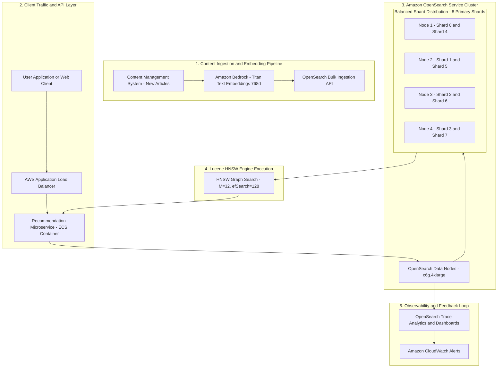
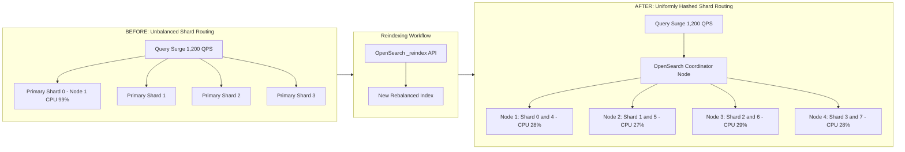
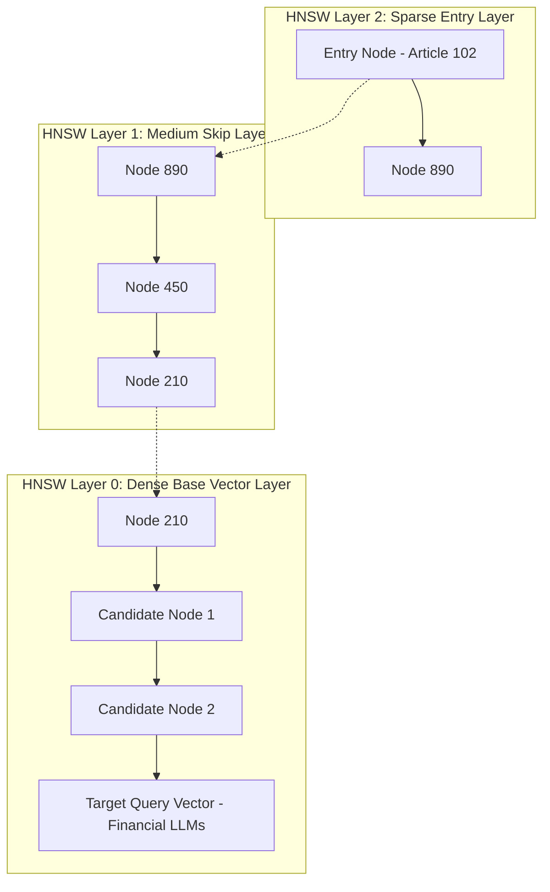
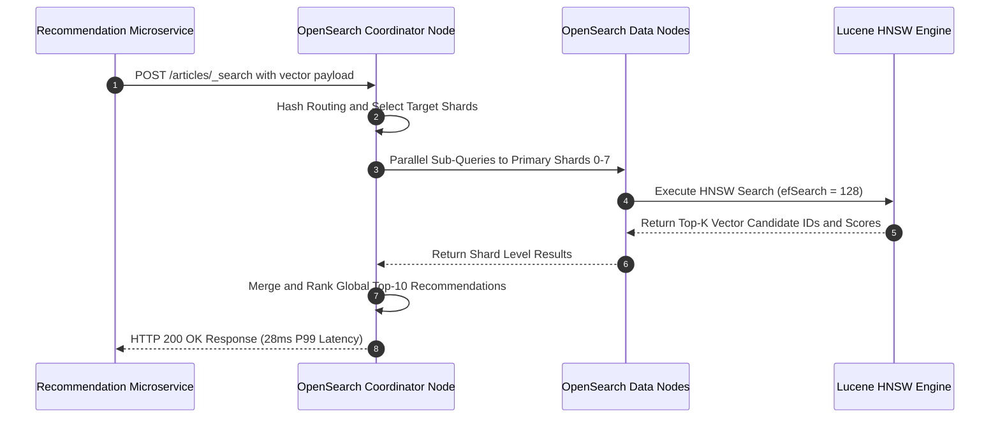

# High-Level Design (HLD): Scalable Vector Search Recommendation Architecture

This High-Level Design (HLD) document specifies the architecture, data flow, cluster topology, HNSW index parameter model, and monitoring feedback loop for a large-scale recommendation system (50M+ vectors) built on **Amazon OpenSearch Service**.

---

## 1. End-to-End System Architecture

The recommendation API ingests article text, generates vector embeddings, indexes them into OpenSearch with k-NN HNSW, and executes low-latency vector similarity queries.

---

## 2. Shard Topology & Rebalancing Architecture (Solution 2)

To eliminate **Hot Shards** under heavy traffic surges, the index is rebalanced from an unbalanced 4-shard configuration to a uniformly hashed 8-shard configuration across multi-AZ data nodes.

---

## 3. HNSW Graph Structure & Parameter Tuning (Solution 1)

`HNSW` constructs a multi-layer graph where upper layers contain sparse skip-links and lower layers contain dense vector connections.

### Parameter Tuning Impact Matrix

| HNSW Parameter | Problem Identified | Optimized Setting | Technical Mechanism |
| :--- | :--- | :--- | :--- |
| `M` (Max Links per Node) | Low graph connectivity for 768-dim embeddings | `M = 32` | Increases max bidirectional connections per vector node from 16 to 32, allowing the graph traversal to escape local minima in high-dimensional space. |
| `efConstruction` | Poor graph edge quality built during indexing | `ef_construction = 250` | Expands candidate search size during graph construction, improving overall search graph quality. |
| `efSearch` | Weakly related or irrelevant articles returned | `ef_search = 128` | Expands dynamic candidate queue during query search. Higher `efSearch` ensures nearest neighbors are evaluated, boosting **Recall @ 10 to > 99%**. |

---

## 4. Query Execution Sequence Diagram

---

## 5. Summary of Architecture Recommendations

1. **Horizontal Scaling & Shard Balance:** Ensure primary shard count matches or is a multiple of data node count (8 primary shards across 4 nodes) to eliminate load concentration.
2. **Dynamic Index Settings Tuning:** Dynamically update `index.knn.algo_param.ef_search` via OpenSearch REST API during marketing events to maintain high recall without requiring index re-indexing.
3. **Query-Level Observability:** Monitor performance using **OpenSearch Trace Analytics** (query-level spans) rather than aggregate cluster-level CPU to identify single-shard latency bottlenecks early.
